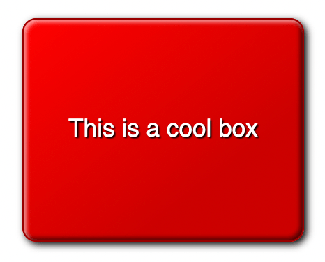

{{LearnSidebar}}
{{PreviousMenu("Learn/CSS/Building_blocks/Creating_fancy_letterheaded_paper", "Learn/CSS/Building_blocks")}}

In this assessment, you'll get some more practice in creating cool-looking boxes by trying to create an eye-catching box.

<table>
  <tbody>
    <tr>
      <th scope="row">Prerequisites:</th>
      <td>
        Before attempting this assessment you should have already worked
        through all the articles in this module.
      </td>
    </tr>
    <tr>
      <th scope="row">Objective:</th>
      <td>
        To test comprehension of the CSS box model and other box-related
        features such as borders and backgrounds.
      </td>
    </tr>
  </tbody>
</table>

## Starting point

To get this assessment started, you should:

- Make local copies of the starting [HTML](https://github.com/mdn/learning-area/blob/main/css/styling-boxes/cool-information-box-start/index.html) and [CSS](https://github.com/mdn/learning-area/blob/main/css/styling-boxes/cool-information-box-start/style.css) — save them as `index.html` and `style.css` in a new directory.

Alternatively, you could use an online editor such as [CodePen](https://codepen.io/), [JSFiddle](https://jsfiddle.net/), or [Glitch](https://glitch.com/).
You could paste the HTML and fill in the CSS into one of these online editors.

> **Note:** If you get stuck, you can reach out to us in one of our [communication channels](/en-US/docs/MDN/Community/Communication_channels).

## Project brief

Your task is to create a cool, fancy box and explore the fun we can have with CSS.

### General tasks

- Apply the CSS to the HTML.

### Styling the box

We'd like you to style the provided {{htmlelement("div")}}, giving it the following:

- A reasonable width for a large box, say around 200 pixels.
- A reasonable height for a large box, centering the text vertically in the process.
- Center the box horizontally.
- Center the text within the box.
- A slight increase in font size, to around 17-18 pixel computed style. Use rems. Write a comment about how you worked out the value.
- A base color for the design. Give the box this color as its background color.
- A contrasting color for the text and a black text shadow.
- A fairly subtle border radius.
- A 1-pixel solid border with a color similar to the base color, but a slightly darker shade.
- A linear semi-transparent black gradient that goes toward the bottom right corner. Make it completely transparent at the start, grading to around 0.2 opacity by 30% along, and remaining at the same color until the end.
- Multiple box shadows. Give it one standard box shadow to make the box look slightly raised off the page. The other two should be inset box shadows — a semi-transparent white shadow near the top left and a semi-transparent black shadow near the bottom right — to add to the nice raised 3D look of the box.

## Hints and tips

- Use the [W3C CSS Validator](https://jigsaw.w3.org/css-validator/) to catch and fix mistakes in your CSS.

## Example

The following screenshot shows an example of what the finished design could look like:

{{PreviousMenu("Learn/CSS/Building_blocks/Creating_fancy_letterheaded_paper", "Learn/CSS/Building_blocks")}}
