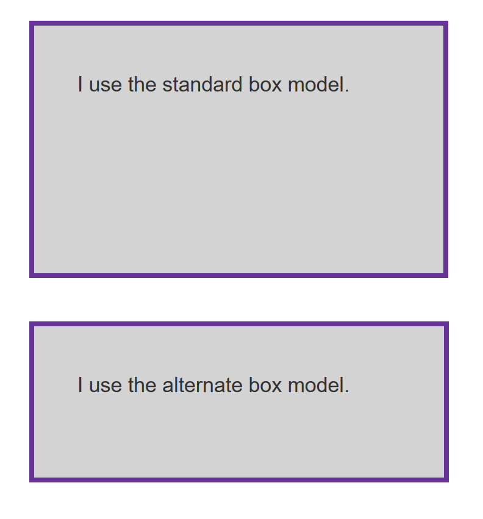
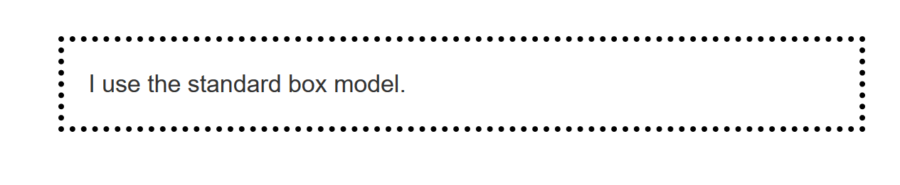
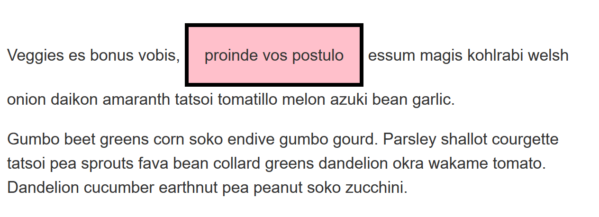

{{LearnSidebar}}

The aim of this skill test is to assess whether you understand the [CSS box model](/en-US/docs/Learn/CSS/Building_blocks/The_box_model).

> **Note:** You can try out solutions in the interactive editors below. However, it may be helpful to download the code and use an online tool such as [CodePen](https://codepen.io/), [jsFiddle](https://jsfiddle.net/), or [Glitch](https://glitch.com/) to work on the tasks.
>
> If you get stuck, then ask us for help — see the [Assessment or further help](#assessment_or_further_help) section at the bottom of this page.

## Task 1

In this task, there are two boxes below, one is using the standard box model, the other the alternate box model. Change the width of the second box by adding declarations to the `.alternate` class, so that it matches the visual width of the first box.

Your final result should look like the image below:

Try updating the live code below to recreate the finished example:

{{EmbedGHLiveSample("css-examples/learn/tasks/box-model/box-models.html", '100%', 1100)}}

> **Callout:**
>
> [Download the starting point for this task](https://github.com/mdn/css-examples/blob/main/learn/tasks/box-model/box-models-download.html) to work in your own editor or in an online editor.

## Task 2

In this task, add to the box:

- A 5px, black, dotted border.
- A top margin of 20px.
- A right margin of 1em.
- A bottom margin of 40px.
- A left margin of 2em.
- Padding on all sides of 1em.

Your final result should look like the image below:

Try updating the live code below to recreate the finished example:

{{EmbedGHLiveSample("css-examples/learn/tasks/box-model/mbp.html", '100%', 600)}}

> **Callout:**
>
> [Download the starting point for this task](https://github.com/mdn/css-examples/blob/main/learn/tasks/box-model/mbp-download.html) to work in your own editor or in an online editor.

## Task 3

In this task, the inline element has a margin, padding and border. However, the lines above and below are overlapping it. What can you add to your CSS to cause the size of the margin, padding, and border to be respected by the other lines, while still keeping the element inline?

Your final result should look like the image below:

Try updating the live code below to recreate the finished example:

{{EmbedGHLiveSample("css-examples/learn/tasks/box-model/inline-block.html", '100%', 800)}}

> **Callout:**
>
> [Download the starting point for this task](https://github.com/mdn/css-examples/blob/main/learn/tasks/box-model/inline-block-download.html) to work in your own editor or in an online editor.

## Assessment or further help

You can practice these examples in the Interactive Editors above.

If you would like your work assessed or are stuck and want to ask for help:

1. Put your work into an online shareable editor such as [CodePen](https://codepen.io/), [jsFiddle](https://jsfiddle.net/), or [Glitch](https://glitch.com/). You can write the code yourself or use the starting point files linked to in the above sections.
2. Write a post asking for assessment and/or help at the [MDN Discourse forum Learning category](https://discourse.mozilla.org/c/mdn/learn/250). Your post should include:

    - A descriptive title such as "Assessment wanted for the box model skill test 1".
    - Details of what you have already tried and what you would like us to do; for example, tell us if you're stuck and need help or want an assessment.
    - A link to the example you want assessed or need help with, in an online shareable editor (as mentioned in step 1 above). This is a good practice to get into — it's very hard to help someone with a coding problem if you can't see their code.
    - A link to the actual task or assessment page, so we can find the question you want help with.
