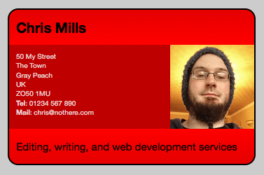

{{LearnSidebar}}
{{PreviousMenuNext("Learn/CSS/Building_blocks/Organizing", "Learn/CSS/Building_blocks/Creating_fancy_letterheaded_paper", "Learn/CSS/Building_blocks")}}

You've covered a lot in this module, so it must feel good to have reached the end! The final step before you move on is to attempt the assessment for the module — this involves a number of related exercises that must be completed in order to create the final design — a business card/gamer card/social media profile.

<table>
  <tbody>
    <tr>
      <th scope="row">Prerequisites:</th>
      <td>
        Before attempting this assessment you should have already worked through
        all the articles in this module.
      </td>
    </tr>
    <tr>
      <th scope="row">Objective:</th>
      <td>
        To test comprehension of fundamental CSS theory, syntax and mechanics.
      </td>
    </tr>
  </tbody>
</table>

## Starting point

To get this assessment started, you should:

- Go and grab the [HTML file for the exercise](https://github.com/mdn/learning-area/blob/main/css/introduction-to-css/fundamental-css-comprehension/index.html), and the [associated image file](https://github.com/mdn/learning-area/blob/main/css/introduction-to-css/fundamental-css-comprehension/chris.jpg), and save them in a new directory on your local computer. If you want to use your own image file and fill your own name in, you are welcome to — just make sure the image is square.
- Grab the [CSS resources text file](https://github.com/mdn/learning-area/blob/main/css/introduction-to-css/fundamental-css-comprehension/style-resources.txt) — this contains a set of raw selectors and rulesets that you'll need to study and combine to answer part of this assessment.

Alternatively, you could use a site like [JSBin](https://jsbin.com/) or [Glitch](https://glitch.com/) to do your assessment. You could paste the HTML and fill in the CSS into one of these online editors, and use [this URL](https://mdn.github.io/learning-area/css/introduction-to-css/fundamental-css-comprehension/chris.jpg) to point the `` element to the image file. If the online editor you are using doesn't have a separate CSS panel, feel free to put it in a `<style>` element in the head of the document.

> **Note:** If you get stuck, then ask us for help — see the [Assessment or further help](#assessment_or_further_help) section at the bottom of this page.

## Project brief

You have been provided with some raw HTML and an image, and need to write the necessary CSS to style this into a nifty little online business card, which can perhaps double as a gamer card or social media profile. The following sections describe what you need to do.

Basic setup:

- First of all, create a new file in the same directory as your HTML and image files. Call it something really imaginative like `style.css`.
- Link your CSS to your HTML file via a `<link>` element.
- The first two rulesets in the CSS resource file are yours, for FREE! After you've finished rejoicing at your good fortune, copy and paste them into the top of your new CSS file. Use them as a test to make sure your CSS is properly applied to your HTML.
- Above the two rules, add a CSS comment with some text inside it to indicate that this is a set of general styles for the overall page. "General page styles" would do. Also add three more comments at the bottom of the CSS file to indicate styles specific to the setup of the card container, styles specific to the header and footer, and styles specific to the main business card contents. From now on, subsequent styles added to the stylesheet should be organized in an appropriate place.

Taking care of the selectors and rulesets provided in the CSS resource file:

- Next up, we'd like you to look at the four selectors, and calculate the specificity for each one. Write these down somewhere where they can be found later on, such as in a comment at the top of your CSS.
- Now it's time to put the right selector on the right rule set! You've got four pairs of selector and ruleset to match in your CSS resources. Do this now, and add them to your CSS file. You need to:

  - Give the main card container a fixed width/height, solid background color, border, and border-radius (rounded corners!), amongst other things.
  - Give the header a background gradient that goes from darker to lighter, plus rounded corners that fit in with the rounded corners set on the main card container.
  - Give the footer a background gradient that goes from lighter to darker, plus rounded corners that fit in with the rounded corners set on the main card container.
  - Float the image to the right so that it sticks to the right-hand side of the main business card contents, and give it a max-height of 100% (a clever trick that ensures that it will grow/shrink to stay the same height as its parent container, regardless of what height it becomes.)

- Beware! There are two errors in the provided rulesets. Using any technique that you know, track these down and fix them before moving on.

New rulesets you need to write:

- Write a ruleset that targets both the card header, and card footer, giving them both a computed total height of 50px (including a content height of 30px and padding of 10px on all sides.) But express it in `em`s.
- The default margin applied to the `<h2>` and `
` elements by the browser will interfere with our design, so write a rule that targets all these elements and sets their margin to 0.
- To stop the image from spilling out of the main business card content (the `<article>` element), we need to give it a specific height. Set the `<article>`'s height to 120px, but expressed in `em`s. Also give it a background color of semi-transparent black, resulting in a slightly darker shade that lets the background red color shine through a bit too.
- Write a ruleset that gives the `<h2>` an effective font size of 20px (but expressed in `em`s) and an appropriate line height to place it in the center of the header's content box. Recall from earlier that the content box height should be 30px — this gives you all the numbers you need to calculate the line height.
- Write a ruleset that gives the `
` inside the footer an effective font size of 15px (but expressed in `em`s) and an appropriate line height to place it in the center of the footer's content box. Recall from earlier that the content box height should be 30px — this gives you all the numbers you need to calculate the line height.
- As a last little touch, give the paragraph inside the `<article>` an appropriate padding value so that its left edge lines up with the `<h2>` and footer paragraph, and set its color to be fairly light so it is easy to read.

> **Note:** Bear in mind that the second ruleset sets `font-size: 10px;` on the `<html>` element — this means that for any descendants of `<html>`, an em will be equal to 10px rather than 16px as it is by default. (This is of course, provided the descendants in question don't have any ancestors sitting in between them and `<html>` in the hierarchy that have a different `font-size` set on them. This could affect the values you need, although in this simple example this is not an issue.)

Other things to think about:

- You'll get bonus marks if you write your CSS for maximum readability, with a separate declaration on each line.
- You should include `.card` at the start of the selector chain in all your rules, so that these rules wouldn't interfere with the styling of any other elements if the business card were to be put on a page with a load of other content.

## Hints and tips

- You don't need to edit the HTML in any way, except to apply the CSS to your HTML.
- When trying to work out the `em` value you need to represent a certain pixel length, think about what base font size the root (`<html>`) element has, and what it needs to be multiplied by to get the desired value. That'll give you your em value, at least in a simple case like this.

## Example

The following screenshot shows an example of what the finished design should look like:

## Assessment or further help

If you would like your work assessed or are stuck and want to ask for help:

1. Put your work into an online shareable editor such as [CodePen](https://codepen.io/), [jsFiddle](https://jsfiddle.net/), or [Glitch](https://glitch.com/).
2. Write a post asking for assessment and/or help at the [MDN Discourse forum Learning category](https://discourse.mozilla.org/c/mdn/learn/250). Your post should include:

    - A descriptive title such as "Assessment wanted for Fundamental CSS comprehension".
    - Details of what you have already tried and what you would like us to do; for example, tell us if you're stuck and need help or want an assessment.
    - A link to the example you want assessed or need help with, in an online shareable editor (as mentioned in step 1 above). This is a good practice to get into — it's very hard to help someone with a coding problem if you can't see their code.
    - A link to the actual task or assessment page, so we can find the question you want help with.

{{PreviousMenuNext("Learn/CSS/Building_blocks/Organizing", "Learn/CSS/Building_blocks/Creating_fancy_letterheaded_paper", "Learn/CSS/Building_blocks")}}

## In this module

- [Cascade and inheritance](/en-US/docs/Learn/CSS/Building_blocks/Cascade_and_inheritance)
- [CSS selectors](/en-US/docs/Learn/CSS/Building_blocks/Selectors)

  - [Type, class, and ID selectors](/en-US/docs/Learn/CSS/Building_blocks/Selectors/Type_Class_and_ID_Selectors)
  - [Attribute selectors](/en-US/docs/Learn/CSS/Building_blocks/Selectors/Attribute_selectors)
  - [Pseudo-classes and pseudo-elements](/en-US/docs/Learn/CSS/Building_blocks/Selectors/Pseudo-classes_and_pseudo-elements)
  - [Combinators](/en-US/docs/Learn/CSS/Building_blocks/Selectors/Combinators)

- [The box model](/en-US/docs/Learn/CSS/Building_blocks/The_box_model)
- [Backgrounds and borders](/en-US/docs/Learn/CSS/Building_blocks/Backgrounds_and_borders)
- [Handling different text directions](/en-US/docs/Learn/CSS/Building_blocks/Handling_different_text_directions)
- [Overflowing content](/en-US/docs/Learn/CSS/Building_blocks/Overflowing_content)
- [Values and units](/en-US/docs/Learn/CSS/Building_blocks/Values_and_units)
- [Sizing items in CSS](/en-US/docs/Learn/CSS/Building_blocks/Sizing_items_in_CSS)
- [Images, media, and form elements](/en-US/docs/Learn/CSS/Building_blocks/Images_media_form_elements)
- [Styling tables](/en-US/docs/Learn/CSS/Building_blocks/Styling_tables)
- [Debugging CSS](/en-US/docs/Learn/CSS/Building_blocks/Debugging_CSS)
- [Organizing your CSS](/en-US/docs/Learn/CSS/Building_blocks/Organizing)
- [Fundamental CSS comprehension](/en-US/docs/Learn/CSS/Building_blocks/Fundamental_CSS_comprehension)
- [Creating fancy letterheaded paper](/en-US/docs/Learn/CSS/Building_blocks/Creating_fancy_letterheaded_paper)
- [A cool-looking box](/en-US/docs/Learn/CSS/Building_blocks/A_cool_looking_box)
