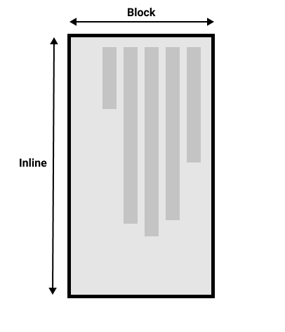

{{LearnSidebar}}{{PreviousMenuNext("Learn/CSS/Building_blocks/Backgrounds_and_borders", "Learn/CSS/Building_blocks/Overflowing_content", "Learn/CSS/Building_blocks")}}

Many of the properties and values that we have encountered so far in our CSS learning have been tied to the physical dimensions of our screen. We create borders on the top, right, bottom, and left of a box, for example. These physical dimensions map very neatly to content that is viewed horizontally, and by default the web tends to support left-to-right languages (e.g. English or French) better than right-to-left languages (such as Arabic).

In recent years however, CSS has evolved in order to better support different directionality of content, including right-to-left but also top-to-bottom content (such as Japanese) — these different directionalities are called **writing modes**. As you progress in your study and begin to work with layout, an understanding of writing modes will be very helpful to you, therefore we will introduce them now.

<table>
  <tbody>
    <tr>
      <th scope="row">Prerequisites:</th>
      <td>
        Basic computer literacy,
        <a
          href="/en-US/docs/Learn/Getting_started_with_the_web/Installing_basic_software"
          >basic software installed</a
        >, basic knowledge of
        <a
          href="/en-US/docs/Learn/Getting_started_with_the_web/Dealing_with_files"
          >working with files</a
        >, HTML basics (study
        <a href="/en-US/docs/Learn/HTML/Introduction_to_HTML"
          >Introduction to HTML</a
        >), and an idea of how CSS works (study
        <a href="/en-US/docs/Learn/CSS/First_steps">CSS first steps</a>.)
      </td>
    </tr>
    <tr>
      <th scope="row">Objective:</th>
      <td>To understand the importance of writing modes to modern CSS.</td>
    </tr>
  </tbody>
</table>

## What are writing modes?

A writing mode in CSS refers to whether the text is running horizontally or vertically. The {{cssxref("writing-mode")}} property lets us switch from one writing mode to another. You don't need to be working in a language which uses a vertical writing mode to want to do this — you could also change the writing mode of parts of your layout for creative purposes.

In the example below we have a heading displayed using `writing-mode: vertical-rl`. The text now runs vertically. Vertical text is common in graphic design, and can be a way to add a more interesting look and feel to your web design.

{{EmbedGHLiveSample("css-examples/learn/writing-modes/simple-vertical.html", '100%', 800)}}

The three possible values for the [`writing-mode`](/en-US/docs/Web/CSS/writing-mode) property are:

- `horizontal-tb`: Top-to-bottom block flow direction. Sentences run horizontally.
- `vertical-rl`: Right-to-left block flow direction. Sentences run vertically.
- `vertical-lr`: Left-to-right block flow direction. Sentences run vertically.

So the `writing-mode` property is in reality setting the direction in which block-level elements are displayed on the page — either from top-to-bottom, right-to-left, or left-to-right. This then dictates the direction text flows in sentences.

## Writing modes and block and inline layout

We have already discussed [block and inline layout](/en-US/docs/Learn/CSS/Building_blocks/The_box_model#block_and_inline_boxes), and the fact that some things display as block elements and others as inline elements. As we have seen described above, block and inline is tied to the writing mode of the document, and not the physical screen. Blocks are only displayed from the top to the bottom of the page if you are using a writing mode that displays text horizontally, such as English.

If we look at an example this will become clearer. In this next example I have two boxes that contain a heading and a paragraph. The first uses `writing-mode: horizontal-tb`, a writing mode that is written horizontally and from the top of the page to the bottom. The second uses `writing-mode: vertical-rl`; this is a writing mode that is written vertically and from right to left.

{{EmbedGHLiveSample("css-examples/learn/writing-modes/block-inline.html", '100%', 1200)}}

When we switch the writing mode, we are changing which direction is block and which is inline. In a `horizontal-tb` writing mode the block direction runs from top to bottom; in a `vertical-rl` writing mode the block direction runs right-to-left horizontally. So the **block dimension** is always the direction blocks are displayed on the page in the writing mode in use. The **inline dimension** is always the direction a sentence flows.

This figure shows the two dimensions when in a horizontal writing mode.

This figure shows the two dimensions in a vertical writing mode.

Once you start to look at CSS layout, and in particular the newer layout methods, this idea of block and inline becomes very important. We will revisit it later on.

### Direction

In addition to writing mode we also have text direction. As mentioned above, some languages such as Arabic are written horizontally, but right-to-left. This is not something you are likely to use in a creative sense — if you want to line something up on the right there are other ways to do so — however it is important to understand this as part of the nature of CSS. The web is not just for languages that are displayed left-to-right!

Due to the fact that writing mode and direction of text can change, newer CSS layout methods do not refer to left and right, and top and bottom. Instead they will talk about _start_ and _end_ along with this idea of inline and block. Don't worry too much about that right now, but keep these ideas in mind as you start to look at layout; you will find it really helpful in your understanding of CSS.

## Logical properties and values

The reason to talk about writing modes and direction at this point in your learning is that we have already looked at a lot of properties that are tied to the physical dimensions of the screen, and these make more sense when in a horizontal writing mode.

Let's take a look at our two boxes again — one with a `horizontal-tb` writing mode and one with `vertical-rl`. I have given both of these boxes a {{cssxref("width")}}. You can see that when the box is in the vertical writing mode, it still has a width, and this is causing the text to overflow.

{{EmbedGHLiveSample("css-examples/learn/writing-modes/width.html", '100%', 1200)}}

What we really want in this scenario is to essentially swap height with width in accordance to the writing mode. When we're in a vertical writing mode we want the box to expand in the block dimension just like it does in the horizontal mode.

To make this easier, CSS has recently developed a set of mapped properties. These essentially replace physical properties — things like `width` and `height` — with **logical**, or **flow relative** versions.

The property mapped to `width` when in a horizontal writing mode is called {{cssxref("inline-size")}} — it refers to the size in the inline dimension. The property for `height` is named {{cssxref("block-size")}} and is the size in the block dimension. You can see how this works in the example below where we have replaced `width` with `inline-size`.

{{EmbedGHLiveSample("css-examples/learn/writing-modes/inline-size.html", '100%', 1000)}}

### Logical margin, border, and padding properties

In the last two lessons we have learned about the CSS box model, and CSS borders. In the margin, border, and padding properties you will find many instances of physical properties, for example {{cssxref("margin-top")}}, {{cssxref("padding-left")}}, and {{cssxref("border-bottom")}}. In the same way that we have mappings for width and height there are mappings for these properties.

The `margin-top` property is mapped to {{cssxref("margin-block-start")}} — this will always refer to the margin at the start of the block dimension.

The {{cssxref("padding-left")}} property maps to {{cssxref("padding-inline-start")}}, the padding that is applied to the start of the inline direction. This will be where sentences start in that writing mode. The {{cssxref("border-bottom")}} property maps to {{cssxref("border-block-end")}}, which is the border at the end of the block dimension.

You can see a comparison between physical and logical properties below.

**If you change the writing mode of the boxes by switching the `writing-mode` property on `.box` to `vertical-rl`, you will see how the physical properties stay tied to their physical direction, whereas the logical properties switch with the writing mode.**

**You can also see that the {{htmlelement("Heading_Elements", "h2")}} has a black `border-bottom`. Can you work out how to make that bottom border always go below the text in both writing modes?**

{{EmbedGHLiveSample("css-examples/learn/writing-modes/logical-mbp.html", '100%', 1300)}}

There are a huge number of properties when you consider all of the individual border longhands, and you can see all of the mapped properties on the MDN page for [Logical Properties and Values](/en-US/docs/Web/CSS/CSS_logical_properties_and_values).

### Logical values

We have so far looked at logical property names. There are also some properties that take physical values of `top`, `right`, `bottom`, and `left`. These values also have mappings, to logical values — `block-start`, `inline-end`, `block-end`, and `inline-start`.

For example, you can float an image left to cause text to wrap round the image. You could replace `left` with `inline-start` as shown in the example below.

**Change the writing mode on this example to `vertical-rl` to see what happens to the image. Change `inline-start` to `inline-end` to change the float.**

{{EmbedGHLiveSample("css-examples/learn/writing-modes/float.html", '100%', 1000)}}

Here we are also using logical margin values to ensure the margin is in the correct place no matter what the writing mode is.

> **Note:** Currently, only Firefox supports flow relative values for `float`. If you are using **Google Chrome** or **Microsoft Edge**, you may find that the image did not float.

### Should you use physical or logical properties?

The logical properties and values are newer than their physical equivalents, and therefore have only recently been implemented in browsers. You can check any property page on MDN to see how far back the browser support goes. If you are not using multiple writing modes, then for now you might prefer to use the physical versions. However, ultimately we expect that people will transition to the logical versions for most things, as they make a lot of sense once you also start dealing with layout methods such as flexbox and grid.

## Test your skills!

You've reached the end of this article, but can you remember the most important information? You can find some further tests to verify that you've retained this information before you move on — see [Test your skills: Writing modes and logical properties](/en-US/docs/Learn/CSS/Building_blocks/Writing_Modes_Tasks).

## Summary

The concepts explained in this lesson are becoming increasingly important in CSS. An understanding of the block and inline direction — and how text flow changes with a change in writing mode — will be very useful going forward. It will help you in understanding CSS even if you never use a writing mode other than a horizontal one.

In the next article, we'll take a good look at [overflow](/en-US/docs/Learn/CSS/Building_blocks/Overflowing_content) in CSS.

{{PreviousMenuNext("Learn/CSS/Building_blocks/Backgrounds_and_borders", "Learn/CSS/Building_blocks/Overflowing_content", "Learn/CSS/Building_blocks")}}
