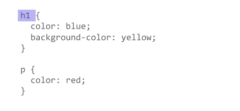

{{LearnSidebar}}{{PreviousMenuNext("Learn/CSS/Building_blocks/Cascade_and_inheritance", "Learn/CSS/Building_blocks/Selectors/Type_Class_and_ID_Selectors", "Learn/CSS/Building_blocks")}}

In {{Glossary("CSS")}}, selectors are used to target the {{glossary("HTML")}} elements on our web pages that we want to style. There are a wide variety of CSS selectors available, allowing for fine-grained precision when selecting elements to style. In this article and its sub-articles we'll run through the different types in great detail, seeing how they work.

<table>
  <tbody>
    <tr>
      <th scope="row">Prerequisites:</th>
      <td>
        Basic computer literacy,
        <a
          href="/en-US/docs/Learn/Getting_started_with_the_web/Installing_basic_software"
          >basic software installed</a
        >, basic knowledge of
        <a
          href="/en-US/docs/Learn/Getting_started_with_the_web/Dealing_with_files"
          >working with files</a
        >, HTML basics (study
        <a href="/en-US/docs/Learn/HTML/Introduction_to_HTML"
          >Introduction to HTML</a
        >), and an idea of how CSS works (study
        <a href="/en-US/docs/Learn/CSS/First_steps">CSS first steps</a>.)
      </td>
    </tr>
    <tr>
      <th scope="row">Objective:</th>
      <td>To learn how CSS selectors work in detail.</td>
    </tr>
  </tbody>
</table>

## What is a selector?

You have met selectors already. A CSS selector is the first part of a CSS Rule. It is a pattern of elements and other terms that tell the browser which HTML elements should be selected to have the CSS property values inside the rule applied to them. The element or elements which are selected by the selector are referred to as the _subject of the selector_.



In earlier articles you met some different selectors, and learned that there are selectors that target the document in different ways — for example by selecting an element such as `h1`, or a class such as `.special`.

In CSS, selectors are defined in the CSS Selectors specification; like any other part of CSS they need to have support in browsers for them to work. The majority of selectors that you will come across are defined in the [Level 3 Selectors specification](https://www.w3.org/TR/selectors-3/), which is a mature specification, therefore you will find excellent browser support for these selectors.

## Selector lists

If you have more than one thing which uses the same CSS then the individual selectors can be combined into a _selector list_ so that the rule is applied to all of the individual selectors. For example, if I have the same CSS for an `h1` and also a class of `.special`, I could write this as two separate rules.

```css
h1 {
  color: blue;
}

.special {
  color: blue;
}
```

I could also combine these into a selector list, by adding a comma between them.

```css
h1, .special {
  color: blue;
}
```

White space is valid before or after the comma. You may also find the selectors more readable if each is on a new line.

```css
h1,
.special {
  color: blue;
}
```

In the live example below try combining the two selectors which have identical declarations. The visual display should be the same after combining them.

{{EmbedGHLiveSample("css-examples/learn/selectors/selector-list.html", '100%', 1000)}}

When you group selectors in this way, if any selector is invalid the whole rule will be ignored.

In the following example, the invalid class selector rule will be ignored, whereas the `h1` would still be styled.

```css
h1 {
  color: blue;
}

..special {
  color: blue;
}
```

When combined however, neither the `h1` nor the class will be styled as the entire rule is deemed invalid.

```css
h1, ..special {
  color: blue;
}
```

## Types of selectors

There are a few different groupings of selectors, and knowing which type of selector you might need will help you to find the right tool for the job. In this article's subarticles we will look at the different groups of selectors in more detail.

### Type, class, and ID selectors

This group includes selectors that target an HTML element such as an `<h1>`.

```css
h1 { }
```

It also includes selectors which target a class:

```css
.box { }
```

or, an ID:

```css
#unique { }
```

### Attribute selectors

This group of selectors gives you different ways to select elements based on the presence of a certain attribute on an element:

```css
a[title] { }
```

Or even make a selection based on the presence of an attribute with a particular value:

```css
a[href="https://example.com"] { }
```

### Pseudo-classes and pseudo-elements

This group of selectors includes pseudo-classes, which style certain states of an element. The `:hover` pseudo-class for example selects an element only when it is being hovered over by the mouse pointer:

```css
a:hover { }
```

It also includes pseudo-elements, which select a certain part of an element rather than the element itself. For example, `::first-line` always selects the first line of text inside an element (a `<p>` in the below case), acting as if a `<span>` was wrapped around the first formatted line and then selected.

```css
p::first-line { }
```

### Combinators

The final group of selectors combine other selectors in order to target elements within our documents. The following, for example, selects paragraphs that are direct children of `<article>` elements using the child combinator (`>`):

```css
article > p { }
```

## Next steps

You can take a look at the reference table of selectors below for direct links to the various types of selectors in this Learn section or on MDN in general, or continue on to start your journey by finding out about [type, class, and ID selectors](/en-US/docs/Learn/CSS/Building_blocks/Selectors/Type_Class_and_ID_Selectors).

{{PreviousMenuNext("Learn/CSS/Building_blocks/Cascade_and_inheritance", "Learn/CSS/Building_blocks/Selectors/Type_Class_and_ID_Selectors", "Learn/CSS/Building_blocks")}}

## Reference table of selectors

The below table gives you an overview of the selectors you have available to use, along with links to the pages in this guide which will show you how to use each type of selector. I have also included a link to the MDN page for each selector where you can check browser support information. You can use this as a reference to come back to when you need to look up selectors later in the material, or as you experiment with CSS generally.

<table class="standard-table no-markdown">
  <thead>
    <tr>
      <th scope="col">Selector</th>
      <th scope="col">Example</th>
      <th scope="col">Learn CSS tutorial</th>
    </tr>
  </thead>
  <tbody>
    <tr>
      <td><a href="/en-US/docs/Web/CSS/Type_selectors">Type selector</a></td>
      <td><code>h1 {  }</code></td>
      <td>
        <a
          href="/en-US/docs/Learn/CSS/Building_blocks/Selectors/Type_Class_and_ID_Selectors#type_selectors"
          >Type selectors</a
        >
      </td>
    </tr>
    <tr>
      <td>
        <a href="/en-US/docs/Web/CSS/Universal_selectors">Universal selector</a>
      </td>
      <td><code>* {  }</code></td>
      <td>
        <a
          href="/en-US/docs/Learn/CSS/Building_blocks/Selectors/Type_Class_and_ID_Selectors#the_universal_selector"
          >The universal selector</a
        >
      </td>
    </tr>
    <tr>
      <td><a href="/en-US/docs/Web/CSS/Class_selectors">Class selector</a></td>
      <td><code>.box {  }</code></td>
      <td>
        <a
          href="/en-US/docs/Learn/CSS/Building_blocks/Selectors/Type_Class_and_ID_Selectors#class_selectors"
          >Class selectors</a
        >
      </td>
    </tr>
    <tr>
      <td><a href="/en-US/docs/Web/CSS/ID_selectors">id selector</a></td>
      <td><code>#unique { }</code></td>
      <td>
        <a
          href="/en-US/docs/Learn/CSS/Building_blocks/Selectors/Type_Class_and_ID_Selectors#id_selectors"
          >ID selectors</a
        >
      </td>
    </tr>
    <tr>
      <td>
        <a href="/en-US/docs/Web/CSS/Attribute_selectors">Attribute selector</a>
      </td>
      <td><code>a[title] {  }</code></td>
      <td>
        <a
          href="/en-US/docs/Learn/CSS/Building_blocks/Selectors/Attribute_selectors"
          >Attribute selectors</a
        >
      </td>
    </tr>
    <tr>
      <td>
        <a href="/en-US/docs/Web/CSS/Pseudo-classes">Pseudo-class selectors</a>
      </td>
      <td><code>p:first-child { }</code></td>
      <td>
        <a
          href="/en-US/docs/Learn/CSS/Building_blocks/Selectors/Pseudo-classes_and_pseudo-elements#what_is_a_pseudo-class"
          >Pseudo-classes</a
        >
      </td>
    </tr>
    <tr>
      <td>
        <a href="/en-US/docs/Web/CSS/Pseudo-elements"
          >Pseudo-element selectors</a
        >
      </td>
      <td><code>p::first-line { }</code></td>
      <td>
        <a
          href="/en-US/docs/Learn/CSS/Building_blocks/Selectors/Pseudo-classes_and_pseudo-elements#what_is_a_pseudo-element"
          >Pseudo-elements</a
        >
      </td>
    </tr>
    <tr>
      <td>
        <a href="/en-US/docs/Web/CSS/Descendant_combinator"
          >Descendant combinator</a
        >
      </td>
      <td><code>article p</code></td>
      <td>
        <a
          href="/en-US/docs/Learn/CSS/Building_blocks/Selectors/Combinators#descendant_selector"
          >Descendant combinator</a
        >
      </td>
    </tr>
    <tr>
      <td>
        <a href="/en-US/docs/Web/CSS/Child_combinator">Child combinator</a>
      </td>
      <td><code>article > p</code></td>
      <td>
        <a
          href="/en-US/docs/Learn/CSS/Building_blocks/Selectors/Combinators#child_combinator"
          >Child combinator</a
        >
      </td>
    </tr>
    <tr>
      <td>
        <a href="/en-US/docs/Web/CSS/Adjacent_sibling_combinator"
          >Adjacent sibling combinator</a
        >
      </td>
      <td><code>h1 + p</code></td>
      <td>
        <a
          href="/en-US/docs/Learn/CSS/Building_blocks/Selectors/Combinators#adjacent_sibling"
          >Adjacent sibling</a
        >
      </td>
    </tr>
    <tr>
      <td>
        <a href="/en-US/docs/Web/CSS/General_sibling_combinator"
          >General sibling combinator</a
        >
      </td>
      <td><code>h1 ~ p</code></td>
      <td>
        <a
          href="/en-US/docs/Learn/CSS/Building_blocks/Selectors/Combinators#general_sibling"
          >General sibling</a
        >
      </td>
    </tr>
  </tbody>
</table>

## In this module

1.  [Cascade and inheritance](/en-US/docs/Learn/CSS/Building_blocks/Cascade_and_inheritance)
2.  [CSS selectors](/en-US/docs/Learn/CSS/Building_blocks/Selectors)

    - [Type, class, and ID selectors](/en-US/docs/Learn/CSS/Building_blocks/Selectors/Type_Class_and_ID_Selectors)
    - [Attribute selectors](/en-US/docs/Learn/CSS/Building_blocks/Selectors/Attribute_selectors)
    - [Pseudo-classes and pseudo-elements](/en-US/docs/Learn/CSS/Building_blocks/Selectors/Pseudo-classes_and_pseudo-elements)
    - [Combinators](/en-US/docs/Learn/CSS/Building_blocks/Selectors/Combinators)

3.  [The box model](/en-US/docs/Learn/CSS/Building_blocks/The_box_model)
4.  [Backgrounds and borders](/en-US/docs/Learn/CSS/Building_blocks/Backgrounds_and_borders)
5.  [Handling different text directions](/en-US/docs/Learn/CSS/Building_blocks/Handling_different_text_directions)
6.  [Overflowing content](/en-US/docs/Learn/CSS/Building_blocks/Overflowing_content)
7.  [Values and units](/en-US/docs/Learn/CSS/Building_blocks/Values_and_units)
8.  [Sizing items in CSS](/en-US/docs/Learn/CSS/Building_blocks/Sizing_items_in_CSS)
9.  [Images, media, and form elements](/en-US/docs/Learn/CSS/Building_blocks/Images_media_form_elements)
10. [Styling tables](/en-US/docs/Learn/CSS/Building_blocks/Styling_tables)
11. [Debugging CSS](/en-US/docs/Learn/CSS/Building_blocks/Debugging_CSS)
12. [Organizing your CSS](/en-US/docs/Learn/CSS/Building_blocks/Organizing)
