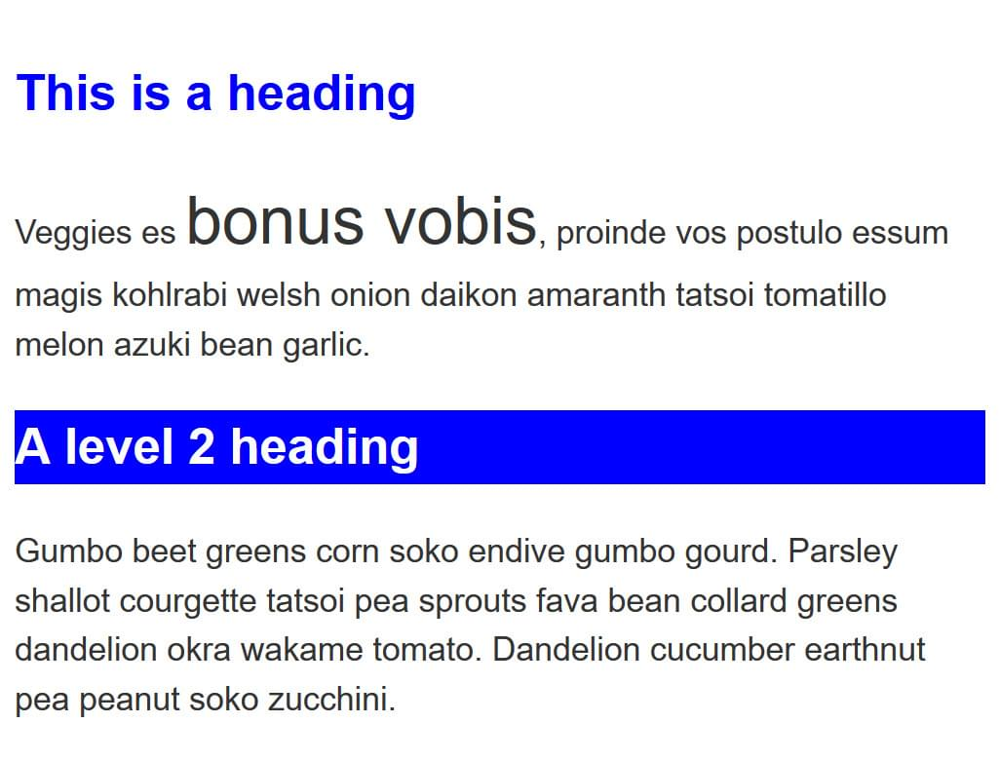
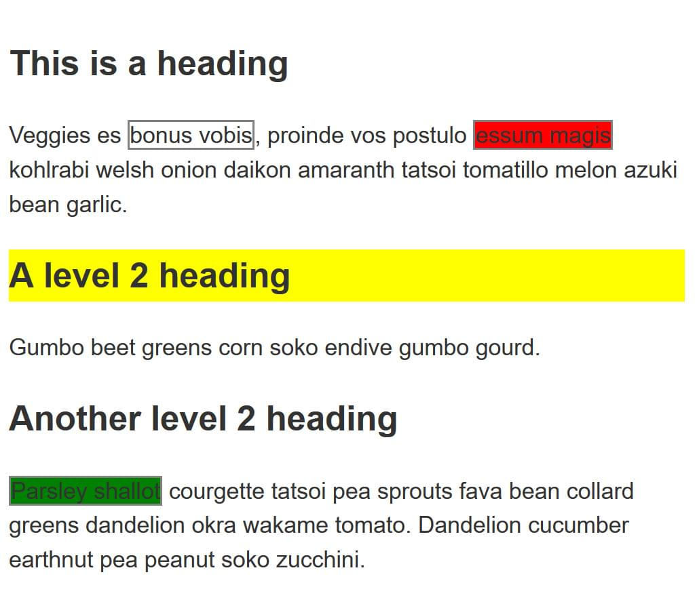
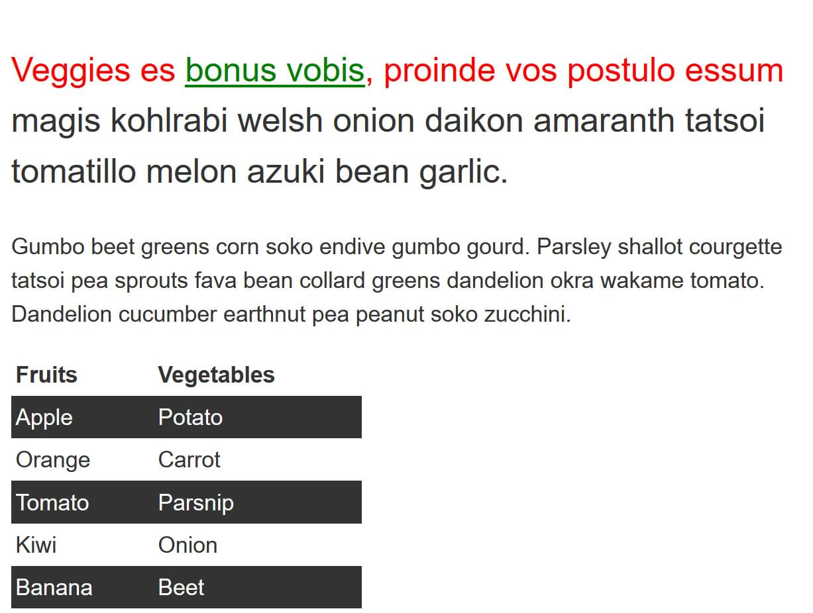
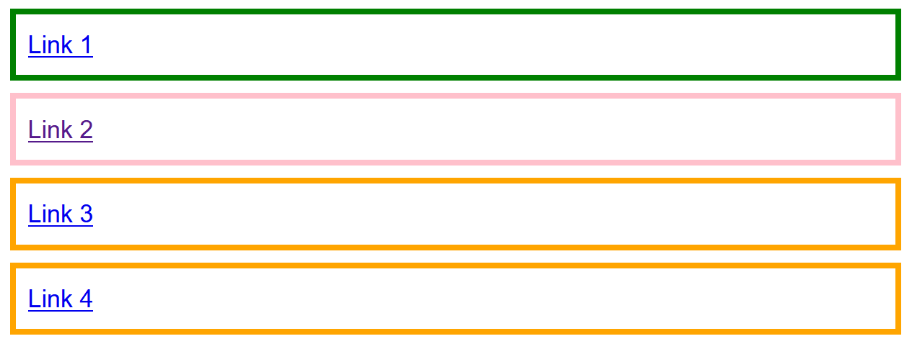

{{LearnSidebar}}

The aim of this skill test is to assess whether you understand [CSS selectors](/en-US/docs/Learn/CSS/Building_blocks/Selectors).

> **Note:** You can try out solutions in the interactive editors below. However, it may be helpful to download the code and use an online tool such as [CodePen](https://codepen.io/), [jsFiddle](https://jsfiddle.net/), or [Glitch](https://glitch.com/) to work on the tasks.
>
> If you get stuck, then ask us for help — see the [Assessment or further help](#assessment_or_further_help) section at the bottom of this page.

## Task 1

In this task, use CSS to do the following things, without changing the HTML:

- Make `<h1>` headings blue.
- Give `<h2>` headings a blue background and white text.
- Cause text wrapped in a `` to have a font-size of 200%.

Your final result should look like the image below:

Try updating the live code below to recreate the finished example:

{{EmbedGHLiveSample("css-examples/learn/tasks/selectors/type.html", '100%', 700)}}

> **Callout:**
>
> [Download the starting point for this task](https://github.com/mdn/css-examples/blob/main/learn/tasks/selectors/type-download.html) to work in your own editor or in an online editor.

## Task 2

In this task, we want you to make the following changes to the look of the content in this example, without changing the HTML:

- Give the element with an id of `special` a yellow background.
- Give the element with a class of `alert` a 1px grey border.
- If the element with a class of `alert` also has a class of `stop`, make the background red.
- If the element with a class of `alert` also has a class of `go`, make the background green.

Your final result should look like the image below:

Try updating the live code below to recreate the finished example:

{{EmbedGHLiveSample("css-examples/learn/tasks/selectors/class-id.html", '100%', 800)}}

> **Callout:**
>
> [Download the starting point for this task](https://github.com/mdn/css-examples/blob/main/learn/tasks/selectors/class-id-download.html) to work in your own editor or in an online editor.

## Task 3

In this task, we want you to make the following changes without adding to the HTML:

- Style links, making the link-state orange, visited links green, and remove the underline on hover.
- Make the first element inside the container font-size: 150% and the first line of that element red.
- Stripe every other row in the table by selecting these rows and giving them a background color of #333 and foreground of white.

Your final result should look like the image below:

Try updating the live code below to recreate the finished example:

{{EmbedGHLiveSample("css-examples/learn/tasks/selectors/pseudo.html", '100%', 800)}}

> **Callout:**
>
> [Download the starting point for this task](https://github.com/mdn/css-examples/blob/main/learn/tasks/selectors/pseudo-download.html) to work in your own editor or in an online editor.

## Task 4

In this task, we want you to do the following:

- Make any paragraph that directly follows an `<h2>` element red.
- Remove the bullets and add a 1px grey bottom border only to list items that are a direct child of the ul with a class of `list`.

Your final result should look like the image below:

Try updating the live code below to recreate the finished example:

{{EmbedGHLiveSample("css-examples/learn/tasks/selectors/combinators.html", '100%', 800)}}

> **Callout:**
>
> [Download the starting point for this task](https://github.com/mdn/css-examples/blob/main/learn/tasks/selectors/combinators-download.html) to work in your own editor or in an online editor.

## Task 5

In this task, add CSS using attribute selectors to do the following:

- Target the `<a>` element with a `title` attribute and make the border pink (`border-color: pink`).
- Target the `<a>` element with an `href` attribute that contains the word `contact` somewhere in its value and make the border orange (`border-color: orange`).
- Target the `<a>` element with an `href` value starting with `https` and give it a green border (`border-color: green`).

Your final result should look like the image below:

Try updating the live code below to recreate the finished example:

{{EmbedGHLiveSample("css-examples/learn/tasks/selectors/attribute-links.html", '100%', 800)}}

> **Callout:**
>
> [Download the starting point for this task](https://github.com/mdn/css-examples/blob/main/learn/tasks/selectors/attribute-links-download.html) to work in your own editor or in an online editor.

## Assessment or further help

You can practice these examples in the Interactive Editors above.

If you would like your work assessed or are stuck and want to ask for help:

1. Put your work into an online shareable editor such as [CodePen](https://codepen.io/), [jsFiddle](https://jsfiddle.net/), or [Glitch](https://glitch.com/). You can write the code yourself or use the starting point files linked to in the above sections.
2. Write a post asking for assessment and/or help at the [MDN Discourse forum Learning category](https://discourse.mozilla.org/c/mdn/learn/250). Your post should include:

   - A descriptive title such as "Assessment wanted for selectors skill test 1".
   - Details of what you have already tried and what you would like us to do; for example, tell us if you're stuck and need help or want an assessment.
   - A link to the example you want assessed or need help with, in an online shareable editor (as mentioned in step 1 above). This is a good practice to get into — it's very hard to help someone with a coding problem if you can't see their code.
   - A link to the actual task or assessment page, so we can find the question you want help with.
