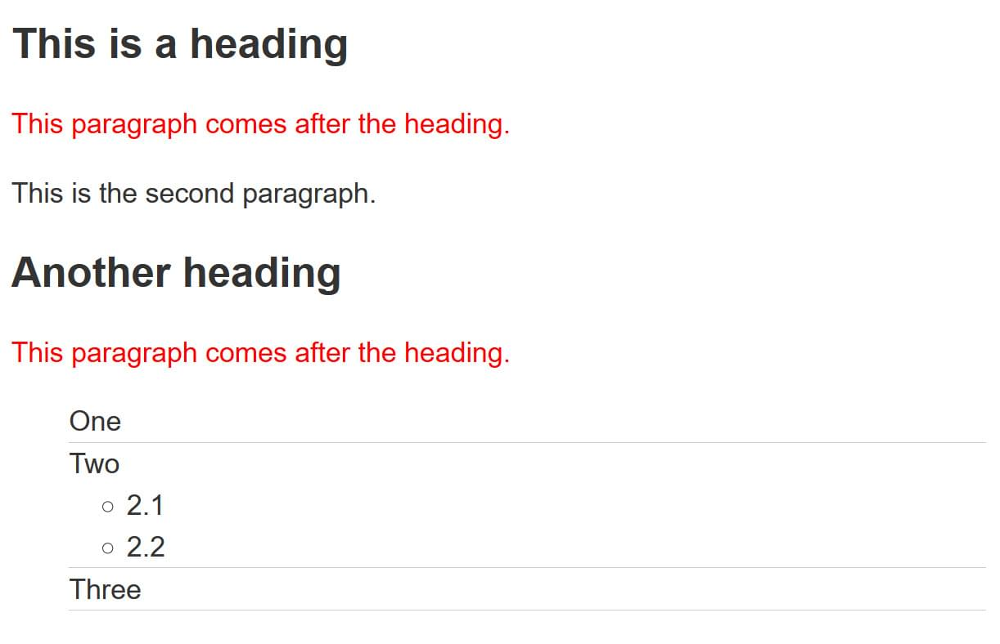

{{LearnSidebar}}

The aim of this task is to help you check your understanding of selectors in CSS.

> **Note:** You can try out solutions in the interactive editors below, however, it may be helpful to download the code and use an online tool such as [CodePen](https://codepen.io/), [jsFiddle](https://jsfiddle.net/), or [Glitch](https://glitch.com/) to work on the tasks.
>
> If you get stuck, then ask us for help — see the {{anch("Assessment or further help")}} section at the bottom of this page.

## Selectors One

Without changing the HTML, use CSS to do the following things:

- Make h1 headings blue.
- Give h2 headings a blue background and white text.
- Cause text wrapped in a span to have a font-size of 200%.

Try updating the live code below to recreate the finished example:

{{EmbedGHLiveSample("css-examples/learn/tasks/selectors/type.html", '100%', 700)}}

> **Callout:**
>
> For assessment or further work purposes, [download the starting point for this task](https://github.com/mdn/css-examples/blob/master/learn/tasks/selectors/type-download.html) to work in your own editor or in an online editor.

## Selectors Two

Without changing the HTML, make the following changes to the look of the content in this example:

- Give the element with an id of `special` a yellow background.
- Give the element with a class of `alert` a 1px grey border.
- If the element with a class of `alert` also has a class of `stop`, make the background red.
- If the element with a class of `alert` also has a class of `go`, make the background green.

Try updating the live code below to recreate the finished example:

{{EmbedGHLiveSample("css-examples/learn/tasks/selectors/class-id.html", '100%', 800)}}

> **Callout:**
>
> For assessment or further work purposes, [download the starting point for this task](https://github.com/mdn/css-examples/blob/master/learn/tasks/selectors/class-id-download.html) to work in your own editor or in an online editor.

## Selectors Three

In this example, try making the following changes without adding to the HTML.

- Style links, making the link-state orange, visited links green, and remove the underline on hover.
- Make the first element inside the container font-size: 150% and the first line of that element red.
- Stripe every other row in the table by selecting these rows and giving them a background color of #333 and foreground of white.

Try updating the live code below to recreate the finished example:

{{EmbedGHLiveSample("css-examples/learn/tasks/selectors/pseudo.html", '100%', 800)}}

> **Callout:**
>
> For assessment or further work purposes, [download the starting point for this task](https://github.com/mdn/css-examples/blob/master/learn/tasks/selectors/pseudo-download.html) to work in your own editor or in an online editor.

## Selectors Four

In this task try the following:

- Make any paragraph that directly follows an h2 element red.
- Remove the bullets and add a 1px grey bottom border only to list items that are a direct child of the ul with a class of list.

Try updating the live code below to recreate the finished example:

{{EmbedGHLiveSample("css-examples/learn/tasks/selectors/combinators.html", '100%', 800)}}

> **Callout:**
>
> For assessment or further work purposes, [download the starting point for this task](https://github.com/mdn/css-examples/blob/master/learn/tasks/selectors/combinators-download.html) to work in your own editor or in an online editor.

## Selectors Five

In this final task add CSS using attribute selectors to do the following:

- Target the `<a>` element with a `title` attribute and make the border pink (`border-color: pink`).
- Target the `<a>` element with an `href` attribute that contains the word `contact` somewhere in its value and make the border orange (`border-color: orange`).
- Target the `<a>` element with an `href` value starting with `https` and give it a green border (`border-color: green`).

Try updating the live code below to recreate the finished example:

{{EmbedGHLiveSample("css-examples/learn/tasks/selectors/attribute-links.html", '100%', 800)}}

> **Callout:**
>
> For assessment or further work purposes, [download the starting point for this task](https://github.com/mdn/css-examples/blob/master/learn/tasks/selectors/attribute-links-download.html) to work in your own editor or in an online editor.

## Assessment or further help

You can practice these examples in the Interactive Editors mentioned above.

If you would like your work assessed, or are stuck and want to ask for help:

1.  Put your work into an online shareable editor such as [CodePen](https://codepen.io/), [jsFiddle](https://jsfiddle.net/), or [Glitch](https://glitch.com/). You can write the code yourself, or use the starting point files linked to in the above sections.
2.  Write a post asking for assessment and/or help at the [MDN Discourse forum Learning category](https://discourse.mozilla.org/c/mdn/learn). Your post should include:

    - A descriptive title such as "Assessment wanted for Selectors skill test 1".
    - Details of what you have already tried, and what you would like us to do, e.g. if you are stuck and need help, or want an assessment.
    - A link to the example you want to be assessed or need help with, in an online shareable editor (as mentioned in step 1 above). This is a good practice to get into — it's very hard to help someone with a coding problem if you can't see their code.
    - A link to the actual task or assessment page, so we can find the question you want help with.

3.  You Can find all the answers in [CodePen Collection](https://codepen.io/collection/DxBgky?grid_type=grid)
