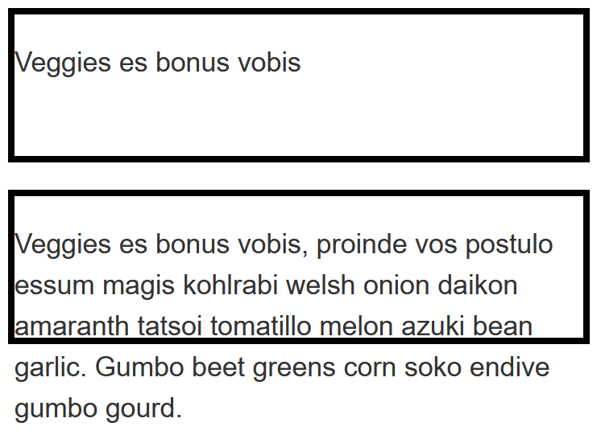
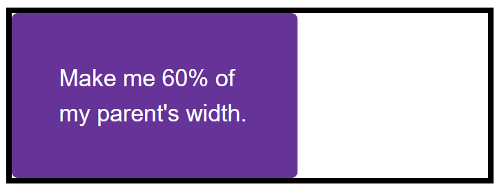
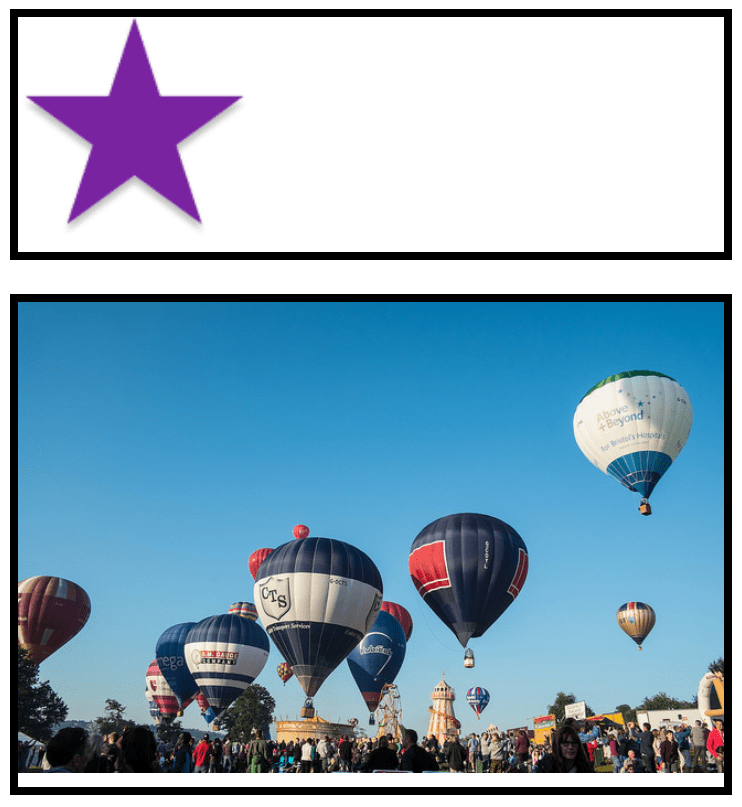

{{LearnSidebar}}

The aim of this skill test is to assess whether you understand the different ways of [sizing items in CSS](/en-US/docs/Learn/CSS/Building_blocks/Sizing_items_in_CSS).

> **Note:** You can try out solutions in the interactive editors below. However, it may be helpful to download the code and use an online tool such as [CodePen](https://codepen.io/), [jsFiddle](https://jsfiddle.net/), or [Glitch](https://glitch.com/) to work on the tasks.
>
> If you get stuck, then ask us for help — see the [Assessment or further help](#assessment_or_further_help) section at the bottom of this page.

## Task 1

In this task, you have two boxes. The first should be sized so that the height will be at least 100 pixels tall, even if there is less content that would cause it to grow to that height. However, the content should not overflow if there is more content than fits in 100 pixels. Test this box by removing the content from the HTML to make sure you still get a 100 pixel tall box even with no content.

The second box should be fixed at 100 pixels tall, so that content will overflow if there is too much.

Try updating the live code below to recreate the finished example:

{{EmbedGHLiveSample("css-examples/learn/tasks/sizing/height-min-height.html", '100%', 1000)}}

> **Callout:**
>
> [Download the starting point for this task](https://github.com/mdn/css-examples/blob/main/learn/tasks/sizing/height-min-height-download.html) to work in your own editor or in an online editor.

## Task 2

In this task, you have a box, which contains another box. Your task is to make the inner box 60% of the width of the outer box. The value of the {{cssxref("box-sizing")}} property is set to `border-box`, which means that the total width includes any padding and border. You should also give the inner box padding of 10% using the width (or inline size) as the size from which that percentage is calculated.

Your final result should look like the image below:

Try updating the live code below to recreate the finished example:

{{EmbedGHLiveSample("css-examples/learn/tasks/sizing/percentages.html", '100%', 800)}}

> **Callout:**
>
> [Download the starting point for this task](https://github.com/mdn/css-examples/blob/main/learn/tasks/sizing/percentages-download.html) to work in your own editor or in an online editor.

## Task 3

In this task, you have two images in boxes. One image is smaller than the box, the other is larger and breaking out of the box. If you imagine that the box is responsive and therefore could grow and shrink, which property would you apply to the image so that the large image shrinks down into the box but the small image does not stretch.

Your final result should look like the images below:

Try updating the live code below to recreate the finished example:

{{EmbedGHLiveSample("css-examples/learn/tasks/sizing/max-width.html", '100%', 1200)}}

> **Callout:**
>
> [Download the starting point for this task](https://github.com/mdn/css-examples/blob/main/learn/tasks/sizing/max-width-download.html) to work in your own editor or in an online editor.

## Assessment or further help

You can practice these examples in the Interactive Editors above.

If you would like your work assessed or are stuck and want to ask for help:

1. Put your work into an online shareable editor such as [CodePen](https://codepen.io/), [jsFiddle](https://jsfiddle.net/), or [Glitch](https://glitch.com/). You can write the code yourself or use the starting point files linked to in the above sections.
2. Write a post asking for assessment and/or help at the [MDN Discourse forum Learning category](https://discourse.mozilla.org/c/mdn/learn/250). Your post should include:

   - A descriptive title such as "Assessment wanted for sizing skill test 1".
   - Details of what you have already tried and what you would like us to do; for example, tell us if you're stuck and need help or want an assessment.
   - A link to the example you want assessed or need help with, in an online shareable editor (as mentioned in step 1 above). This is a good practice to get into — it's very hard to help someone with a coding problem if you can't see their code.
   - A link to the actual task or assessment page, so we can find the question you want help with.
