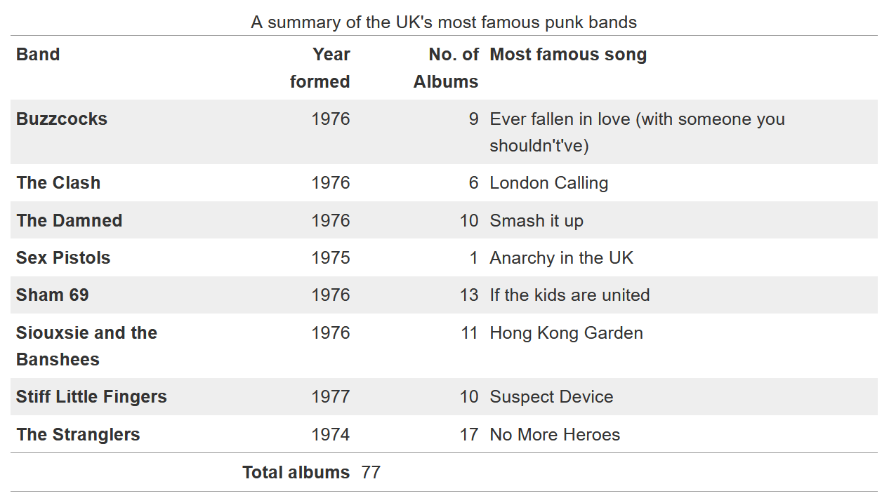

{{LearnSidebar}}

The aim of this skill test is to assess whether you understand how to [style HTML tables in CSS](/en-US/docs/Learn/CSS/Building_blocks/Styling_tables).

> **Note:** You can try out solutions in the interactive editors below. However, it may be helpful to download the code and use an online tool such as [CodePen](https://codepen.io/), [jsFiddle](https://jsfiddle.net/), or [Glitch](https://glitch.com/) to work on the tasks.
>
> If you get stuck, then ask us for help — see the [Assessment or further help](#assessment_or_further_help) section at the bottom of this page.

## Task

In the lesson on [styling tables](/en-US/docs/Learn/CSS/Building_blocks/Styling_tables) we styled up a table in a rather garish manner. In this task, we are going to style the same table, but using some good practices for table design as outlined in the external article [Web Typography: designing tables to be read not looked at](https://alistapart.com/article/web-typography-tables/).

Our finished table will look like the image below. There are a number of ways that you can achieve this, but we suggest you follow similar patterns as used in the tutorial to do the following things:

- Add padding of `0.3em` to the table headings and data and align them at the top of their cells.
- Align headings and data for columns containing numbers right.
- Align headings and data for columns containing text left.
- Add a 1px top and bottom solid border with the hex color `#999`, plus a 1px solid border of the same color above the footer.
- Remove the default spacing between the table elements borders to get the expected result.
- Stripe every odd row of the main table with the hex color `#eee`.

Try updating the live code below to recreate the finished example:

{{EmbedGHLiveSample("css-examples/learn/tasks/tables/table.html", '100%', 1000)}}

Additional question:

- What can you do to make the table layout behave a bit more predictably? Think of how table columns are sized by default and how we can change this behavior to size the columns according to the width of their headings.

> **Callout:**
>
> [Download the starting point for this task](https://github.com/mdn/css-examples/blob/main/learn/tasks/tables/table-download.html) to work in your own editor or in an online editor.

## Assessment or further help

You can practice these examples in the Interactive Editors above.

If you would like your work assessed or are stuck and want to ask for help:

1. Put your work into an online shareable editor such as [CodePen](https://codepen.io/), [jsFiddle](https://jsfiddle.net/), or [Glitch](https://glitch.com/). You can write the code yourself or use the starting point files linked to in the above sections.
2. Write a post asking for assessment and/or help at the [MDN Discourse forum Learning category](https://discourse.mozilla.org/c/mdn/learn/250). Your post should include:

    - A descriptive title such as "Assessment wanted for the tables skill test".
    - Details of what you have already tried and what you would like us to do; for example, tell us if you're stuck and need help or want an assessment.
    - A link to the example you want assessed or need help with, in an online shareable editor (as mentioned in step 1 above). This is a good practice to get into — it's very hard to help someone with a coding problem if you can't see their code.
    - A link to the actual task or assessment page, so we can find the question you want help with.
