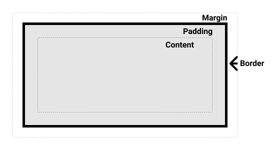
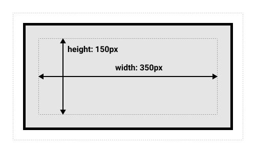
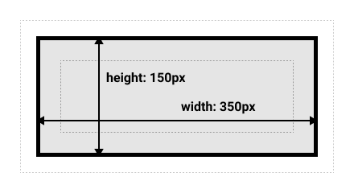
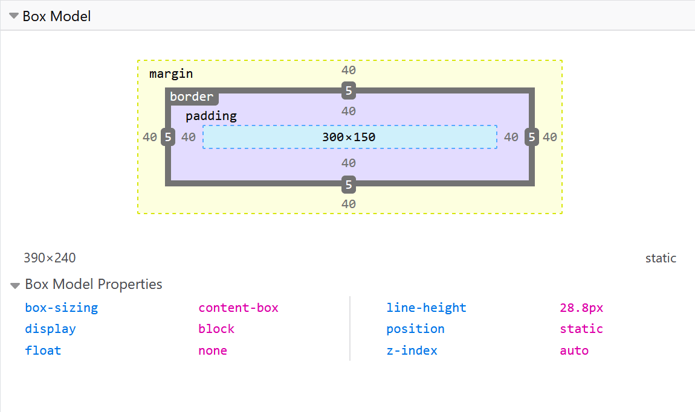

{{LearnSidebar}}{{PreviousMenuNext("Learn/CSS/Building_blocks/Cascade_layers", "Learn/CSS/Building_blocks/Backgrounds_and_borders", "Learn/CSS/Building_blocks")}}

Everything in CSS has a box around it, and understanding these boxes is key to being able to create more complex layouts with CSS, or to align items with other items. In this lesson, we will take a look at the CSS _Box Model_. You'll get an understanding of how it works and the terminology that relates to it.

<table>
  <tbody>
    <tr>
      <th scope="row">Prerequisites:</th>
      <td>
        Basic computer literacy,
        <a
          href="/en-US/docs/Learn/Getting_started_with_the_web/Installing_basic_software"
          >basic software installed</a
        >, basic knowledge of
        <a
          href="/en-US/docs/Learn/Getting_started_with_the_web/Dealing_with_files"
          >working with files</a
        >, HTML basics (study
        <a href="/en-US/docs/Learn/HTML/Introduction_to_HTML"
          >Introduction to HTML</a
        >), and an idea of how CSS works (study
        <a href="/en-US/docs/Learn/CSS/First_steps">CSS first steps</a>.)
      </td>
    </tr>
    <tr>
      <th scope="row">Objective:</th>
      <td>
        To learn about the CSS Box Model, what makes up the box model and how to
        switch to the alternate model.
      </td>
    </tr>
  </tbody>
</table>

## Block and inline boxes

In CSS we have several types of boxes that generally fit into the categories of **block boxes** and **inline boxes**. The type refers to how the box behaves in terms of page flow and in relation to other boxes on the page. Boxes have an **inner display type** and an **outer display type**.

In general, you can set various values for the display type using the {{cssxref("display")}} property, which can have various values.

## Outer display type

If a box has an outer display type of `block`, then:

- The box will break onto a new line.
- The {{cssxref("width")}} and {{cssxref("height")}} properties are respected.
- Padding, margin and border will cause other elements to be pushed away from the box.
- If {{cssxref("width")}} is not specified, the box will extend in the inline direction to fill the space available in its container. In most cases, the box will become as wide as its container, filling up 100% of the space available.

Some HTML elements, such as `<h1>` and `<p>`, use `block` as their outer display type by default.

If a box has an outer display type of `inline`, then:

- The box will not break onto a new line.
- The {{cssxref("width")}} and {{cssxref("height")}} properties will not apply.
- Top and bottom padding, margins, and borders will apply but will not cause other inline boxes to move away from the box.
- Left and right padding, margins, and borders will apply and will cause other inline boxes to move away from the box.

Some HTML elements, such as `<a>`, `<span>`, `<em>` and `<strong>` use `inline` as their outer display type by default.

## Inner display type

Boxes also have an _inner_ display type, which dictates how elements inside that box are laid out.

Block and inline layout is the default way things behave on the web. By default and without any other instruction, the elements inside a box are also laid out in **[normal flow](/en-US/docs/Learn/CSS/CSS_layout/Normal_Flow)** and behave as block or inline boxes.

You can change the inner display type for example by setting `display: flex;`. The element will still use the outer display type `block` but this changes the inner display type to `flex`. Any direct children of this box will become flex items and behave according to the [Flexbox](/en-US/docs/Learn/CSS/CSS_layout/Flexbox) specification.

When you move on to learn about CSS Layout in more detail, you will encounter [`flex`](/en-US/docs/Learn/CSS/CSS_layout/Flexbox), and various other inner values that your boxes can have, for example [`grid`](/en-US/docs/Learn/CSS/CSS_layout/Grids).

> **Note:** To read more about the values of display, and how boxes work in block and inline layout, take a look at the MDN guide [Block and Inline Layout](/en-US/docs/Web/CSS/CSS_flow_layout/Block_and_inline_layout_in_normal_flow).

## Examples of different display types

The example below has three different HTML elements, all of which have an outer display type of `block`.

- A paragraph with a border added in CSS. The browser renders this as a block box. The paragraph starts on a new line and extends the entire available width.

- A list, which is laid out using `display: flex`. This establishes flex layout for the children of the container, which are flex items. The list itself is a block box and — like the paragraph — expands to the full container width and breaks onto a new line.

- A block-level paragraph, inside which are two `<span>` elements. These elements would normally be `inline`, however, one of the elements has a class of "block" which gets set to `display: block`.

{{EmbedGHLiveSample("css-examples/learn/box-model/block.html", '100%', 1100)}}

In the next example, we can see how `inline` elements behave.

- The `<span>` elements in the first paragraph are inline by default and so do not force line breaks.

- The `<ul>` element that is set to `display: inline-flex` creates an inline box containing some flex items.

- The two paragraphs are both set to `display: inline`. The inline flex container and paragraphs all run together on one line rather than breaking onto new lines (as they would do if they were displaying as block-level elements).

**To toggle between the display modes, you can change `display: inline` to `display: block` or `display: inline-flex` to `display: flex`.**

{{EmbedGHLiveSample("css-examples/learn/box-model/inline.html", '100%', 1100)}}

The key thing to remember for now is: Changing the value of the `display` property can change whether the outer display type of a box is block or inline. This changes the way it displays alongside other elements in the layout.

## What is the CSS box model?

The CSS box model as a whole applies to block boxes and defines how the different parts of a box — margin, border, padding, and content — work together to create a box that you can see on a page. Inline boxes use just _some_ of the behavior defined in the box model.

To add complexity, there is a standard and an alternate box model. By default, browsers use the standard box model.

### Parts of a box

Making up a block box in CSS we have the:

- **Content box**: The area where your content is displayed; size it using properties like {{cssxref("inline-size")}} and {{cssxref("block-size")}} or {{cssxref("width")}} and {{cssxref("height")}}.
- **Padding box**: The padding sits around the content as white space; size it using {{cssxref("padding")}} and related properties.
- **Border box**: The border box wraps the content and any padding; size it using {{cssxref("border")}} and related properties.
- **Margin box**: The margin is the outermost layer, wrapping the content, padding, and border as whitespace between this box and other elements; size it using {{cssxref("margin")}} and related properties.

The below diagram shows these layers:



### The standard CSS box model

In the standard box model, if you give a box an `inline-size` and a `block-size` (or `width` and a `height`) attributes, this defines the inline-size and block-size (width and height in horizontal languages) of the _content box_. Any padding and border is then added to those dimensions to get the total size taken up by the box (see image below).

If we assume that a box has the following CSS:

```css
.box {
  width: 350px;
  height: 150px;
  margin: 10px;
  padding: 25px;
  border: 5px solid black;
}
```

The _actual_ space taken up by the box will be 410px wide (350 + 25 + 25 + 5 + 5) and 210px high (150 + 25 + 25 + 5 + 5).



> **Note:** The margin is not counted towards the actual size of the box — sure, it affects the total space that the box will take up on the page, but only the space outside the box. The box's area stops at the border — it does not extend into the margin.

### The alternative CSS box model

In the alternative box model, any width is the width of the visible box on the page. The content area width is that width minus the width for the padding and border (see image below). No need to add up the border and padding to get the real size of the box.

To turn on the alternative model for an element, set `box-sizing: border-box` on it:

```css
.box {
  box-sizing: border-box;
}
```

If we assume the box has the same CSS as above:

```css
.box {
  width: 350px;
  inline-size: 350px;
  height: 150px;
  block-size: 150px;
  margin: 10px;
  padding: 25px;
  border: 5px solid black;
}
```

Now, the _actual_ space taken up by the box will be 350px in the inline direction and 150px in the block direction.



To use the alternative box model for all of your elements (which is a common choice among developers), set the `box-sizing` property on the `<html>` element and set all other elements to inherit that value:

```css
html {
  box-sizing: border-box;
}
*,
*::before,
*::after {
  box-sizing: inherit;
}
```

To understand the underlying idea, you can read [the CSS Tricks article on box-sizing](https://css-tricks.com/inheriting-box-sizing-probably-slightly-better-best-practice/).

## Playing with box models

In the example below, you can see two boxes. Both have a class of `.box`, which gives them the same `width`, `height`, `margin`, `border`, and `padding`. The only difference is that the second box has been set to use the alternative box model.

**Can you change the size of the second box (by adding CSS to the `.alternate` class) to make it match the first box in width and height?**

{{EmbedGHLiveSample("css-examples/learn/box-model/box-models.html", '100%', 1100)}}

> **Note:** You can find a solution for this task [here](https://github.com/mdn/css-examples/blob/main/learn/solutions.md#the-box-model).

### Use browser DevTools to view the box model

Your [browser developer tools](/en-US/docs/Learn/Common_questions/Tools_and_setup/What_are_browser_developer_tools) can make understanding the box model far easier. If you inspect an element in Firefox's DevTools, you can see the size of the element plus its margin, padding, and border. Inspecting an element in this way is a great way to find out if your box is really the size you think it is!



## Margins, padding, and borders

You've already seen the {{cssxref("margin")}}, {{cssxref("padding")}}, and {{cssxref("border")}} properties at work in the example above. The properties used in that example are **shorthands** and allow us to set all four sides of the box at once. These shorthands also have equivalent longhand properties, which allow control over the different sides of the box individually.

Let's explore these properties in more detail.

### Margin

The margin is an invisible space around your box. It pushes other elements away from the box. Margins can have positive or negative values. Setting a negative margin on one side of your box can cause it to overlap other things on the page. Whether you are using the standard or alternative box model, the margin is always added after the size of the visible box has been calculated.

We can control all margins of an element at once using the {{cssxref("margin")}} property, or each side individually using the equivalent longhand properties:

- {{cssxref("margin-top")}}
- {{cssxref("margin-right")}}
- {{cssxref("margin-bottom")}}
- {{cssxref("margin-left")}}

**In the example below, try changing the margin values to see how the box is pushed around due to the margin creating or removing space (if it is a negative margin) between this element and the containing element.**

{{EmbedGHLiveSample("css-examples/learn/box-model/margin.html", '100%', 800)}}

#### Margin collapsing

Depending on whether two elements whose margins touch have positive or negative margins, the results will be different:

- Two positive margins will combine to become one margin. Its size will be equal to the largest individual margin.
- Two negative margins will collapse and the smallest (furthest from zero) value will be used.
- If one margin is negative, its value will be _subtracted_ from the total.

In the example below, we have two paragraphs. The top paragraph has a `margin-bottom` of 50 pixels, the other has a `margin-top` of 30 pixels. The margins have collapsed together so the actual margin between the boxes is 50 pixels and not the total of the two margins.

**You can test this by setting the `margin-top` of paragraph two to 0. The visible margin between the two paragraphs will not change — it retains the 50 pixels set in the `margin-bottom` of paragraph one. If you set it to -10px, you'll see that the overall margin becomes 40px — it subtracts from the 50px.**

{{EmbedGHLiveSample("css-examples/learn/box-model/margin-collapse.html", '100%', 800)}}

A number of rules dictate when margins do and do not collapse. For further information see the detailed page on [mastering margin collapsing](/en-US/docs/Web/CSS/CSS_box_model/Mastering_margin_collapsing). The main thing to remember is that margin collapsing is a thing that happens if you are creating space with margins and don't get the space you expect.

### Borders

The border is drawn between the margin and the padding of a box. If you are using the standard box model, the size of the border is added to the `width` and `height` of the content box. If you are using the alternative box model then the size of the border makes the content box smaller as it takes up some of that available `width` and `height` of the element box.

For styling borders, there are a large number of properties — there are four borders, and each border has a style, width, and color that we might want to manipulate.

You can set the width, style, or color of all four borders at once using the {{cssxref("border")}} property.

To set the properties of each side individually, use:

- {{cssxref("border-top")}}
- {{cssxref("border-right")}}
- {{cssxref("border-bottom")}}
- {{cssxref("border-left")}}

To set the width, style, or color of all sides, use:

- {{cssxref("border-width")}}
- {{cssxref("border-style")}}
- {{cssxref("border-color")}}

To set the width, style, or color of a single side, use one of the more granular longhand properties:

- {{cssxref("border-top-width")}}
- {{cssxref("border-top-style")}}
- {{cssxref("border-top-color")}}
- {{cssxref("border-right-width")}}
- {{cssxref("border-right-style")}}
- {{cssxref("border-right-color")}}
- {{cssxref("border-bottom-width")}}
- {{cssxref("border-bottom-style")}}
- {{cssxref("border-bottom-color")}}
- {{cssxref("border-left-width")}}
- {{cssxref("border-left-style")}}
- {{cssxref("border-left-color")}}

In the example below, we have used various shorthands and longhands to create borders. Play around with the different properties to check that you understand how they work. The MDN pages for the border properties give you information about the different available border styles.

{{EmbedGHLiveSample("css-examples/learn/box-model/border.html", '100%', 700)}}

### Padding

The padding sits between the border and the content area and is used to push the content away from the border. Unlike margins, you cannot have a negative padding. Any background applied to your element will display behind the padding.

The {{cssxref("padding")}} property controls the padding on all sides of an element. To control each side individually, use these longhand properties:

- {{cssxref("padding-top")}}
- {{cssxref("padding-right")}}
- {{cssxref("padding-bottom")}}
- {{cssxref("padding-left")}}

In the example below, you can change the values for padding on the class `.box` to see that this changes where the text begins in relation to the box. You can also change the padding on the class `.container` to create space between the container and the box. You can change the padding on any element to create space between its border and whatever is inside the element.

{{EmbedGHLiveSample("css-examples/learn/box-model/padding.html", '100%', 700)}}

## The box model and inline boxes

All of the above fully applies to block boxes. Some of the properties can apply to inline boxes too, such as those created by a `<span>` element.

In the example below, we have a `<span>` inside a paragraph. We have applied a `width`, `height`, `margin`, `border`, and `padding` to it. You can see that the width and height are ignored. The top and bottom margin, padding, and border are respected but don't change the relationship of other content to our inline box. The padding and border overlap other words in the paragraph. The left and right padding, margins, and borders move other content away from the box.

{{EmbedGHLiveSample("css-examples/learn/box-model/inline-box-model.html", '100%', 700)}}

## Using display: inline-block

`display: inline-block` is a special value of `display`, which provides a middle ground between `inline` and `block`. Use it if you do not want an item to break onto a new line, but do want it to respect `width` and `height` and avoid the overlapping seen above.

An element with `display: inline-block` does a subset of the block things we already know about:

- The `width` and `height` properties are respected.
- `padding`, `margin`, and `border` will cause other elements to be pushed away from the box.

It does not, however, break onto a new line, and will only become larger than its content if you explicitly add `width` and `height` properties.

**In this next example, we have added `display: inline-block` to our `<span>` element. Try changing this to `display: block` or removing the line completely to see the difference in display models.**

{{EmbedGHLiveSample("css-examples/learn/box-model/inline-block.html", '100%', 800)}}

Where this can be useful is when you want to give a link a larger hit area by adding `padding`. `<a>` is an inline element like `<span>`; you can use `display: inline-block` to allow padding to be set on it, making it easier for a user to click the link.

You see this fairly frequently in navigation bars. The navigation below is displayed in a row using flexbox and we have added padding to the `<a>` element as we want to be able to change the `background-color` when the `<a>` is hovered. The padding appears to overlap the border on the `<ul>` element. This is because the `<a>` is an inline element.

**Add `display: inline-block` to the rule with the `.links-list a` selector, and you will see how it fixes this issue by causing the padding to be respected by other elements.**

{{EmbedGHLiveSample("css-examples/learn/box-model/inline-block-nav.html", '100%', 700)}}

## Test your skills!

You've reached the end of this article, but can you remember the most important information? You can find some further tests to verify that you've retained this information before you move on — see [Test your skills: The box model](/en-US/docs/Learn/CSS/Building_blocks/Box_Model_Tasks).

## Summary

That's most of what you need to understand about the box model. You may want to return to this lesson in the future if you ever find yourself confused about how big boxes are in your layout.

In the next article, we'll take a look at how [backgrounds and borders](/en-US/docs/Learn/CSS/Building_blocks/Backgrounds_and_borders) can be used to make your plain boxes look more interesting.

{{PreviousMenuNext("Learn/CSS/Building_blocks/Cascade_layers", "Learn/CSS/Building_blocks/Backgrounds_and_borders", "Learn/CSS/Building_blocks")}}
