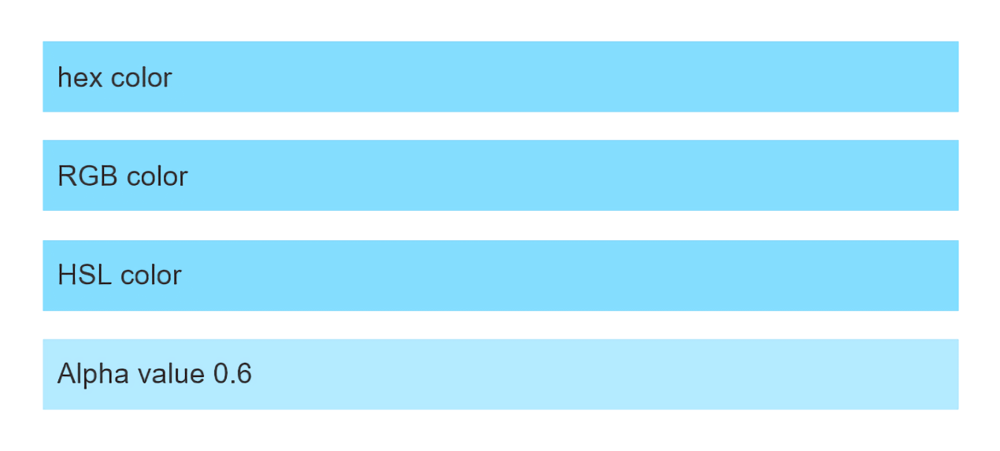

{{LearnSidebar}}

The aim of this skill test is to assess whether you understand different types of [values and units used in CSS properties](/en-US/docs/Learn/CSS/Building_blocks/Values_and_units).

> **Note:** You can try solutions in the interactive editors on this page or in an online editor such as [CodePen](https://codepen.io/), [JSFiddle](https://jsfiddle.net/), or [Glitch](https://glitch.com/).
>
> If you get stuck, you can reach out to us in one of our [communication channels](/en-US/docs/MDN/Community/Communication_channels).

## Task 1

In this task, the first list item has been given a background color using a hex color code. Your task is to complete the CSS using the same color in different formats, plus a final list item where you should make the background semi-opaque.

- The second list item should use RGB color.
- The third should use HSL color.
- The fourth should use RGB color but with the alpha channel set to `0.6`.

You can find conversions for the hex color at [this link](https://convertingcolors.com/hex-color-86DEFA.html). You need to figure out how to use the values in CSS. Your final result should look like the image below:

Try updating the live code below to recreate the finished example:

{{EmbedGHLiveSample("css-examples/learn/tasks/values/color.html", '100%', 1000)}}

> **Callout:**
>
> [Download the starting point for this task](https://github.com/mdn/css-examples/blob/main/learn/tasks/values/color-download.html) to work in your own editor or in an online editor.

## Task 2

In this task, we want you to set the size of various items of text, as described below:

- The `<h1>` element should be 50 pixels.
- The `<h2>` element should be 2em.
- All `
` elements should be 16 pixels.
- A `
` element that is directly after an `<h1>` should be 120%.

Your final result should look like the image below:

Try updating the live code below to recreate the finished example:

{{EmbedGHLiveSample("css-examples/learn/tasks/values/length.html", '100%', 1000)}}

> **Callout:**
>
> [Download the starting point for this task](https://github.com/mdn/css-examples/blob/main/learn/tasks/values/length-download.html) to work in your own editor or in an online editor.

## Task 3

In this task, we want you to move the background image so that it is centered horizontally and is 20% from the top of the box.

Your final result should look like the image below:

Try updating the live code below to recreate the finished example:

{{EmbedGHLiveSample("css-examples/learn/tasks/values/position.html", '100%', 800)}}

> **Callout:**
>
> [Download the starting point for this task](https://github.com/mdn/css-examples/blob/main/learn/tasks/values/position-download.html) to work in your own editor or in an online editor.
