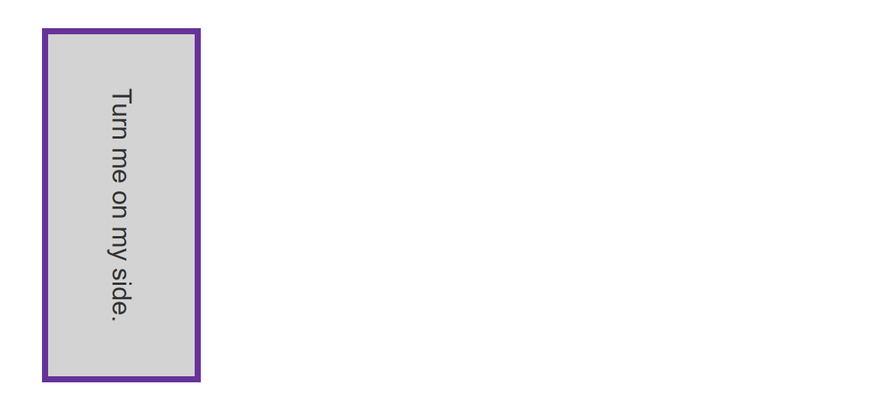
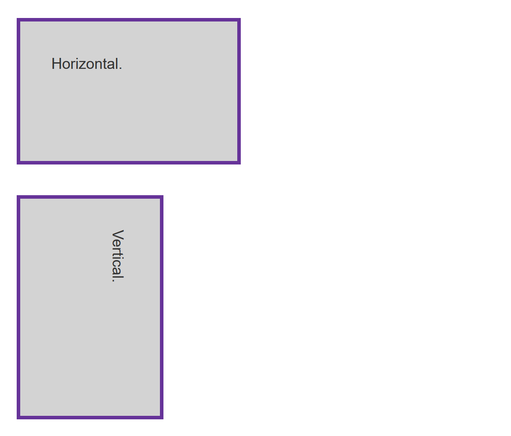
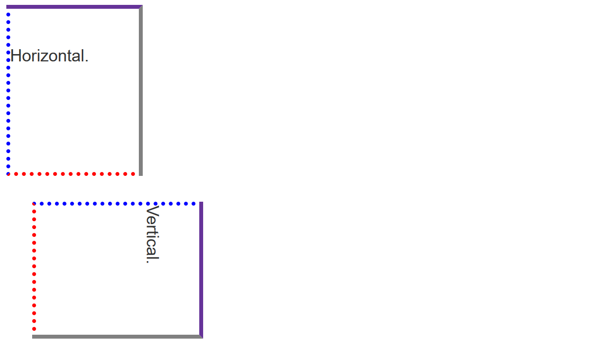

{{LearnSidebar}}

The aim of this skill test is to assess whether you understand how to [handle different text directions using writing modes and logical properties in CSS](/en-US/docs/Learn/CSS/Building_blocks/Handling_different_text_directions).

> **Note:** You can try out solutions in the interactive editors below. However, it may be helpful to download the code and use an online tool such as [CodePen](https://codepen.io/), [jsFiddle](https://jsfiddle.net/), or [Glitch](https://glitch.com/) to work on the tasks.
>
> If you get stuck, then ask us for help — see the [Assessment or further help](#assessment_or_further_help) section at the bottom of this page.

## Task 1

In this task, the box is displayed with a horizontal writing mode. Can you add a line of CSS to change it so it uses a vertical writing mode with right to left text?

Your final result should look like the image below:

Try updating the live code below to recreate the finished example:

{{EmbedGHLiveSample("css-examples/learn/tasks/writing-modes/writing-mode.html", '100%', 800)}}

> **Callout:**
>
> [Download the starting point for this task](https://github.com/mdn/css-examples/blob/main/learn/tasks/writing-modes/writing-mode-download.html) to work in your own editor or in an online editor.

## Task 2

In this task, we want you to use logical properties to replace `width` and `height` in order to maintain the aspect ratio of the box as it is turned vertically.

Your final result should look like the image below:

Try updating the live code below to recreate the finished example:

{{EmbedGHLiveSample("css-examples/learn/tasks/writing-modes/logical-width-height.html", '100%', 1100)}}

> **Callout:**
>
> [Download the starting point for this task](https://github.com/mdn/css-examples/blob/main/learn/tasks/writing-modes/logical-width-height-download.html) to work in your own editor or in an online editor.

## Task 3

In this task, we want you to use logical versions of the margin, border, and padding properties so that the edges of the box relate to the text rather than following top, left, bottom and right.

Your final result should look like the image below:

Try updating the live code below to recreate the finished example:

{{EmbedGHLiveSample("css-examples/learn/tasks/writing-modes/logical-mbp.html", '100%', 1100)}}

> **Callout:**
>
> [Download the starting point for this task](https://github.com/mdn/css-examples/blob/main/learn/tasks/writing-modes/logical-mbp-download.html) to work in your own editor or in an online editor.

## Assessment or further help

You can practice these examples in the Interactive Editors above.

If you would like your work assessed or are stuck and want to ask for help:

1. Put your work into an online shareable editor such as [CodePen](https://codepen.io/), [jsFiddle](https://jsfiddle.net/), or [Glitch](https://glitch.com/). You can write the code yourself or use the starting point files linked to in the above sections.
2. Write a post asking for assessment and/or help at the [MDN Discourse forum Learning category](https://discourse.mozilla.org/c/mdn/learn/250). Your post should include:

   - A descriptive title such as "Assessment wanted for writing modes and logical properties skill test 1".
   - Details of what you have already tried and what you would like us to do; for example, tell us if you're stuck and need help or want an assessment.
   - A link to the example you want assessed or need help with, in an online shareable editor (as mentioned in step 1 above). This is a good practice to get into — it's very hard to help someone with a coding problem if you can't see their code.
   - A link to the actual task or assessment page, so we can find the question you want help with.
