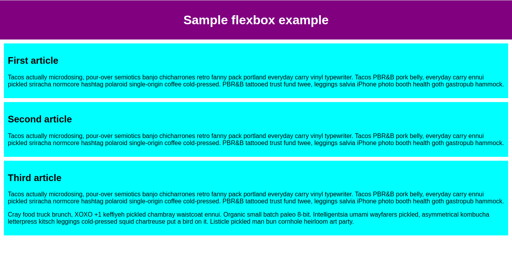
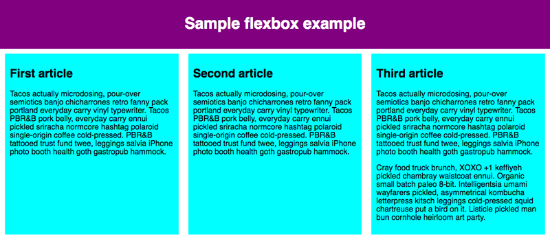
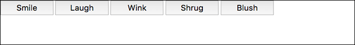

{{LearnSidebar}}{{PreviousMenuNext("Learn/CSS/CSS_layout/Normal_Flow", "Learn/CSS/CSS_layout/Grids", "Learn/CSS/CSS_layout")}}

[Flexbox](/en-US/docs/Web/CSS/CSS_Flexible_Box_Layout) is a one-dimensional layout method for arranging items in rows or columns. Items _flex_ (expand) to fill additional space or shrink to fit into smaller spaces. This article explains all the fundamentals.

<table>
  <tbody>
    <tr>
      <th scope="row">Prerequisites:</th>
      <td>
        HTML basics (study
        <a href="/en-US/docs/Learn/HTML/Introduction_to_HTML"
          >Introduction to HTML</a
        >), and an idea of how CSS works (study
        <a href="/en-US/docs/Learn/CSS/First_steps">Introduction to CSS</a>.)
      </td>
    </tr>
    <tr>
      <th scope="row">Objective:</th>
      <td>
        To learn how to use the Flexbox layout system to create web layouts.
      </td>
    </tr>
  </tbody>
</table>

## Why Flexbox?

For a long time, the only reliable cross-browser compatible tools available for creating CSS layouts were features like [floats](/en-US/docs/Learn/CSS/CSS_layout/Floats) and [positioning](/en-US/docs/Learn/CSS/CSS_layout/Positioning). These work, but in some ways they're also limiting and frustrating.

The following simple layout designs are either difficult or impossible to achieve with such tools in any kind of convenient, flexible way:

- Vertically centering a block of content inside its parent.
- Making all the children of a container take up an equal amount of the available width/height, regardless of how much width/height is available.
- Making all columns in a multiple-column layout adopt the same height even if they contain a different amount of content.

As you'll see in subsequent sections, flexbox makes a lot of layout tasks much easier. Let's dig in!

## Introducing a simple example

In this article, you'll work through a series of exercises to help you understand how flexbox works. To get started, you should make a local copy of the first starter file — [flexbox0.html](https://github.com/mdn/learning-area/blob/main/css/css-layout/flexbox/flexbox0.html) from our GitHub repo. Load it in a modern browser (like Firefox or Chrome) and have a look at the code in your code editor. You can also [see it live here](https://mdn.github.io/learning-area/css/css-layout/flexbox/flexbox0.html).



You'll see that we have a {{htmlelement("header")}} element with a top level heading inside it and a {{htmlelement("section")}} element containing three {{htmlelement("article")}}s. We're going to use these to create a fairly standard three column layout.

## Specifying what elements to lay out as flexible boxes

To start with, we need to select which elements are to be laid out as flexible boxes. To do this, we set a special value of {{cssxref("display")}} on the parent element of the elements you want to affect. In this case we want to lay out the {{htmlelement("article")}} elements, so we set this on the {{htmlelement("section")}}:

```css
section {
  display: flex;
}
```

This causes the \<section> element to become a **flex container** and its children to become **flex items**. The result of this should be something like so:



So, this single declaration gives us everything we need. Incredible, right? We have our multiple column layout with equal-sized columns, and the columns are all the same height. This is because the default values given to flex items (the children of the flex container) are set up to solve common problems such as this.

To be clear, let's reiterate what is happening here. The element we've given a {{cssxref("display")}} value of `flex` to is acting like a block-level element in terms of how it interacts with the rest of the page, but its children are laid out as flex items. The next section will explain in more detail what this means. Note also that you can use a `display` value of `inline-flex` if you wish to lay out an element's children as flex items, but have that element behave like an inline element.

## The flex model

When elements are laid out as flex items, they are laid out along two axes:

![Three flex items in a left-to-right language are laid out side-by-side in a flex container. The main axis — the axis of the flex container in the direction in which the flex items are laid out — is horizontal. The ends of the axis are main-start and main-end and are on the left and right respectively. The cross axis is vertical;  perpendicular to the main axis. The cross-start and cross-end are at the top and bottom respectively. The length of the flex item along the main axis, in this case, the width, is called the main size, and the length of the flex item along the cross axis, in this case, the height, is called the cross size.](flex_terms.png)

- The **main axis** is the axis running in the direction the flex items are laid out in (for example, as rows across the page, or columns down the page.) The start and end of this axis are called the **main start** and **main end**.
- The **cross axis** is the axis running perpendicular to the direction the flex items are laid out in. The start and end of this axis are called the **cross start** and **cross end**.
- The parent element that has `display: flex` set on it (the {{htmlelement("section")}} in our example) is called the **flex container**.
- The items laid out as flexible boxes inside the flex container are called **flex items** (the {{htmlelement("article")}} elements in our example).

Bear this terminology in mind as you go through subsequent sections. You can always refer back to it if you get confused about any of the terms being used.

## Columns or rows?

Flexbox provides a property called {{cssxref("flex-direction")}} that specifies which direction the main axis runs (which direction the flexbox children are laid out in). By default this is set to `row`, which causes them to be laid out in a row in the direction your browser's default language works in (left to right, in the case of an English browser).

Try adding the following declaration to your {{htmlelement("section")}} rule:

```css
flex-direction: column;
```

You'll see that this puts the items back in a column layout, much like they were before we added any CSS. Before you move on, delete this declaration from your example.

> **Note:** You can also lay out flex items in a reverse direction using the `row-reverse` and `column-reverse` values. Experiment with these values too!

## Wrapping

One issue that arises when you have a fixed width or height in your layout is that eventually your flexbox children will overflow their container, breaking the layout. Have a look at our [flexbox-wrap0.html](https://github.com/mdn/learning-area/blob/main/css/css-layout/flexbox/flexbox-wrap0.html) example and try [viewing it live](https://mdn.github.io/learning-area/css/css-layout/flexbox/flexbox-wrap0.html) (take a local copy of this file now if you want to follow along with this example):

![The Sample flexbox example has all the flex items laid out in a single row of the flex container. The eighth flex item overflows the browser window, and the page has visible horizontal and vertical scroll bars as it cannot be accommodated within the width of the window as the previous seven flex items have taken the space available within the viewport. By default, the Browser tries to place all the flex items in a single row if the flex-direction is set to row or a single column if the flex-direction is set to column.](flexbox-example3.png)

Here we see that the children are indeed breaking out of their container. One way in which you can fix this is to add the following declaration to your {{htmlelement("section")}} rule:

```css
flex-wrap: wrap;
```

Also, add the following declaration to your {{htmlelement("article")}} rule:

```css
flex: 200px;
```

Try this now. You'll see that the layout looks much better with this included:


We now have multiple rows. Each row has as many flexbox children fitted into it as is sensible. Any overflow is moved down to the next line. The `flex: 200px` declaration set on the articles means that each will be at least 200px wide. We'll discuss this property in more detail later on. You might also notice that the last few children on the last row are each made wider so that the entire row is still filled.

But there's more we can do here. First of all, try changing your {{cssxref("flex-direction")}} property value to `row-reverse`. Now you'll see that you still have your multiple row layout, but it starts from the opposite corner of the browser window and flows in reverse.

## flex-flow shorthand

At this point it's worth noting that a shorthand exists for {{cssxref("flex-direction")}} and {{cssxref("flex-wrap")}}: {{cssxref("flex-flow")}}. So, for example, you can replace

```css
flex-direction: row;
flex-wrap: wrap;
```

with

```css
flex-flow: row wrap;
```

## Flexible sizing of flex items

Let's now return to our first example and look at how we can control what proportion of space flex items take up compared to the other flex items. Fire up your local copy of [flexbox0.html](https://github.com/mdn/learning-area/blob/main/css/css-layout/flexbox/flexbox0.html), or take a copy of [flexbox1.html](https://github.com/mdn/learning-area/blob/main/css/css-layout/flexbox/flexbox1.html) as a new starting point ([see it live](https://mdn.github.io/learning-area/css/css-layout/flexbox/flexbox1.html)).

First, add the following rule to the bottom of your CSS:

```css
article {
  flex: 1;
}
```

This is a unitless proportion value that dictates how much available space along the main axis each flex item will take up compared to other flex items. In this case, we're giving each {{htmlelement("article")}} element the same value (a value of 1), which means they'll all take up an equal amount of the spare space left after properties like padding and margin have been set. This value is proportionally shared among the flex items: giving each flex item a value of 400000 would have exactly the same effect.

Now add the following rule below the previous one:

```css
article:nth-of-type(3) {
  flex: 2;
}
```

Now when you refresh, you'll see that the third {{htmlelement("article")}} takes up twice as much of the available width as the other two. There are now four proportion units available in total (since 1 + 1 + 2 = 4). The first two flex items have one unit each, so they each take 1/4 of the available space. The third one has two units, so it takes up 2/4 of the available space (or one-half).

You can also specify a minimum size value within the flex value. Try updating your existing article rules like so:

```css
article {
  flex: 1 200px;
}

article:nth-of-type(3) {
  flex: 2 200px;
}
```

This basically states, "Each flex item will first be given 200px of the available space. After that, the rest of the available space will be shared according to the proportion units." Try refreshing and you'll see a difference in how the space is shared.


The real value of flexbox can be seen in its flexibility/responsiveness. If you resize the browser window or add another {{htmlelement("article")}} element, the layout continues to work just fine.

## flex: shorthand versus longhand

{{cssxref("flex")}} is a shorthand property that can specify up to three different values:

- The unitless proportion value we discussed above. This can be specified separately using the {{cssxref("flex-grow")}} longhand property.
- A second unitless proportion value, {{cssxref("flex-shrink")}}, which comes into play when the flex items are overflowing their container. This value specifies how much an item will shrink in order to prevent overflow. This is quite an advanced flexbox feature and we won't be covering it any further in this article.
- The minimum size value we discussed above. This can be specified separately using the {{cssxref("flex-basis")}} longhand value.

We'd advise against using the longhand flex properties unless you really have to (for example, to override something previously set). They lead to a lot of extra code being written, and they can be somewhat confusing.

## Horizontal and vertical alignment

You can also use flexbox features to align flex items along the main or cross axis. Let's explore this by looking at a new example: [flex-align0.html](https://github.com/mdn/learning-area/blob/main/css/css-layout/flexbox/flex-align0.html) ([see it live also](https://mdn.github.io/learning-area/css/css-layout/flexbox/flex-align0.html)). We're going to turn this into a neat, flexible button/toolbar. At the moment you'll see a horizontal menu bar with some buttons jammed into the top left-hand corner.



First, take a local copy of this example.

Now, add the following to the bottom of the example's CSS:

```css
div {
  display: flex;
  align-items: center;
  justify-content: space-around;
}
```


Refresh the page and you'll see that the buttons are now nicely centered horizontally and vertically. We've done this via two new properties.

{{cssxref("align-items")}} controls where the flex items sit on the cross axis.

- By default, the value is `stretch`, which stretches all flex items to fill the parent in the direction of the cross axis. If the parent doesn't have a fixed height in the cross axis direction, then all flex items will become as tall as the tallest flex item. This is how our first example had columns of equal height by default.
- The `center` value that we used in our above code causes the items to maintain their intrinsic dimensions, but be centered along the cross axis. This is why our current example's buttons are centered vertically.
- You can also have values like `flex-start` and `flex-end`, which will align all items at the start and end of the cross axis respectively. See {{cssxref("align-items")}} for the full details.

You can override the {{cssxref("align-items")}} behavior for individual flex items by applying the {{cssxref("align-self")}} property to them. For example, try adding the following to your CSS:

```css
button:first-child {
  align-self: flex-end;
}
```


Have a look at what effect this has and remove it again when you've finished.

{{cssxref("justify-content")}} controls where the flex items sit on the main axis.

- The default value is `flex-start`, which makes all the items sit at the start of the main axis.
- You can use `flex-end` to make them sit at the end.
- `center` is also a value for `justify-content`. It'll make the flex items sit in the center of the main axis.
- The value we've used above, `space-around`, is useful — it distributes all the items evenly along the main axis with a bit of space left at either end.
- There is another value, `space-between`, which is very similar to `space-around` except that it doesn't leave any space at either end.

The [`justify-items`](/en-US/docs/Web/CSS/justify-items) property is ignored in flexbox layouts.

We'd like to encourage you to play with these values to see how they work before you continue.

## Ordering flex items

Flexbox also has a feature for changing the layout order of flex items without affecting the source order. This is another thing that is impossible to do with traditional layout methods.

The code for this is simple. Try adding the following CSS to your button bar example code:

```css
button:first-child {
  order: 1;
}
```

Refresh and you'll see that the "Smile" button has moved to the end of the main axis. Let's talk about how this works in a bit more detail:

- By default, all flex items have an {{cssxref("order")}} value of 0.
- Flex items with higher specified order values will appear later in the display order than items with lower order values.
- Flex items with the same order value will appear in their source order. So if you have four items whose order values have been set as 2, 1, 1, and 0 respectively, their display order would be 4th, 2nd, 3rd, then 1st.
- The 3rd item appears after the 2nd because it has the same order value and is after it in the source order.

You can set negative order values to make items appear earlier than items whose value is 0. For example, you could make the "Blush" button appear at the start of the main axis using the following rule:

```css
button:last-child {
  order: -1;
}
```

## Nested flex boxes

It's possible to create some pretty complex layouts with flexbox. It's perfectly OK to set a flex item to also be a flex container, so that its children are also laid out like flexible boxes. Have a look at [complex-flexbox.html](https://github.com/mdn/learning-area/blob/main/css/css-layout/flexbox/complex-flexbox.html) ([see it live also](https://mdn.github.io/learning-area/css/css-layout/flexbox/complex-flexbox.html)).

![The Sample flexbox example has three flex item children laid out in a row. The first two are the same width, the third is slightly wider. The third flex item is also a flex container. It has a set of buttons in two rows followed by text. The first row of buttons has 4 buttons that are laid out in a row; the buttons are the same width, taking up the full width of the container. The second row has a single button that takes up the entire width of the row on its own. This complex layout where few flex items are treated as flex containers.](flexbox-example7.png)

The HTML for this is fairly simple. We've got a {{htmlelement("section")}} element containing three {{htmlelement("article")}}s. The third {{htmlelement("article")}} contains three {{htmlelement("div")}}s, and the first {{htmlelement("div")}} contains five {{htmlelement("button")}}s :

```
section - article
          article
          article - div - button
                    div   button
                    div   button
                          button
                          button
```

Let's look at the code we've used for the layout.

First of all, we set the children of the {{htmlelement("section")}} to be laid out as flexible boxes.

```css
section {
  display: flex;
}
```

Next, we set some flex values on the {{htmlelement("article")}}s themselves. Take special note of the second rule here: we're setting the third {{htmlelement("article")}} to have its children laid out like flex items too, but this time we're laying them out like a column.

```css
article {
  flex: 1 200px;
}

article:nth-of-type(3) {
  flex: 3 200px;
  display: flex;
  flex-flow: column;
}
```

Next, we select the first {{htmlelement("div")}}. We first use `flex: 1 100px;` to effectively give it a minimum height of 100px, then we set its children (the {{htmlelement("button")}} elements) to also be laid out like flex items. Here we lay them out in a wrapping row and align them in the center of the available space as we did with the individual button example we saw earlier.

```css
article:nth-of-type(3) div:first-child {
  flex: 1 100px;
  display: flex;
  flex-flow: row wrap;
  align-items: center;
  justify-content: space-around;
}
```

Finally, we set some sizing on the button. This time by giving it a flex value of 1 auto. This has a very interesting effect, which you'll see if you try resizing your browser window width. The buttons will take up as much space as they can. As many will fit on a line as is comfortable; beyond that, they'll drop to a new line.

```css
button {
  flex: 1 auto;
  margin: 5px;
  font-size: 18px;
  line-height: 1.5;
}
```

## Cross-browser compatibility

Flexbox support is available in most new browsers: Firefox, Chrome, Opera, Microsoft Edge, and IE 11, newer versions of Android/iOS, etc. However, you should be aware that there are still older browsers in use that don't support Flexbox (or do, but support a really old, out-of-date version of it.)

While you're just learning and experimenting, this doesn't matter too much; however, if you're considering using flexbox in a real website, you need to do testing and make sure that your user experience is still acceptable in as many browsers as possible.

Flexbox is a bit trickier than some CSS features. For example, if a browser is missing a CSS drop shadow, then the site will likely still be usable. Not supporting flexbox features, however, will probably break a layout completely, making it unusable.

We discuss strategies for overcoming cross-browser support issues in our [Cross browser testing](/en-US/docs/Learn/Tools_and_testing/Cross_browser_testing) module.

## Test your skills!

You've reached the end of this article, but can you remember the most important information? You can find some further tests to verify that you've retained this information before you move on — see [Test your skills: Flexbox](/en-US/docs/Learn/CSS/CSS_layout/Flexbox_skills).

## Summary

That concludes our tour of the basics of Flexbox. We hope you had fun and will have a good play around with it as you proceed further with your learning. Next, we'll have a look at another important aspect of CSS layouts: [CSS Grids](/en-US/docs/Learn/CSS/CSS_layout/Grids).

## See also

- [CSS-Tricks Guide to Flexbox](https://css-tricks.com/snippets/css/a-guide-to-flexbox/) — an article explaining everything about Flexbox in a visually appealing way
- [Flexbox Froggy](https://flexboxfroggy.com/) — an educational game to learn and better understand the basics of Flexbox

{{PreviousMenuNext("Learn/CSS/CSS_layout/Normal_Flow", "Learn/CSS/CSS_layout/Grids", "Learn/CSS/CSS_layout")}}

## In this module

- [Introduction to CSS layout](/en-US/docs/Learn/CSS/CSS_layout/Introduction)
- [Normal flow](/en-US/docs/Learn/CSS/CSS_layout/Normal_Flow)
- [Flexbox](/en-US/docs/Learn/CSS/CSS_layout/Flexbox)
- [Grid](/en-US/docs/Learn/CSS/CSS_layout/Grids)
- [Floats](/en-US/docs/Learn/CSS/CSS_layout/Floats)
- [Positioning](/en-US/docs/Learn/CSS/CSS_layout/Positioning)
- [Multiple-column layout](/en-US/docs/Learn/CSS/CSS_layout/Multiple-column_Layout)
- [Responsive design](/en-US/docs/Learn/CSS/CSS_layout/Responsive_Design)
- [Beginner's guide to media queries](/en-US/docs/Learn/CSS/CSS_layout/Media_queries)
- [Legacy layout methods](/en-US/docs/Learn/CSS/CSS_layout/Legacy_Layout_Methods)
- [Supporting older browsers](/en-US/docs/Learn/CSS/CSS_layout/Supporting_Older_Browsers)
- [Fundamental layout comprehension](/en-US/docs/Learn/CSS/CSS_layout/Fundamental_Layout_Comprehension)
