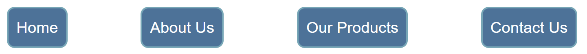
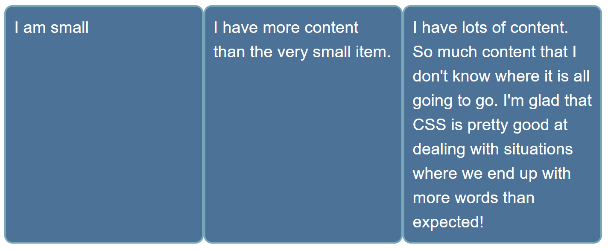
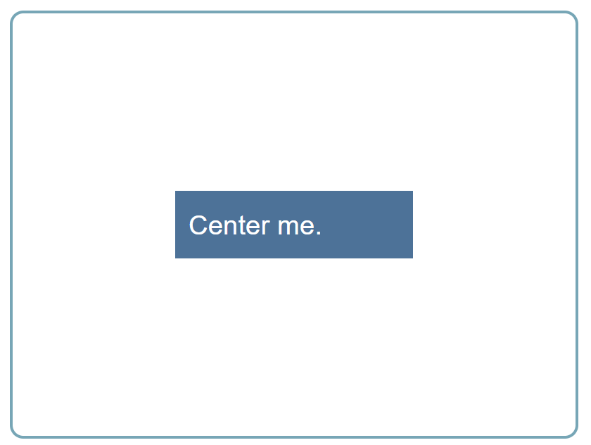
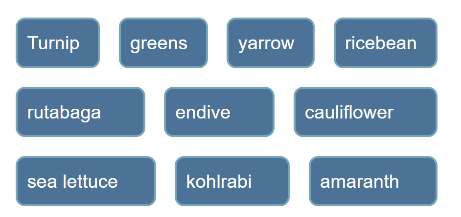

{{LearnSidebar}}

The aim of this skill test is to assess whether you understand how [flexbox and flex items](/en-US/docs/Learn/CSS/CSS_layout/Flexbox) behave. Below are four common design patterns that you might use flexbox to create. Your task is to build them.

> **Note:** You can try out solutions in the interactive editors below. However, it may be helpful to download the code and use an online tool such as [CodePen](https://codepen.io/), [jsFiddle](https://jsfiddle.net/), or [Glitch](https://glitch.com/) to work on the tasks.
>
> If you get stuck, then ask us for help — see the [Assessment or further help](#assessment_or_further_help) section at the bottom of this page.

## Task 1

In this task, the list items are the navigation for a site. They should be laid out as a row, with an equal amount of space between each item.

Your final result should look like the image below:

Try updating the live code below to recreate the finished example:

{{EmbedGHLiveSample("css-examples/learn/tasks/flexbox/flexbox1.html", '100%', 700)}}

> **Callout:**
>
> [Download the starting point for this task](https://github.com/mdn/css-examples/blob/main/learn/tasks/flexbox/flexbox1-download.html) to work in your own editor or in an online editor.

## Task 2

In this task, the list items are all different sizes, but we want them to be displayed as three equal sized columns, no matter what content is in each item.

Your final result should look like the image below:

Try updating the live code below to recreate the finished example:

{{EmbedGHLiveSample("css-examples/learn/tasks/flexbox/flexbox2.html", '100%', 800)}}

Additional question:

- Can you now make the first item twice the size of the other items?

> **Callout:**
>
> [Download the starting point for this task](https://github.com/mdn/css-examples/blob/main/learn/tasks/flexbox/flexbox2-download.html) to work in your own editor or in an online editor.

## Task 3

In this task, there are two elements in the HTML below, a `
` element with a class of `parent` which contains another `
` element with a class of `child`. Use flexbox to center the child inside the parent. Note that there is not just one possible solution here.

Your final result should look like the image below:

Try updating the live code below to recreate the finished example:

{{EmbedGHLiveSample("css-examples/learn/tasks/flexbox/flexbox3.html", '100%', 800)}}

> **Callout:**
>
> [Download the starting point for this task](https://github.com/mdn/css-examples/blob/main/learn/tasks/flexbox/flexbox3-download.html) to work in your own editor or in an online editor.

## Task 4

In this task, we want you to arrange these items into rows as in the image below:

Try updating the live code below to recreate the finished example:

{{EmbedGHLiveSample("css-examples/learn/tasks/flexbox/flexbox4.html", '100%', 1100)}}

> **Callout:**
>
> [Download the starting point for this task](https://github.com/mdn/css-examples/blob/main/learn/tasks/flexbox/flexbox4-download.html) to work in your own editor or in an online editor.

## Assessment or further help

You can practice these examples in the Interactive Editors above.

If you would like your work assessed or are stuck and want to ask for help:

1. Put your work into an online shareable editor such as [CodePen](https://codepen.io/), [jsFiddle](https://jsfiddle.net/), or [Glitch](https://glitch.com/). You can write the code yourself or use the starting point files linked to in the above sections.
2. Write a post asking for assessment and/or help at the [MDN Discourse forum Learning category](https://discourse.mozilla.org/c/mdn/learn/250). Your post should include:

   - A descriptive title such as "Assessment wanted for flexbox skill test 1".
   - Details of what you have already tried and what you would like us to do; for example, tell us if you're stuck and need help or want an assessment.
   - A link to the example you want assessed or need help with, in an online shareable editor (as mentioned in step 1 above). This is a good practice to get into — it's very hard to help someone with a coding problem if you can't see their code.
   - A link to the actual task or assessment page, so we can find the question you want help with.
