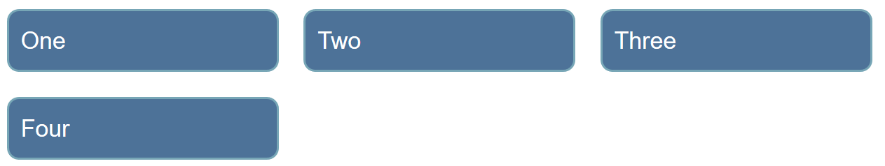
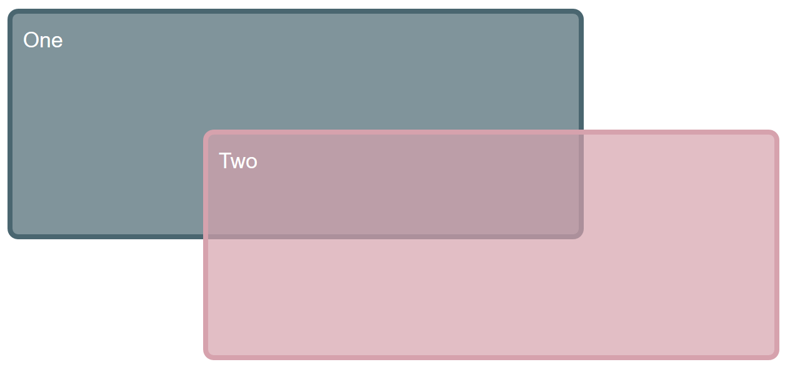
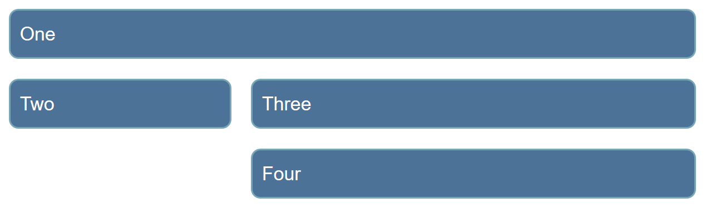
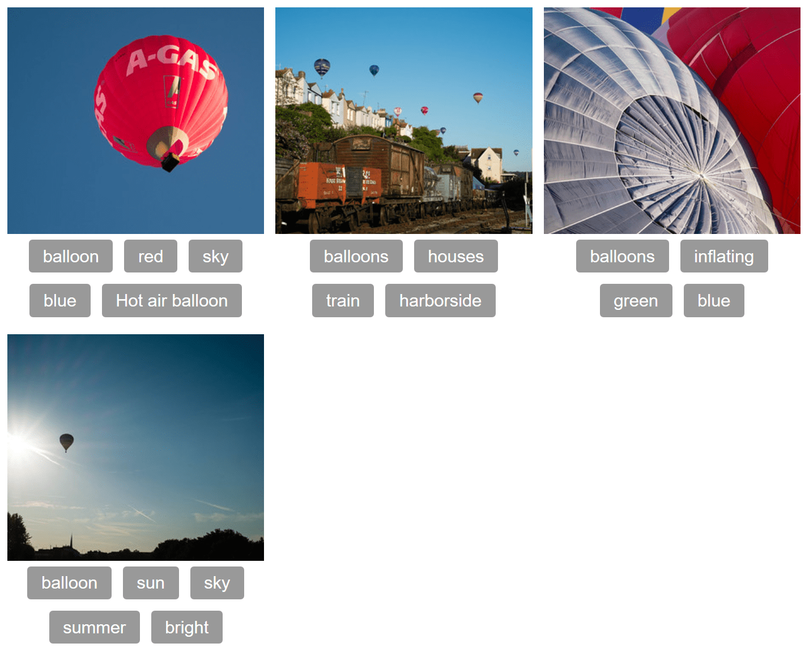

{{LearnSidebar}}

The aim of this skill test is to assess whether you understand how a [grid and grid items](/en-US/docs/Learn/CSS/CSS_layout/Grids) behave. You will be working through several small tasks that use different elements of the material you have just covered.

> **Note:** You can try out solutions in the interactive editors below. However, it may be helpful to download the code and use an online tool such as [CodePen](https://codepen.io/), [jsFiddle](https://jsfiddle.net/), or [Glitch](https://glitch.com/) to work on the tasks.
>
> If you get stuck, then ask us for help — see the [Assessment or further help](#assessment_or_further_help) section at the bottom of this page.

## Task 1

In this task, you should create a grid into which the four child elements will auto-place. The grid should have three columns sharing the available space equally and a 20-pixel gap between the column and row tracks. After that, try adding more child containers inside the parent container with the class of `grid` and see how they behave by default.

Your final result should look like the image below:

Try updating the live code below to recreate the finished example:

{{EmbedGHLiveSample("css-examples/learn/tasks/grid/grid1.html", '100%', 700)}}

> **Callout:**
>
> [Download the starting point for this task](https://github.com/mdn/css-examples/blob/main/learn/tasks/grid/grid1-download.html) to work in your own editor or in an online editor.

## Task 2

In this task, we already have a grid defined. By editing the CSS rules for the two child elements, cause them to span over several grid tracks each. The second item should overlay the first as in the image below:

Try updating the live code below to recreate the finished example:

{{EmbedGHLiveSample("css-examples/learn/tasks/grid/grid2.html", '100%', 900)}}

Additional question:

- Can you now cause the first item to display on top without changing the order of items in the source?

> **Callout:**
>
> [Download the starting point for this task](https://github.com/mdn/css-examples/blob/main/learn/tasks/grid/grid2-download.html) to work in your own editor or in an online editor.

## Task 3

In this task, there are four direct children in this grid. The starting point has them displayed using auto-placement. Use the grid-area and grid-template-areas properties to lay the items out as shown in the image below:

Try updating the live code below to recreate the finished example:

{{EmbedGHLiveSample("css-examples/learn/tasks/grid/grid3.html", '100%', 800)}}

> **Callout:**
>
> [Download the starting point for this task](https://github.com/mdn/css-examples/blob/main/learn/tasks/grid/grid3-download.html) to work in your own editor or in an online editor.

## Task 4

In this task, you will need to use both grid layout and flexbox to recreate the example as seen in the image below. The gap between the column and row tracks should be 10px. You do not need to make any changes to the HTML in order to achieve this.

Try updating the live code below to recreate the finished example:

{{EmbedGHLiveSample("css-examples/learn/tasks/grid/grid4.html", '100%', 2000)}}

> **Callout:**
>
> [Download the starting point for this task](https://github.com/mdn/css-examples/blob/main/learn/tasks/grid/grid4-download.html) to work in your own editor or in an online editor.

## Assessment or further help

You can practice these examples in the Interactive Editors above.

If you would like your work assessed or are stuck and want to ask for help:

1. Put your work into an online shareable editor such as [CodePen](https://codepen.io/), [jsFiddle](https://jsfiddle.net/), or [Glitch](https://glitch.com/). You can write the code yourself or use the starting point files linked to in the above sections.
2. Write a post asking for assessment and/or help at the [MDN Discourse forum Learning category](https://discourse.mozilla.org/c/mdn/learn/250). Your post should include:

   - A descriptive title such as "Assessment wanted for grid skill test 1".
   - Details of what you have already tried and what you would like us to do; for example, tell us if you're stuck and need help or want an assessment.
   - A link to the example you want assessed or need help with, in an online shareable editor (as mentioned in step 1 above). This is a good practice to get into — it's very hard to help someone with a coding problem if you can't see their code.
   - A link to the actual task or assessment page, so we can find the question you want help with.
