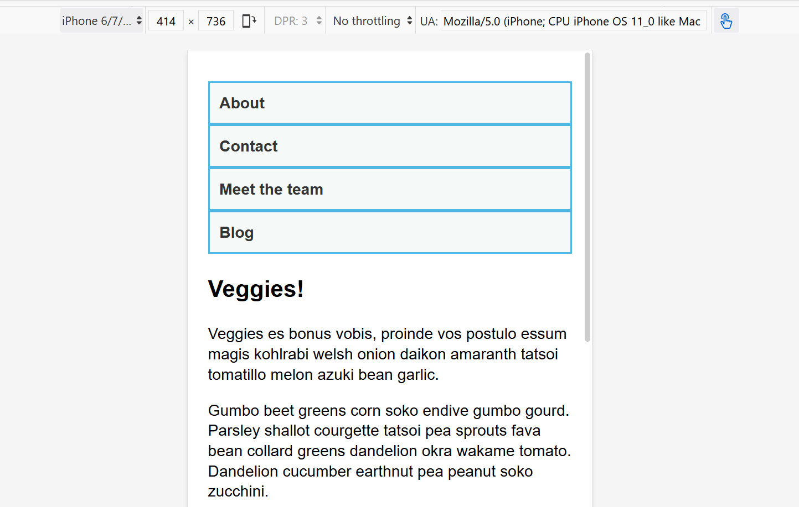

{{learnsidebar}}{{PreviousMenuNext("Learn/CSS/CSS_layout/Responsive_Design", "Learn/CSS/CSS_layout/Legacy_Layout_Methods", "Learn/CSS/CSS_layout")}}

The **CSS Media Query** gives you a way to apply CSS only when the browser and device environment matches a rule that you specify, for example "viewport is wider than 480 pixels". Media queries are a key part of responsive web design, as they allow you to create different layouts depending on the size of the viewport, but they can also be used to detect other things about the environment your site is running on, for example whether the user is using a touchscreen rather than a mouse. In this lesson you will first learn about the syntax used in media queries, and then move on to use them in a working example showing how a simple design might be made responsive.

<table>
  <tbody>
    <tr>
      <th scope="row">Prerequisites:</th>
      <td>
        HTML basics (study
        <a href="/en-US/docs/Learn/HTML/Introduction_to_HTML"
          >Introduction to HTML</a
        >), and an idea of how CSS works (study
        <a href="/en-US/docs/Learn/CSS/First_steps">CSS first steps</a> and
        <a href="/en-US/docs/Learn/CSS/Building_blocks">CSS building blocks</a
        >.)
      </td>
    </tr>
    <tr>
      <th scope="row">Objective:</th>
      <td>
        To understand how to use media queries, and the most common approach for
        using them to create responsive designs.
      </td>
    </tr>
  </tbody>
</table>

## Media Query Basics

The simplest media query syntax looks like this:

```css
@media media-type and (media-feature-rule) {
  /* CSS rules go here */
}
```

It consists of:

- A media type, which tells the browser what kind of media this code is for (e.g. print, or screen).
- A media expression, which is a rule, or test that must be passed for the contained CSS to be applied.
- A set of CSS rules that will be applied if the test passes and the media type is correct.

### Media types

The possible types of media you can specify are:

- `all`
- `print`
- `screen`

The following media query will only set the body to 12pt if the page is printed. It will not apply when the page is loaded in a browser.

```css
@media print {
  body {
    font-size: 12pt;
  }
}
```

> **Note:** The media type here is different from the so-called {{glossary("MIME type")}}.

> **Note:** There were a number of other media types defined in the Level 3 Media Queries specification; these have been deprecated and should be avoided.

> **Note:** Media types are optional; if you do not indicate a media type in your media query, then the media query will default to being for all media types.

### Media feature rules

After specifying the type, you can then target a media feature with a rule.

#### Width and height

The feature we tend to detect most often in order to create responsive designs (and that has widespread browser support) is viewport width, and we can apply CSS if the viewport is above or below a certain width — or an exact width — using the `min-width`, `max-width`, and `width` media features.

These features are used to create layouts that respond to different screen sizes. For example, to change the body text color to red if the viewport is exactly 600 pixels, you would use the following media query.

```css
@media screen and (width: 600px) {
  body {
    color: red;
  }
}
```

[Open this example](https://mdn.github.io/css-examples/learn/media-queries/width.html) in the browser, or [view the source](https://github.com/mdn/css-examples/blob/main/learn/media-queries/width.html).

The `width` (and `height`) media features can be used as ranges, and therefore be prefixed with `min-` or `max-` to indicate that the given value is a minimum, or a maximum. For example, to make the color blue if the viewport is 600 pixels or narrower, use `max-width`:

```css
@media screen and (max-width: 600px) {
  body {
    color: blue;
  }
}
```

[Open this example](https://mdn.github.io/css-examples/learn/media-queries/max-width.html) in the browser, or [view the source](https://github.com/mdn/css-examples/blob/main/learn/media-queries/max-width.html).

In practice, using minimum or maximum values is much more useful for responsive design so you will rarely see `width` or `height` used alone.

There are many other media features that you can test for, although some of the newer features introduced in Levels 4 and 5 of the media queries specification have limited browser support. Each feature is documented on MDN along with browser support information, and you can find a complete list at [Using Media Queries: Syntax](/en-US/docs/Web/CSS/CSS_media_queries/Using_media_queries#syntax).

#### Orientation

One well-supported media feature is `orientation`, which allows us to test for portrait or landscape mode. To change the body text color if the device is in landscape orientation, use the following media query.

```css
@media (orientation: landscape) {
  body {
    color: rebeccapurple;
  }
}
```

[Open this example](https://mdn.github.io/css-examples/learn/media-queries/orientation.html) in the browser, or [view the source](https://github.com/mdn/css-examples/blob/main/learn/media-queries/orientation.html).

A standard desktop view has a landscape orientation, and a design that works well in this orientation may not work as well when viewed on a phone or tablet in portrait mode. Testing for orientation can help you to create a layout which is optimized for devices in portrait mode.

#### Use of pointing devices

As part of the Level 4 specification, the `hover` media feature was introduced. This feature means you can test if the user has the ability to hover over an element, which essentially means they are using some kind of pointing device; touchscreen and keyboard navigation does not hover.

```css
@media (hover: hover) {
  body {
    color: rebeccapurple;
  }
}
```

[Open this example](https://mdn.github.io/css-examples/learn/media-queries/hover.html) in the browser, or [view the source](https://github.com/mdn/css-examples/blob/main/learn/media-queries/hover.html).

If we know the user cannot hover, we could display some interactive features by default. For users who can hover, we might choose to make them available when a link is hovered over.

Also in Level 4 is the `pointer` media feature. This takes three possible values, `none`, `fine` and `coarse`. A `fine` pointer is something like a mouse or trackpad. It enables the user to precisely target a small area. A `coarse` pointer is your finger on a touchscreen. The value `none` means the user has no pointing device; perhaps they are navigating with the keyboard only or with voice commands.

Using `pointer` can help you to design better interfaces that respond to the type of interaction a user is having with a screen. For example, you could create larger hit areas if you know that the user is interacting with the device as a touchscreen.

## More complex media queries

With all of the different possible media queries, you may want to combine them, or create lists of queries — any of which could be matched.

### "and" logic in media queries

To combine media features you can use `and` in much the same way as we have used `and` above to combine a media type and feature. For example, we might want to test for a `min-width` and `orientation`. The body text will only be blue if the viewport is at least 600 pixels wide and the device is in landscape mode.

```css
@media screen and (min-width: 600px) and (orientation: landscape) {
  body {
    color: blue;
  }
}
```

[Open this example](https://mdn.github.io/css-examples/learn/media-queries/and.html) in the browser, or [view the source](https://github.com/mdn/css-examples/blob/main/learn/media-queries/and.html).

### "or" logic in media queries

If you have a set of queries, any of which could match, then you can comma separate these queries. In the below example the text will be blue if the viewport is at least 600 pixels wide OR the device is in landscape orientation. If either of these things are true the query matches.

```css
@media screen and (min-width: 600px), screen and (orientation: landscape) {
  body {
    color: blue;
  }
}
```

[Open this example](https://mdn.github.io/css-examples/learn/media-queries/or.html) in the browser, or [view the source](https://github.com/mdn/css-examples/blob/main/learn/media-queries/or.html).

### "not" logic in media queries

You can negate an entire media query by using the `not` operator. This reverses the meaning of the entire media query. Therefore in this next example the text will only be blue if the orientation is portrait.

```css
@media not all and (orientation: landscape) {
  body {
    color: blue;
  }
}
```

[Open this example](https://mdn.github.io/css-examples/learn/media-queries/not.html) in the browser, or [view the source](https://github.com/mdn/css-examples/blob/main/learn/media-queries/not.html).

## How to choose breakpoints

In the early days of responsive design, many designers would attempt to target very specific screen sizes. Lists of the sizes of the screens of popular phones and tablets were published in order that designs could be created to neatly match those viewports.

There are now far too many devices, with a huge variety of sizes, to make that feasible. This means that instead of targeting specific sizes for all designs, a better approach is to change the design at the size where the content starts to break in some way. Perhaps the line lengths become far too long, or a boxed out sidebar gets squashed and hard to read. That's the point at which you want to use a media query to change the design to a better one for the space you have available. This approach means that it doesn't matter what the exact dimensions are of the device being used, every range is catered for. The points at which a media query is introduced are known as **breakpoints**.

The [Responsive Design Mode](https://firefox-source-docs.mozilla.org/devtools-user/responsive_design_mode/index.html) in Firefox DevTools is very useful for working out where these breakpoints should go. You can easily make the viewport smaller and larger to see where the content would be improved by adding a media query and tweaking the design.



## Active learning: mobile first responsive design

Broadly, you can take two approaches to a responsive design. You can start with your desktop or widest view and then add breakpoints to move things around as the viewport becomes smaller, or you can start with the smallest view and add layout as the viewport becomes larger. This second approach is described as **mobile first** responsive design and is quite often the best approach to follow.

The view for the very smallest devices is quite often a simple single column of content, much as it appears in normal flow. This means that you probably don't need to do a lot of layout for small devices — order your source well and you will have a readable layout by default.

The below walkthrough takes you through this approach with a very simple layout. In a production site you are likely to have more things to adjust within your media queries, however the approach would be exactly the same.

### Walkthrough: a simple mobile-first layout

Our starting point is an HTML document with some CSS applied to add background colors to the various parts of the layout.

```css
* {
  box-sizing: border-box;
}

body {
  width: 90%;
  margin: 2em auto;
  font:
    1em/1.3 Arial,
    Helvetica,
    sans-serif;
}

a:link,
a:visited {
  color: #333;
}

nav ul,
aside ul {
  list-style: none;
  padding: 0;
}

nav a:link,
nav a:visited {
  background-color: rgba(207, 232, 220, 0.2);
  border: 2px solid rgb(79, 185, 227);
  text-decoration: none;
  display: block;
  padding: 10px;
  color: #333;
  font-weight: bold;
}

nav a:hover {
  background-color: rgba(207, 232, 220, 0.7);
}

.related {
  background-color: rgba(79, 185, 227, 0.3);
  border: 1px solid rgb(79, 185, 227);
  padding: 10px;
}

.sidebar {
  background-color: rgba(207, 232, 220, 0.5);
  padding: 10px;
}

article {
  margin-bottom: 1em;
}
```

We've made no layout changes, however the source of the document is ordered in a way that makes the content readable. This is an important first step and one which ensures that if the content were to be read out by a screen reader, it would be understandable.

```html
<body>
  <div class="wrapper">
    <header>
      <nav>
        <ul>
          <li><a href="">About</a></li>
          <li><a href="">Contact</a></li>
          <li><a href="">Meet the team</a></li>
          <li><a href="">Blog</a></li>
        </ul>
      </nav>
    </header>
    <main>
      <article>
        <div class="content">
          <h1>Veggies!</h1>
          <p>…</p>
        </div>
        <aside class="related">
          <p>…</p>
        </aside>
      </article>

      <aside class="sidebar">
        <h2>External vegetable-based links</h2>
        <ul>
          <li>…</li>
        </ul>
      </aside>
    </main>

    <footer><p>&copy;2019</p></footer>
  </div>
</body>
```

This simple layout also works well on mobile. If we view the layout in Responsive Design Mode in DevTools we can see that it works pretty well as a straightforward mobile view of the site.

[Open step 1](https://mdn.github.io/css-examples/learn/media-queries/step1.html) in the browser, or [view the source](https://github.com/mdn/css-examples/blob/main/learn/media-queries/step1.html).

**If you want to follow on and implement this example as we go, make a local copy of [step1.html](https://github.com/mdn/css-examples/blob/main/learn/media-queries/step1.html) on your computer.**

From this point, start to drag the Responsive Design Mode view wider until you can see that the line lengths are becoming quite long, and we have space for the navigation to display in a horizontal line. This is where we'll add our first media query. We'll use ems, as this will mean that if the user has increased their text size, the breakpoint will happen at a similar line-length but wider viewport, than someone with a smaller text size.

**Add the below code into the bottom of your step1.html CSS.**

```css
@media screen and (min-width: 40em) {
  article {
    display: grid;
    grid-template-columns: 3fr 1fr;
    column-gap: 20px;
  }

  nav ul {
    display: flex;
  }

  nav li {
    flex: 1;
  }
}
```

This CSS gives us a two-column layout inside the article, of the article content and related information in the aside element. We have also used flexbox to put the navigation into a row.

[Open step 2](https://mdn.github.io/css-examples/learn/media-queries/step2.html) in the browser, or [view the source](https://github.com/mdn/css-examples/blob/main/learn/media-queries/step2.html).

Let's continue to expand the width until we feel there is enough room for the sidebar to also form a new column. Inside a media query we'll make the main element into a two column grid. We then need to remove the {{cssxref("margin-bottom")}} on the article in order that the two sidebars align with each other, and we'll add a {{cssxref("border")}} to the top of the footer. Typically these small tweaks are the kind of thing you will do to make the design look good at each breakpoint.

**Again, add the below code into the bottom of your step1.html CSS.**

```css
@media screen and (min-width: 70em) {
  main {
    display: grid;
    grid-template-columns: 3fr 1fr;
    column-gap: 20px;
  }

  article {
    margin-bottom: 0;
  }

  footer {
    border-top: 1px solid #ccc;
    margin-top: 2em;
  }
}
```

[Open step 3](https://mdn.github.io/css-examples/learn/media-queries/step3.html) in the browser, or [view the source](https://github.com/mdn/css-examples/blob/main/learn/media-queries/step3.html).

If you look at the final example at different widths you can see how the design responds and works as a single column, two columns, or three columns, depending on the available width. This is a very simple example of a mobile first responsive design.

## The viewport meta tag

If you look at the HTML source in the above example, you'll see the following element included in the head of the document:

```html
<meta name="viewport" content="width=device-width,initial-scale=1" />
```

This is the [viewport meta tag](/en-US/docs/Web/HTML/Viewport_meta_tag) — it exists as a way to control how mobile browsers render content. This is needed because by default, most mobile browsers lie about their viewport width. Non-responsive sites commonly look really bad when rendered in a narrow viewport, so mobile browsers usually render the site with a viewport width wider than the real device width by default (usually 980 pixels), and then shrink the rendered result so that it fits in the display.

This is all well and good, but it means that responsive sites are not going to work as expected. If the viewport width is reported as 980 pixels, then mobile layouts (for example created using a media query of `@media screen and (max-width: 600px) { }`) are not going to render as expected.

To remedy this, including a viewport meta tag like the one above on your page tells the browser "don't render the content with a 980 pixel viewport — render it using the real device width instead, and set a default initial scale level for better consistency." The media queries will then kick in as expected.

There are a number of other options you can put inside the `content` attribute of the viewport meta tag — see [Using the viewport meta tag to control layout on mobile browsers](/en-US/docs/Web/HTML/Viewport_meta_tag) for more details.

## Do you really need a media query?

Flexbox, Grid, and multi-column layout all give you ways to create flexible and even responsive components without the need for a media query. It's always worth considering whether these layout methods can achieve what you want without adding media queries. For example, you might want a set of cards that are at least 200 pixels wide, with as many of these 200 pixels as will fit into the main article. This can be achieved with grid layout, using no media queries at all.

This could be achieved using the following:

```html
<ul class="grid">
  <li>
    <h2>Card 1</h2>
    <p>…</p>
  </li>
  <li>
    <h2>Card 2</h2>
    <p>…</p>
  </li>
  <li>
    <h2>Card 3</h2>
    <p>…</p>
  </li>
  <li>
    <h2>Card 4</h2>
    <p>…</p>
  </li>
  <li>
    <h2>Card 5</h2>
    <p>…</p>
  </li>
</ul>
```

```css
.grid {
  list-style: none;
  margin: 0;
  padding: 0;
  display: grid;
  gap: 20px;
  grid-template-columns: repeat(auto-fill, minmax(200px, 1fr));
}

.grid li {
  border: 1px solid #666;
  padding: 10px;
}
```

[Open the grid layout example](https://mdn.github.io/css-examples/learn/media-queries/grid.html) in the browser, or [view the source](https://github.com/mdn/css-examples/blob/main/learn/media-queries/grid.html).

With the example open in your browser, make the screen wider and narrower to see the number of column tracks change. The nice thing about this method is that grid is not looking at the viewport width, but the width it has available for this component. It might seem strange to wrap up a section about media queries with a suggestion that you might not need one at all! However, in practice you will find that good use of modern layout methods, enhanced with media queries, will give the best results.

## Test your skills!

You've reached the end of this article, but can you remember the most important information? You can find a test to verify that you've retained this information before you move on — see [Test your skills: Responsive web design and media queries](/en-US/docs/Learn/CSS/CSS_layout/rwd_skills).

## Summary

In this lesson you have learned about media queries, and also discovered how to use them in practice to create a mobile first responsive design.

You could use the starting point that we have created to test out more media queries. For example, perhaps you could change the size of the navigation if you detect that the visitor has a coarse pointer, using the `pointer` media feature.

You could also experiment with adding different components and seeing whether the addition of a media query, or using a layout method like flexbox or grid is the most appropriate way to make the components responsive. Very often there is no right or wrong way — you should experiment and see which works best for your design and content.

{{PreviousMenuNext("Learn/CSS/CSS_layout/Responsive_Design", "Learn/CSS/CSS_layout/Legacy_Layout_Methods", "Learn/CSS/CSS_layout")}}
