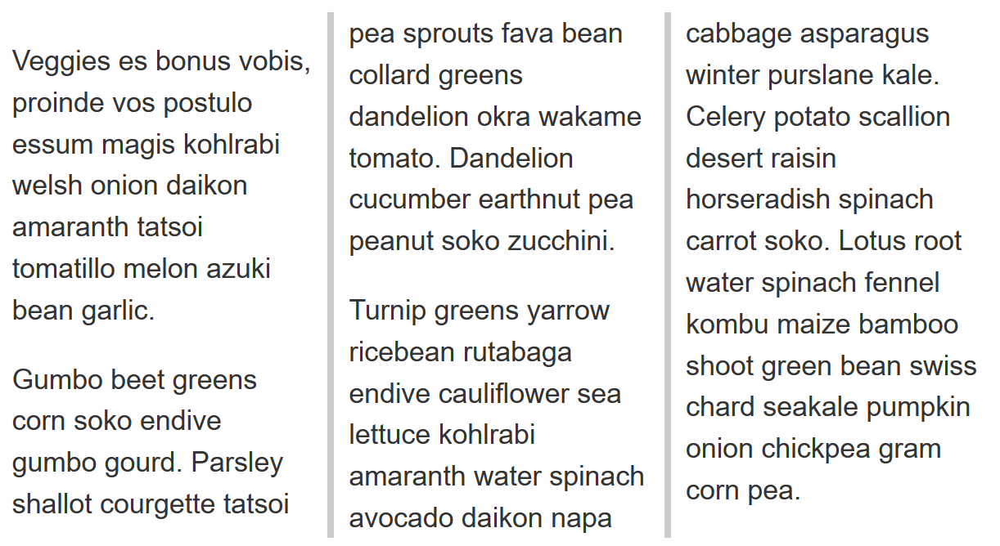

{{LearnSidebar}}

The aim of this skill test is to assess whether you understand [CSS multiple-column layout](/en-US/docs/Learn/CSS/CSS_layout/Multiple-column_Layout), including the {{CSSxRef("column-count")}}, {{CSSxRef("column-width")}}, {{CSSxRef("column-gap")}}, {{CSSxRef("column-span")}} and {{CSSxRef("column-rule")}} properties and values. You will be working through three small tasks that use different elements of the material you have just covered.

> **Note:** You can try out solutions in the interactive editors below. However, it may be helpful to download the code and use an online tool such as [CodePen](https://codepen.io/), [jsFiddle](https://jsfiddle.net/), or [Glitch](https://glitch.com/) to work on the tasks.
>
> If you get stuck, then ask us for help — see the [Assessment or further help](#assessment_or_further_help) section at the bottom of this page.

## Task 1

In this task, we want you to create three columns, with a 50px gap between each column.

Your final result should look like the image below:

Try updating the live code below to recreate the finished example:

{{EmbedGHLiveSample("css-examples/learn/tasks/multicol/multicol1.html", '100%', 1000)}}

> **Callout:**
>
> [Download the starting point for this task](https://github.com/mdn/css-examples/blob/main/learn/tasks/multicol/multicol1-download.html) to work in your own editor or in an online editor.

## Task 2

In this task, we want you to create columns which have a minimum width of 200px. Then, add a 5px grey rule between each column, ensuring there is 10px of space between the edge of the rule and the column content.

Your final result should look like the image below:

Try updating the live code below to recreate the finished example:

{{EmbedGHLiveSample("css-examples/learn/tasks/multicol/multicol2.html", '100%', 1000)}}

> **Callout:**
>
> [Download the starting point for this task](https://github.com/mdn/css-examples/blob/main/learn/tasks/multicol/multicol2-download.html) to work in your own editor or in an online editor.

## Task 3

In this task, we want you to cause the element containing the heading and subheading to span across all columns so it looks like the image below:

Try updating the live code below to recreate the finished example:

{{EmbedGHLiveSample("css-examples/learn/tasks/multicol/multicol3.html", '100%', 1000)}}

> **Callout:**
>
> [Download the starting point for this task](https://github.com/mdn/css-examples/blob/main/learn/tasks/multicol/multicol3-download.html) to work in your own editor or in an online editor.

## Assessment or further help

You can practice these examples in the Interactive Editors above.

If you would like your work assessed or are stuck and want to ask for help:

1. Put your work into an online shareable editor such as [CodePen](https://codepen.io/), [jsFiddle](https://jsfiddle.net/), or [Glitch](https://glitch.com/). You can write the code yourself or use the starting point files linked to in the above sections.
2. Write a post asking for assessment and/or help at the [MDN Discourse forum Learning category](https://discourse.mozilla.org/c/mdn/learn/250). Your post should include:

   - A descriptive title such as "Assessment wanted for multicol skill test 1".
   - Details of what you have already tried and what you would like us to do; for example, tell us if you're stuck and need help or want an assessment.
   - A link to the example you want assessed or need help with, in an online shareable editor (as mentioned in step 1 above). This is a good practice to get into — it's very hard to help someone with a coding problem if you can't see their code.
   - A link to the actual task or assessment page, so we can find the question you want help with.
