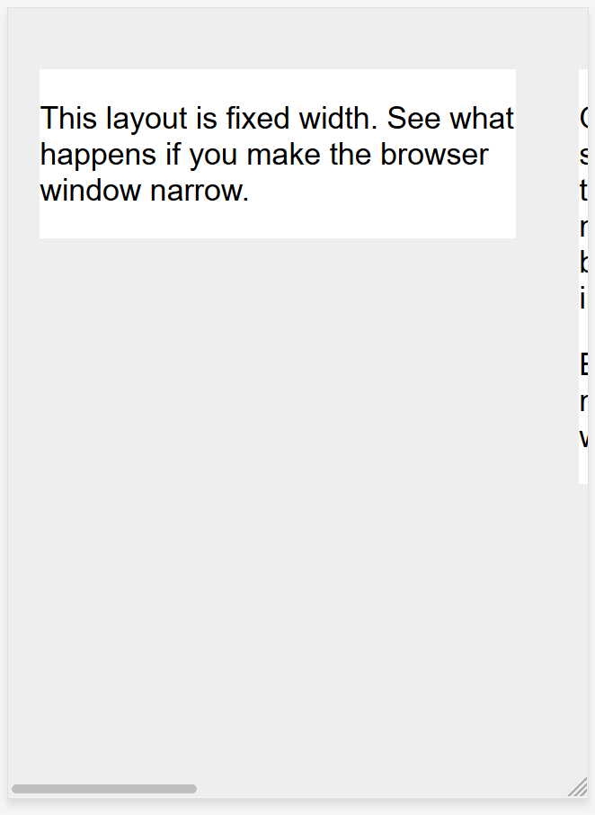
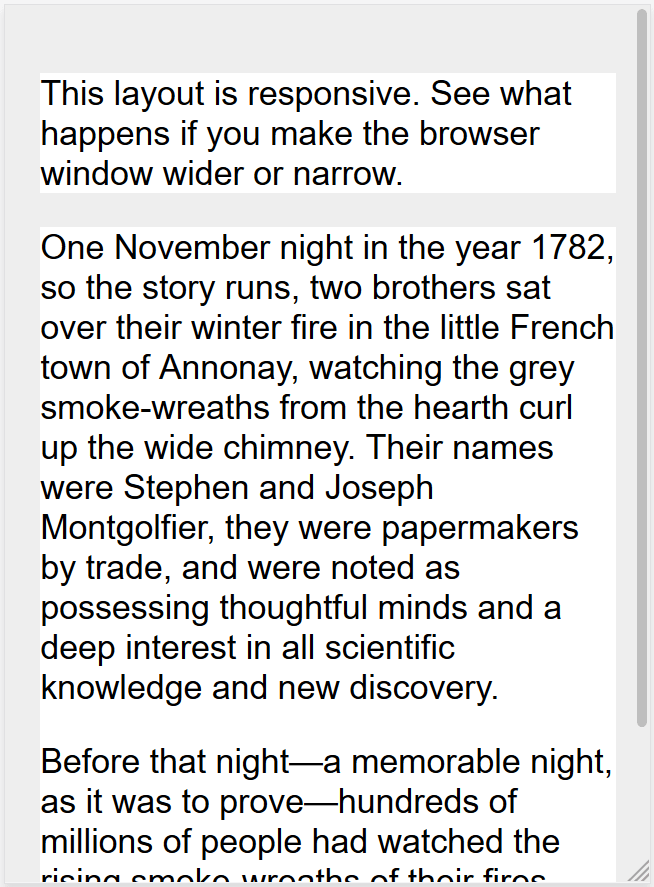
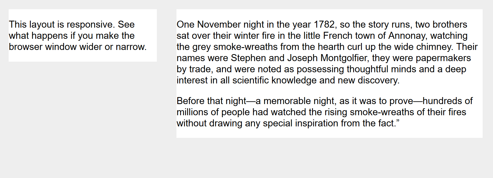
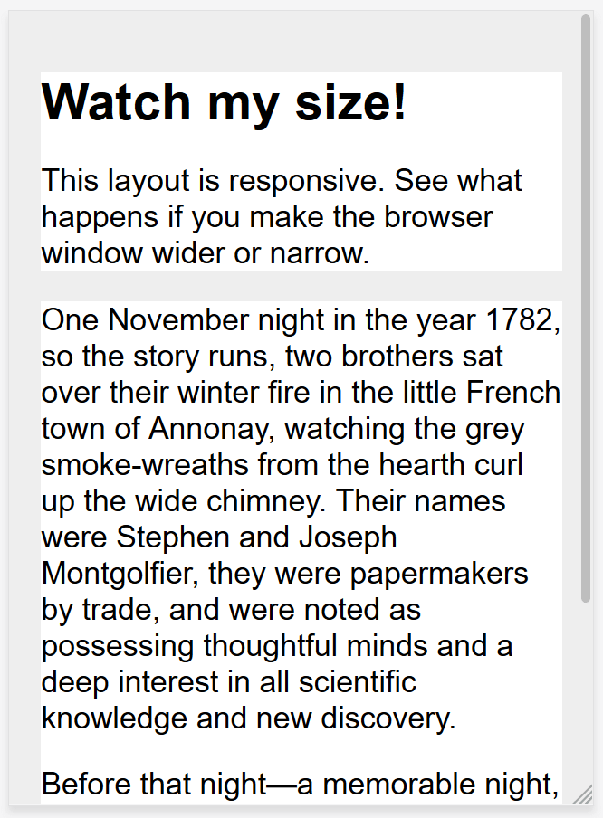
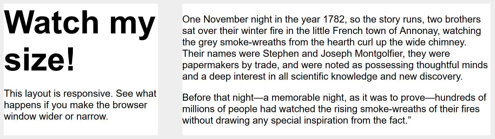

{{learnsidebar}}{{PreviousMenuNext("Learn/CSS/CSS_layout/Multiple-column_Layout", "Learn/CSS/CSS_layout/Media_queries", "Learn/CSS/CSS_layout")}}

In the early days of web design, pages were built to target a particular screen size. If the user had a larger or smaller screen than the designer expected, results ranged from unwanted scrollbars to overly long line lengths, and poor use of space. As more diverse screen sizes became available, the concept of _responsive web design_ (RWD) appeared, a set of practices that allows web pages to alter their layout and appearance to suit different screen widths, resolutions, etc. It is an idea that changed the way we design for a multi-device web, and in this article, we'll help you understand the main techniques you need to know to master it.

<table>
  <tbody>
    <tr>
      <th scope="row">Prerequisites:</th>
      <td>
        HTML basics (study
        <a href="/en-US/docs/Learn/HTML/Introduction_to_HTML"
          >Introduction to HTML</a
        >), and an idea of how CSS works (study
        <a href="/en-US/docs/Learn/CSS/First_steps">CSS first steps</a> and
        <a href="/en-US/docs/Learn/CSS/Building_blocks">CSS building blocks</a
        >.)
      </td>
    </tr>
    <tr>
      <th scope="row">Objective:</th>
      <td>
        To understand the fundamental concepts and history of responsive design.
      </td>
    </tr>
  </tbody>
</table>

## Historic website layouts

HTML is fundamentally responsive. If you create a web page containing text and resize the browser window, or display the page on a device with a smaller screen, then the browser will automatically reflow the text to fit the window.

This is called a _liquid_ layout.

The problem with this layout, though, is that the site would look squashed on smaller screens (as seen below) and have unreadably long line lengths on larger ones.


> **Note:** See this simple liquid layout: [example](https://mdn.github.io/css-examples/learn/rwd/liquid-width.html), [source code](https://github.com/mdn/css-examples/blob/main/learn/rwd/liquid-width.html). When viewing the example, drag your browser window in and out to see how this looks at different sizes.

The alternative is to create a _fixed width_ layout, which sets elements to a fixed size in pixels.

The problem with this approach is that you will get a horizontal scrollbar on screens smaller than the site width (as seen below), and lots of white space at the edges of the design on larger screens.



> **Note:** See this simple fixed-width layout: [example](https://mdn.github.io/css-examples/learn/rwd/fixed-width.html), [source code](https://github.com/mdn/css-examples/blob/main/learn/rwd/fixed-width.html). Again, observe the result as you change the browser window size.

> **Note:** The screenshots above are taken using the [Responsive Design Mode](https://firefox-source-docs.mozilla.org/devtools-user/responsive_design_mode/index.html) in Firefox DevTools.

As the mobile web started to become a reality with the first feature phones, companies who wished to embrace mobile would generally create a special mobile version of their site, with a different URL (often something like _m.example.com_, or _example.mobi_). This meant that two separate versions of the site had to be developed and kept up-to-date.

In addition, these mobile sites often offered a very cut down experience. As mobile devices became more powerful and able to display full websites, this was frustrating to mobile users who found themselves trapped in the site's mobile version and unable to access information they knew was on the full-featured desktop version of the site.

## Flexible layout before responsive design

A number of approaches were developed to try to solve the downsides of the liquid or fixed-width methods of building websites. In 2004 Cameron Adams wrote a post entitled [Resolution dependent layout](https://www.themaninblue.com/writing/perspective/2004/09/21/), describing a method of creating a design that could adapt to different screen resolutions. This approach required JavaScript to detect the screen resolution and load the correct CSS.

Zoe Mickley Gillenwater was instrumental in [her work](https://zomigi.com/blog/voices-that-matter-slides-available/) to describe and formalize the different ways in which flexible sites could be created, attempting to find a happy medium between filling the screen or being completely fixed in size.

## Responsive design

The term responsive design was [coined by Ethan Marcotte in 2010](https://alistapart.com/article/responsive-web-design/) and described the use of three techniques in combination.

1. The first was the idea of fluid grids, something which was already being explored by Gillenwater, and can be read up on in Marcotte's article, [Fluid Grids](https://alistapart.com/article/fluidgrids/) (published in 2009 on A List Apart).
2. The second technique was the idea of [fluid images](https://unstoppablerobotninja.com/entry/fluid-images/). Using a very simple technique of setting the `max-width` property to `100%`, images would scale down smaller if their containing column became narrower than the image's intrinsic size, but never grow larger. This enables an image to scale down to fit in a flexibly-sized column, rather than overflow it, but not grow larger and become pixelated if the column becomes wider than the image.
3. The third key component was the [media query](/en-US/docs/Web/CSS/Media_Queries). Media Queries enable the type of layout switch that Cameron Adams had previously explored using JavaScript, using only CSS. Rather than having one layout for all screen sizes, the layout could be changed. Sidebars could be repositioned for the smaller screen, or alternate navigation could be displayed.

It is important to understand that **responsive web design isn't a separate technology** — it is a term used to describe an approach to web design or a set of best practices, used to create a layout that can _respond_ to the device being used to view the content. In Marcotte's original exploration this meant flexible grids (using floats) and media queries, however in the almost 10 years since that article was written, working responsively has become the default. Modern CSS layout methods are inherently responsive, and we have new things built into the web platform to make designing responsive sites easier.

The rest of this article will point you to the various web platform features you might want to use when creating a responsive site.

## Media Queries

Responsive design was only able to emerge due to the media query. The Media Queries Level 3 specification became a Candidate Recommendation in 2009, meaning that it was deemed ready for implementation in browsers. Media Queries allow us to run a series of tests (e.g. whether the user's screen is greater than a certain width, or a certain resolution) and apply CSS selectively to style the page appropriately for the user's needs.

For example, the following media query tests to see if the current web page is being displayed as screen media (therefore not a printed document) and the viewport is at least 800 pixels wide. The CSS for the `.container` selector will only be applied if these two things are true.

```css
@media screen and (min-width: 800px) {
  .container {
    margin: 1em 2em;
  }
}
```

You can add multiple media queries within a stylesheet, tweaking your whole layout or parts of it to best suit the various screen sizes. The points at which a media query is introduced, and the layout changed, are known as _breakpoints_.

A common approach when using Media Queries is to create a simple single-column layout for narrow-screen devices (e.g. mobile phones), then check for larger screens and implement a multiple-column layout when you know that you have enough screen width to handle it. This is often described as **mobile first** design.

Find out more in the MDN documentation for [Media Queries](/en-US/docs/Web/CSS/Media_Queries).

## Flexible grids

Responsive sites don't just change their layout between breakpoints, they are built on flexible grids. A flexible grid means that you don't need to target every possible device size that there is, and build a pixel perfect layout for it. That approach would be impossible given the vast number of differently-sized devices that exist, and the fact that on desktop at least, people do not always have their browser window maximized.

By using a flexible grid, you only need to add in a breakpoint and change the design at the point where the content starts to look bad. For example, if the line lengths become unreadably long as the screen size increases, or a box becomes squashed with two words on each line as it narrows.

In the early days of responsive design, our only option for performing layout was to use [floats](/en-US/docs/Learn/CSS/CSS_layout/Floats). Flexible floated layouts were achieved by giving each element a percentage width, and ensuring that across the layout the totals were not more than 100%. In his original piece on fluid grids, Marcotte detailed a formula for taking a layout designed using pixels and converting it into percentages.

```
target / context = result
```

For example, if our target column size is 60 pixels, and the context (or container) it is in is 980 pixels, we divide 60 by 980 to get a value we can use in our CSS, after moving the decimal point two places to the right.

```css
.col {
  width: 6.12%; /* 60 / 980 = 0.0612 */
}
```

This approach will be found in many places across the web today, and it is documented here in the layout section of our [Legacy layout methods](/en-US/docs/Learn/CSS/CSS_layout/Legacy_Layout_Methods) article. It is likely that you will come across websites using this approach in your work, so it is worth understanding it, even though you would not build a modern site using a float-based flexible grid.

The following example demonstrates a simple responsive design using Media Queries and a flexible grid. On narrow screens, the layout displays the boxes stacked on top of one another:



On wider screens they move to two columns:



> **Note:** You can find the [live example](https://mdn.github.io/css-examples/learn/rwd/float-based-rwd.html) and [source code](https://github.com/mdn/css-examples/blob/main/learn/rwd/float-based-rwd.html) for this example on GitHub.

## Modern layout technologies

Modern layout methods such as [Multiple-column layout](/en-US/docs/Learn/CSS/CSS_layout/Multiple-column_Layout), [Flexbox](/en-US/docs/Learn/CSS/CSS_layout/Flexbox), and [Grid](/en-US/docs/Learn/CSS/CSS_layout/Grids) are responsive by default. They all assume that you are trying to create a flexible grid and give you easier ways to do so.

### Multicol

The oldest of these layout methods is multicol — when you specify a `column-count`, this indicates how many columns you want your content to be split into. The browser then works out the size of these, a size that will change according to the screen size.

```css
.container {
  column-count: 3;
}
```

If you instead specify a `column-width`, you are specifying a _minimum_ width. The browser will create as many columns of that width as will comfortably fit into the container, then share out the remaining space between all the columns. Therefore the number of columns will change according to how much space there is.

```css
.container {
  column-width: 10em;
}
```

### Flexbox

In Flexbox, flex items will shrink and distribute space between the items according to the space in their container, as their initial behavior. By changing the values for `flex-grow` and `flex-shrink` you can indicate how you want the items to behave when they encounter more or less space around them.

In the example below the flex items will each take an equal amount of space in the flex container, using the shorthand of `flex: 1` as described in the layout topic [Flexbox: Flexible sizing of flex items](/en-US/docs/Learn/CSS/CSS_layout/Flexbox#flexible_sizing_of_flex_items).

```css
.container {
  display: flex;
}

.item {
  flex: 1;
}
```

> **Note:** As an example, we have rebuilt the simple responsive layout above, this time using flexbox. You can see how we no longer need to use strange percentage values to calculate the size of the columns: [example](https://mdn.github.io/css-examples/learn/rwd/flex-based-rwd.html), [source code](https://github.com/mdn/css-examples/blob/main/learn/rwd/flex-based-rwd.html).

### CSS grid

In CSS Grid Layout the `fr` unit allows the distribution of available space across grid tracks. The next example creates a grid container with three tracks sized at `1fr`. This will create three column tracks, each taking one part of the available space in the container. You can find out more about this approach to create a grid in the Learn Layout Grids topic, under [Flexible grids with the fr unit](/en-US/docs/Learn/CSS/CSS_layout/Grids#flexible_grids_with_the_fr_unit).

```css
.container {
  display: grid;
  grid-template-columns: 1fr 1fr 1fr;
}
```

> **Note:** The grid layout version is even simpler as we can define the columns on the .wrapper: [example](https://mdn.github.io/css-examples/learn/rwd/grid-based-rwd.html), [source code](https://github.com/mdn/css-examples/blob/main/learn/rwd/grid-based-rwd.html).

## Responsive images

The simplest approach to responsive images was as described in Marcotte's early articles on responsive design. Basically, you would take an image that was at the largest size that might be needed, and scale it down. This is still an approach used today, and in most stylesheets, you will find the following CSS somewhere:

```css
img {
  max-width: 100%;
}
```

There are obvious downsides to this approach. The image might be displayed a lot smaller than its intrinsic size, which is a waste of bandwidth — a mobile user may be downloading an image several times the size of what they actually see in the browser window. In addition, you may not want the same image aspect ratio on mobile as on desktop. For example, it might be nice to have a square image for mobile, but show the same scene as a landscape image on desktop. Or, acknowledging the smaller size of an image on mobile you might want to show a different image altogether, one which is more easily understood at a small screen size. These things can't be achieved by scaling down an image.

Responsive Images, using the {{htmlelement("picture")}} element and the {{htmlelement("img")}} `srcset` and `sizes` attributes solve both of these problems. You can provide multiple sizes along with "hints" (metadata that describes the screen size and resolution the image is best suited for), and the browser will choose the most appropriate image for each device, ensuring that a user will download an image size appropriate for the device they are using.

You can also _art direct_ images used at different sizes, thus providing a different crop or completely different image to different screen sizes.

You can find a detailed [guide to Responsive Images in the Learn HTML section](/en-US/docs/Learn/HTML/Multimedia_and_embedding/Responsive_images) here on MDN.

## Responsive typography

An element of responsive design not covered in earlier work was the idea of responsive typography. Essentially, this describes changing font sizes within media queries to reflect lesser or greater amounts of screen real estate.

In this example, we want to set our level 1 heading to be `4rem`, meaning it will be four times our base font size. That's a really large heading! We only want this jumbo heading on larger screen sizes, therefore we first create a smaller heading then use media queries to overwrite it with the larger size if we know that the user has a screen size of at least `1200px`.

```css
html {
  font-size: 1em;
}

h1 {
  font-size: 2rem;
}

@media (min-width: 1200px) {
  h1 {
    font-size: 4rem;
  }
}
```

We have edited our responsive grid example above to also include responsive type using the method outlined. You can see how the heading switches sizes as the layout goes to the two column version.

On mobile the heading is smaller:



On desktop, however, we see the larger heading size:



> **Note:** See this example in action: [example](https://mdn.github.io/css-examples/learn/rwd/type-rwd.html), [source code](https://github.com/mdn/css-examples/blob/main/learn/rwd/type-rwd.html).

As this approach to typography shows, you do not need to restrict media queries to only changing the layout of the page. They can be used to tweak any element to make it more usable or attractive at alternate screen sizes.

### Using viewport units for responsive typography

An interesting approach is to use the viewport unit `vw` to enable responsive typography. `1vw` is equal to one percent of the viewport width, meaning that if you set your font size using `vw`, it will always relate to the size of the viewport.

```css
h1 {
  font-size: 6vw;
}
```

The problem with doing the above is that the user loses the ability to zoom any text set using the `vw` unit, as that text is always related to the size of the viewport. **Therefore you should never set text using viewport units alone**.

There is a solution, and it involves using [`calc()`](/en-US/docs/Web/CSS/calc). If you add the `vw` unit to a value set using a fixed size such as `em`s or `rem`s then the text will still be zoomable. Essentially, the `vw` unit adds on top of that zoomed value:

```css
h1 {
  font-size: calc(1.5rem + 3vw);
}
```

This means that we only need to specify the font size for the heading once, rather than set it up for mobile and redefine it in the media queries. The font then gradually increases as you increase the size of the viewport.

> **Note:** See an example of this in action: [example](https://mdn.github.io/css-examples/learn/rwd/type-vw.html), [source code](https://github.com/mdn/css-examples/blob/main/learn/rwd/type-vw.html).

## The viewport meta tag

If you look at the HTML source of a responsive page, you will usually see the following {{htmlelement("meta")}} tag in the `<head>` of the document.

```html
<meta name="viewport" content="width=device-width,initial-scale=1">
```

This meta tag tells mobile browsers that they should set the width of the viewport to the device width, and scale the document to 100% of its intended size, which shows the document at the mobile-optimized size that you intended.

Why is this needed? Because mobile browsers tend to lie about their viewport width.

This meta tag exists because when the original iPhone launched and people started to view websites on a small phone screen, most sites were not mobile optimized. The mobile browser would, therefore, set the viewport width to 980 pixels, render the page at that width, and show the result as a zoomed-out version of the desktop layout. Other mobile browsers (e.g. on Google Android) did the same thing. Users could zoom in and pan around the website to view the bits they were interested in, but it looked bad. You will still see this today if you have the misfortune to come across a site that does not have a responsive design.

The trouble is that your responsive design with breakpoints and media queries won't work as intended on mobile browsers. If you've got a narrow screen layout that kicks in at 480px viewport width or less, and the viewport is set at 980px, you'll never see your narrow screen layout on mobile. By setting `width=device-width` you are overriding Apple's default `width=980px` with the actual width of the device, so your media queries will work as intended.

**So you should _always_ include the above line of HTML in the head of your documents.**

There are other settings you can use with the viewport meta tag, however in general the above line is what you will want to use.

- `initial-scale`: Sets the initial zoom of the page, which we set to 1.
- `height`: Sets a specific height for the viewport.
- `minimum-scale`: Sets the minimum zoom level.
- `maximum-scale`: Sets the maximum zoom level.
- `user-scalable`: Prevents zooming if set to `no`.

You should avoid using `minimum-scale`, `maximum-scale`, and in particular setting `user-scalable` to `no`. Users should be allowed to zoom as much or as little as they need to; preventing this causes accessibility problems.

> **Note:** There was a CSS @ rule designed to replace the viewport meta tag — [@viewport](/en-US/docs/Web/CSS/@viewport) — however, the rule failed to gain traction and has been deprecated. @viewport should not be used.

## Summary

Responsive design refers to a site or application design that responds to the environment in which it is viewed. It encompasses a number of CSS and HTML features and techniques and is now essentially just how we build websites by default. Consider the sites that you visit on your phone — it is probably fairly unusual to come across a site that is the desktop version scaled down, or where you need to scroll sideways to find things. This is because the web has moved to this approach of designing responsively.

It has also become much easier to achieve responsive designs with the help of the layout methods you have learned in these lessons. If you are new to web development today you have many more tools at your disposal than in the early days of responsive design. It is therefore worth checking the age of any materials you are using. While the historical articles are still useful, modern use of CSS and HTML makes it far easier to create elegant and useful designs, no matter what device your visitor views the site with.

## See also

- [CSS-Tricks Guide to Media Queries](https://css-tricks.com/a-complete-guide-to-css-media-queries/)

{{PreviousMenuNext("Learn/CSS/CSS_layout/Multiple-column_Layout", "Learn/CSS/CSS_layout/Media_queries", "Learn/CSS/CSS_layout")}}

## In this module

- [Introduction to CSS layout](/en-US/docs/Learn/CSS/CSS_layout/Introduction)
- [Normal flow](/en-US/docs/Learn/CSS/CSS_layout/Normal_Flow)
- [Flexbox](/en-US/docs/Learn/CSS/CSS_layout/Flexbox)
- [Grid](/en-US/docs/Learn/CSS/CSS_layout/Grids)
- [Floats](/en-US/docs/Learn/CSS/CSS_layout/Floats)
- [Positioning](/en-US/docs/Learn/CSS/CSS_layout/Positioning)
- [Multiple-column layout](/en-US/docs/Learn/CSS/CSS_layout/Multiple-column_Layout)
- [Responsive design](/en-US/docs/Learn/CSS/CSS_layout/Responsive_Design)
- [Beginner's guide to media queries](/en-US/docs/Learn/CSS/CSS_layout/Media_queries)
- [Legacy layout methods](/en-US/docs/Learn/CSS/CSS_layout/Legacy_Layout_Methods)
- [Supporting older browsers](/en-US/docs/Learn/CSS/CSS_layout/Supporting_Older_Browsers)
- [Fundamental layout comprehension](/en-US/docs/Learn/CSS/CSS_layout/Fundamental_Layout_Comprehension)
