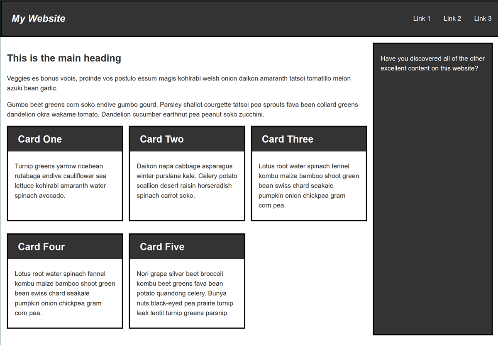

{{LearnSidebar}}

The aim of this skill test is to assess whether you understand [how to use media queries](/en-US/docs/Learn/CSS/CSS_layout/Media_queries) and get you working with responsive web design with a practical task. Everything you need to know to complete this task is covered in the layout lessons in the [CSS layout module](/en-US/docs/Learn/CSS/CSS_layout).

> **Note:** Due to the need to test your design in multiple screen sizes, we do not have an Interactive Editor for this task. Download the code and work locally, or use an online tool such as [CodePen](https://codepen.io/), [jsFiddle](https://jsfiddle.net/), or [Glitch](https://glitch.com/) to work on the tasks.
>
> If you get stuck, then ask us for help — see the [Assessment or further help](#assessment_or_further_help) section at the bottom of this page.

## Task

[Download the starting point for this task](https://github.com/mdn/css-examples/blob/main/learn/tasks/rwd/rwd-download.html). Open the downloaded HTML file in your browser and you will find a wireframed site which will load in a mobile device in a readable manner. You can drag your window smaller or use the [responsive design view in Firefox DevTools](https://firefox-source-docs.mozilla.org/devtools-user/index.html#responsive-design-mode) to view this as if on a phone.

Your task is to create a desktop version of this layout which displays when there is enough screen width to accommodate it. Your final result should look like the image below:

There are a number of ways that you could create the desktop layout, enjoy experimenting. You could also add a second breakpoint perhaps creating a layout that would work well on a tablet in portrait mode.

## Assessment or further help

If you would like your work assessed or are stuck and want to ask for help:

1. Put your work into an online shareable editor such as [CodePen](https://codepen.io/), [jsFiddle](https://jsfiddle.net/), or [Glitch](https://glitch.com/). You can write the code yourself or use the starting point files linked to in the above sections.
2. Write a post asking for assessment and/or help at the [MDN Discourse forum Learning category](https://discourse.mozilla.org/c/mdn/learn/250). Your post should include:

    - A descriptive title such as "Assessment wanted for responsive web design and media queries skill test".
    - Details of what you have already tried and what you would like us to do; for example, tell us if you're stuck and need help or want an assessment.
    - A link to the example you want assessed or need help with, in an online shareable editor (as mentioned in step 1 above). This is a good practice to get into — it's very hard to help someone with a coding problem if you can't see their code.
    - A link to the actual task or assessment page, so we can find the question you want help with.
