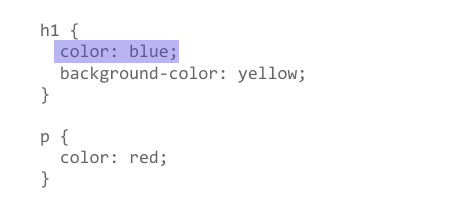
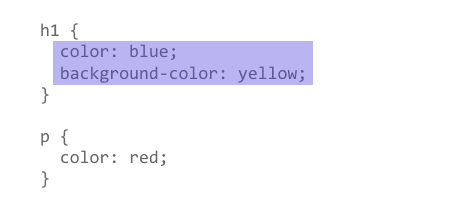
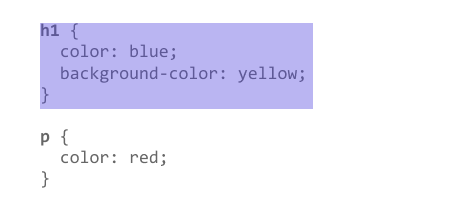

{{LearnSidebar}}{{PreviousMenuNext("Learn/CSS/First_steps/Getting_started", "Learn/CSS/First_steps/How_CSS_works", "Learn/CSS/First_steps")}}

Now that you are beginning to understand the purpose and use of CSS, let's examine the structure of CSS.

<table>
  <tbody>
    <tr>
      <th scope="row">Prerequisites:</th>
      <td>
        Basic computer literacy,
        <a
          href="/en-US/docs/Learn/Getting_started_with_the_web/Installing_basic_software"
          >basic software installed</a
        >, basic knowledge of
        <a
          href="/en-US/docs/Learn/Getting_started_with_the_web/Dealing_with_files"
          >working with files</a
        >, HTML basics (study
        <a href="/en-US/docs/Learn/HTML/Introduction_to_HTML"
          >Introduction to HTML</a
        >), and an idea of
        <a href="/en-US/docs/Learn/CSS/First_steps/How_CSS_works"
          >How CSS works</a
        >.
      </td>
    </tr>
    <tr>
      <th scope="row">Objective:</th>
      <td>To learn CSS's fundamental syntax structures in detail.</td>
    </tr>
  </tbody>
</table>

## Applying CSS to HTML

First, let's examine three methods of applying CSS to a document: with an external stylesheet, with an internal stylesheet, and with inline styles.

### External stylesheet

An external stylesheet contains CSS in a separate file with a `.css` extension. This is the most common and useful method of bringing CSS to a document. You can link a single CSS file to multiple web pages, styling all of them with the same CSS stylesheet. In the [Getting started with CSS](/en-US/docs/Learn/CSS/First_steps/Getting_started), we linked an external stylesheet to our web page.

You reference an external CSS stylesheet from an HTML `<link>` element:

```html
<!doctype html>
<html lang="en-GB">
  <head>
    <meta charset="utf-8" />
    <title>My CSS experiment</title>
    <link rel="stylesheet" href="styles.css" />
  </head>
  <body>
    <h1>Hello World!</h1>
    <p>This is my first CSS example</p>
  </body>
</html>
```

The CSS stylesheet file might look like this:

```css
h1 {
  color: blue;
  background-color: yellow;
  border: 1px solid black;
}

p {
  color: red;
}
```

The `href` attribute of the {{htmlelement("link")}} element needs to reference a file on your file system. In the example above, the CSS file is in the same folder as the HTML document, but you could place it somewhere else and adjust the path. Here are three examples:

```html
<!-- Inside a subdirectory called styles inside the current directory -->
<link rel="stylesheet" href="styles/style.css" />

<!-- Inside a subdirectory called general, which is in a subdirectory called styles, inside the current directory -->
<link rel="stylesheet" href="styles/general/style.css" />

<!-- Go up one directory level, then inside a subdirectory called styles -->
<link rel="stylesheet" href="../styles/style.css" />
```

### Internal stylesheet

An internal stylesheet resides within an HTML document. To create an internal stylesheet, you place CSS inside a {{htmlelement("style")}} element contained inside the HTML {{htmlelement("head")}}.

The HTML for an internal stylesheet might look like this:

```html
<!doctype html>
<html lang="en-GB">
  <head>
    <meta charset="utf-8" />
    <title>My CSS experiment</title>
    <style>
      h1 {
        color: blue;
        background-color: yellow;
        border: 1px solid black;
      }

      p {
        color: red;
      }
    </style>
  </head>
  <body>
    <h1>Hello World!</h1>
    <p>This is my first CSS example</p>
  </body>
</html>
```

In some circumstances, internal stylesheets can be useful. For example, perhaps you're working with a content management system where you are blocked from modifying external CSS files.

But for sites with more than one page, an internal stylesheet becomes a less efficient way of working. To apply uniform CSS styling to multiple pages using internal stylesheets, you must have an internal stylesheet in every web page that will use the styling. The efficiency penalty carries over to site maintenance too. With CSS in internal stylesheets, there is the risk that even one simple styling change may require edits to multiple web pages.

### Inline styles

Inline styles are CSS declarations that affect a single HTML element, contained within a `style` attribute. The implementation of an inline style in an HTML document might look like this:

```html
<!doctype html>
<html lang="en-GB">
  <head>
    <meta charset="utf-8" />
    <title>My CSS experiment</title>
  </head>
  <body>
    <h1 style="color: blue;background-color: yellow;border: 1px solid black;">
      Hello World!
    </h1>
    <p style="color:red;">This is my first CSS example</p>
  </body>
</html>
```

**Avoid using CSS in this way, when possible.** It is the opposite of a best practice. First, it is the least efficient implementation of CSS for maintenance. One styling change might require multiple edits within a single web page. Second, inline CSS also mixes (CSS) presentational code with HTML and content, making everything more difficult to read and understand. Separating code and content makes maintenance easier for all who work on the website.

There are a few circumstances where inline styles are more common. You might have to resort to using inline styles if your working environment is very restrictive. For example, perhaps your CMS only allows you to edit the HTML body. You may also see a lot of inline styles in HTML email to achieve compatibility with as many email clients as possible.

## Playing with the CSS in this article

For the exercise that follows, create a folder on your computer. You can name the folder whatever you want. Inside the folder, copy the text below to create two files:

**index.html:**

```html
<!doctype html>
<html lang="en">
  <head>
    <meta charset="utf-8" />
    <meta name="viewport" content="width=device-width" />
    <title>My CSS experiments</title>
    <link rel="stylesheet" href="styles.css" />
  </head>
  <body>
    <p>Create your test HTML here</p>
  </body>
</html>
```

**styles.css:**

```css
/* Create your test CSS here */

p {
  color: red;
}
```

When you find CSS that you want to experiment with, replace the HTML `<body>` contents with some HTML to style, and then add your test CSS code to your CSS file.

As an alternative, you can also use the interactive editor below.

{{EmbedGHLiveSample("css-examples/learn/getting-started/experiment-sandbox.html", '100%', 800)}}

Read on and have fun!

## Selectors

A selector targets HTML to apply styles to content. We have already discovered a variety of selectors in the [Getting started with CSS](/en-US/docs/Learn/CSS/First_steps/Getting_started) tutorial. If CSS is not applying to content as expected, your selector may not match the way you think it should match.

Each CSS rule starts with a selector — or a list of selectors — in order to tell the browser which element or elements the rules should apply to. All the examples below are valid selectors or lists of selectors.

```css
h1
a:link
.manythings
#onething
*
.box p
.box p:first-child
h1, h2, .intro
```

Try creating some CSS rules that use the selectors above. Add HTML to be styled by the selectors. If any of the syntax above is not familiar, try searching MDN.

> **Note:** You will learn more about selectors in the next module: [CSS selectors](/en-US/docs/Learn/CSS/Building_blocks/Selectors).

### Specificity

You may encounter scenarios where two selectors select the same HTML element. Consider the stylesheet below, with a `p` selector that sets paragraph text to blue. However, there is also a class that sets the text of selected elements to red.

```css
.special {
  color: red;
}

p {
  color: blue;
}
```

Suppose that in our HTML document, we have a paragraph with a class of `special`. Both rules apply. Which selector prevails? Do you expect to see blue or red paragraph text?

```html
<p class="special">What color am I?</p>
```

The CSS language has rules to control which selector is stronger in the event of a conflict. These rules are called **cascade** and **specificity**. In the code block below, we define two rules for the `p` selector, but the paragraph text will be blue. This is because the declaration that sets the paragraph text to blue appears later in the stylesheet. Later styles replace conflicting styles that appear earlier in the stylesheet. This is the **cascade** rule.

```css
p {
  color: red;
}

p {
  color: blue;
}
```

However, in the case of our earlier example with the conflict between the class selector and the element selector, the class prevails, rendering the paragraph text red. How can this happen even though a conflicting style appears later in the stylesheet? A class is rated as being more specific, as in having more **specificity** than the element selector, so it cancels the other conflicting style declaration.

Try this experiment for yourself! Add HTML, then add the two `p { }` rules to your stylesheet. Next, change the first `p` selector to `.special` to see how it changes the styling.

The rules of specificity and the cascade can seem complicated at first. These rules are easier to understand as you become more familiar with CSS. The [Cascade and inheritance](/en-US/docs/Learn/CSS/Building_blocks/Cascade_and_inheritance) section in the next module explains this in detail, including how to calculate specificity.

For now, remember that specificity exists. Sometimes, CSS might not apply as you expected because something else in the stylesheet has more specificity. Recognizing that more than one rule could apply to an element is the first step in fixing these kinds of issues.

## Properties and values

At its most basic level, CSS consists of two components:

- **Properties**: These are human-readable identifiers that indicate which stylistic features you want to modify. For example, {{cssxref("font-size")}}, {{cssxref("width")}}, {{cssxref("background-color")}}.
- **Values**: Each property is assigned a value. This value indicates how to style the property.

The example below highlights a single property and value. The property name is `color` and the value is `blue`.



When a property is paired with a value, this pairing is called a _CSS declaration_. CSS declarations are found within _CSS Declaration Blocks_. In the example below, highlighting identifies the CSS declaration block.



Finally, CSS declaration blocks are paired with _selectors_ to produce _CSS rulesets_ (or _CSS rules_). The example below contains two rules: one for the `h1` selector and one for the `p` selector. The colored highlighting identifies the `h1` rule.



Setting CSS properties to specific values is the primary way of defining layout and styling for a document. The CSS engine calculates which declarations apply to every single element of a page.

CSS properties and values are case-insensitive. The property and value in a property-value pair are separated by a colon (`:`).

**Look up different values of properties listed below. Write CSS rules that apply styling to different HTML elements:**

- **{{cssxref("font-size")}}**
- **{{cssxref("width")}}**
- **{{cssxref("background-color")}}**
- **{{cssxref("color")}}**
- **{{cssxref("border")}}**

> **Warning:** If a property is unknown, or if a value is not valid for a given property, the declaration is processed as _invalid_. It is completely ignored by the browser's CSS engine.

> **Warning:** In CSS (and other web standards), it has been agreed that US spelling is the standard where there is language variation or uncertainty. For example, `colour` should be spelled `color`, as `colour` will not work.

### Functions

While most values are relatively simple keywords or numeric values, there are some values that take the form of a function.

#### The calc() function

An example would be the `calc()` function, which can do simple math within CSS:

```html
<div class="outer"><div class="box">The inner box is 90% - 30px.</div></div>
```

```css
.outer {
  border: 5px solid black;
}

.box {
  padding: 10px;
  width: calc(90% - 30px);
  background-color: rebeccapurple;
  color: white;
}
```

This renders as:

{{EmbedLiveSample('The_calc_function', '100%', 200)}}

A function consists of the function name, and parentheses to enclose the values for the function. In the case of the `calc()` example above, the values define the width of this box to be 90% of the containing block width, minus 30 pixels. The result of the calculation isn't something that can be computed in advance and entered as a static value.

#### Transform functions

Another example would be the various values for {{cssxref("transform")}}, such as `rotate()`.

```html
<div class="box"></div>
```

```css
.box {
  margin: 30px;
  width: 100px;
  height: 100px;
  background-color: rebeccapurple;
  transform: rotate(0.8turn);
}
```

The output from the above code looks like this:

{{EmbedLiveSample('Transform_functions', '100%', 200)}}

**Look up different values of properties listed below. Write CSS rules that apply styling to different HTML elements:**

- **{{cssxref("transform")}}**
- **{{cssxref("background-image")}}, in particular gradient values**
- **{{cssxref("color")}}, in particular rgb and hsl values**

## @rules

CSS [@rules](/en-US/docs/Web/CSS/At-rule) (pronounced "at-rules") provide instruction for what CSS should perform or how it should behave. Some @rules are simple with just a keyword and a value. For example, `@import` imports a stylesheet into another CSS stylesheet:

```css
@import "styles2.css";
```

One common @rule that you are likely to encounter is `@media`, which is used to create [media queries](/en-US/docs/Web/CSS/CSS_media_queries). Media queries use conditional logic for applying CSS styling.

In the example below, the stylesheet defines a default pink background for the `<body>` element. However, a media query follows that defines a blue background if the browser viewport is wider than 30em.

```css
body {
  background-color: pink;
}

@media (min-width: 30em) {
  body {
    background-color: blue;
  }
}
```

You will encounter other @rules throughout these tutorials.

**See if you can add a media query that changes styles based on the viewport width. Change the width of your browser window to see the result.**

## Shorthands

Some properties like {{cssxref("font")}}, {{cssxref("background")}}, {{cssxref("padding")}}, {{cssxref("border")}}, and {{cssxref("margin")}} are called **shorthand properties.** This is because shorthand properties set several values in a single line.

For example, this one line of code:

```css
/* In 4-value shorthands like padding and margin, the values are applied
   in the order top, right, bottom, left (clockwise from the top). There are also other
   shorthand types, for example 2-value shorthands, which set padding/margin
   for top/bottom, then left/right */
padding: 10px 15px 15px 5px;
```

is equivalent to these four lines of code:

```css
padding-top: 10px;
padding-right: 15px;
padding-bottom: 15px;
padding-left: 5px;
```

This one line:

```css
background: red url(bg-graphic.png) 10px 10px repeat-x fixed;
```

is equivalent to these five lines:

```css
background-color: red;
background-image: url(bg-graphic.png);
background-position: 10px 10px;
background-repeat: repeat-x;
background-attachment: fixed;
```

Later in the course, you will encounter many other examples of shorthand properties. MDN's [CSS reference](/en-US/docs/Web/CSS/Reference) is a good resource for more information about any shorthand property.

**Try using the declarations (above) in your own CSS exercise to become more familiar with how it works. You can also experiment with different values.**

> **Warning:** One less obvious aspect of using CSS shorthand is how omitted values reset. A value not specified in CSS shorthand reverts to its initial value. This means an omission in CSS shorthand can **override previously set values**.

## Comments

As with any coding work, it is best practice to write comments along with CSS. This helps you to remember how the code works as you come back later for fixes or enhancement. It also helps others understand the code.

CSS comments begin with `/*` and end with `*/`. In the example below, comments mark the start of distinct sections of code. This helps to navigate the codebase as it gets larger. With this kind of commenting in place, searching for comments in your code editor becomes a way to efficiently find a section of code.

```css
/* Handle basic element styling */
/* -------------------------------------------------------------------------------------------- */
body {
  font:
    1em/150% Helvetica,
    Arial,
    sans-serif;
  padding: 1em;
  margin: 0 auto;
  max-width: 33em;
}

@media (min-width: 70em) {
  /* Increase the global font size on larger screens or windows
     for better readability */
  body {
    font-size: 130%;
  }
}

h1 {
  font-size: 1.5em;
}

/* Handle specific elements nested in the DOM */
div p,
#id:first-line {
  background-color: red;
  border-radius: 3px;
}

div p {
  margin: 0;
  padding: 1em;
}

div p + p {
  padding-top: 0;
}
```

"Commenting out" code is also useful for temporarily disabling sections of code for testing. In the example below, the rules for `.special` are disabled by "commenting out" the code.

```css
/*.special {
  color: red;
}*/

p {
  color: blue;
}
```

**Add comments to your CSS.**

## White space

White space means actual spaces, tabs and new lines. Just as browsers ignore white space in HTML, browsers ignore white space inside CSS. The value of white space is how it can improve readability.

In the example below, each declaration (and rule start/end) has its own line. This is arguably a good way to write CSS. It makes it easier to maintain and understand CSS.

```css
body {
  font:
    1em/150% Helvetica,
    Arial,
    sans-serif;
  padding: 1em;
  margin: 0 auto;
  max-width: 33em;
}

@media (min-width: 70em) {
  body {
    font-size: 130%;
  }
}

h1 {
  font-size: 1.5em;
}

div p,
#id:first-line {
  background-color: red;
  border-radius: 3px;
}

div p {
  margin: 0;
  padding: 1em;
}

div p + p {
  padding-top: 0;
}
```

The next example shows the equivalent CSS in a more compressed format. Although the two examples work the same, the one below is more difficult to read.

```css-nolint
body {font: 1em/150% Helvetica, Arial, sans-serif; padding: 1em; margin: 0 auto; max-width: 33em;}
@media (min-width: 70em) { body { font-size: 130%;}}

h1 {font-size: 1.5em;}

div p, #id:first-line {background-color: red; border-radius: 3px;}
div p {margin: 0; padding: 1em;}
div p + p {padding-top: 0;}
```

For your own projects, you will format your code according to personal preference. For team projects, you may find that a team or project has its own style guide.

> **Warning:** Though white space separates values in CSS declarations, **property names never have white space**.

For example, these declarations are valid CSS:

```css
margin: 0 auto;
padding-left: 10px;
```

But these declarations are invalid:

```css example-bad
margin: 0auto;
padding- left: 10px;
```

Do you see the spacing errors? First, `0auto` is not recognized as a valid value for the `margin` property. The entry `0auto` is meant to be two separate values: `0` and `auto`. Second, the browser does not recognize `padding-` as a valid property. The correct property name (`padding-left`) is separated by an errant space.

You should always make sure to separate distinct values from one another by at least one space. Keep property names and property values together as single unbroken strings.

**To find out how spacing can break CSS, try playing with spacing inside your test CSS.**

## Summary

At this point, you should have a better idea about how CSS is structured. It's also useful to understand how the browser uses HTML and CSS to display a webpage. The next article, [How CSS works](/en-US/docs/Learn/CSS/First_steps/How_CSS_works), explains the process.

{{PreviousMenuNext("Learn/CSS/First_steps/Getting_started", "Learn/CSS/First_steps/How_CSS_works", "Learn/CSS/First_steps")}}
