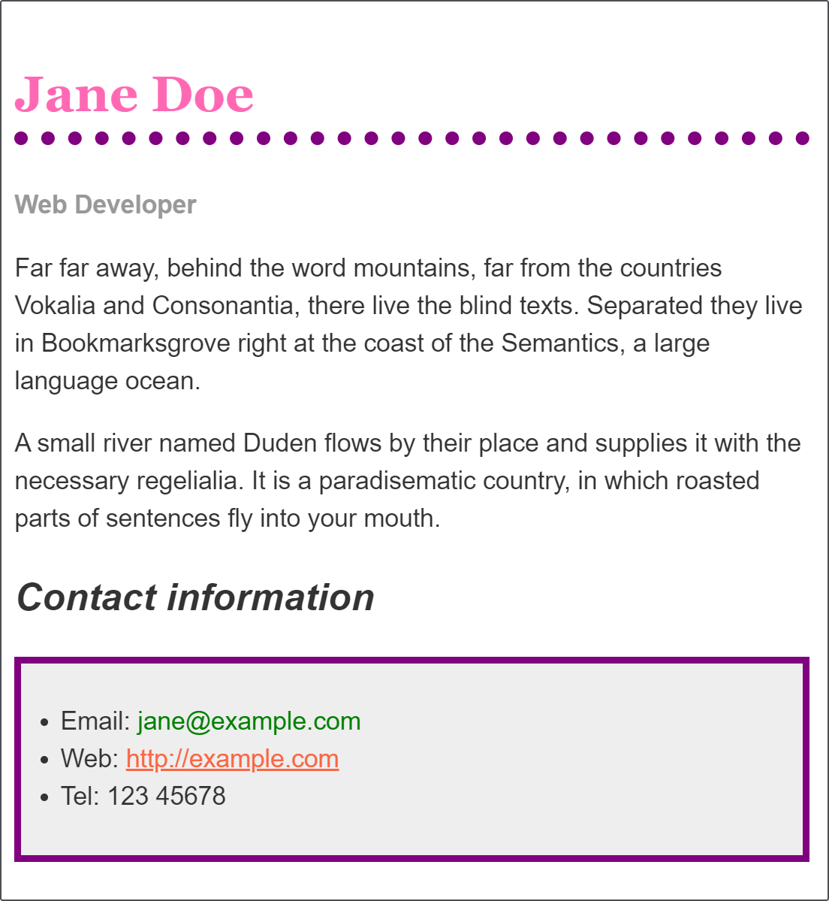

{{LearnSidebar}}{{PreviousMenu("Learn/CSS/First_steps/How_CSS_works", "Learn/CSS/First_steps")}}

With the things you have learned in the last few lessons you should find that you can format simple text documents using CSS to add your own style to them. This assessment gives you a chance to do that.

<table>
  <tbody>
    <tr>
      <th scope="row">Prerequisites:</th>
      <td>
        Before attempting this assessment you should have already worked through
        all the articles in this module, and also have an understanding of HTML
        basics (study
        <a href="/en-US/docs/Learn/HTML/Introduction_to_HTML"
          >Introduction to HTML</a
        >).
      </td>
    </tr>
    <tr>
      <th scope="row">Objective:</th>
      <td>To have a play with some CSS and test your new-found knowledge.</td>
    </tr>
  </tbody>
</table>

## Starting point

You can work in the live editor below, or you can [download the starting point file](https://github.com/mdn/css-examples/blob/main/learn/getting-started/biog-download.html) to work with in your own editor. This is a single page containing both the HTML and the starting point CSS (in the head of the document). If you prefer you could move this CSS to a separate file and link to it when you create the example on your local computer.

Alternatively use an online tool such as [CodePen](https://codepen.io/), [jsFiddle](https://jsfiddle.net/), or [Glitch](https://glitch.com/) to work on the tasks.

> **Note:** If you get stuck, then ask us for help — see the [Assessment or further help](#assessment_or_further_help) section at the bottom of this page.

## Project brief

The following live example shows a biography, which has been styled using CSS. The CSS properties that are used are as follows — each one links to its property page on MDN, which will give you more examples of its use.

- {{cssxref("font-family")}}
- {{cssxref("color")}}
- {{cssxref("border-bottom")}}
- {{cssxref("font-weight")}}
- {{cssxref("font-size")}}
- {{cssxref("font-style")}}
- {{cssxref("text-decoration")}}

In the interactive editor you will find some CSS already in place. This selects parts of the document using element selectors, classes, and pseudo-classes. Make the following changes to this CSS:

1. Make the level one heading pink, using the CSS color keyword `hotpink`.
2. Give the heading a 10px dotted {{cssxref("border-bottom")}} which uses the CSS color keyword `purple`.
3. Make the level 2 heading italic.
4. Give the `ul` used for the contact details a {{cssxref("background-color")}} of `#eeeeee`, and a 5px solid purple {{cssxref("border")}}. Use some {{cssxref("padding")}} to push the content away from the border.
5. Make the links `green` on hover.

## Hints and tips

- Use the [W3C CSS Validator](https://jigsaw.w3.org/css-validator/) to catch unintended mistakes in your CSS — mistakes you might have otherwise missed — so that you can fix them.
- Afterwards try looking up some properties not mentioned on this page in the [MDN CSS reference](/en-US/docs/Web/CSS/Reference) and get adventurous!
- Remember that there is no wrong answer here — at this stage in your learning you can afford to have a bit of fun.

## Example

You should end up with something like this image.

{{EmbedGHLiveSample("css-examples/learn/getting-started/biog.html", '100%', 1600)}}

## Assessment or further help

If you would like your work assessed or are stuck and want to ask for help:

1. Put your work into an online shareable editor such as [CodePen](https://codepen.io/), [jsFiddle](https://jsfiddle.net/), or [Glitch](https://glitch.com/).
2. Write a post asking for assessment and/or help at the [MDN Discourse forum Learning category](https://discourse.mozilla.org/c/mdn/learn/250). Your post should include:

   - A descriptive title such as "Assessment wanted for Styling a biography page".
   - Details of what you have already tried and what you would like us to do; for example, tell us if you're stuck and need help or want an assessment.
   - A link to the example you want assessed or need help with, in an online shareable editor (as mentioned in step 1 above). This is a good practice to get into — it's very hard to help someone with a coding problem if you can't see their code.
   - A link to the actual task or assessment page, so we can find the question you want help with.

{{PreviousMenu("Learn/CSS/First_steps/How_CSS_works", "Learn/CSS/First_steps")}}
