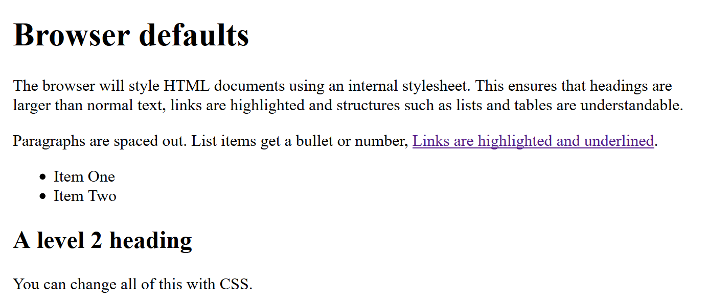

{{LearnSidebar}}{{NextMenu("Learn/CSS/First_steps/Getting_started", "Learn/CSS/First_steps")}}

**{{Glossary("CSS")}}** (Cascading Style Sheets) allows you to create great-looking web pages, but how does it work under the hood? This article explains what CSS is with a simple syntax example and also covers some key terms about the language.

<table>
  <tbody>
    <tr>
      <th scope="row">Prerequisites:</th>
      <td>
        Basic computer literacy,
        <a
          href="/en-US/docs/Learn/Getting_started_with_the_web/Installing_basic_software"
          >basic software installed</a
        >, basic knowledge of
        <a
          href="/en-US/docs/Learn/Getting_started_with_the_web/Dealing_with_files"
          >working with files</a
        >, and HTML basics (study
        <a href="/en-US/docs/Learn/HTML/Introduction_to_HTML"
          >Introduction to HTML</a
        >.)
      </td>
    </tr>
    <tr>
      <th scope="row">Objective:</th>
      <td>To learn what CSS is.</td>
    </tr>
  </tbody>
</table>

In the [Introduction to HTML](/en-US/docs/Learn/HTML/Introduction_to_HTML) module, we covered what HTML is and how it is used to mark up documents. These documents will be readable in a web browser. Headings will look larger than regular text, paragraphs break onto a new line and have space between them. Links are colored and underlined to distinguish them from the rest of the text. What you are seeing are the browser's default styles — very basic styles — that the browser applies to HTML to make sure that the page will be basically readable even if no explicit styling is specified by the author of the page.



However, the web would be a boring place if all websites looked like that. Using CSS, you can control exactly how HTML elements look in the browser, presenting your markup using whatever design you like.

For more on browser/default styles, check out the following video:

{{EmbedYouTube("spK_S0HfzFw")}}

## What is CSS for?

As we have mentioned before, CSS is a language for specifying how documents are presented to users — how they are styled, laid out, etc.

A **document** is usually a text file structured using a markup language — {{Glossary("HTML")}} is the most common markup language, but you may also come across other markup languages such as {{Glossary("SVG")}} or {{Glossary("XML")}}.

**Presenting** a document to a user means converting it into a form usable by your audience. {{Glossary("browser","Browsers")}}, like {{Glossary("Mozilla Firefox","Firefox")}}, {{Glossary("Google Chrome","Chrome")}}, or {{Glossary("Microsoft Edge","Edge")}} , are designed to present documents visually, for example, on a computer screen, projector, or printer.

> **Note:** A browser is sometimes called a {{Glossary("User agent","user agent")}}, which basically means a computer program that represents a person inside a computer system. Browsers are the main type of user agents we think of when talking about CSS, however, they are not the only ones. There are other user agents available, such as those that convert HTML and CSS documents into PDFs to be printed.

CSS can be used for very basic document text styling — for example, for changing the [color](/en-US/docs/Web/CSS/color_value) and [size](/en-US/docs/Web/CSS/font-size) of headings and links. It can be used to create a layout — for example, [turning a single column of text into a layout](/en-US/docs/Web/CSS/Layout_cookbook/Column_layouts) with a main content area and a sidebar for related information. It can even be used for effects such as [animation](/en-US/docs/Web/CSS/CSS_Animations). Have a look at the links in this paragraph for specific examples.

## CSS syntax

CSS is a rule-based language — you define the rules by specifying groups of styles that should be applied to particular elements or groups of elements on your web page.

For example, you can decide to have the main heading on your page to be shown as large red text. The following code shows a very simple CSS rule that would achieve the styling described above:

```css
h1 {
    color: red;
    font-size: 5em;
}
```

- In the above example, the CSS rule opens with a {{Glossary("CSS Selector", "selector")}} . This _selects_ the HTML element that we are going to style. In this case, we are styling level one headings ({{htmlelement("h1")}}).
- We then have a set of curly braces `{ }`.
- Inside the braces will be one or more **declarations**, which take the form of **property** and **value** pairs. We specify the property (`color` in the above example) before the colon, and we specify the value of the property after the colon (`red` in this example).
- This example contains two declarations, one for `color` and the other for `font-size`. Each pair specifies a property of the element(s) we are selecting ({{htmlelement("h1")}} in this case), then a value that we'd like to give the property.

CSS {{Glossary("property/CSS","properties")}} have different allowable values, depending on which property is being specified. In our example, we have the `color` property, which can take various [color values](/en-US/docs/Learn/CSS/Building_blocks/Values_and_units#color). We also have the `font-size` property. This property can take various [size units](/en-US/docs/Learn/CSS/Building_blocks/Values_and_units#numbers_lengths_and_percentages) as a value.

A CSS stylesheet will contain many such rules, written one after the other.

```css
h1 {
    color: red;
    font-size: 5em;
}

p {
    color: black;
}
```

You will find that you quickly learn some values, whereas others you will need to look up. The individual property pages on MDN give you a quick way to look up properties and their values when you forget or when you want to know what else you can use as a value.

> **Note:** You can find links to all the CSS property pages (along with other CSS features) listed on the MDN [CSS reference](/en-US/docs/Web/CSS/Reference). Alternatively, you should get used to searching for "mdn _css-feature-name_" in your favorite search engine whenever you need to find out more information about a CSS feature. For example, try searching for "mdn color" and "mdn font-size"!

## CSS modules

As there are so many things that you could style using CSS, the language is broken down into _modules_. You'll see reference to these modules as you explore MDN. Many of the documentation pages are organized around a particular module. For example, you could take a look at the MDN reference to the [Backgrounds and Borders](/en-US/docs/Web/CSS/CSS_Backgrounds_and_Borders) module to find out what its purpose is and the properties and features it contains. In that module, you will also find a link to _Specifications_ that defines the technology (also see the section below).

At this stage, you don't need to worry too much about how CSS is structured; however, it can make it easier to find information if, for example, you are aware that a certain property is likely to be found among other similar things, and is therefore, probably in the same specification.

For a specific example, let's go back to the Backgrounds and Borders module — you might think that it makes logical sense for the [`background-color`](/en-US/docs/Web/CSS/background-color) and [`border-color`](/en-US/docs/Web/CSS/border-color) properties to be defined in this module. And you'd be right.

## CSS specifications

All web standards technologies (HTML, CSS, JavaScript, etc.) are defined in giant documents called specifications (or "specs"), which are published by standards organizations (such as the {{glossary("W3C")}}, {{glossary("WHATWG")}}, {{glossary("ECMA")}}, or {{glossary("Khronos")}}) and define precisely how those technologies are supposed to behave.

CSS is no different — it is developed by a group within the W3C called the [CSS Working Group](https://www.w3.org/Style/CSS/). This group is made of representatives of browser vendors and other companies who have an interest in CSS. There are also other people, known as _invited experts_, who act as independent voices; they are not linked to a member organization.

New CSS features are developed or specified by the CSS Working Group — sometimes because a particular browser is interested in having some capability, other times because web designers and developers are asking for a feature, and sometimes because the Working Group itself has identified a requirement. CSS is constantly developing, with new features becoming available. However, a key thing about CSS is that everyone works very hard to never change things in a way that would break old websites. A website built in 2000, using the limited CSS available then, should still be usable in a browser today!

As a newcomer to CSS, it is likely that you will find the CSS specs overwhelming — they are intended for engineers to use to implement support for the features in user agents, not for web developers to read to understand CSS. Many experienced developers would much rather refer to MDN documentation or other tutorials. Nevertheless, it is worth knowing that these specs exist and understanding the relationship between the CSS you are using, the browser support (see below), and the specs.

## Browser support information

After a CSS feature has been specified, then it is only useful for us in developing web pages if one or more browsers have implemented the feature. This means that the code has been written to turn the instruction in our CSS file into something that can be output to the screen. We'll look at this process more in the lesson [How CSS works](/en-US/docs/Learn/CSS/First_steps/How_CSS_works). It is unusual for all browsers to implement a feature at the same time, and so there is usually a gap where you can use some part of CSS in some browsers and not in others. For this reason, being able to check implementation status is useful.

The browser support status is shown on every MDN CSS property page in a table named "Browser compatibility". Consult the information in that table to check if the property can be used on your website. For an example, see the [browser compatibility table for the CSS `font-family` property](/en-US/docs/Web/CSS/font-family#browser_compatibility).

Based on your requirements, you can use the browser compatibility table to check how this property is supported across various browsers, or check if your specific browser and the version you have support the property, or if there are any caveats you should be aware of for the browser and version you are using.

## Summary

You made it to the end of the article! Now that you have some understanding of what CSS is, let's move on to [Getting started with CSS](/en-US/docs/Learn/CSS/First_steps/Getting_started), where you can start to write some CSS yourself.

{{NextMenu("Learn/CSS/First_steps/Getting_started", "Learn/CSS/First_steps")}}

## In this module

- [What is CSS?](/en-US/docs/Learn/CSS/First_steps/What_is_CSS)
- [Getting started with CSS](/en-US/docs/Learn/CSS/First_steps/Getting_started)
- [How CSS is structured](/en-US/docs/Learn/CSS/First_steps/How_CSS_is_structured)
- [How CSS works](/en-US/docs/Learn/CSS/First_steps/How_CSS_works)
- [Styling a biography page](/en-US/docs/Learn/CSS/First_steps/Styling_a_biography_page)
