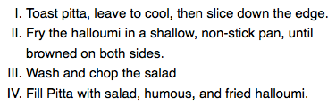
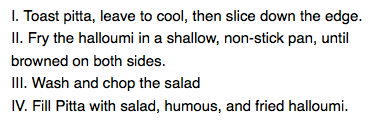
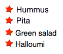

{{LearnSidebar}}{{PreviousMenuNext("Learn/CSS/Styling_text/Fundamentals", "Learn/CSS/Styling_text/Styling_links", "Learn/CSS/Styling_text")}}

[Lists](/en-US/docs/Learn/HTML/Introduction_to_HTML/HTML_text_fundamentals#lists) behave like any other text for the most part, but there are some CSS properties specific to lists that you need to know about, as well as some best practices to consider. This article explains all.

<table>
  <tbody>
    <tr>
      <th scope="row">Prerequisites:</th>
      <td>
        Basic computer literacy, HTML basics (study
        <a href="/en-US/docs/Learn/HTML/Introduction_to_HTML"
          >Introduction to HTML</a
        >), CSS basics (study
        <a href="/en-US/docs/Learn/CSS/First_steps">Introduction to CSS</a>),
        <a href="/en-US/docs/Learn/CSS/Styling_text/Fundamentals"
          >CSS text and font fundamentals</a
        >.
      </td>
    </tr>
    <tr>
      <th scope="row">Objective:</th>
      <td>
        To become familiar with the best practices and properties related to
        styling lists.
      </td>
    </tr>
  </tbody>
</table>

## A simple list example

To begin with, let's look at a simple list example. Throughout this article, we'll look at unordered, ordered, and description lists — all have styling features that are similar, as well as some that are particular to themselves. The unstyled example is [available on GitHub](https://mdn.github.io/learning-area/css/styling-text/styling-lists/unstyled-list.html) (check out the [source code](https://github.com/mdn/learning-area/blob/main/css/styling-text/styling-lists/unstyled-list.html) too.)

The HTML for our list example looks like so:

```html
<h2>Shopping (unordered) list</h2>

<p>
  Paragraph for reference, paragraph for reference, paragraph for reference,
  paragraph for reference, paragraph for reference, paragraph for reference.
</p>

<ul>
  <li>Hummus</li>
  <li>Pita</li>
  <li>Green salad</li>
  <li>Halloumi</li>
</ul>

<h2>Recipe (ordered) list</h2>

<p>
  Paragraph for reference, paragraph for reference, paragraph for reference,
  paragraph for reference, paragraph for reference, paragraph for reference.
</p>

<ol>
  <li>Toast pita, leave to cool, then slice down the edge.</li>
  <li>
    Fry the halloumi in a shallow, non-stick pan, until browned on both sides.
  </li>
  <li>Wash and chop the salad.</li>
  <li>Fill pita with salad, hummus, and fried halloumi.</li>
</ol>

<h2>Ingredient description list</h2>

<p>
  Paragraph for reference, paragraph for reference, paragraph for reference,
  paragraph for reference, paragraph for reference, paragraph for reference.
</p>

<dl>
  <dt>Hummus</dt>
  <dd>
    A thick dip/sauce generally made from chick peas blended with tahini, lemon
    juice, salt, garlic, and other ingredients.
  </dd>
  <dt>Pita</dt>
  <dd>A soft, slightly leavened flatbread.</dd>
  <dt>Halloumi</dt>
  <dd>
    A semi-hard, unripened, brined cheese with a higher-than-usual melting
    point, usually made from goat/sheep milk.
  </dd>
  <dt>Green salad</dt>
  <dd>That green healthy stuff that many of us just use to garnish kebabs.</dd>
</dl>
```

If you go to the live example now and investigate the list elements using [browser developer tools](/en-US/docs/Learn/Common_questions/Tools_and_setup/What_are_browser_developer_tools), you'll notice a couple of styling defaults:

- The {{htmlelement("ul")}} and {{htmlelement("ol")}} elements have a top and bottom {{cssxref("margin")}} of `16px` (`1em`) and a {{cssxref("padding-left")}} of `40px` (`2.5em`). If the directionality attribute [`dir`](/en-US/docs/Web/HTML/Global_attributes/dir) is set to right-to-left (`rtl`) for `ul` and `ol` elements, in that case {{cssxref("padding-right")}} comes into effect and its default value is `40px` (`2.5em`) .
- The list items ({{htmlelement("li")}} elements) have no set defaults for spacing.
- The {{htmlelement("dl")}} element has a top and bottom {{cssxref("margin")}} of `16px` (`1em`), but no padding set.
- The {{htmlelement("dd")}} elements have {{cssxref("margin-left")}} of `40px` (`2.5em`).
- The {{htmlelement("p")}} elements we've included for reference have a top and bottom {{cssxref("margin")}} of `16px` (`1em`) — the same as the different list types.

## Handling list spacing

When styling lists, you need to adjust their styles so they keep the same vertical spacing as their surrounding elements (such as paragraphs and images; sometimes called vertical rhythm), and the same horizontal spacing as each other (you can see the [finished styled example](https://mdn.github.io/learning-area/css/styling-text/styling-lists/) on GitHub, and [find the source code](https://github.com/mdn/learning-area/blob/main/css/styling-text/styling-lists/index.html) too).

The CSS used for the text styling and spacing is as follows:

```css
/* General styles */

html {
  font-family: Helvetica, Arial, sans-serif;
  font-size: 10px;
}

h2 {
  font-size: 2rem;
}

ul,
ol,
dl,
p {
  font-size: 1.5rem;
}

li,
p {
  line-height: 1.5;
}

/* Description list styles */

dd,
dt {
  line-height: 1.5;
}

dt {
  font-weight: bold;
}
```

- The first rule sets a sitewide font and a baseline font size of 10px. These are inherited by everything on the page.
- Rules 2 and 3 set relative font sizes for the headings, different list types (the children of the list elements inherit these), and paragraphs. This means that each paragraph and list will have the same font size and top and bottom spacing, helping to keep the vertical rhythm consistent.
- Rule 4 sets the same {{cssxref("line-height")}} on the paragraphs and list items — so the paragraphs and each individual list item will have the same spacing between lines. This will also help to keep the vertical rhythm consistent.
- Rules 5 and 6 apply to the description list. We set the same `line-height` on the description list terms and descriptions as we did with the paragraphs and list items. Again, consistency is good! We also make the description terms have bold font, so they visually stand out easier.

## List-specific styles

Now that we've looked at general spacing techniques for lists, let's explore some list-specific properties. There are three properties you should know about to start with, which can be set on {{htmlelement("ul")}} or {{htmlelement("ol")}} elements:

- {{cssxref("list-style-type")}}: Sets the type of bullets to use for the list, for example, square or circle bullets for an unordered list, or numbers, letters, or roman numerals for an ordered list.
- {{cssxref("list-style-position")}}: Sets whether the bullets, at the start of each item, appear inside or outside the lists.
- {{cssxref("list-style-image")}}: Allows you to use a custom image for the bullet, rather than a simple square or circle.

### Bullet styles

As mentioned above, the {{cssxref("list-style-type")}} property allows you to set what type of bullet to use for the bullet points. In our example, we've set the ordered list to use uppercase roman numerals with:

```css
ol {
  list-style-type: upper-roman;
}
```

This gives us the following look:



You can find a lot more options by checking out the {{cssxref("list-style-type")}} reference page.

### Bullet position

The {{cssxref("list-style-position")}} property sets whether the bullets appear inside the list items, or outside them before the start of each item. The default value is `outside`, which causes the bullets to sit outside the list items, as seen above.

If you set the value to `inside`, the bullets will sit inside the lines:

```css
ol {
  list-style-type: upper-roman;
  list-style-position: inside;
}
```



### Using a custom bullet image

The {{cssxref("list-style-image")}} property allows you to use a custom image for your bullet. The syntax is pretty simple:

```css
ul {
  list-style-image: url(star.svg);
}
```

However, this property is a bit limited in terms of controlling the position, size, etc. of the bullets. You are better off using the {{cssxref("background")}} family of properties, which you've learned in the [Backgrounds and borders](/en-US/docs/Learn/CSS/Building_blocks/Backgrounds_and_borders) article. For now, here's a taster!

In our finished example, we have styled the unordered list like so (on top of what you've already seen above):

```css
ul {
  padding-left: 2rem;
  list-style-type: none;
}

ul li {
  padding-left: 2rem;
  background-image: url(star.svg);
  background-position: 0 0;
  background-size: 1.6rem 1.6rem;
  background-repeat: no-repeat;
}
```

Here we've done the following:

- Set the {{cssxref("padding-left")}} of the {{htmlelement("ul")}} down from the default `40px` to `20px`, then set the same amount on the list items. This is so that, overall, the list items are still lined up with the ordered list items and the description list descriptions, but the list items have some padding for the background images to sit inside. If we didn't do this, the background images would overlap with the list item text, which would look messy.
- Set the {{cssxref("list-style-type")}} to `none`, so that no bullet appears by default. We're going to use {{cssxref("background")}} properties to handle the bullets instead.
- Inserted a bullet onto each unordered list item. The relevant properties are as follows:

  - {{cssxref("background-image")}}: This references the path to the image file you want to use as the bullet.
  - {{cssxref("background-position")}}: This defines where in the background of the selected element the image will appear — in this case we are saying `0 0`, which means the bullet will appear in the very top left of each list item.
  - {{cssxref("background-size")}}: This sets the size of the background image. We ideally want the bullets to be the same size as the list items (or very slightly smaller or larger). We are using a size of `1.6rem` (`16px`), which fits very nicely with the `20px` padding we've allowed for the bullet to sit inside — 16px plus 4px of space between the bullet and the list item text works well.
  - {{cssxref("background-repeat")}}: By default, background images repeat until they fill up the available background space. We only want one copy of the image inserted in each case, so we set this to a value of `no-repeat`.

This gives us the following result:



### list-style shorthand

The three properties mentioned above can all be set using a single shorthand property, {{cssxref("list-style")}}. For example, the following CSS:

```css
ul {
  list-style-type: square;
  list-style-image: url(example.png);
  list-style-position: inside;
}
```

Could be replaced by this:

```css
ul {
  list-style: square url(example.png) inside;
}
```

The values can be listed in any order, and you can use one, two, or all three (the default values used for the properties that are not included are `disc`, `none`, and `outside`). If both a `type` and an `image` are specified, the type is used as a fallback if the image can't be loaded for some reason.

## Controlling list counting

Sometimes you might want to count differently on an ordered list — e.g., starting from a number other than 1, or counting backwards, or counting in steps of more than 1. HTML and CSS have some tools to help you here.

### start

The [`start`](/en-US/docs/Web/HTML/Element/ol#start) attribute allows you to start the list counting from a number other than 1. The following example:

```html
<ol start="4">
  <li>Toast pita, leave to cool, then slice down the edge.</li>
  <li>
    Fry the halloumi in a shallow, non-stick pan, until browned on both sides.
  </li>
  <li>Wash and chop the salad.</li>
  <li>Fill pita with salad, hummus, and fried halloumi.</li>
</ol>
```

Gives you this output:

{{ EmbedLiveSample('start', '100%', 150) }}

### reversed

The [`reversed`](/en-US/docs/Web/HTML/Element/ol#reversed) attribute will start the list counting down instead of up. The following example:

```html
<ol start="4" reversed>
  <li>Toast pita, leave to cool, then slice down the edge.</li>
  <li>
    Fry the halloumi in a shallow, non-stick pan, until browned on both sides.
  </li>
  <li>Wash and chop the salad.</li>
  <li>Fill pita with salad, hummus, and fried halloumi.</li>
</ol>
```

Gives you this output:

{{ EmbedLiveSample('reversed', '100%', 150) }}

> **Note:** If there are more list items in a reversed list than the value of the `start` attribute, the count will continue to zero and then into negative values.

### value

The [`value`](/en-US/docs/Web/HTML/Element/li#value) attribute allows you to set your list items to specific numerical values. The following example:

```html
<ol>
  <li value="2">Toast pita, leave to cool, then slice down the edge.</li>
  <li value="4">
    Fry the halloumi in a shallow, non-stick pan, until browned on both sides.
  </li>
  <li value="6">Wash and chop the salad.</li>
  <li value="8">Fill pita with salad, hummus, and fried halloumi.</li>
</ol>
```

Gives you this output:

{{ EmbedLiveSample('value', '100%', 150) }}

> **Note:** Even if you are using a non-number {{cssxref("list-style-type")}}, you still need to use the equivalent numerical values in the `value` attribute.

## Active learning: Styling a nested list

In this active learning session, we want you to take what you've learned above and have a go at styling a nested list. We've provided you with the HTML, and we want you to:

1. Give the unordered list square bullets.
2. Give the unordered list items and the ordered list items a line-height of 1.5 of their font-size.
3. Give the ordered list lower alphabetical bullets.
4. Feel free to play with the list example as much as you like, experimenting with bullet types, spacing, or whatever else you can find.

If you make a mistake, you can always reset it using the _Reset_ button. If you get really stuck, press the _Show solution_ button to see a potential answer.

```html hidden
<div
  class="body-wrapper"
  style="font-family: 'Open Sans Light',Helvetica,Arial,sans-serif;">
  <h2>HTML Input</h2>
  <textarea
    id="code"
    class="html-input"
    style="width: 90%;height: 10em;padding: 10px;border: 1px solid #0095dd;">
<ul>
  <li>First, light the candle.</li>
  <li>Next, open the box.</li>
  <li>Finally, place the three magic items in the box, in this exact order, to complete the spell:
    <ol>
      <li>The book of spells</li>
      <li>The shiny rod</li>
      <li>The goblin statue</li>
    </ol>
  </li>
</ul>
  </textarea>

  <h2>CSS Input</h2>
  <textarea
    id="code"
    class="css-input"
    style="width: 90%;height: 10em;padding: 10px;border: 1px solid #0095dd;"></textarea>

  <h2>Output</h2>
  <div
    class="output"
    style="width: 90%;height: 12em;padding: 10px;border: 1px solid #0095dd;overflow: auto;"></div>
  <div class="controls">
    <input
      id="reset"
      type="button"
      value="Reset"
      style="margin: 10px 10px 0 0;" />
    <input
      id="solution"
      type="button"
      value="Show solution"
      style="margin: 10px 0 0 10px;" />
  </div>
</div>
```

```js hidden
const htmlInput = document.querySelector(".html-input");
const cssInput = document.querySelector(".css-input");
const reset = document.getElementById("reset");
const htmlCode = htmlInput.value;
const cssCode = cssInput.value;
const output = document.querySelector(".output");
const solution = document.getElementById("solution");

const styleElem = document.createElement("style");
const headElem = document.querySelector("head");
headElem.appendChild(styleElem);

function drawOutput() {
  output.innerHTML = htmlInput.value;
  styleElem.textContent = cssInput.value;
}

reset.addEventListener("click", () => {
  htmlInput.value = htmlCode;
  cssInput.value = cssCode;
  drawOutput();
});

solution.addEventListener("click", () => {
  htmlInput.value = htmlCode;
  cssInput.value = `ul {
  list-style-type: square;
}

ul li,
ol li {
  line-height: 1.5;
}

ol {
  list-style-type: lower-alpha;
}`;
  drawOutput();
});

htmlInput.addEventListener("input", drawOutput);
cssInput.addEventListener("input", drawOutput);
window.addEventListener("load", drawOutput);
```

{{ EmbedLiveSample('Active_learning_Styling_a_nested_list', 700, 800) }}

## Summary

Lists are relatively easy to get the hang of styling once you know a few associated basic principles and specific properties. In the next article, we'll move on to [link styling techniques](/en-US/docs/Learn/CSS/Styling_text/Styling_links).

## See also

CSS counters provide advanced tools for customizing list counting and styling, but they are quite complex. We recommend looking into these if you want to stretch yourself. See:

- {{cssxref("@counter-style")}}
- {{cssxref("counter-increment")}}
- {{cssxref("counter-reset")}}

{{PreviousMenuNext("Learn/CSS/Styling_text/Fundamentals", "Learn/CSS/Styling_text/Styling_links", "Learn/CSS/Styling_text")}}
