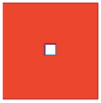

{{LearnSidebar}}{{PreviousMenuNext("Learn/Forms/Styling_web_forms", "Learn/Forms/UI_pseudo-classes", "Learn/Forms")}}

In this article, we will see what can be done with CSS to style the types of form control that are more difficult to style — the "bad" and "ugly" categories. As we saw [in the previous article](/en-US/docs/Learn/Forms/Styling_web_forms), text fields and buttons are perfectly easy to style; now we will dig into styling the more problematic bits.

<table>
  <tbody>
    <tr>
      <th scope="row">Prerequisites:</th>
      <td>
        A basic understanding of
        <a href="/en-US/docs/Learn/HTML/Introduction_to_HTML">HTML</a> and
        <a href="/en-US/docs/Learn/CSS/First_steps">CSS</a>.
      </td>
    </tr>
    <tr>
      <th scope="row">Objective:</th>
      <td>
        To understand what parts of forms are hard to style, and why; to learn
        what can be done to customize them.
      </td>
    </tr>
  </tbody>
</table>

To recap what we said in the previous article, we have:

**The bad**: Some elements are more difficult to style, requiring more complex CSS or some more specific tricks:

- Checkboxes and radio buttons
- [`<input type="search">`](/en-US/docs/Web/HTML/Element/input/search)

**The ugly**: Some elements can't be styled thoroughly using CSS. These include:

- Elements involved in creating dropdown widgets, including {{HTMLElement("select")}}, {{HTMLElement("option")}}, {{HTMLElement("optgroup")}} and {{HTMLElement("datalist")}}.
- [`<input type="color">`](/en-US/docs/Web/HTML/Element/input/color)
- Date-related controls such as [`<input type="datetime-local">`](/en-US/docs/Web/HTML/Element/input/datetime-local)
- [`<input type="range">`](/en-US/docs/Web/HTML/Element/input/range)
- [`<input type="file">`](/en-US/docs/Web/HTML/Element/input/file)
- {{HTMLElement("progress")}} and {{HTMLElement("meter")}}

Let's first talk about the [`appearance`](/en-US/docs/Web/CSS/appearance) property, which is pretty useful for making all of the above more stylable.

## appearance: controlling OS-level styling

In the previous article we said that historically, the styling of web form controls was largely taken from the underlying operating system, which is part of the problem with customizing the look of these controls.

The {{cssxref("appearance")}} property was created as a way to control what OS- or system-level styling was applied to web form controls. By far the most helpful value, and probably the only one you'll use, is `none`. This stops any control you apply it to from using system-level styling, as much as possible, and lets you build up the styles yourself using CSS.

For example, let's take the following controls:

```html
<form>
  <p>
    <label for="search">search: </label>
    <input id="search" name="search" type="search" />
  </p>
  <p>
    <label for="text">text: </label>
    <input id="text" name="text" type="text" />
  </p>
  <p>
    <label for="date">date: </label>
    <input id="date" name="date" type="datetime-local" />
  </p>
  <p>
    <label for="radio">radio: </label>
    <input id="radio" name="radio" type="radio" />
  </p>
  <p>
    <label for="checkbox">checkbox: </label>
    <input id="checkbox" name="checkbox" type="checkbox" />
  </p>
  <p><input type="submit" value="submit" /></p>
  <p><input type="button" value="button" /></p>
</form>
```

Applying the following CSS to them removes system-level styling.

```css
input {
  appearance: none;
}
```

The following live example shows you what they look like in your system — default on the left, and with the above CSS applied on the right ([find it here also](https://mdn.github.io/learning-area/html/forms/styling-examples/appearance-tester.html) if you want to test it on other systems).

{{EmbedGHLiveSample("learning-area/html/forms/styling-examples/appearance-tester.html", '100%', 400)}}

In most cases, the effect is to remove the stylized border, which makes CSS styling a bit easier, but isn't really essential. In a couple of cases — search and radio buttons/checkboxes, it becomes way more useful. We'll look at those now.

### Taming search boxes

[`<input type="search">`](/en-US/docs/Web/HTML/Element/input/search) is basically just a text input, so why is `appearance: none;` useful here? The answer is that Safari search boxes have some styling restrictions — you can't adjust their `height` or `font-size` freely, for example.

This can be fixed using our friend `appearance: none;`, which disables the default appearance:

```css
input[type="search"] {
  appearance: none;
}
```

In the example below, you can see two identical styled search boxes. The right one has `appearance: none;` applied, and the left one doesn't. If you look at it in Safari on macOS you'll see that the left one isn't sized properly.

{{EmbedGHLiveSample("learning-area/html/forms/styling-examples/search-appearance.html", '100%', 200)}}

Interestingly, setting border/background on the search field also fixes this problem. The following styled search doesn't have `appearance: none;` applied, but it doesn't suffer from the same problem in Safari as the previous example.

{{EmbedGHLiveSample("learning-area/html/forms/styling-examples/styled-search.html", '100%', 200)}}

> **Note:** You may have noticed that in the search field, the "x" delete icon, which appears when the value of the search is not null, disappears when the input loses focus in Edge and Chrome, but stays put in Safari. To remove via CSS, you can use `input[type="search"]:not(:focus, :active)::-webkit-search-cancel-button { display: none; }`.

### Styling checkboxes and radio buttons

Styling a checkbox or a radio button is tricky by default. The sizes of checkboxes and radio buttons are not meant to be changed with their default designs, and browsers react very differently when you try.

For example, consider this simple test case:

```html
<label
  ><span><input type="checkbox" name="q5" value="true" /></span> True</label
>
<label
  ><span><input type="checkbox" name="q5" value="false" /></span> False</label
>
```

```css
span {
  display: inline-block;
  background: red;
}

input[type="checkbox"] {
  width: 100px;
  height: 100px;
}
```

Different browsers handle the checkbox and span differently, often ugly ways:

| Browser                             | Rendering                                                                                              |
| ----------------------------------- | ------------------------------------------------------------------------------------------------------ |
| Firefox 71 (macOS)                  |                                  |
| Firefox 57 (Windows 10)             |                        |
| Chrome 77 (macOS), Safari 13, Opera |                                  |
| Chrome 63 (Windows 10)              |  |
| Edge 16 (Windows 10)                |            |

#### Using appearance: none on radios/checkboxes

As we showed before, you can remove the default appearance of a checkbox or radio button altogether with {{cssxref('appearance')}}`:none;`. Let's take this example HTML:

```html
<form>
  <fieldset>
    <legend>Fruit preferences</legend>

    <p>
      <label>
        <input type="checkbox" name="fruit" value="cherry" />
        I like cherry
      </label>
    </p>
    <p>
      <label>
        <input type="checkbox" name="fruit" value="banana" disabled />
        I can't like banana
      </label>
    </p>
    <p>
      <label>
        <input type="checkbox" name="fruit" value="strawberry" />
        I like strawberry
      </label>
    </p>
  </fieldset>
</form>
```

Now, let's style these with a custom checkbox design. Let's start by unstyling the original check boxes:

```css
input[type="checkbox"] {
  appearance: none;
}
```

We can use the {{cssxref(":checked")}} and {{cssxref(":disabled")}} pseudo-classes to change the appearance of our custom checkbox as its state changes:

```css
input[type="checkbox"] {
  position: relative;
  width: 1em;
  height: 1em;
  border: 1px solid gray;
  /* Adjusts the position of the checkboxes on the text baseline */
  vertical-align: -2px;
  /* Set here so that Windows' High-Contrast Mode can override */
  color: green;
}

input[type="checkbox"]::before {
  content: "✔";
  position: absolute;
  font-size: 1.2em;
  right: -1px;
  top: -0.3em;
  visibility: hidden;
}

input[type="checkbox"]:checked::before {
  /* Use `visibility` instead of `display` to avoid recalculating layout */
  visibility: visible;
}

input[type="checkbox"]:disabled {
  border-color: black;
  background: #ddd;
  color: gray;
}
```

You'll find out more about such pseudo-classes and more in the [next article](/en-US/docs/Learn/Forms/UI_pseudo-classes); the above ones do the following:

- `:checked` — the checkbox (or radio button) is in a checked state — the user has clicked/activated it.
- `:disabled` — the checkbox (or radio button) is in a disabled state — it cannot be interacted with.

You can see the live result:

{{EmbedGHLiveSample("learning-area/html/forms/styling-examples/checkboxes-styled.html", '100%', 200)}}

We've also created a couple of other examples to give you more ideas:

- [Styled radio buttons](https://mdn.github.io/learning-area/html/forms/styling-examples/radios-styled.html): Custom radio button styling.
- [Toggle switch example](https://mdn.github.io/learning-area/html/forms/toggle-switch-example/): A checkbox styled to look like a toggle switch.

If you view these checkboxes in a browser that doesn't support {{cssxref("appearance")}}, your custom design will be lost, but they will still look like checkboxes and be usable.

## What can be done about the "ugly" elements?

Now let's turn our attention to the "ugly" controls — the ones that are really hard to thoroughly style. In short, these are drop-down boxes, complex control types like [`color`](/en-US/docs/Web/HTML/Element/input/color) and [`datetime-local`](/en-US/docs/Web/HTML/Element/input/datetime-local), and feedback—oriented controls like {{HTMLElement("progress")}} and {{HTMLElement("meter")}}.

The problem is that these elements have very different default looks across browsers, and while you can style them in some ways, some parts of their internals are literally impossible to style.

If you are prepared to live with some differences in look and feel, you can get away with some simple styling to make sizing consistent, uniform styling of things like background-colors, and usage of appearance to get rid of some system-level styling.

Take the following example, which shows a number of the "ugly" form features in action:

{{EmbedGHLiveSample("learning-area/html/forms/styling-examples/ugly-controls.html", '100%', 750)}}

This example has the following CSS applied to it:

```css
body {
  font-family: "Josefin Sans", sans-serif;
  margin: 20px auto;
  max-width: 400px;
}

form > div {
  margin-bottom: 20px;
}

select {
  appearance: none;
  width: 100%;
  height: 100%;
}

.select-wrapper {
  position: relative;
}

.select-wrapper::after {
  content: "▼";
  font-size: 1rem;
  top: 3px;
  right: 10px;
  position: absolute;
}

button,
label,
input,
select,
progress,
meter {
  display: block;
  font-family: inherit;
  font-size: 100%;
  margin: 0;
  box-sizing: border-box;
  width: 100%;
  padding: 5px;
  height: 30px;
}

input[type="text"],
input[type="datetime-local"],
input[type="color"],
select {
  box-shadow: inset 1px 1px 3px #ccc;
  border-radius: 5px;
}

label {
  margin-bottom: 5px;
}

button {
  width: 60%;
  margin: 0 auto;
}
```

> **Note:** If you want to test these examples across a number of browsers simultaneously, you can [find it live here](https://mdn.github.io/learning-area/html/forms/styling-examples/ugly-controls.html) (also [see here for the source code](https://github.com/mdn/learning-area/blob/main/html/forms/styling-examples/ugly-controls.html)).
>
> Also bear in mind that we've added some JavaScript to the page that lists the files selected by the file picker, below the control itself. This is a simplified version of the example found on the [`<input type="file">`](/en-US/docs/Web/HTML/Element/input/file#examples) reference page.

As you can see, we've done fairly well at getting these to look uniform across modern browsers.

We've applied some global normalizing CSS to all the controls and their labels, to get them to size in the same way, adopt their parent font, etc., as mentioned in the previous article:

```css
button,
label,
input,
select,
progress,
meter {
  display: block;
  font-family: inherit;
  font-size: 100%;
  margin: 0;
  box-sizing: border-box;
  width: 100%;
  padding: 5px;
  height: 30px;
}
```

We also added some uniform shadow and rounded corners to the controls on which it made sense:

```css
input[type="text"],
input[type="datetime-local"],
input[type="color"],
select {
  box-shadow: inset 1px 1px 3px #ccc;
  border-radius: 5px;
}
```

On other controls like range types, progress bars, and meters they just add an ugly box around the control area, so it doesn't make sense.

Let's talk about some specifics of each of these types of control, highlighting difficulties along the way.

### Selects and datalists

In modern browsers, selects and datalists are generally not too bad to style provided you don't want to vary the look and feel too much from the defaults.

We've managed to get the basic look of the boxes looking pretty uniform and consistent. The datalist control is `<input type="text">` anyway, so we knew this wouldn't be a problem.

Two things are slightly more problematic. First of all, the select's "arrow" icon that indicates it is a dropdown differs across browsers. It also tends to change if you increase the size of the select box, or resize in an ugly fashion. To fix this in our example we first used our old friend `appearance: none` to get rid of the icon altogether:

```css
select {
  appearance: none;
}
```

We then created our own icon using generated content. We put an extra wrapper around the control, because [`::before`](/en-US/docs/Web/CSS/::before)/[`::after`](/en-US/docs/Web/CSS/::after) don't work on `<select>` elements (because their content is fully controlled by the browser):

```html
<label for="select">Select a fruit</label>
<div class="select-wrapper">
  <select id="select" name="select">
    <option>Banana</option>
    <option>Cherry</option>
    <option>Lemon</option>
  </select>
</div>
```

We then use generated content to generate a little down arrow, and put it in the right place using positioning:

```css
.select-wrapper {
  position: relative;
}

.select-wrapper::after {
  content: "▼";
  font-size: 1rem;
  top: 6px;
  right: 10px;
  position: absolute;
}
```

The second, slightly more important issue is that you don't have control over the box that appears containing the options when you click on the `<select>` box to open it. You can inherit the font set on the parent, but you won't be able to set things like spacing and colors. The same is true for the autocomplete list that appears with {{HTMLElement("datalist")}}.

If you really need full control over the option styling, you'll have to either use some kind of library to generate a custom control, or build your own custom control, or in the case of select use the `multiple` attribute, which makes all the options appear on the page, sidestepping this particular problem:

```html
<label for="select">Select fruits</label>
<select id="select" name="select" multiple>
  …
</select>
```

Of course, this might also not fit in with the design you are going for, but it's worth noting!

### Date input types

The date/time input types ([`datetime-local`](/en-US/docs/Web/HTML/Element/input/datetime-local), [`time`](/en-US/docs/Web/HTML/Element/input/time), [`week`](/en-US/docs/Web/HTML/Element/input/week), [`month`](/en-US/docs/Web/HTML/Element/input/month)) all have the same major associated issue. The actual containing box is as easy to style as any text input, and what we've got in this demo looks fine.

However, the internal parts of the control (e.g. the popup calendar that you use to pick a date, the spinner that you can use to increment/decrement values) are not stylable at all, and you can't get rid of them using `appearance: none;`. If you really need full control over the styling, you'll have to either use some kind of library to generate a custom control, or build your own.

> **Note:** It is worth mentioning [`<input type="number">`](/en-US/docs/Web/HTML/Element/input/number) here too — this also has a spinner that you can use to increment/decrement values, so potentially suffers from the same problem. However, in the case of the `number` type the data being collected is simpler, and it is easy to just use a `tel` input type instead which has the appearance of `text`, but displays the numeric keypad in devices with touch keyboards.

### Range input types

[`<input type="range">`](/en-US/docs/Web/HTML/Element/input/range) is annoying to style. You can use something like the following to remove the default slider track completely and replace it with a custom style (a thin red track, in this case):

```css
input[type="range"] {
  appearance: none;
  background: red;
  height: 2px;
  padding: 0;
  outline: 1px solid transparent;
}
```

However, it is very difficult to customize the style of the range control's drag handle — to get full control over range styling you'll need to use a whole bunch of complex CSS code, including multiple non-standard, browser-specific pseudo-elements. Check out [Styling Cross-Browser Compatible Range Inputs with CSS](https://css-tricks.com/styling-cross-browser-compatible-range-inputs-css/) on CSS tricks for a detailed write-up of what's needed.

### Color input types

Input controls of type color are not too bad. In supporting browsers, they tend to just give you a block of solid color with a small border.

You can remove the border, just leaving the block of color, using something like this:

```css
input[type="color"] {
  border: 0;
  padding: 0;
}
```

However, a custom solution is the only way to get anything significantly different.

### File input types

Inputs of type file are generally OK — as you saw in our example, it is fairly easy to create something that fits in OK with the rest of the page — the output line that is part of the control will inherit the parent font if you tell the input to do so, and you can style the custom list of file names and sizes in any way you want; we created it after all.

The only problem with file pickers is that the button provided that you press to open the file picker is completely unstylable — it can't be sized or colored, and it won't even accept a different font.

One way around this is to take advantage of the fact that if you have a label associated with a form control, clicking the label will activate the control. So you could hide the actual form input using something like this:

```css
input[type="file"] {
  height: 0;
  padding: 0;
  opacity: 0;
}
```

And then style the label to act like a button, which when pressed will open the file picker as expected:

```css
label[for="file"] {
  box-shadow: 1px 1px 3px #ccc;
  background: linear-gradient(to bottom, #eee, #ccc);
  border: 1px solid rgb(169, 169, 169);
  border-radius: 5px;
  text-align: center;
  line-height: 1.5;
}

label[for="file"]:hover {
  background: linear-gradient(to bottom, #fff, #ddd);
}

label[for="file"]:active {
  box-shadow: inset 1px 1px 3px #ccc;
}
```

You can see the result of the above CSS styling in the below live example (see also [styled-file-picker.html](https://mdn.github.io/learning-area/html/forms/styling-examples/styled-file-picker.html) live, and the [source code](https://github.com/mdn/learning-area/blob/main/html/forms/styling-examples/styled-file-picker.html)).

{{EmbedGHLiveSample("learning-area/html/forms/styling-examples/styled-file-picker.html", '100%', 200)}}

### Meters and progress bars

[`<meter>`](/en-US/docs/Web/HTML/Element/meter) and [`<progress>`](/en-US/docs/Web/HTML/Element/progress) are possibly the worst of the lot. As you saw in the earlier example, we can set them to the desired width relatively accurately. But beyond that, they are really difficult to style in any way. They don't handle height settings consistently between each other and between browsers, you can color the background, but not the foreground bar, and setting `appearance: none` on them makes things worse, not better.

It is easier to just create your own custom solution for these features, if you want to be able to control the styling, or use a third-party solution such as [progressbar.js](https://kimmobrunfeldt.github.io/progressbar.js/#examples).

The article [How to build custom form controls](/en-US/docs/Learn/Forms/How_to_build_custom_form_controls) provides an example of how to build a custom designed select with HTML, CSS, and JavaScript.

## Summary

While there are still difficulties using CSS with HTML forms, there are ways to get around many of the problems. There are no clean, universal solutions, but modern browsers offer new possibilities. For now, the best solution is to learn more about the way the different browsers support CSS when applied to HTML form controls.

In the next article of this module, we will explore the different [UI pseudo-classes](/en-US/docs/Learn/Forms/UI_pseudo-classes) available to us in modern browsers for styling forms in different states.

{{PreviousMenuNext("Learn/Forms/Styling_web_forms", "Learn/Forms/UI_pseudo-classes", "Learn/Forms")}}

### Advanced Topics

- [How to build custom form controls](/en-US/docs/Learn/Forms/How_to_build_custom_form_controls)
- [Sending forms through JavaScript](/en-US/docs/Learn/Forms/Sending_forms_through_JavaScript)
- [Property compatibility table for form widgets](/en-US/docs/Learn/Forms/Property_compatibility_table_for_form_controls)
