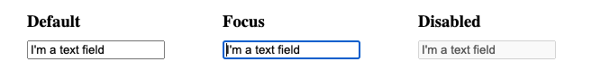
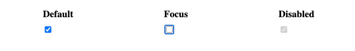
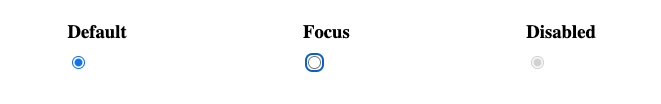
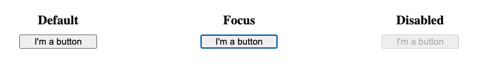
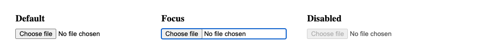

{{LearnSidebar}}{{PreviousMenuNext("Learn/Forms/How_to_structure_a_web_form", "Learn/Forms/HTML5_input_types", "Learn/Forms")}}

In the [previous article](/en-US/docs/Learn/Forms/How_to_structure_a_web_form), we marked up a functional web form example, introducing some form controls and common structural elements, and focusing on accessibility best practices. Next, we will look at the functionality of the different form controls, or widgets, in detail — studying all the different options available to collect different types of data. In this particular article, we will look at the original set of form controls, available in all browsers since the early days of the web.

<table>
  <tbody>
    <tr>
      <th scope="row">Prerequisites:</th>
      <td>
        A basic
        <a href="/en-US/docs/Learn/HTML/Introduction_to_HTML"
          >understanding of HTML</a
        >.
      </td>
    </tr>
    <tr>
      <th scope="row">Objective:</th>
      <td>
        To understand in detail the original set of native form widgets
        available in browsers for collecting data, and how to implement them
        using HTML.
      </td>
    </tr>
  </tbody>
</table>

You've already met some form elements, including {{HTMLelement('form')}}, {{HTMLelement('fieldset')}}, {{HTMLelement('legend')}}, {{HTMLelement('textarea')}}, {{HTMLelement('label')}}, {{HTMLelement('button')}}, and {{HTMLelement('input')}}. This article covers:

- The common input types {{HTMLelement('input/button', 'button')}}, {{HTMLelement('input/checkbox', 'checkbox')}}, {{HTMLelement('input/file', 'file')}}, {{HTMLelement('input/hidden', 'hidden')}}, {{HTMLelement('input/image', 'image')}}, {{HTMLelement('input/password', 'password')}}, {{HTMLelement('input/radio', 'radio')}}, {{HTMLelement('input/reset', 'reset')}}, {{HTMLelement('input/submit', 'submit')}}, and {{HTMLelement('input/text', 'text')}}.
- Some of the attributes that are common to all form controls.

> **Note:** We cover additional, more powerful form controls in the next two articles. If you want a more advanced reference, you should consult our [HTML forms element reference](/en-US/docs/Web/HTML/Element#forms), and in particular our extensive [`<input>` types](/en-US/docs/Web/HTML/Element/input) reference.

## Text input fields

Text {{htmlelement("input")}} fields are the most basic form widgets. They are a very convenient way to let the user enter any kind of data, and we've already seen a few simple examples.

> **Note:** HTML form text fields are simple plain text input controls. This means that you cannot use them to perform rich text editing (bold, italic, etc.). All rich text editors you'll encounter are custom widgets created with HTML, CSS, and JavaScript.

All basic text controls share some common behaviors:

- They can be marked as [`readonly`](/en-US/docs/Web/HTML/Element/input#readonly) (the user cannot modify the input value but it is still sent with the rest of the form data) or [`disabled`](/en-US/docs/Web/HTML/Element/input#disabled) (the input value can't be modified and is never sent with the rest of the form data).
- They can have a [`placeholder`](/en-US/docs/Web/HTML/Element/input#placeholder); this is the text that appears inside the text input box that should be used to briefly describe the purpose of the box.
- They can be constrained in [`size`](/en-US/docs/Web/HTML/Attributes/size) (the physical size of the box) and [`maxlength`](/en-US/docs/Web/HTML/Attributes/maxlength) (the maximum number of characters that can be entered into the box).
- They can benefit from spell checking (using the [`spellcheck`](/en-US/docs/Web/HTML/Global_attributes/spellcheck) attribute), if the browser supports it.

> **Note:** The {{htmlelement("input")}} element is unique amongst HTML elements because it can take many forms depending on its [`type`](/en-US/docs/Web/HTML/Element/input#type) attribute value. It is used for creating most types of form widgets including single line text fields, time and date controls, controls without text input like checkboxes, radio buttons, and color pickers, and buttons.

### Single line text fields

A single line text field is created using an {{HTMLElement("input")}} element whose [`type`](/en-US/docs/Web/HTML/Element/input#type) attribute value is set to `text`, or by omitting the [`type`](/en-US/docs/Web/HTML/Element/input#type) attribute altogether (`text` is the default value). The value `text` for this attribute is also the fallback value if the value you specify for the [`type`](/en-US/docs/Web/HTML/Element/input#type) attribute is unknown by the browser (for example if you specify `type="color"` and the browser doesn't support native color pickers).

> **Note:** You can find examples of all the single line text field types on GitHub at [single-line-text-fields.html](https://github.com/mdn/learning-area/blob/main/html/forms/native-form-widgets/single-line-text-fields.html) ([see it live also](https://mdn.github.io/learning-area/html/forms/native-form-widgets/single-line-text-fields.html)).

Here is a basic single line text field example:

```html
<input type="text" id="comment" name="comment" value="I'm a text field" />
```

Single line text fields have only one true constraint: if you type text with line breaks, the browser removes those line breaks before sending the data to the server.

The screenshot below shows a text input in default, focused, and disabled states. Most browsers indicate the focused state using a focus ring around the control and the disabled state using grey text or a faded/semi-opaque control.



The screenshots used in this document were taken in the Chrome browser on macOS. There may be minor variations in these fields/buttons across different browsers, but the basic highlighting technique remains similar.

> **Note:** We discuss values for the [`type`](/en-US/docs/Web/HTML/Element/input#type) attribute that enforce specific validation constraints including color, email, and url input types, in the next article, [The HTML5 input types](/en-US/docs/Learn/Forms/HTML5_input_types).

#### Password field

One of the original input types was the `password` text field type:

```html
<input type="password" id="pwd" name="pwd" />
```

The following screenshot shows Password input field in which each input character is shown as a dot.


The `password` value doesn't add any special constraints to the entered text, but it does obscure the value entered into the field (e.g. with dots or asterisks) so it can't be easily read by others.

Keep in mind this is just a user interface feature; unless you submit your form securely, it will get sent in plain text, which is bad for security — a malicious party could intercept your data and steal passwords, credit card details, or whatever else you've submitted. The best way to protect users from this is to host any pages involving forms over a secure connection (i.e. located at an `https://` address), so the data is encrypted before it is sent.

Browsers recognize the security implications of sending form data over an insecure connection, and have warnings to deter users from using insecure forms. For more information on what Firefox implements, see [Insecure passwords](/en-US/docs/Web/Security/Insecure_passwords).

### Hidden content

Another original text control is the `hidden` input type. This is used to create a form control that is invisible to the user, but is still sent to the server along with the rest of the form data once submitted — for example you might want to submit a timestamp to the server stating when an order was placed. Because it is hidden, the user can not see nor intentionally edit the value, it will never receive focus, and a screen reader will not notice it either.

```html
<input type="hidden" id="timestamp" name="timestamp" value="1286705410" />
```

If you create such an element, it's required to set its `name` and `value` attributes. The value can be dynamically set via JavaScript. The `hidden` input type should not have an associated label.

Other text input types, like {{HTMLElement("input/search", "search")}}, {{HTMLElement("input/url", "url")}}, and {{HTMLElement("input/tel", "tel")}}, will be covered in the next tutorial, [HTML5 input types](/en-US/docs/Learn/Forms/HTML5_input_types).

## Checkable items: checkboxes and radio buttons

Checkable items are controls whose state you can change by clicking on them or their associated labels. There are two kinds of checkable items: the checkbox and the radio button. Both use the [`checked`](/en-US/docs/Web/HTML/Element/input/checkbox#checked) attribute to indicate whether the widget is checked by default or not.

It's worth noting that these widgets do not behave exactly like other form widgets. For most form widgets, once the form is submitted all widgets that have a [`name`](/en-US/docs/Web/HTML/Element/input#name) attribute are sent, even if no value has been filled out. In the case of checkable items, their values are sent only if they are checked. If they are not checked, nothing is sent, not even their name. If they are checked but have no value, the name is sent with a value of _on._

> **Note:** You can find the examples from this section on GitHub as [checkable-items.html](https://github.com/mdn/learning-area/blob/main/html/forms/native-form-widgets/checkable-items.html) ([see it live also](https://mdn.github.io/learning-area/html/forms/native-form-widgets/checkable-items.html)).

For maximum usability/accessibility, you are advised to surround each list of related items in a {{htmlelement("fieldset")}}, with a {{htmlelement("legend")}} providing an overall description of the list. Each individual pair of {{htmlelement("label")}}/{{htmlelement("input")}} elements should be contained in its own list item (or similar). The associated {{htmlelement('label')}} is generally placed immediately before or after the radio button or checkbox, with the instructions for the group of radio button or checkboxes generally being the content of the {{htmlelement("legend")}}. See the examples linked above for structural examples.

### Checkbox

A checkbox is created using the {{HTMLElement("input")}} element with a [`type`](/en-US/docs/Web/HTML/Element/input#type) attribute set to the value {{HTMLElement("input/checkbox", "checkbox")}}.

```html
<input type="checkbox" id="questionOne" name="subscribe" value="yes" checked />
```

Related checkbox items should use the same [`name`](/en-US/docs/Web/HTML/Element/input#name) attribute. Including the [`checked`](/en-US/docs/Web/HTML/Element/input/checkbox#checked) attribute makes the checkbox checked automatically when the page loads. Clicking the checkbox or its associated label toggles the checkbox on and off.

```html
<fieldset>
  <legend>Choose all the vegetables you like to eat</legend>
  <ul>
    <li>
      <label for="carrots">Carrots</label>
      <input
        type="checkbox"
        id="carrots"
        name="vegetable"
        value="carrots"
        checked />
    </li>
    <li>
      <label for="peas">Peas</label>
      <input type="checkbox" id="peas" name="vegetable" value="peas" />
    </li>
    <li>
      <label for="cabbage">Cabbage</label>
      <input type="checkbox" id="cabbage" name="vegetable" value="cabbage" />
    </li>
  </ul>
</fieldset>
```

The following screenshot shows checkboxes in the default, focused, and disabled states. Checkboxes in the default and disabled states appear checked, whereas in the focused state, the checkbox is unchecked, with focus ring around it.



> **Note:** Any checkboxes and radio buttons with the [`checked`](/en-US/docs/Web/HTML/Element/input/checkbox#checked) attribute on load match the {{cssxref(':default')}} pseudo-class, even if they are no longer checked. Any that are currently checked match the {{cssxref(':checked')}} pseudo-class.

Due to the on-off nature of checkboxes, the checkbox is considered a toggle button, with many developers and designers expanding on the default checkbox styling to create buttons that look like toggle switches. You can [see an example in action here](https://mdn.github.io/learning-area/html/forms/toggle-switch-example/) (also see the [source code](https://github.com/mdn/learning-area/blob/main/html/forms/toggle-switch-example/index.html)).

### Radio button

A radio button is created using the {{HTMLElement("input")}} element with its [`type`](/en-US/docs/Web/HTML/Element/input#type) attribute set to the value `radio`:

```html
<input type="radio" id="soup" name="meal" value="soup" checked />
```

Several radio buttons can be tied together. If they share the same value for their [`name`](/en-US/docs/Web/HTML/Element/input#name) attribute, they will be considered to be in the same group of buttons. Only one button in a given group may be checked at a time; this means that when one of them is checked all the others automatically get unchecked. When the form is sent, only the value of the checked radio button is sent. If none of them are checked, the whole pool of radio buttons is considered to be in an unknown state and no value is sent with the form. Once one of the radio buttons in a same-named group of buttons is checked, it is not possible for the user to uncheck all the buttons without resetting the form.

```html
<fieldset>
  <legend>What is your favorite meal?</legend>
  <ul>
    <li>
      <label for="soup">Soup</label>
      <input type="radio" id="soup" name="meal" value="soup" checked />
    </li>
    <li>
      <label for="curry">Curry</label>
      <input type="radio" id="curry" name="meal" value="curry" />
    </li>
    <li>
      <label for="pizza">Pizza</label>
      <input type="radio" id="pizza" name="meal" value="pizza" />
    </li>
  </ul>
</fieldset>
```

The following screenshot shows default and disabled radio buttons in the checked state, along with a focused radio button in the unchecked state.



## Actual buttons

The radio button isn't actually a button, despite its name; let's move on and look at actual buttons! There are three input types that produce buttons:

- `submit`
  - : Sends the form data to the server. For {{HTMLElement("button")}} elements, omitting the `type` attribute (or an invalid value of `type`) results in a submit button.
- `reset`
  - : Resets all form widgets to their default values.
- `button`
  - : Buttons that have no automatic effect but can be customized using JavaScript code.

Then we also have the {{htmlelement("button")}} element itself. This can take a `type` attribute of value `submit`, `reset`, or `button` to mimic the behavior of the three `<input>` types mentioned above. The main difference between the two is that actual `<button>` elements are much easier to style.

```html
<input type="submit" value="Submit this form" />
<input type="reset" value="Reset this form" />
<input type="button" value="Do Nothing without JavaScript" />

<button type="submit">Submit this form</button>
<button type="reset">Reset this form</button>
<button type="button">Do Nothing without JavaScript</button>
```

```html hidden
<div class="buttondemo">
  <p>Using &lt;input></p>
  <p>
    <input type="submit" value="Submit this form" />
    <input type="reset" value="Reset this form" />
    <input type="button" value="Do Nothing without JavaScript" />
  </p>
  <p>Using &lt;button></p>
  <p>
    <button type="submit">Submit this form</button>
    <button type="reset">Reset this form</button>
    <button type="button">Do Nothing without JavaScript</button>
  </p>
</div>
```

```css hidden
button,
input {
  display: none;
}
.buttondemo button,
.buttondemo input {
  all: revert;
}
```

{{ EmbedLiveSample('Actual_buttons', '500', '250') }}

> **Note:** The `image` input type also renders as a button. We'll cover that later too.

> **Note:** You can find the examples from this section on GitHub as [button-examples.html](https://github.com/mdn/learning-area/blob/main/html/forms/native-form-widgets/button-examples.html) ([see it live also](https://mdn.github.io/learning-area/html/forms/native-form-widgets/button-examples.html)).

Below you can find examples of each button `<input>` type, along with the equivalent `<button>` type.

### submit

```html
<button type="submit">This is a <strong>submit button</strong></button>

<input type="submit" value="This is a submit button" />
```

### reset

```html
<button type="reset">This is a <strong>reset button</strong></button>

<input type="reset" value="This is a reset button" />
```

### anonymous

```html
<button type="button">This is an <strong>anonymous button</strong></button>

<input type="button" value="This is an anonymous button" />
```

Buttons always behave the same whether you use a {{HTMLElement("button")}} element or an {{HTMLElement("input")}} element. As you can see from the examples, however, {{HTMLElement("button")}} elements let you use HTML in their content, which is inserted between the opening and closing `<button>` tags. {{HTMLElement("input")}} elements on the other hand are {{glossary("void element", "void elements")}}; their displayed content is inserted inside the `value` attribute, and therefore only accepts plain text as content.

The following screenshot shows a button in the default, focused, and disabled states. In the focused state, there is a focus ring around the button, and in the disabled state, the button is greyed out.



### Image button

The **image button** control is rendered exactly like an {{HTMLElement("img")}} element, except that when the user clicks on it, it behaves like a submit button.

An image button is created using an {{HTMLElement("input")}} element with its [`type`](/en-US/docs/Web/HTML/Element/input#type) attribute set to the value `image`. This element supports exactly the same set of attributes as the {{HTMLElement("img")}} element, plus all the attributes supported by other form buttons.

```html
<input type="image" alt="Click me!" src="my-img.png" width="80" height="30" />
```

If the image button is used to submit the form, this control doesn't submit its value — instead, the X and Y coordinates of the click on the image are submitted (the coordinates are relative to the image, meaning that the upper-left corner of the image represents the coordinate (0, 0)). The coordinates are sent as two key/value pairs:

- The X value key is the value of the [`name`](/en-US/docs/Web/HTML/Element/input#name) attribute followed by the string "_.x_".
- The Y value key is the value of the [`name`](/en-US/docs/Web/HTML/Element/input#name) attribute followed by the string "_.y_".

So for example when you click on the image at coordinate (123, 456) and it submits via the `get` method, you'll see the values appended to the URL as follows:

```url
http://foo.com?pos.x=123&pos.y=456
```

This is a very convenient way to build a "hot map". How these values are sent and retrieved is detailed in the [Sending form data](/en-US/docs/Learn/Forms/Sending_and_retrieving_form_data) article.

## File picker

There is one last `<input>` type that came to us in early HTML: the file input type. Forms are able to send files to a server (this specific action is also detailed in the [Sending form data](/en-US/docs/Learn/Forms/Sending_and_retrieving_form_data) article). The file picker widget can be used to choose one or more files to send.

To create a [file picker widget](/en-US/docs/Web/HTML/Element/input/file), you use the {{HTMLElement("input")}} element with its [`type`](/en-US/docs/Web/HTML/Element/input#type) attribute set to `file`. The types of files that are accepted can be constrained using the [`accept`](/en-US/docs/Web/HTML/Element/input#accept) attribute. In addition, if you want to let the user pick more than one file, you can do so by adding the [`multiple`](/en-US/docs/Web/HTML/Element/input#multiple) attribute.

### Example

In this example, a file picker is created that requests graphic image files. The user is allowed to select multiple files in this case.

```html
<input type="file" name="file" id="file" accept="image/*" multiple />
```

On some mobile devices, the file picker can access photos, videos, and audio captured directly by the device's camera and microphone by adding capture information to the `accept` attribute like so:

```html
<input type="file" accept="image/*;capture=camera" />
<input type="file" accept="video/*;capture=camcorder" />
<input type="file" accept="audio/*;capture=microphone" />
```

The following screenshot shows the file picker widget in the default, focus, and disabled states when no file is selected.



## Common attributes

Many of the elements used to define form controls have some of their own specific attributes. However, there is a set of attributes common to all form elements. You've met some of these already, but below is a list of those common attributes, for your reference:

<table class="no-markdown">
  <thead>
    <tr>
      <th scope="col">Attribute name</th>
      <th scope="col">Default value</th>
      <th scope="col">Description</th>
    </tr>
  </thead>
  <tbody>
    <tr>
      <td>
        <code
          ><a href="/en-US/docs/Web/HTML/Global_attributes/autofocus"
            >autofocus</a
          ></code
        >
      </td>
      <td>false</td>
      <td>
        This Boolean attribute lets you specify that the element should automatically have input focus when the page loads.
        Only one form-associated element in a document can have this attribute specified.
      </td>
    </tr>
    <tr>
      <td>
        <code
          ><a href="/en-US/docs/Web/HTML/Attributes/disabled">disabled</a></code
        >
      </td>
      <td>false</td>
      <td>
        This Boolean attribute indicates that the user cannot interact with the element.
        If this attribute is not specified, the element inherits its setting from the containing element, for example, {{HTMLElement("fieldset")}};
        if there is no containing element with the <code>disabled</code> attribute set, then the element is enabled.
      </td>
    </tr>
    <tr>
      <td>
        <code><a href="/en-US/docs/Web/HTML/Element/input#form">form</a></code>
      </td>
      <td></td>
      <td>
        The <code>&#x3C;form></code> element that the widget is associated with, used if it is not nested within that form.
        The value of the attribute must be the <code>id</code> attribute of a {{HTMLElement("form")}} element in the same document.
        This lets you associate a form control with a form it is outside of, even if it is inside a different form element.
      </td>
    </tr>
    <tr>
      <td>
        <code><a href="/en-US/docs/Web/HTML/Element/input#name">name</a></code>
      </td>
      <td></td>
      <td>The name of the element; this is submitted with the form data.</td>
    </tr>
    <tr>
      <td>
        <code><a href="/en-US/docs/Web/HTML/Element/input#value">value</a></code>
      </td>
      <td></td>
      <td>The element's initial value.</td>
    </tr>
  </tbody>
</table>

## Test your skills!

You've reached the end of this article, but can you remember the most important information? You can find some further tests to verify that you've retained this information before you move on — see [Test your skills: Basic controls](/en-US/docs/Learn/Forms/Test_your_skills:_Basic_controls).

## Summary

This article has covered the older input types — the original set introduced in the early days of HTML that is well-supported in all browsers. In the next section, we'll take a look at the more modern values of the `type` attribute.

{{PreviousMenuNext("Learn/Forms/How_to_structure_a_web_form", "Learn/Forms/HTML5_input_types", "Learn/Forms")}}

### Advanced Topics

- [How to build custom form controls](/en-US/docs/Learn/Forms/How_to_build_custom_form_controls)
- [Sending forms through JavaScript](/en-US/docs/Learn/Forms/Sending_forms_through_JavaScript)
- [Property compatibility table for form widgets](/en-US/docs/Learn/Forms/Property_compatibility_table_for_form_controls)
