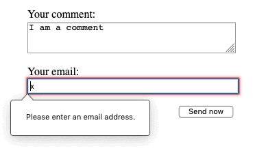
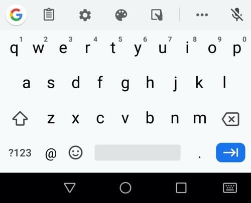
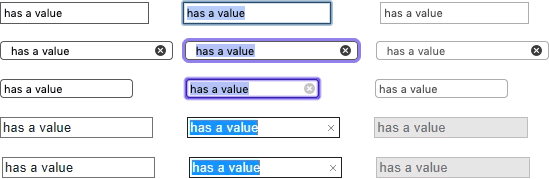
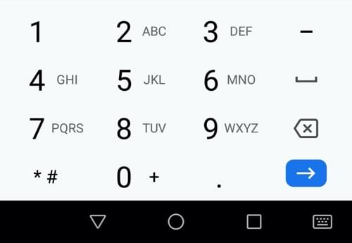
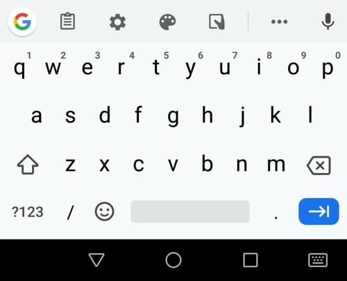
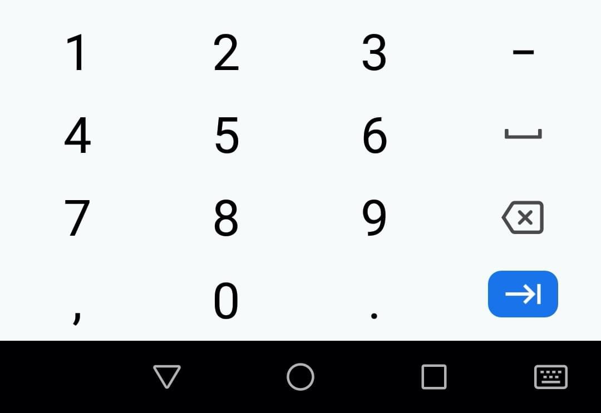

{{LearnSidebar}}{{PreviousMenuNext("Learn/Forms/Basic_native_form_controls", "Learn/Forms/Other_form_controls", "Learn/Forms")}}

In the [previous article](/en-US/docs/Learn/Forms/Basic_native_form_controls) we looked at the {{htmlelement("input")}} element, covering the original values of the `type` attribute available since the early days of HTML. Now we'll look at the functionality of newer form controls in detail, including some new input types, which were added in HTML5 to allow the collection of specific types of data.

<table>
  <tbody>
    <tr>
      <th scope="row">Prerequisites:</th>
      <td>
        Basic computer literacy, and a basic
        <a href="/en-US/docs/Learn/HTML/Introduction_to_HTML"
          >understanding of HTML</a
        >.
      </td>
    </tr>
    <tr>
      <th scope="row">Objective:</th>
      <td>
        To understand the newer input type values available to create native
        form controls, and how to implement them using HTML.
      </td>
    </tr>
  </tbody>
</table>

> **Note:** Most of the features discussed in this article have wide support across browsers. We'll note any exceptions. If you want more detail on browser support, you should consult our [HTML forms element reference](/en-US/docs/Web/HTML/Element#forms), and in particular our extensive [\<input> types](/en-US/docs/Web/HTML/Element/input) reference.

Because HTML form control appearance may be quite different from a designer's specifications, web developers sometimes build their own custom form controls. We cover this in an advanced tutorial: [How to build custom form widgets](/en-US/docs/Learn/Forms/How_to_build_custom_form_controls).

## Email address field

This type of field is set using the value `email` for the [`type`](/en-US/docs/Web/HTML/Element/input#type) attribute:

```html
<input type="email" id="email" name="email" />
```

When this [`type`](/en-US/docs/Web/HTML/Element/input#type) is used, the user is required to type a valid email address into the field. Any other content causes the browser to display an error when the form is submitted. You can see this in action in the below screenshot.



You can also use the [`multiple`](/en-US/docs/Web/HTML/Attributes/multiple) attribute in combination with the `email` input type to allow several email addresses to be entered in the same input (separated by commas):

```html
<input type="email" id="email" name="email" multiple />
```

On some devices — notably, touch devices with dynamic keyboards like smartphones — a different virtual keypad might be presented that is more suitable for entering email addresses, including the `@` key. See the Firefox for Android keyboard screenshot below for an example:



> **Note:** You can find examples of the basic text input types at [basic input examples](https://mdn.github.io/learning-area/html/forms/basic-input-examples/) (see the [source code](https://github.com/mdn/learning-area/blob/main/html/forms/basic-input-examples/index.html) also).

This is another good reason for using these newer input types, improving the user experience for users of these devices.

### Client-side validation

As you can see above, `email` — along with other newer `input` types — provides built-in _client-side_ error validation, performed by the browser before the data gets sent to the server. It _is_ a helpful aid to guide users to fill out a form accurately, and it can save time: it is useful to know that your data is not correct immediately, rather than having to wait for a round trip to the server.

But it _should not be considered_ an exhaustive security measure! Your apps should always perform security checks on any form-submitted data on the _server-side_ as well as the client-side, because client-side validation is too easy to turn off, so malicious users can still easily send bad data through to your server. Read [Website security](/en-US/docs/Learn/Server-side/First_steps/Website_security) for an idea of what _could_ happen; implementing server-side validation is somewhat beyond the scope of this module, but you should bear it in mind.

Note that `a@b` is a valid email address according to the default provided constraints. This is because the `email` input type allows intranet email addresses by default. To implement different validation behavior, you can use the [`pattern`](/en-US/docs/Web/HTML/Attributes/pattern) attribute, and you can also customize the error messages; we'll talk about how to use these features in the [Client-side form validation](/en-US/docs/Learn/Forms/Form_validation) article later on.

> **Note:** If the data entered is not an email address, the {{cssxref(':invalid')}} pseudo-class will match, and the {{domxref('validityState.typeMismatch')}} property will return `true`.

## Search field

Search fields are intended to be used to create search boxes on pages and apps. This type of field is set by using the value `search` for the [`type`](/en-US/docs/Web/HTML/Element/input#type) attribute:

```html
<input type="search" id="search" name="search" />
```

The main difference between a `text` field and a `search` field is how the browser styles its appearance. Often, `search` fields are rendered with rounded corners; they also sometimes display an "Ⓧ", which clears the field of any value when clicked. Additionally, on devices with dynamic keyboards, the keyboard's enter key may read "**search**", or display a magnifying glass icon.

The below screenshots show a non-empty search field in Firefox 71, Safari 13, and Chrome 79 on macOS, and Edge 18 and Chrome 79 on Windows 10. Note that the clear icon only appears if the field has a value, and, apart from Safari, it is only displayed when the field is focused.



Another worth-noting feature is that the values of a `search` field can be automatically saved and re-used to offer auto-completion across multiple pages of the same website; this tends to happen automatically in most modern browsers.

## Phone number field

A special field for filling in phone numbers can be created using `tel` as the value of the [`type`](/en-US/docs/Web/HTML/Element/input#type) attribute:

```html
<input type="tel" id="tel" name="tel" />
```

When accessed via a touch device with a dynamic keyboard, most devices will display a numeric keypad when `type="tel"` is encountered, meaning this type is useful whenever a numeric keypad is useful, and doesn't just have to be used for telephone numbers.

The following Firefox for Android keyboard screenshot provides an example:



Due to the wide variety of phone number formats around the world, this type of field does not enforce any constraints on the value entered by a user (this means it may include letters, etc.).

As we mentioned earlier, the [`pattern`](/en-US/docs/Web/HTML/Attributes/pattern) attribute can be used to enforce constraints, which you'll learn about in [Client-side form validation](/en-US/docs/Learn/Forms/Form_validation).

## URL field

A special type of field for entering URLs can be created using the value `url` for the [`type`](/en-US/docs/Web/HTML/Element/input#type) attribute:

```html
<input type="url" id="url" name="url" />
```

It adds special validation constraints to the field. The browser will report an error if no protocol (such as `http:`) is entered, or if the URL is otherwise malformed. On devices with dynamic keyboards, the default keyboard will often display some or all of the colon, period, and forward slash as default keys.

See below for an example (taken on Firefox for Android):



> **Note:** Just because the URL is well-formed doesn't necessarily mean that it refers to a location that actually exists!

## Numeric field

Controls for entering numbers can be created with an {{HTMLElement("input")}} [`type`](/en-US/docs/Web/HTML/Element/input#type) of `number`. This control looks like a text field but allows only floating-point numbers, and usually provides buttons in the form of a spinner to increase and decrease the value of the control. On devices with dynamic keyboards, the numeric keyboard is generally displayed.

The following screenshot (from Firefox for Android) provides an example:



With the `number` input type, you can constrain the minimum and maximum values allowed by setting the [`min`](/en-US/docs/Web/HTML/Element/input#min) and [`max`](/en-US/docs/Web/HTML/Element/input#max) attributes.

You can also use the `step` attribute to set the increment increase and decrease caused by pressing the spinner buttons. By default, the number input type only validates if the number is an integer. To allow float numbers, specify [`step="any"`](/en-US/docs/Web/HTML/Attributes/step). If omitted, the `step` value defaults to `1`, meaning only whole numbers are valid.

Let's look at some examples. The first one below creates a number control whose value is restricted to any value between `1` and `10`, and whose increase and decrease buttons change its value by `2`.

```html
<input type="number" name="age" id="age" min="1" max="10" step="2" />
```

The second one creates a number control whose value is restricted to any value between `0` and `1` inclusive, and whose increase and decrease buttons change its value by `0.01`.

```html
<input type="number" name="change" id="pennies" min="0" max="1" step="0.01" />
```

The `number` input type makes sense when the range of valid values is limited, for example a person's age or height. If the range is too large for incremental increases to make sense (such as USA ZIP codes, which range from `00001` to `99999`), the `tel` type might be a better option; it provides the numeric keypad while forgoing the number's spinner UI feature.

## Slider controls

Another way to pick a number is to use a **slider**. You see these quite often on sites like house-buying sites where you want to set a maximum property price to filter by. Let's look at a live example to illustrate this:

{{EmbedGHLiveSample("learning-area/html/forms/range-example/index.html", '100%', 200)}}

Usage-wise, sliders are less accurate than text fields. Therefore, they are used to pick a number whose _precise_ value is not necessarily important.

A slider is created using the {{HTMLElement("input")}} with its [`type`](/en-US/docs/Web/HTML/Element/input#type) attribute set to the value `range`. The slider-thumb can be moved via mouse or touch, or with the arrows of the keypad.

It's important to properly configure your slider. To that end, it's highly recommended that you set the [`min`](/en-US/docs/Web/HTML/Attributes/min), [`max`](/en-US/docs/Web/HTML/Attributes/max), and [`step`](/en-US/docs/Web/HTML/Attributes/step) attributes which set the minimum, maximum, and increment values, respectively.

Let's look at the code behind the above example, so you can see how it's done. First of all, the basic HTML:

```html
<label for="price">Choose a maximum house price: </label>
<input
  type="range"
  name="price"
  id="price"
  min="50000"
  max="500000"
  step="100"
  value="250000" />
<output class="price-output" for="price"></output>
```

This example creates a slider whose value may range between `50000` and `500000`, which increments/decrements by 100 at a time. We've given it a default value of `250000`, using the `value` attribute.

One problem with sliders is that they don't offer any kind of visual feedback as to what the current value is. This is why we've included an {{htmlelement("output")}} element to contain the current value. You could display an input value or the output of a calculation inside any element, but `<output>` is special — like `<label>` — and it can take a `for` attribute that allows you to associate it with the element or elements that the output value came from.

To actually display the current value, and update it as it changed, you must use JavaScript, but this is relatively easy to do:

```js
const price = document.querySelector("#price");
const output = document.querySelector(".price-output");

output.textContent = price.value;

price.addEventListener("input", () => {
  output.textContent = price.value;
});
```

Here we store references to the `range` input and the `output` in two variables. Then we immediately set the `output`'s [`textContent`](/en-US/docs/Web/API/Node/textContent) to the current `value` of the input. Finally, an event listener is set to ensure that whenever the range slider is moved, the `output`'s `textContent` is updated to the new value.

> **Note:** There is a nice tutorial covering this subject on CSS Tricks: [The Output Element](https://css-tricks.com/the-output-element/).

## Date and time pickers

Gathering date and time values has traditionally been a nightmare for web developers. For a good user experience, it is important to provide a calendar selection UI, enabling users to select dates without necessitating context switching to a native calendar application or potentially entering them in differing formats that are hard to parse. The last minute of the previous millennium can be expressed in the following different ways, for example: 1999/12/31, 23:59 or 12/31/99T11:59PM.

HTML date controls are available to handle this specific kind of data, providing calendar widgets and making the data uniform.

A date and time control is created using the {{HTMLElement("input")}} element and an appropriate value for the [`type`](/en-US/docs/Web/HTML/Element/input#type) attribute, depending on whether you wish to collect dates, times, or both. Here's a live example that falls back to {{htmlelement("select")}} elements in non-supporting browsers:

{{EmbedGHLiveSample("learning-area/html/forms/datetime-local-picker-fallback/index.html", '100%', 200)}}

Let's look at the different available types in brief. Note that the usage of these types is quite complex, especially considering browser support (see below); to find out the full details, follow the links below to the reference pages for each type, including detailed examples.

### `datetime-local`

[`<input type="datetime-local">`](/en-US/docs/Web/HTML/Element/input/datetime-local) creates a widget to display and pick a date with time with no specific time zone information.

```html
<input type="datetime-local" name="datetime" id="datetime" />
```

### `month`

[`<input type="month">`](/en-US/docs/Web/HTML/Element/input/month) creates a widget to display and pick a month with a year.

```html
<input type="month" name="month" id="month" />
```

### `time`

[`<input type="time">`](/en-US/docs/Web/HTML/Element/input/time) creates a widget to display and pick a time value. While time may _display_ in 12-hour format, the _value returned_ is in 24-hour format.

```html
<input type="time" name="time" id="time" />
```

### `week`

[`<input type="week">`](/en-US/docs/Web/HTML/Element/input/week) creates a widget to display and pick a week number and its year.

Weeks start on Monday and run to Sunday. Additionally, the first week 1 of each year contains the first Thursday of that year — which may not include the first day of the year, or may include the last few days of the previous year.

```html
<input type="week" name="week" id="week" />
```

### Constraining date/time values

All date and time controls can be constrained using the [`min`](/en-US/docs/Web/HTML/Attributes/min) and [`max`](/en-US/docs/Web/HTML/Attributes/max) attributes, with further constraining possible via the [`step`](/en-US/docs/Web/HTML/Attributes/step) attribute (whose value varies according to input type).

```html
<label for="myDate">When are you available this summer?</label>
<input
  type="date"
  name="myDate"
  min="2013-06-01"
  max="2013-08-31"
  step="7"
  id="myDate" />
```

## Color picker control

Colors are always a bit difficult to handle. There are many ways to express them: RGB values (decimal or hexadecimal), HSL values, keywords, and so on.

A `color` control can be created using the {{HTMLElement("input")}} element with its [`type`](/en-US/docs/Web/HTML/Element/input#type) attribute set to the value `color`:

```html
<input type="color" name="color" id="color" />
```

Clicking a color control generally displays the operating system's default color-picking functionality for you to choose.

Here is a live example for you to try out:

{{EmbedGHLiveSample("learning-area/html/forms/color-example/index.html", '100%', 200)}}

The value returned is always a lowercase 6-value hexadecimal color.

## Test your skills!

You've reached the end of this article, but can you remember the most important information? You can find some further tests to verify that you've retained this information before you move on — see [Test your skills: HTML5 controls](/en-US/docs/Learn/Forms/Test_your_skills:_HTML5_controls).

## Summary

That brings us to the end of our tour of the HTML5 form input types. There are a few other control types that cannot be easily grouped together due to their very specific behaviors, but which are still essential to know about. We cover those in the next article.

{{PreviousMenuNext("Learn/Forms/Basic_native_form_controls", "Learn/Forms/Other_form_controls", "Learn/Forms")}}

### Advanced Topics

- [How to build custom form controls](/en-US/docs/Learn/Forms/How_to_build_custom_form_controls)
- [Sending forms through JavaScript](/en-US/docs/Learn/Forms/Sending_forms_through_JavaScript)
- [Property compatibility table for form widgets](/en-US/docs/Learn/Forms/Property_compatibility_table_for_form_controls)
