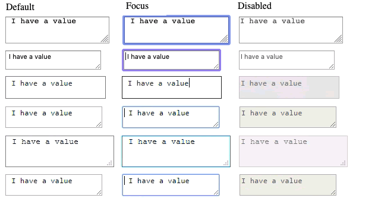
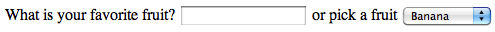

{{LearnSidebar}}{{PreviousMenuNext("Learn/Forms/HTML5_input_types","Learn/Forms/Styling_web_forms", "Learn/Forms")}}

We now look at the functionality of non-`<input>` form elements in detail, from other control types such as drop-down lists and multi-line text fields, to other useful form features such as the {{htmlelement('output')}} element (which we saw in action in the previous article), and progress bars.

<table>
  <tbody>
    <tr>
      <th scope="row">Prerequisites:</th>
      <td>
        Basic computer literacy, and a basic
        <a href="/en-US/docs/Learn/HTML/Introduction_to_HTML"
          >understanding of HTML</a
        >.
      </td>
    </tr>
    <tr>
      <th scope="row">Objective:</th>
      <td>
        To understand the non-<code>&#x3C;input></code> form features, and how
        to implement them using HTML.
      </td>
    </tr>
  </tbody>
</table>

## Multi-line text fields

A multi-line text field is specified using a {{HTMLElement("textarea")}} element, rather than using the {{HTMLElement("input")}} element.

```html
<textarea cols="30" rows="8"></textarea>
```

This renders like so:

{{EmbedLiveSample("Multi-line_text_fields", 120, 160)}}

The main difference between a `<textarea>` and a regular single-line text field is that users are allowed to include hard line breaks (i.e. pressing return) that will be included when the data is submitted.

`<textarea>` also takes a closing tag; any default text you want it to contain should be put between the opening and closing tags. In contrast, the {{HTMLElement("input")}} is a {{glossary("void element")}} with no closing tag — any default value is put inside the [`value`](/en-US/docs/Web/HTML/Element/input#value) attribute.

Note that even though you can put anything inside a `<textarea>` element (including other HTML elements, CSS, and JavaScript), because of its nature, it is all rendered as if it was plain text content. (Using [`contenteditable`](/en-US/docs/Web/HTML/Global_attributes/contenteditable) on non-form controls provides an API for capturing HTML/"rich" content instead of plain text).

Visually, the text entered wraps and the form control is by default resizable. Modern browsers provide a drag handle that you can drag to increase/decrease the size of the text area.

The following screenshots show default, focused, and disabled `<textarea>` elements in Firefox 71 and Safari 13 on macOS and in Edge 18, Yandex 14, Firefox 71, and Chrome 79 on Windows 10.



> **Note:** You can find a slightly more interesting example of text area usage in the [example](https://mdn.github.io/learning-area/html/forms/your-first-HTML-form/first-form-styled.html) we put together in the first article of the series ([see the source code also](https://github.com/mdn/learning-area/blob/main/html/forms/your-first-HTML-form/first-form-styled.html)).

### Controlling multi-line rendering

{{htmlelement("textarea")}} accepts three attributes to control its rendering across several lines:

- [`cols`](/en-US/docs/Web/HTML/Element/textarea#cols)
  - : Specifies the visible width (columns) of the text control, measured in average character widths. This is effectively the starting width, as it can be changed by resizing the `<textarea>`, and overridden using CSS. The default value if none is specified is 20.
- [`rows`](/en-US/docs/Web/HTML/Element/textarea#rows)
  - : Specifies the number of visible text rows for the control. This is effectively the starting height, as it can be changed by resizing the `<textarea>`, and overridden using CSS. The default value if none is specified is 2.
- [`wrap`](/en-US/docs/Web/HTML/Element/textarea#wrap)
  - : Specifies how the control wraps text. The values are `soft` (the default value), which means the text submitted is not wrapped but the text rendered by the browser is wrapped; `hard` (the `cols` attribute must be specified when using this value), which means both the submitted and rendered texts are wrapped, and `off`, which stops wrapping.

### Controlling textarea resizability

The ability to resize a `<textarea>` is controlled with the CSS `resize` property. Its possible values are:

- `both`: The default — allows resizing horizontally and vertically.
- `horizontal`: Allows resizing only horizontally.
- `vertical`: Allows resizing only vertically.
- `none`: Allows no resizing.
- `block` and `inline`: Experimental values that allow resizing in the `block` or `inline` direction only (this varies depending on the directionality of your text; read [Handling different text directions](/en-US/docs/Learn/CSS/Building_blocks/Handling_different_text_directions) if you want to find out more.)

Play with the interactive example at the top of the {{cssxref("resize")}} reference page for a demonstration of how these work.

## Drop-down controls

Drop-down controls are a simple way to let users select from many options without taking up much space in the user interface. HTML has two types of drop-down controls: the **select box** and the **autocomplete box**. The interaction is the same in both the types of drop-down controls — after the control is activated, the browser displays a list of values the user can select from.

> **Note:** You can find examples of all the drop-down box types on GitHub at [drop-down-content.html](https://github.com/mdn/learning-area/blob/main/html/forms/native-form-widgets/drop-down-content.html) ([see it live also](https://mdn.github.io/learning-area/html/forms/native-form-widgets/drop-down-content.html)).

### Select box

A simple select box is created with a {{HTMLElement("select")}} element with one or more {{HTMLElement("option")}} elements as its children, each of which specifies one of its possible values.

#### Basic example

```html
<select id="simple" name="simple">
  <option>Banana</option>
  <option selected>Cherry</option>
  <option>Lemon</option>
</select>
```

{{EmbedLiveSample("Basic_example", 120, 120)}}

If required, the default value for the select box can be set using the [`selected`](/en-US/docs/Web/HTML/Element/option#selected) attribute on the desired {{HTMLElement("option")}} element — this option is then preselected when the page loads.

#### Using optgroup

The {{HTMLElement("option")}} elements can be nested inside {{HTMLElement("optgroup")}} elements to create visually associated groups of values:

```html
<select id="groups" name="groups">
  <optgroup label="fruits">
    <option>Banana</option>
    <option selected>Cherry</option>
    <option>Lemon</option>
  </optgroup>
  <optgroup label="vegetables">
    <option>Carrot</option>
    <option>Eggplant</option>
    <option>Potato</option>
  </optgroup>
</select>
```

{{EmbedLiveSample("Using_optgroup", 120, 120)}}

On the {{HTMLElement("optgroup")}} element, the value of the [`label`](/en-US/docs/Web/HTML/Element/optgroup#label) attribute is displayed before the values of the nested options. The browser usually sets them visually apart from the options (i.e. by being bolded and at a different nesting level) so they are less likely to be confused for actual options.

#### Using the value attribute

If an {{HTMLElement("option")}} element has an explicit `value` attribute set on it, that value is sent when the form is submitted with that option selected. If the `value` attribute is omitted, as with the examples above, the content of the {{HTMLElement("option")}} element is used as the value. So `value` attributes are not needed, but you might find a reason to want to send a shortened or different value to the server than what is visually shown in the select box.

For example:

```html
<select id="simple" name="simple">
  <option value="banana">Big, beautiful yellow banana</option>
  <option value="cherry">Succulent, juicy cherry</option>
  <option value="lemon">Sharp, powerful lemon</option>
</select>
```

By default, the height of the select box is enough to display a single value. The optional [`size`](/en-US/docs/Web/HTML/Attributes/size) attribute provides control over how many options are visible when the select does not have focus.

### Multiple choice select box

By default, a select box lets a user select only one value. By adding the [`multiple`](/en-US/docs/Web/HTML/Element/select#multiple) attribute to the {{HTMLElement("select")}} element, you can allow users to select several values. Users can select multiple values by using the default mechanism provided by the operating system (e.g., on the desktop, multiple values can be clicked while holding down <kbd>Cmd</kbd>/<kbd>Ctrl</kbd> keys).

```html
<select id="multi" name="multi" multiple size="2">
  <optgroup label="fruits">
    <option>Banana</option>
    <option selected>Cherry</option>
    <option>Lemon</option>
  </optgroup>
  <optgroup label="vegetables">
    <option>Carrot</option>
    <option>Eggplant</option>
    <option>Potato</option>
  </optgroup>
</select>
```

{{EmbedLiveSample("Multiple_choice_select_box", 120, 120)}}

> **Note:** In the case of multiple choice select boxes, you'll notice that the select box no longer displays the values as drop-down content — instead, all values are displayed at once in a list, with the optional [`size`](/en-US/docs/Web/HTML/Attributes/size) attribute determining the height of the widget.

> **Note:** All browsers that support the {{HTMLElement("select")}} element also support the [`multiple`](/en-US/docs/Web/HTML/Element/select#multiple) attribute.

### Autocomplete box

You can provide suggested, automatically-completed values for form widgets using the {{HTMLElement("datalist")}} element with child {{HTMLElement("option")}} elements to specify the values to display. The `<datalist>` needs to be given an `id`.

The data list is then bound to an {{htmlelement("input")}} element (e.g. a `text` or `email` input type) using the [`list`](/en-US/docs/Web/HTML/Element/input#list) attribute, the value of which is the `id` of the data list to bind.

Once a data list is affiliated with a form widget, its options are used to auto-complete text entered by the user; typically, this is presented to the user as a drop-down box listing possible matches for what they've typed into the input.

#### Basic example

Let's look at an example.

```html
<label for="myFruit">What's your favorite fruit?</label>
<input type="text" name="myFruit" id="myFruit" list="mySuggestion" />
<datalist id="mySuggestion">
  <option>Apple</option>
  <option>Banana</option>
  <option>Blackberry</option>
  <option>Blueberry</option>
  <option>Lemon</option>
  <option>Lychee</option>
  <option>Peach</option>
  <option>Pear</option>
</datalist>
```

{{EmbedLiveSample("Basic_example_2", 120, 120)}}

#### Datalist support and fallbacks

Almost all browsers support datalist, but if you are still supporting older browsers such as IE versions below 10, there is a trick to provide a fallback:

```html
<label for="myFruit">What is your favorite fruit? (With fallback)</label>
<input type="text" id="myFruit" name="fruit" list="fruitList" />

<datalist id="fruitList">
  <label for="suggestion">or pick a fruit</label>
  <select id="suggestion" name="altFruit">
    <option>Apple</option>
    <option>Banana</option>
    <option>Blackberry</option>
    <option>Blueberry</option>
    <option>Lemon</option>
    <option>Lychee</option>
    <option>Peach</option>
    <option>Pear</option>
  </select>
</datalist>
```

{{EmbedLiveSample("Datalist_support_and_fallbacks", 120, 120)}}

Browsers that support the {{HTMLElement("datalist")}} element will ignore all the elements that are not {{HTMLElement("option")}} elements, with the datalist working as expected. Old browsers that don't support the {{HTMLElement("datalist")}} element will display the label and the select box.

The following screenshot shows the datalist fallback as rendered in Safari 6:



If you use this fallback, ensure the data for both the `<input>` and the `<select>` are collected server-side.

#### Less obvious datalist uses

According to [the HTML specification](https://html.spec.whatwg.org/multipage/input.html#attr-input-list), the [`list`](/en-US/docs/Web/HTML/Element/input#list) attribute and the {{HTMLElement("datalist")}} element can be used with any kind of widget requiring a user input. This leads to some uses of it that might seem a little non-obvious.

For example, in browsers that support `{{htmlelement("datalist")}}` on `range` input types, a small tick mark will be displayed above the range for each datalist `{{htmlelement("option")}}` value. You can see an implementation [example of this on the `<input type="range">` reference page](/en-US/docs/Web/HTML/Element/input/range#adding_tick_marks).

And browsers that support {{htmlelement('datalist')}}s and [`<input type="color">`](/en-US/docs/Web/HTML/Element/input/color) should display a customized palette of colors as the default, while still making the full color palette available.

In this case, different browsers behave differently from case to case, so consider such uses as progressive enhancement, and ensure they degrade gracefully.

## Other form features

There are a few other form features that are not as obvious as the ones we have already mentioned, but still useful in some situations, so we thought it would be worth giving them a brief mention.

> **Note:** You can find the examples from this section on GitHub as [other-examples.html](https://github.com/mdn/learning-area/blob/main/html/forms/native-form-widgets/other-examples.html) ([see it live also](https://mdn.github.io/learning-area/html/forms/native-form-widgets/other-examples.html)).

### Meters and progress bars

Meters and progress bars are visual representations of numeric values. Support for {{HTMLElement("progress")}} and {{HTMLElement("meter")}} is available in all modern browsers.

#### Meter

A meter bar represents a fixed value in a range delimited by [`max`](/en-US/docs/Web/HTML/Element/meter#max) and [`min`](/en-US/docs/Web/HTML/Element/meter#min) values. This value is visually rendered as a bar, and to know how this bar looks, we compare the value to some other set values:

- The [`low`](/en-US/docs/Web/HTML/Element/meter#low) and [`high`](/en-US/docs/Web/HTML/Element/meter#high) values divide the range into the following three parts:

  - The lower part of the range is between the [`min`](/en-US/docs/Web/HTML/Element/meter#min) and [`low`](/en-US/docs/Web/HTML/Element/meter#low) values, inclusive.
  - The medium part of the range is between the [`low`](/en-US/docs/Web/HTML/Element/meter#low) and [`high`](/en-US/docs/Web/HTML/Element/meter#high) values, exclusive.
  - The higher part of the range is between the [`high`](/en-US/docs/Web/HTML/Element/meter#high) and [`max`](/en-US/docs/Web/HTML/Element/meter#max) values, inclusive.

- The [`optimum`](/en-US/docs/Web/HTML/Element/meter#optimum) value defines the optimum value for the {{HTMLElement("meter")}} element. In conjunction with the [`low`](/en-US/docs/Web/HTML/Element/meter#low) and [`high`](/en-US/docs/Web/HTML/Element/meter#high) value, it defines which part of the range is preferred:

  - If the [`optimum`](/en-US/docs/Web/HTML/Element/meter#optimum) value is in the lower part of the range, the lower range is considered to be the preferred part, the medium range is considered to be the average part, and the higher range is considered to be the worst part.
  - If the [`optimum`](/en-US/docs/Web/HTML/Element/meter#optimum) value is in the medium part of the range, the lower range is considered to be an average part, the medium range is considered to be the preferred part, and the higher range is considered to be average as well.
  - If the [`optimum`](/en-US/docs/Web/HTML/Element/meter#optimum) value is in the higher part of the range, the lower range is considered to be the worst part, the medium range is considered to be the average part and the higher range is considered to be the preferred part.

All browsers that implement the {{HTMLElement("meter")}} element use those values to change the color of the meter bar:

- If the current value is in the preferred part of the range, the bar is green.
- If the current value is in the average part of the range, the bar is yellow.
- If the current value is in the worst part of the range, the bar is red.

Such a bar is created by using the {{HTMLElement("meter")}} element. This is for implementing any kind of meter; for example, a bar showing the total space used on a disk, which turns red when it starts to get full.

```html
<meter min="0" max="100" value="75" low="33" high="66" optimum="0">75</meter>
```

{{EmbedLiveSample("Meter", 120, 120)}}

The content inside the {{HTMLElement("meter")}} element is a fallback for browsers that don't support the element and for assistive technologies to vocalize it.

#### Progress

A progress bar represents a value that changes over time up to a maximum value specified by the [`max`](/en-US/docs/Web/HTML/Element/progress#max) attribute. Such a bar is created using a {{ HTMLElement("progress")}} element.

```html
<progress max="100" value="75">75/100</progress>
```

{{EmbedLiveSample("Progress", 120, 120)}}

This is for implementing anything requiring progress reporting, such as the percentage of total files downloaded, or the number of questions filled in on a questionnaire.

The content inside the {{HTMLElement("progress")}} element is a fallback for browsers that don't support the element and for screen readers to vocalize it.

## Test your skills!

You've reached the end of this article, but can you remember the most important information? You can find some further tests to verify that you've retained this information before you move on — see [Test your skills: Other controls](/en-US/docs/Learn/Forms/Test_your_skills:_Other_controls).

## Summary

As you'll have seen in the last few articles, there are many types of form control. You don't need to remember all of these details at once, and can return to these articles as often as you like to check up on details.

Now that you have a grasp of the HTML behind the different available form controls, we'll take a look at [Styling them](/en-US/docs/Learn/Forms/Styling_web_forms).

{{PreviousMenuNext("Learn/Forms/HTML5_input_types","Learn/Forms/Styling_web_forms", "Learn/Forms")}}

### Advanced Topics

- [How to build custom form controls](/en-US/docs/Learn/Forms/How_to_build_custom_form_controls)
- [Sending forms through JavaScript](/en-US/docs/Learn/Forms/Sending_forms_through_JavaScript)
- [Property compatibility table for form widgets](/en-US/docs/Learn/Forms/Property_compatibility_table_for_form_controls)
