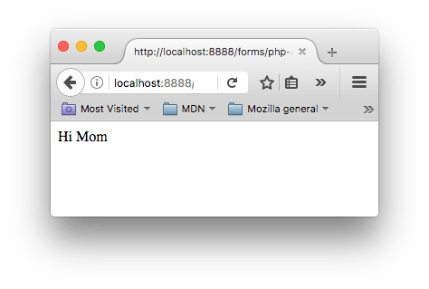

{{LearnSidebar}}{{PreviousMenu("Learn/Forms/Form_validation", "Learn/Forms")}}

Once the form data has been validated on the client-side, it is okay to submit the form. And, since we covered validation in the previous article, we're ready to submit! This article looks at what happens when a user submits a form — where does the data go, and how do we handle it when it gets there? We also look at some of the security concerns associated with sending form data.

<table>
  <tbody>
    <tr>
      <th scope="row">Prerequisites:</th>
      <td>
        An
        <a href="/en-US/docs/Learn/HTML/Introduction_to_HTML"
          >understanding of HTML</a
        >, and basic knowledge of
        <a href="/en-US/docs/Web/HTTP/Basics_of_HTTP">HTTP</a> and
        <a href="/en-US/docs/Learn/Server-side/First_steps"
          >server-side programming</a
        >.
      </td>
    </tr>
    <tr>
      <th scope="row">Objective:</th>
      <td>
        To understand what happens when form data is submitted, including
        getting a basic idea of how data is processed on the server.
      </td>
    </tr>
  </tbody>
</table>

First, we'll discuss what happens to the data when a form is submitted.

## Client/server architecture

At its most basic, the web uses a client/server architecture that can be summarized as follows: a client (usually a web browser) sends a request to a server (most of the time a web server like [Apache](https://httpd.apache.org/), [Nginx](https://nginx.org/), [IIS](https://www.iis.net/), [Tomcat](https://tomcat.apache.org/), etc.), using the [HTTP protocol](/en-US/docs/Web/HTTP). The server answers the request using the same protocol.


An HTML form on a web page is nothing more than a convenient user-friendly way to configure an HTTP request to send data to a server. This enables the user to provide information to be delivered in the HTTP request.

> **Note:** To get a better idea of how client-server architectures work, read our [Server-side website programming first steps](/en-US/docs/Learn/Server-side/First_steps) module.

## On the client side: defining how to send the data

The {{HTMLElement("form")}} element defines how the data will be sent. All of its attributes are designed to let you configure the request to be sent when a user hits a {{Glossary("submit button")}}. The two most important attributes are [`action`](/en-US/docs/Web/HTML/Element/form#action) and [`method`](/en-US/docs/Web/HTML/Element/form#method).

### The action attribute

The [`action`](/en-US/docs/Web/HTML/Element/form#action) attribute defines where the data gets sent. Its value must be a valid relative or absolute [URL](/en-US/docs/Learn/Common_questions/Web_mechanics/What_is_a_URL). If this attribute isn't provided, the data will be sent to the URL of the page containing the form — the current page.

In this example, the data is sent to an absolute URL — `https://example.com`:

```html
<form action="https://example.com">…</form>
```

Here, we use a relative URL — the data is sent to a different URL on the same origin:

```html
<form action="/somewhere_else">…</form>
```

When specified with no attributes, as below, the {{HTMLElement("form")}} data is sent to the same page that the form is present on:

```html
<form>…</form>
```

> **Note:** It's possible to specify a URL that uses the HTTPS (secure HTTP) protocol. When you do this, the data is encrypted along with the rest of the request, even if the form itself is hosted on an insecure page accessed using HTTP. On the other hand, if the form is hosted on a secure page but you specify an insecure HTTP URL with the [`action`](/en-US/docs/Web/HTML/Element/form#action) attribute, all browsers display a security warning to the user each time they try to send data because the data will not be encrypted.

The names and values of the non-file form controls are sent to the server as `name=value` pairs joined with ampersands. The `action` value should be a file on the server that can handle the incoming data, including ensuring server-side validation. The server then responds, generally handling the data and loading the URL defined by the `action` attribute, causing a new page load (or a refresh of the existing page, if the `action` points to the same page).

How the data is sent depends on the `method` attribute.

### The method attribute

The [`method`](/en-US/docs/Web/HTML/Element/form#method) attribute defines how data is sent. The [HTTP protocol](/en-US/docs/Web/HTTP) provides several ways to perform a request; HTML form data can be transmitted via a number of different methods, the most common being the `GET` method and the `POST` method

To understand the difference between those two methods, let's step back and examine [how HTTP works](/en-US/docs/Web/HTTP/Overview). Each time you want to reach a resource on the Web, the browser sends a request to a URL. An HTTP request consists of two parts: a [header](/en-US/docs/Web/HTTP/Headers) that contains a set of global metadata about the browser's capabilities, and a body that can contain information necessary for the server to process the specific request.

#### The GET method

The [`GET` method](/en-US/docs/Web/HTTP/Methods/GET) is the method used by the browser to ask the server to send back a given resource: "Hey server, I want to get this resource." In this case, the browser sends an empty body. Because the body is empty, if a form is sent using this method the data sent to the server is appended to the URL.

Consider the following form:

```html
<form action="http://www.foo.com" method="GET">
  <div>
    <label for="say">What greeting do you want to say?</label>
    <input name="say" id="say" value="Hi" />
  </div>
  <div>
    <label for="to">Who do you want to say it to?</label>
    <input name="to" id="to" value="Mom" />
  </div>
  <div>
    <button>Send my greetings</button>
  </div>
</form>
```

Since the `GET` method has been used, you'll see the URL `www.foo.com/?say=Hi&to=Mom` appear in the browser address bar when you submit the form.


The data is appended to the URL as a series of name/value pairs. After the URL web address has ended, we include a question mark (`?`) followed by the name/value pairs, each one separated by an ampersand (`&`). In this case, we are passing two pieces of data to the server:

- `say`, which has a value of `Hi`
- `to`, which has a value of `Mom`

The HTTP request looks like this:

```http
GET /?say=Hi&to=Mom HTTP/2.0
Host: foo.com
```

> **Note:** You can find this example on GitHub — see [get-method.html](https://github.com/mdn/learning-area/blob/main/html/forms/sending-form-data/get-method.html) ([see it live also](https://mdn.github.io/learning-area/html/forms/sending-form-data/get-method.html)).

> **Note:** The data will not be appended if the `action` URL scheme cannot handle queries, e.g. `file:`.

#### The POST method

The [`POST` method](/en-US/docs/Web/HTTP/Methods/POST) is a little different. It's the method the browser uses to talk to the server when asking for a response that takes into account the data provided in the body of the HTTP request: "Hey server, take a look at this data and send me back an appropriate result." If a form is sent using this method, the data is appended to the body of the HTTP request.

Let's look at an example — this is the same form we looked at in the `GET` section above, but with the [`method`](/en-US/docs/Web/HTML/Element/form#method) attribute set to `POST`.

```html
<form action="http://www.foo.com" method="POST">
  <div>
    <label for="say">What greeting do you want to say?</label>
    <input name="say" id="say" value="Hi" />
  </div>
  <div>
    <label for="to">Who do you want to say it to?</label>
    <input name="to" id="to" value="Mom" />
  </div>
  <div>
    <button>Send my greetings</button>
  </div>
</form>
```

When the form is submitted using the `POST` method, you get no data appended to the URL, and the HTTP request looks like so, with the data included in the request body instead:

```http
POST / HTTP/2.0
Host: foo.com
Content-Type: application/x-www-form-urlencoded
Content-Length: 13

say=Hi&to=Mom
```

The `Content-Length` header indicates the size of the body, and the `Content-Type` header indicates the type of resource sent to the server. We'll discuss these headers later on.

> **Note:** You can find this example on GitHub — see [post-method.html](https://github.com/mdn/learning-area/blob/main/html/forms/sending-form-data/post-method.html) ([see it live also](https://mdn.github.io/learning-area/html/forms/sending-form-data/post-method.html)).

> **Note:** The `GET` method will be used instead if the `action` URL scheme cannot handle a request body, e.g. `data:`.

### Viewing HTTP requests

HTTP requests are never displayed to the user (if you want to see them, you need to use tools such as the [Firefox Network Monitor](https://firefox-source-docs.mozilla.org/devtools-user/network_monitor/index.html) or the [Chrome Developer Tools](https://developer.chrome.com/docs/devtools/)). As an example, your form data will be shown as follows in the Chrome Network tab. After submitting the form:

1. Open the developer tools.
2. Select "Network"
3. Select "All"
4. Select "foo.com" in the "Name" tab
5. Select "Request" (Firefox) or "Payload" (Chrome/Edge)

You can then get the form data, as shown in the image below.


The only thing displayed to the user is the URL called. As we mentioned above, with a `GET` request the user will see the data in their URL bar, but with a `POST` request they won't. This can be very important for two reasons:

1. If you need to send a password (or any other sensitive piece of data), never use the `GET` method or you risk displaying it in the URL bar, which would be very insecure.
2. If you need to send a large amount of data, the `POST` method is preferred because some browsers limit the sizes of URLs. In addition, many servers limit the length of URLs they accept.

## On the server side: retrieving the data

Whichever HTTP method you choose, the server receives a string that will be parsed in order to get the data as a list of key/value pairs. The way you access this list depends on the development platform you use and on any specific frameworks you may be using with it.

### Example: Raw PHP

[PHP](https://www.php.net/) offers some global objects to access the data. Assuming you've used the `POST` method, the following example just takes the data and displays it to the user. Of course, what you do with the data is up to you. You might display it, store it in a database, send it by email, or process it in some other way.

```php
<?php
  // The global $_POST variable allows you to access the data sent with the POST method by name
  // To access the data sent with the GET method, you can use $_GET
  $say = htmlspecialchars($_POST['say']);
  $to  = htmlspecialchars($_POST['to']);

  echo  $say, ' ', $to;
?>
```

This example displays a page with the data we sent. You can see this in action in our example [php-example.html](https://github.com/mdn/learning-area/blob/main/html/forms/sending-form-data/php-example.html) file — which contains the same example form as we saw before, with a `method` of `POST` and an `action` of `php-example.php`. When it is submitted, it sends the form data to [php-example.php](https://github.com/mdn/learning-area/blob/main/html/forms/sending-form-data/php-example.php), which contains the PHP code seen in the above block. When this code is executed, the output in the browser is `Hi Mom`.



> **Note:** This example won't work when you load it into a browser locally — browsers cannot interpret PHP code, so when the form is submitted the browser will just offer to download the PHP file for you. To get it to work, you need to run the example through a PHP server of some kind. Good options for local PHP testing are [MAMP](https://www.mamp.info/en/downloads/) (Mac and Windows) and [AMPPS](https://ampps.com/downloads/) (Mac, Windows, Linux).
>
> Note also that if you are using MAMP but don't have MAMP Pro installed (or if the MAMP Pro demo time trial has expired), you might have trouble getting it working. To get it working again, we have found that you can load up the MAMP app, then choose the menu options _MAMP_ > _Preferences_ > _PHP_, and set "Standard Version:" to "7.2.x" (x will differ depending on what version you have installed).

### Example: Python

This example shows how you would use Python to do the same thing — display the submitted data on a web page. This uses the [Flask framework](https://flask.palletsprojects.com/) for rendering the templates, handling the form data submission, etc. (see [python-example.py](https://github.com/mdn/learning-area/blob/main/html/forms/sending-form-data/python-example.py)).

```python
from flask import Flask, render_template, request

app = Flask(__name__)

@app.route('/', methods=['GET', 'POST'])
def form():
    return render_template('form.html')

@app.route('/hello', methods=['GET', 'POST'])
def hello():
    return render_template('greeting.html', say=request.form['say'], to=request.form['to'])

if __name__ == "__main__":
    app.run()
```

The two templates referenced in the above code are as follows (these need to be in a subdirectory called `templates` in the same directory as the `python-example.py` file, if you try to run the example yourself):

- [form.html](https://github.com/mdn/learning-area/blob/main/html/forms/sending-form-data/templates/form.html): The same form as we saw above in [The POST method](#the_post_method) section but with the `action` set to `\{{ url_for('hello') }}`. This is a [Jinja](https://jinja.palletsprojects.com) template, which is basically HTML but can contain calls to the Python code that is running the web server contained in curly braces. `url_for('hello')` is basically saying "redirect to `/hello` when the form is submitted".
- [greeting.html](https://github.com/mdn/learning-area/blob/main/html/forms/sending-form-data/templates/greeting.html): This template just contains a line that renders the two bits of data passed to it when it is rendered. This is done via the `hello()` function seen above, which runs when the `/hello` URL is navigated to.

> **Note:** Again, this code won't work if you just try to load it into a browser directly. Python works a bit differently from PHP — to run this code locally you'll need to [install Python/PIP](/en-US/docs/Learn/Server-side/Django/development_environment#installing_python_3), then install Flask using `pip3 install flask`. At this point, you should be able to run the example using `python3 python-example.py`, then navigate to `localhost:5042` in your browser.

### Other languages and frameworks

There are many other server-side technologies you can use for form handling, including Perl, Java, .Net, Ruby, etc. Just pick the one you like best. That said, it's worth noting that it's very uncommon to use these technologies directly because this can be tricky. It's more common to use one of the many high quality frameworks that make handling forms easier, such as:

- Python
  - [Django](/en-US/docs/Learn/Server-side/Django)
  - [Flask](https://flask.palletsprojects.com/)
  - [web2py](https://github.com/web2py/web2py) (easiest to get started with)
  - [py4web](https://py4web.com/) (written by the same develops as web2py, has a more Django-like setup)
- Node.js
  - [Express](/en-US/docs/Learn/Server-side/Express_Nodejs)
  - [Next.js](https://nextjs.org/) (for React apps)
  - [Nuxt](https://nuxt.com/) (for Vue apps)
  - [Remix](https://remix.run/)
- PHP
  - [Laravel](https://laravel.com/)
  - [Laminas](https://getlaminas.org/) (formerly Zend Framework)
  - [Symfony](https://symfony.com/)
- Ruby
  - [Ruby On Rails](https://rubyonrails.org/)
- Java
  - [Spring Boot](https://spring.io/guides/gs/handling-form-submission/)

It's worth noting that even using these frameworks, working with forms isn't necessarily _easy_. But it's much easier than trying to write all the functionality yourself from scratch, and will save you a lot of time.

> **Note:** It is beyond the scope of this article to teach you any server-side languages or frameworks. The links above will give you some help, should you wish to learn them.

## A special case: sending files

Sending files with HTML forms is a special case. Files are binary data — or considered as such — whereas all other data is text data. Because HTTP is a text protocol, there are special requirements for handling binary data.

### The enctype attribute

This attribute lets you specify the value of the `Content-Type` HTTP header included in the request generated when the form is submitted. This header is very important because it tells the server what kind of data is being sent. By default, its value is `application/x-www-form-urlencoded`. In human terms, this means: "This is form data that has been encoded into URL parameters."

If you want to send files, you need to take three extra steps:

- Set the [`method`](/en-US/docs/Web/HTML/Element/form#method) attribute to `POST` because file content can't be put inside URL parameters.
- Set the value of [`enctype`](/en-US/docs/Web/HTML/Element/form#enctype) to `multipart/form-data` because the data will be split into multiple parts, one for each file plus one for the text data included in the form body (if the text is also entered into the form).
- Include one or more [`<input type="file">`](/en-US/docs/Web/HTML/Element/input/file) controls to allow your users to select the file(s) that will be uploaded.

For example:

```html
<form method="post" action="https://www.foo.com" enctype="multipart/form-data">
  <div>
    <label for="file">Choose a file</label>
    <input type="file" id="file" name="myFile" />
  </div>
  <div>
    <button>Send the file</button>
  </div>
</form>
```

> **Note:** Servers can be configured with a size limit for files and HTTP requests in order to prevent abuse.

## Security issues

Each time you send data to a server, you need to consider security. HTML forms are by far the most common server attack vectors (places where attacks can occur). The problems never come from the HTML forms themselves — they come from how the server handles data.

The [Website security](/en-US/docs/Learn/Server-side/First_steps/Website_security) article of our [server-side](/en-US/docs/Learn/Server-side) learning topic discusses several common attacks and potential defenses against them in detail. You should go and check that article out, to get an idea of what's possible.

### Be paranoid: Never trust your users

So, how do you fight these threats? This is a topic far beyond this guide, but there are a few rules to keep in mind. The most important rule is: never ever trust your users, including yourself; even a trusted user could have been hijacked.

All data that comes to your server must be checked and sanitized. Always. No exception.

- **Escape potentially dangerous characters**. The specific characters you should be cautious with vary depending on the context in which the data is used and the server platform you employ, but all server-side languages have functions for this. Things to watch out for are character sequences that look like executable code (such as [JavaScript](/en-US/docs/Learn/JavaScript) or [SQL](https://en.wikipedia.org/wiki/SQL) commands).
- **Limit the incoming amount of data to allow only what's necessary**.
- **Sandbox uploaded files**. Store them on a different server and allow access to the file only through a different subdomain or even better through a completely different domain.

You should be able to avoid many/most problems if you follow these three rules, but it's always a good idea to get a security review performed by a competent third party. Don't assume that you've seen all the possible problems.

## Summary

As we'd alluded to above, sending form data is easy, but securing an application can be tricky. Just remember that a front-end developer is not the one who should define the security model of the data. It's possible to perform [client-side form validation](/en-US/docs/Learn/Forms/Form_validation), but the server can't trust this validation because it has no way to truly know what has really happened on the client-side.

If you've worked your way through these tutorials in order, you now know how to markup and style a form, do client-side validation, and have some idea about submitting a form.

## See also

If you want to learn more about securing a web application, you can dig into these resources:

- [Server-side website programming first steps](/en-US/docs/Learn/Server-side/First_steps)
- [The Open Web Application Security Project (OWASP)](https://owasp.org/)
- [Web Security by Mozilla](https://infosec.mozilla.org/guidelines/web_security)

{{PreviousMenu("Learn/Forms/Form_validation", "Learn/Forms")}}

### Advanced Topics

- [How to build custom form controls](/en-US/docs/Learn/Forms/How_to_build_custom_form_controls)
- [Sending forms through JavaScript](/en-US/docs/Learn/Forms/Sending_forms_through_JavaScript)
- [Property compatibility table for form widgets](/en-US/docs/Learn/Forms/Property_compatibility_table_for_form_controls)
