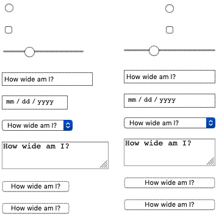
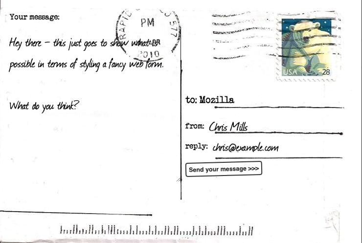

{{LearnSidebar}}{{PreviousMenuNext("Learn/Forms/Other_form_controls","Learn/Forms/Advanced_form_styling","Learn/Forms")}}

In the previous few articles, we showed how to create web forms in HTML. Now, we'll show how to style them in [CSS](/en-US/docs/Web/CSS).

<table>
  <tbody>
    <tr>
      <th scope="row">Prerequisites:</th>
      <td>
        Basic computer literacy, and a basic understanding of
        <a href="/en-US/docs/Learn/HTML/Introduction_to_HTML">HTML</a> and
        <a href="/en-US/docs/Learn/CSS/First_steps">CSS</a>.
      </td>
    </tr>
    <tr>
      <th scope="row">Objective:</th>
      <td>
        To understand the issues behind styling forms, and learn some of the
        basic styling techniques that will be useful to you.
      </td>
    </tr>
  </tbody>
</table>

## Challenges in styling form widgets

### History

In 1995, [the HTML 2 specification](https://www.ietf.org/rfc/rfc1866.txt) introduced form controls (a.k.a. "form widgets", or "form elements"). But CSS wasn't released until late 1996, and wasn't supported by most browsers until years afterward; so, in the interim, browsers relied on the underlying operating system to render form widgets.

Even with CSS available, browser vendors were reluctant at first to make form elements stylable, because users were so accustomed to the looks of their respective browsers. But things have changed, and forms widgets are now mostly stylable, with a few exceptions.

### Types of widgets

#### Easy-to-style

1. {{HTMLElement("form")}}
2. {{HTMLElement("fieldset")}} and {{HTMLElement("legend")}}
3. Single-line text {{HTMLElement("input")}}s (e.g. type text, url, email), except for [`<input type="search">`](/en-US/docs/Web/HTML/Element/input/search).
4. Multi-line {{HTMLElement("textarea")}}
5. Buttons (both {{HTMLElement("input")}} and {{HTMLElement("button")}})
6. {{HTMLElement("label")}}
7. {{HTMLElement("output")}}

#### Harder-to-style

- Checkboxes and radio buttons
- [`<input type="search">`](/en-US/docs/Web/HTML/Element/input/search)

The article [Advanced form styling](/en-US/docs/Learn/Forms/Advanced_form_styling) shows how to style these.

#### Having internals can't be styled in CSS alone

- [`<input type="color">`](/en-US/docs/Web/HTML/Element/input/color)
- Date-related controls such as [`<input type="datetime-local">`](/en-US/docs/Web/HTML/Element/input/datetime-local)
- [`<input type="range">`](/en-US/docs/Web/HTML/Element/input/range)
- [`<input type="file">`](/en-US/docs/Web/HTML/Element/input/file)
- Elements involved in creating dropdown widgets, including {{HTMLElement("select")}}, {{HTMLElement("option")}}, {{HTMLElement("optgroup")}} and {{HTMLElement("datalist")}}.
- {{HTMLElement("progress")}} and {{HTMLElement("meter")}}

For example, the date picker calendar, and the button on \<select> that displays an options list when clicked, can't be styled using CSS alone.

The articles [Advanced form styling](/en-US/docs/Learn/Forms/Advanced_form_styling) and [How to build custom form controls](/en-US/docs/Learn/Forms/How_to_build_custom_form_controls) describe how to style these.

> **Note:** some proprietary CSS pseudo-elements, such as {{cssxref('::-moz-range-track')}}, are capable of styling such internal components, but these aren't consistent across browsers, so aren't very reliable. We will mention these later.

## Styling simple form widgets

The "easy-to-style" widgets in the previous section may be styled using techniques from the articles [Your first form](/en-US/docs/Learn/Forms/Your_first_form) and [CSS building blocks](/en-US/docs/Learn/CSS/Building_blocks). There are also special selectors — [UI pseudo-classes](/en-US/docs/Learn/Forms/UI_pseudo-classes) — that enable styling based on the current state of the UI.

We'll walk through an example at the end of this article — but first, here are some special aspects of form styling that are worth knowing about.

### Fonts and text

CSS font and text features can be used easily with any widget (and yes, you can use {{cssxref("@font-face")}} with form widgets). However, browser behavior is often inconsistent. By default, some widgets do not inherit {{cssxref("font-family")}} and {{cssxref("font-size")}} from their parents. Many browsers use the system's default appearance instead. To make your forms' appearance consistent with the rest of your content, you can add the following rules to your stylesheet:

```css
button,
input,
select,
textarea {
  font-family: inherit;
  font-size: 100%;
}
```

The {{cssxref('inherit')}} property value causes the property value to match the computed value of the property of its parent element; inheriting the value of the parent.

The screenshots below show the difference. On the left is the default rendering of an `<input type="text">`, `<input type="date">`, {{htmlelement('select')}}, {{htmlelement('textarea')}}, `<input type="submit">`, and a `<button>` in Chrome on macOS, with the platform's default font style in use. On the right are the same elements, with our above style rule applied.


The defaults differed in a number of ways. Inheriting should change their fonts to that of the parent's font family — in this case, the default serif font of the parent container. They all do, with a strange exception — `<input type="submit">` does not inherit from the parent paragraph in Chrome. Rather, it uses the {{cssxref('font-family#Values', 'font-family: system-ui')}}. This is another reason to use `<button>` elements over their equivalent input types!

There's a lot of debate as to whether forms look better using the system default styles, or customized styles designed to match your content. This decision is yours to make, as the designer of your site, or web application.

### Box sizing

All text fields have complete support for every property related to the CSS box model, such as {{cssxref("width")}}, {{cssxref("height")}}, {{cssxref("padding")}}, {{cssxref("margin")}}, and {{cssxref("border")}}. As before, however, browsers rely on the system default styles when displaying these widgets. It's up to you to define how you wish to blend them into your content. If you want to keep the native look and feel of the widgets, you'll face a little difficulty if you want to give them a consistent size.

**This is because each widget has its own rules for border, padding, and margin.** To give the same size to several different widgets, you can use the {{cssxref("box-sizing")}} property along with some consistent values for other properties:

```css
input,
textarea,
select,
button {
  width: 150px;
  padding: 0;
  margin: 0;
  box-sizing: border-box;
}
```

In the screenshot below, the left column shows the default rendering of an \<input type="radio">, \<input type="checkbox">, \<input type="range">, \<input type="text">, \<input type="date"> input, {{htmlelement('select')}}, {{htmlelement('textarea')}},\<input type="submit">, and {{htmlelement('button')}}. The right column on the other hand shows the same elements with our above rule applied to them. Notice how this lets us ensure that all of the elements occupy the same amount of space, despite the platform's default rules for each kind of widget.



What may not be apparent via the screenshot is that the radio and checkbox controls still look the same, but they are centered in the 150px of horizontal space provided by the {{cssxref('width')}} property. Other browsers may not center the widgets, but they do adhere to the space allotted.

### Legend placement

The {{HTMLElement("legend")}} element is okay to style, but it can be a bit tricky to control the placement of it. By default, it is always positioned over the top border of its {{HTMLElement("fieldset")}} parent, near the top left corner. To position it somewhere else, for example inside the fieldset somewhere, or near the bottom left corner, you need to rely on the positioning.

Take the following example:

{{EmbedGHLiveSample("learning-area/html/forms/native-form-widgets/positioned-legend.html", '100%', 400)}}

To position the legend in this manner, we used the following CSS (other declarations removed for brevity):

```css
fieldset {
  position: relative;
}

legend {
  position: absolute;
  bottom: 0;
  right: 0;
}
```

The `<fieldset>` needs to be positioned too, so that the `<legend>` is positioned relative to it (otherwise the `<legend>` would be positioned relative to the `<body>`).

The {{HTMLElement("legend")}} element is very important for accessibility — it will be spoken by assistive technologies as part of the label of each form element inside the fieldset — but using a technique like the one above is fine. The legend contents will still be spoken in the same way; it is just the visual position that has changed.

> **Note:** You could also use the {{cssxref("transform")}} property to help you with positioning your `<legend>`. However, when you position it with for example a `transform: translateY();`, it moves but leaves an ugly gap in the `<fieldset>` border, which is not easy to get rid of.

## A specific styling example

Let's look at a concrete example of how to style an HTML form. We will build a fancy-looking "postcard" contact form; [see here for the finished version](https://mdn.github.io/learning-area/html/forms/postcard-example/).

If you want to follow along with this example, make a local copy of our [postcard-start.html file](https://github.com/mdn/learning-area/blob/main/html/forms/postcard-example/postcard-start.html), and follow the below instructions.

### The HTML

The HTML is only slightly more involved than the example we used in [the first article of this guide](/en-US/docs/Learn/Forms/Your_first_form); it just has a few extra IDs and a heading.

```html
<form>
  <h1>to: Mozilla</h1>

  <div id="from">
    <label for="name">from:</label>
    <input type="text" id="name" name="user_name" />
  </div>

  <div id="reply">
    <label for="mail">reply:</label>
    <input type="email" id="mail" name="user_email" />
  </div>

  <div id="message">
    <label for="msg">Your message:</label>
    <textarea id="msg" name="user_message"></textarea>
  </div>

  <div class="button">
    <button type="submit">Send your message</button>
  </div>
</form>
```

Add the above code into the body of your HTML.

### Organizing your assets

This is where the fun begins! Before we start coding, we need three additional assets:

1. [The postcard background](background.jpg) — download this image and save it in the same directory as your working HTML file.
2. A typewriter font: [The "Mom's Typewriter" font from dafont.com](https://www.dafont.com/moms-typewriter.font?back=theme) — download the TTF file into the same directory as above.
3. A hand-drawn font: [The "Journal" font from dafont.com](https://www.dafont.com/journal.font) — download the TTF file into the same directory as above.

Your fonts need some more processing before you start:

1. Go to the fontsquirrel.com [Webfont Generator](https://www.fontsquirrel.com/tools/webfont-generator).
2. Using the form, upload both your font files and generate a webfont kit. Download the kit to your computer.
3. Unzip the provided zip file.
4. Inside the unzipped contents you will find some font files (at the time of writing, two `.woff` files and two `.woff2` files; they might vary in the future.) Copy these files into a directory called fonts, in the same directory as before. We are using two different files for each font to maximize browser compatibility; see our [Web fonts](/en-US/docs/Learn/CSS/Styling_text/Web_fonts) article for a lot more information.

### The CSS

Now we can dig into the CSS for the example. Add all the code blocks shown below inside the {{htmlelement("style")}} element, one after another.

#### Overall layout

First, we prepare by defining our {{cssxref("@font-face")}} rules, and all the basic styles set on the {{HTMLElement("body")}} and {{HTMLElement("form")}} elements. If the fontsquirrel output was different from what we described above, you can find the correct `@font-face` blocks inside your downloaded webfont kit, in the `stylesheet.css` file (you'll need to replace the below `@font-face` blocks with them, and update the paths to the font files):

```css
@font-face {
  font-family: "handwriting";
  src:
    url("fonts/journal-webfont.woff2") format("woff2"),
    url("fonts/journal-webfont.woff") format("woff");
  font-weight: normal;
  font-style: normal;
}

@font-face {
  font-family: "typewriter";
  src:
    url("fonts/momot___-webfont.woff2") format("woff2"),
    url("fonts/momot___-webfont.woff") format("woff");
  font-weight: normal;
  font-style: normal;
}

body {
  font: 1.3rem sans-serif;
  padding: 0.5em;
  margin: 0;
  background: #222;
}

form {
  position: relative;
  width: 740px;
  height: 498px;
  margin: 0 auto;
  padding: 1em;
  box-sizing: border-box;
  background: #fff url(background.jpg);

  /* we create our grid */
  display: grid;
  grid-gap: 20px;
  grid-template-columns: repeat(2, 1fr);
  grid-template-rows: 10em 1em 1em 1em;
}
```

Notice that we've used some [CSS Grid](/en-US/docs/Web/CSS/CSS_grid_layout) and [Flexbox](/en-US/docs/Web/CSS/CSS_flexible_box_layout) to lay out the form. Using this we can easily position our elements, including the title and all the form elements:

```css
h1 {
  font:
    1em "typewriter",
    monospace;
  align-self: end;
}

#message {
  grid-row: 1 / 5;
}

#from,
#reply {
  display: flex;
}
```

#### Labels and controls

Now we can start working on the form elements themselves. First, let's ensure that the {{HTMLElement("label")}}s are given the right font:

```css
label {
  font:
    0.8em "typewriter",
    sans-serif;
}
```

The text fields require some common rules. In other words, we remove their {{cssxref("border","borders")}} and {{cssxref("background","backgrounds")}}, and redefine their {{cssxref("padding")}} and {{cssxref("margin")}}:

```css
input,
textarea {
  font:
    1.4em/1.5em "handwriting",
    cursive,
    sans-serif;
  border: none;
  padding: 0 10px;
  margin: 0;
  width: 80%;
  background: none;
}
```

When one of these fields gains focus, we highlight them with a light grey, transparent, background (it is always important to have focus style, for usability and keyboard accessibility):

```css
input:focus,
textarea:focus {
  background: rgba(0, 0, 0, 0.1);
  border-radius: 5px;
}
```

Now that our text fields are complete, we need to adjust the display of the single and multiple-line text fields to match, since they won't typically look the same using the defaults.

#### Tweaking the textareas

{{HTMLElement("textarea")}} elements default to being rendered as an inline-block element. The two important things here are the {{cssxref("resize")}} and {{cssxref("overflow")}} properties. While our design is a fixed-size design, and we could use the `resize` property to prevent users from resizing our multi-line text field, it is best to not prevent users from resizing a textarea if they so choose. The {{cssxref("overflow")}} property is used to make the field render more consistently across browsers. Some browsers default to the value `auto`, while some default to the value `scroll`. In our case, it's better to be sure everyone will use `auto`:

```css
textarea {
  display: block;

  padding: 10px;
  margin: 10px 0 0 -10px;
  width: 100%;
  height: 90%;

  border-right: 1px solid;

  /* resize  : none; */
  overflow: auto;
}
```

#### Styling the submit button

The {{HTMLElement("button")}} element is really convenient to style with CSS; you can do whatever you want, even using [pseudo-elements](/en-US/docs/Web/CSS/Pseudo-elements):

```css
button {
  padding: 5px;
  font: bold 0.6em sans-serif;
  border: 2px solid #333;
  border-radius: 5px;
  background: none;
  cursor: pointer;
  transform: rotate(-1.5deg);
}

button:after {
  content: " >>>";
}

button:hover,
button:focus {
  outline: none;
  background: #000;
  color: #fff;
}
```

### The final result

And voilà! Your form should now look like this:



> **Note:** If your example does not work quite as you expected and you want to check it against our version, you can find it on GitHub — see it [running live](https://mdn.github.io/learning-area/html/forms/postcard-example/) (also see [the source code](https://github.com/mdn/learning-area/tree/main/html/forms/postcard-example)).

## Test your skills

You've reached the end of this article, but can you remember the most important information? You can find some further tests to verify that you've retained this information before you move on — see [Test your skills: Styling basics](/en-US/docs/Learn/Forms/Test_your_skills:_Styling_basics).

## Summary

As you can see, as long as we want to build forms with just text fields and buttons, it's easy to style them using CSS. [In the next article](/en-US/docs/Learn/Forms/Advanced_form_styling), we will see how to handle form widgets which fall into the "bad" and "ugly" categories.

{{PreviousMenuNext("Learn/Forms/Other_form_controls","Learn/Forms/Advanced_form_styling","Learn/Forms")}}

### Advanced Topics

- [How to build custom form controls](/en-US/docs/Learn/Forms/How_to_build_custom_form_controls)
- [Sending forms through JavaScript](/en-US/docs/Learn/Forms/Sending_forms_through_JavaScript)
- [Property compatibility table for form widgets](/en-US/docs/Learn/Forms/Property_compatibility_table_for_form_controls)
