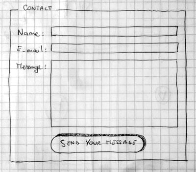

{{LearnSidebar}}{{NextMenu("Learn/Forms/How_to_structure_a_web_form", "Learn/Forms")}}

The first article in our series provides you with your very first experience of creating a web form, including designing a simple form, implementing it using the right HTML form controls and other HTML elements, adding some very simple styling via CSS, and describing how data is sent to a server.
We'll expand on each of these subtopics in more detail later on in the module.

<table>
  <tbody>
    <tr>
      <th scope="row">Prerequisites:</th>
      <td>
        Basic computer literacy, and a basic
        <a href="/en-US/docs/Learn/HTML/Introduction_to_HTML"
          >understanding of HTML</a
        >.
      </td>
    </tr>
    <tr>
      <th scope="row">Objective:</th>
      <td>
        To gain familiarity with what web forms are, what they are used for, how
        to think about designing them, and the basic HTML elements you'll need
        for simple cases.
      </td>
    </tr>
  </tbody>
</table>

## What are web forms?

**Web forms** are one of the main points of interaction between a user and a website or application.
Forms allow users to enter data, which is generally sent to a web server for processing and storage (see [Sending form data](/en-US/docs/Learn/Forms/Sending_and_retrieving_form_data) later in the module), or used on the client-side to immediately update the interface in some way (for example, add another item to a list, or show or hide a UI feature).

A web form's HTML is made up of one or more **form controls** (sometimes called **widgets**), plus some additional elements to help structure the overall form — they are often referred to as **HTML forms**.
The controls can be single or multi-line text fields, dropdown boxes, buttons, checkboxes, or radio buttons, and are mostly created using the {{htmlelement("input")}} element, although there are some other elements to learn about too.

Form controls can also be programmed to enforce specific formats or values to be entered (**form validation**), and paired with text labels that describe their purpose to both sighted and visually impaired users.

## Designing your form

Before starting to code, it's always better to step back and take the time to think about your form. Designing a quick mockup will help you to define the right set of data you want to ask your user to enter. From a user experience (UX) point of view, it's important to remember that the bigger your form, the more you risk frustrating people and losing users. Keep it simple and stay focused: ask only for the data you absolutely need.

Designing forms is an important step when you are building a site or application.
It's beyond the scope of this article to cover the user experience of forms, but if you want to dig into that topic you should read the following articles:

- Smashing Magazine has some [good articles about forms UX](https://www.smashingmagazine.com/2018/08/ux-html5-mobile-form-part-1/), including an older but still relevant [Extensive Guide To Web Form Usability](https://www.smashingmagazine.com/2011/11/extensive-guide-web-form-usability/) article.
- UXMatters is also a very thoughtful resource with good advice from [basic best practices](https://www.uxmatters.com/mt/archives/2012/05/7-basic-best-practices-for-buttons.php) to complex concerns such as [multipage forms](https://www.uxmatters.com/mt/archives/2010/03/pagination-in-web-forms-evaluating-the-effectiveness-of-web-forms.php).

In this article, we'll build a simple contact form. Let's make a rough sketch.



Our form will contain three text fields and one button. We are asking the user for their name, their email and the message they want to send. Hitting the button will send their data to a web server.

## Active learning: Implementing our form HTML

Ok, let's have a go at creating the HTML for our form. We will use the following HTML elements: {{HTMLelement("form")}}, {{HTMLelement("label")}}, {{HTMLelement("input")}}, {{HTMLelement("textarea")}}, and {{HTMLelement("button")}}.

Before you go any further, make a local copy of our [simple HTML template](https://github.com/mdn/learning-area/blob/main/html/introduction-to-html/getting-started/index.html) — you'll enter your form HTML into here.

### The `<form>` element

All forms start with a {{HTMLelement("form")}} element, like this:

```html
<form action="/my-handling-form-page" method="post">…</form>
```

This element formally defines a form. It's a container element like a {{HTMLelement("section")}} or {{HTMLelement("footer")}} element, but specifically for containing forms; it also supports some specific attributes to configure the way the form behaves. All of its attributes are optional, but it's standard practice to always set at least the [`action`](/en-US/docs/Web/HTML/Element/form#action) and [`method`](/en-US/docs/Web/HTML/Element/form#method) attributes:

- The `action` attribute defines the location (URL) where the form's collected data should be sent when it is submitted.
- The `method` attribute defines which HTTP method to send the data with (usually `get` or `post`).

> **Note:** We'll look at how those attributes work in our [Sending form data](/en-US/docs/Learn/Forms/Sending_and_retrieving_form_data) article later on.

For now, add the above {{htmlelement("form")}} element into your HTML {{htmlelement("body")}}.

### The `<label>`, `<input>`, and `<textarea>` elements

Our contact form is not complex: the data entry portion contains three text fields, each with a corresponding {{HTMLelement("label")}}:

- The input field for the name is a {{HTMLelement("input/text", "single-line text field")}}.
- The input field for the email is an {{HTMLelement("input/email", "input of type email")}}: a single-line text field that accepts only email addresses.
- The input field for the message is a {{HTMLelement("textarea")}}; a multiline text field.

In terms of HTML code we need something like the following to implement these form widgets:

```html
<form action="/my-handling-form-page" method="post">
  <ul>
    <li>
      <label for="name">Name:</label>
      <input type="text" id="name" name="user_name" />
    </li>
    <li>
      <label for="mail">Email:</label>
      <input type="email" id="mail" name="user_email" />
    </li>
    <li>
      <label for="msg">Message:</label>
      <textarea id="msg" name="user_message"></textarea>
    </li>
  </ul>
</form>
```

Update your form code to look like the above.

The {{HTMLelement("li")}} elements are there to conveniently structure our code and make styling easier (see later in the article).
For usability and accessibility, we include an explicit label for each form control.
Note the use of the [`for`](/en-US/docs/Web/HTML/Attributes/for) attribute on all {{HTMLelement("label")}} elements, which takes as its value the [`id`](/en-US/docs/Web/HTML/Global_attributes/id) of the form control with which it is associated — this is how you associate a form control with its label.

There is great benefit to doing this — it associates the label with the form control, enabling mouse, trackpad, and touch device users to click on the label to activate the corresponding control, and it also provides an accessible name for screen readers to read out to their users.
You'll find further details of form labels in [How to structure a web form](/en-US/docs/Learn/Forms/How_to_structure_a_web_form).

On the {{HTMLelement("input")}} element, the most important attribute is the `type` attribute.
This attribute is extremely important because it defines the way the {{HTMLelement("input")}} element appears and behaves.
You'll find more about this in the [Basic native form controls](/en-US/docs/Learn/Forms/Basic_native_form_controls) article later on.

- In our simple example, we use the value {{HTMLelement("input/text", "text")}} for the first input — the default value for this attribute.
  It represents a basic single-line text field that accepts any kind of text input.
- For the second input, we use the value {{HTMLelement("input/email", "email")}}, which defines a single-line text field that only accepts a well-formed email address.
  This turns a basic text field into a kind of "intelligent" field that will perform some validation checks on the data typed by the user.
  It also causes a more appropriate keyboard layout for entering email addresses (e.g. with an @ symbol by default) to appear on devices with dynamic keyboards, like smartphones.
  You'll find out more about form validation in the [client-side form validation](/en-US/docs/Learn/Forms/Form_validation) article later on.

Last but not least, note the syntax of `<input>` vs. `<textarea></textarea>`.
This is one of the oddities of HTML.
The `<input>` tag is a {{glossary("void element")}}, meaning that it doesn't need a closing tag.
{{HTMLElement("textarea")}} is not a void element, meaning it should be closed with the proper ending tag.
This has an impact on a specific feature of forms: the way you define the default value.
To define the default value of an {{HTMLElement("input")}} element you have to use the [`value`](/en-US/docs/Web/HTML/Element/input#value) attribute like this:

```html
<input type="text" value="by default this element is filled with this text" />
```

On the other hand, if you want to define a default value for a {{HTMLElement("textarea")}}, you put it between the opening and closing tags of the {{HTMLElement("textarea")}} element, like this:

```html
<textarea>
by default this element is filled with this text
</textarea>
```

### The `<button>` element

The markup for our form is almost complete; we just need to add a button to allow the user to send, or "submit", their data once they have filled out the form.
This is done by using the {{HTMLelement("button")}} element; add the following just above the closing `</ul>` tag:

```html
<li class="button">
  <button type="submit">Send your message</button>
</li>
```

The {{htmlelement("button")}} element also accepts a `type` attribute — this accepts one of three values: `submit`, `reset`, or `button`.

- A click on a `submit` button (the default value) sends the form's data to the web page defined by the `action` attribute of the {{HTMLelement("form")}} element.
- A click on a `reset` button resets all the form widgets to their default value immediately. From a UX point of view, this is considered bad practice, so you should avoid using this type of button unless you really have a good reason to include one.
- A click on a `button` button does _nothing_! That sounds silly, but it's amazingly useful for building custom buttons — you can define their chosen functionality with JavaScript.

> **Note:** You can also use the {{HTMLElement("input")}} element with the corresponding `type` to produce a button, for example `<input type="submit">`. The main advantage of the {{HTMLelement("button")}} element is that the {{HTMLelement("input")}} element only allows plain text in its label whereas the {{HTMLelement("button")}} element allows full HTML content, allowing more complex, creative button content.

## Basic form styling

Now that you have finished writing your form's HTML code, try saving it and looking at it in a browser. At the moment, you'll see that it looks rather ugly.

> **Note:** If you don't think you've got the HTML code right, try comparing it with our finished example — see [first-form.html](https://github.com/mdn/learning-area/blob/main/html/forms/your-first-HTML-form/first-form.html) ([also see it live](https://mdn.github.io/learning-area/html/forms/your-first-HTML-form/first-form.html)).

Forms are notoriously tricky to style nicely. It is beyond the scope of this article to teach you form styling in detail, so for the moment we will just get you to add some CSS to make it look OK.

First of all, add a {{htmlelement("style")}} element to your page, inside your HTML head. It should look like so:

```html
<style>
  …
</style>
```

Inside the `style` tags, add the following CSS:

```css
form {
  /* Center the form on the page */
  margin: 0 auto;
  width: 400px;
  /* Form outline */
  padding: 1em;
  border: 1px solid #ccc;
  border-radius: 1em;
}

ul {
  list-style: none;
  padding: 0;
  margin: 0;
}

form li + li {
  margin-top: 1em;
}

label {
  /* Uniform size & alignment */
  display: inline-block;
  width: 90px;
  text-align: right;
}

input,
textarea {
  /* To make sure that all text fields have the same font settings
     By default, textareas have a monospace font */
  font: 1em sans-serif;

  /* Uniform text field size */
  width: 300px;
  box-sizing: border-box;

  /* Match form field borders */
  border: 1px solid #999;
}

input:focus,
textarea:focus {
  /* Additional highlight for focused elements */
  border-color: #000;
}

textarea {
  /* Align multiline text fields with their labels */
  vertical-align: top;

  /* Provide space to type some text */
  height: 5em;
}

.button {
  /* Align buttons with the text fields */
  padding-left: 90px; /* same size as the label elements */
}

button {
  /* This extra margin represent roughly the same space as the space
     between the labels and their text fields */
  margin-left: 0.5em;
}
```

Save and reload, and you'll see that your form should look much less ugly.

> **Note:** You can find our version on GitHub at [first-form-styled.html](https://github.com/mdn/learning-area/blob/main/html/forms/your-first-HTML-form/first-form-styled.html) ([also see it live](https://mdn.github.io/learning-area/html/forms/your-first-HTML-form/first-form-styled.html)).

## Sending form data to your web server

The last part, and perhaps the trickiest, is to handle form data on the server side.
The {{HTMLelement("form")}} element defines where and how to send the data thanks to the [`action`](/en-US/docs/Web/HTML/Element/form#action) and [`method`](/en-US/docs/Web/HTML/Element/form#method) attributes.

We provide a `name` attribute for each form control.
The names are important on both the client- and server-side; they tell the browser which name to give each piece of data and, on the server side, they let the server handle each piece of data by name.
The form data is sent to the server as name/value pairs.

To name the data in a form, you need to use the `name` attribute on each form widget that will collect a specific piece of data.
Let's look at some of our form code again:

```html
<form action="/my-handling-form-page" method="post">
  <ul>
    <li>
      <label for="name">Name:</label>
      <input type="text" id="name" name="user_name" />
    </li>
    <li>
      <label for="mail">Email:</label>
      <input type="email" id="mail" name="user_email" />
    </li>
    <li>
      <label for="msg">Message:</label>
      <textarea id="msg" name="user_message"></textarea>
    </li>

    …
  </ul>
</form>
```

In our example, the form will send 3 pieces of data named "`user_name`", "`user_email`", and "`user_message`".
That data will be sent to the URL "`/my-handling-form-page`" using the [HTTP `POST`](/en-US/docs/Web/HTTP/Methods/POST) method.

On the server side, the script at the URL "`/my-handling-form-page`" will receive the data as a list of 3 key/value items contained in the HTTP request.
The way this script will handle that data is up to you.
Each server-side language (PHP, Python, Ruby, Java, C#, etc.) has its own mechanism of handling form data.
It's beyond the scope of this guide to go deeply into that subject, but if you want to know more, we have provided some examples in our [Sending form data](/en-US/docs/Learn/Forms/Sending_and_retrieving_form_data) article later on.

## Summary

Congratulations, you've built your first web form. It looks like this live:

```html hidden
<form action="/my-handling-form-page" method="post">
  <div>
    <label for="name">Name:</label>
    <input type="text" id="name" name="user_name" />
  </div>

  <div>
    <label for="mail">Email:</label>
    <input type="email" id="mail" name="user_email" />
  </div>

  <div>
    <label for="msg">Message:</label>
    <textarea id="msg" name="user_message"></textarea>
  </div>

  <div class="button">
    <button type="submit">Send your message</button>
  </div>
</form>
```

```css hidden
form {
  /* Just to center the form on the page */
  margin: 0 auto;
  width: 400px;

  /* To see the limits of the form */
  padding: 1em;
  border: 1px solid #ccc;
  border-radius: 1em;
}

div + div {
  margin-top: 1em;
}

label {
  /* To make sure that all label have the same size and are properly align */
  display: inline-block;
  width: 90px;
  text-align: right;
}

input,
textarea {
  /* To make sure that all text field have the same font settings
     By default, textarea are set with a monospace font */
  font: 1em sans-serif;

  /* To give the same size to all text field */
  width: 300px;

  -moz-box-sizing: border-box;
  box-sizing: border-box;

  /* To harmonize the look & feel of text field border */
  border: 1px solid #999;
}

input:focus,
textarea:focus {
  /* To give a little highlight on active elements */
  border-color: #000;
}

textarea {
  /* To properly align multiline text field with their label */
  vertical-align: top;

  /* To give enough room to type some text */
  height: 5em;

  /* To allow users to resize any textarea vertically
     It works only on Chrome, Firefox and Safari */
  resize: vertical;
}

.button {
  /* To position the buttons to the same position of the text fields */
  padding-left: 90px; /* same size as the label elements */
}

button {
  /* This extra margin represent the same space as the space between
     the labels and their text fields */
  margin-left: 0.5em;
}
```

{{ EmbedLiveSample('Summary', '', '300') }}

That's only the beginning, however — now it's time to take a deeper look. Forms have way more power than what we saw here and the other articles in this module will help you to master the rest.

{{NextMenu("Learn/Forms/How_to_structure_a_web_form", "Learn/Forms")}}

### Advanced Topics

- [How to build custom form controls](/en-US/docs/Learn/Forms/How_to_build_custom_form_controls)
- [Sending forms through JavaScript](/en-US/docs/Learn/Forms/Sending_forms_through_JavaScript)
- [Property compatibility table for form widgets](/en-US/docs/Learn/Forms/Property_compatibility_table_for_form_controls)
