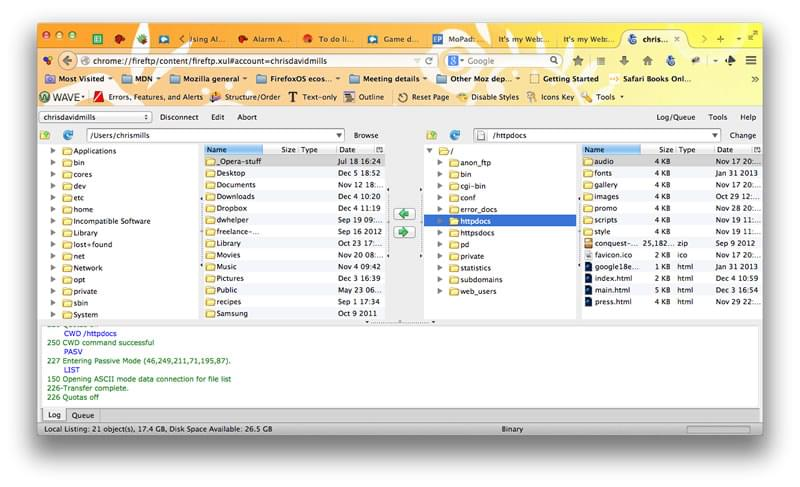
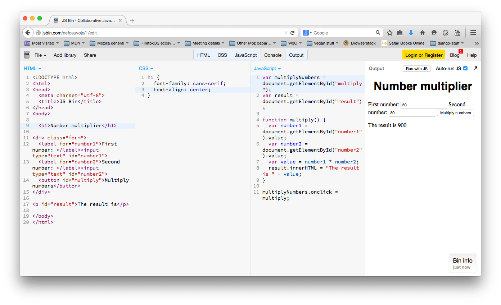
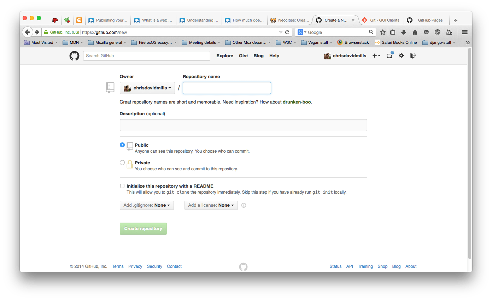

{{LearnSidebar}}{{PreviousMenuNext("Learn/Getting_started_with_the_web/JavaScript_basics", "Learn/Getting_started_with_the_web/How_the_Web_works", "Learn/Getting_started_with_the_web")}}

Once you finish writing the code and organizing the files that make up your website, you need to put it all online so people can find it. This article explains how to get your simple sample code online with little effort.

## What are the options?

Publishing a website is a complex topic because there are many ways to go about it. This article doesn't attempt to document all the possible methods. Instead, it explains the advantages and disadvantages of three approaches that are practical for beginners. Then it steps through one method that can work right away for many readers.

### Getting hosting and a domain name

To have more control over content and website appearance, most people choose to buy web hosting and a domain name:

- Web hosting is rented file space on a hosting company's [web server](/en-US/docs/Learn/Common_questions/Web_mechanics/What_is_a_web_server). You put website files on the web server. The web server provides website content to website visitors.
- A [domain name](/en-US/docs/Learn/Common_questions/Web_mechanics/What_is_a_domain_name) is the unique address where people find your website, such as `https://www.mozilla.org` or `https://www.bbc.co.uk`. You can rent your domain name for as many years as you want from a **domain registrar**.

Many professional websites go online this way.

In addition, you will need a {{Glossary("FTP", "File Transfer Protocol (FTP)")}} program (see [How much does it cost: software](/en-US/docs/Learn/Common_questions/Tools_and_setup/How_much_does_it_cost#software) for more details) to actually transfer the website files over to the server. FTP programs vary widely, but generally, you have to connect to your web server using details provided by your hosting company (typically username, password, hostname). Then the program shows you your local files and the web server's files in two windows, and provides a way for you to transfer files back and forth.

#### Tips for finding hosting and domains

- MDN does not promote specific commercial hosting companies or domain name registrars. To find hosting companies and registrars, just search for "web hosting" and "domain names". All registrars will have a feature to allow you to check if the domain name you want is available.
- Your home or office {{Glossary("ISP", "internet service provider")}} may provide some limited hosting for a small website. The available feature set will be limited, but it might be perfect for your first experiments.
- There are also free services available like [Neocities](https://neocities.org/), [Google Sites](https://sites.google.com/), [Blogger](https://www.blogger.com), and [WordPress](https://wordpress.com/). Sometimes you get what you pay for, but sometimes these resources are good enough for your initial experiments.
- Many companies provide hosting and domains.

### Using an online tool like GitHub or Google App Engine

Some tools let you publish your website online:

- [GitHub](https://github.com/) is a "social coding" site. It allows you to upload code repositories for storage in the [Git](https://git-scm.com/) **version control system.** You can then collaborate on code projects, and the system is open-source by default, meaning that anyone in the world can find your GitHub code, use it, learn from it, and improve on it. GitHub has a very useful feature called [GitHub Pages](https://pages.github.com/), which allows you to expose website code live on the web.
- [Google App Engine](https://cloud.google.com/appengine/) is a powerful platform that lets you build and run applications on Google's infrastructure — whether you need to build a multi-tiered web application from scratch or host a static website. See [How do you host your website on Google App Engine?](/en-US/docs/Learn/Common_questions/Tools_and_setup/How_do_you_host_your_website_on_Google_App_Engine) for more information.

These options are usually free, but you may outgrow the limited feature-set.

### Using a web-based IDE such as CodePen

There are a number of web apps that emulate a website development environment, allowing you to enter HTML, CSS and JavaScript, and then display the result of that code as a website — all in one browser tab. Generally speaking, these tools are relatively easy, great for learning, good for sharing code (for example, if you want to share a technique with or ask for debugging help from colleagues in a different office), and free (for basic features). They host your rendered page at a unique web address. However, the features are limited, and these apps usually don't provide hosting space for assets (like images).

Try playing with some of these examples to find out which one works best for you:

- [JSFiddle](https://jsfiddle.net/)
- [Glitch](https://glitch.com/)
- [JS Bin](https://jsbin.com/)
- [CodePen](https://codepen.io/)

## Publishing via GitHub

Now let's examine how to easily publish your site via GitHub Pages.

1. First of all, [sign up for GitHub](https://github.com/) and verify your email address.
2. Next, you need to [create a repository](https://github.com/new) to store files.
3. On this page, in the _Repository name_ box, enter _username_.github.io, where _username_ is your username. For example, our friend Bob Smith would enter _bobsmith.github.io_.
   Check the "_Initialize this repository with a README"_ box. Then click _Create repository_.
4. Drag and drop the content of your website folder into your repository. Then click _Commit changes_.

   > **Note:** Make sure your folder has an `index.html` file.

5. Navigate your browser to _username_.github.io to see your website online. For example, for the username _chrisdavidmills_, go to [_chrisdavidmills_.github.io](https://chrisdavidmills.github.io/).

   > **Note:** It may take a few minutes for your website to go live. If your website does not display immediately, wait a few minutes. Try again.

To learn more, see [GitHub Pages Help](https://docs.github.com/en/pages/getting-started-with-github-pages).

## Further reading

- [What is a web server](/en-US/docs/Learn/Common_questions/Web_mechanics/What_is_a_web_server)
- [Understanding domain names](/en-US/docs/Learn/Common_questions/Web_mechanics/What_is_a_domain_name)
- [How much does it cost to do something on the web?](/en-US/docs/Learn/Common_questions/Tools_and_setup/How_much_does_it_cost)
- [Deploy a Website](https://www.codecademy.com/learn/deploy-a-website): A nice tutorial from Codecademy that goes a bit further and shows some additional techniques.

{{PreviousMenuNext("Learn/Getting_started_with_the_web/JavaScript_basics", "Learn/Getting_started_with_the_web/How_the_Web_works", "Learn/Getting_started_with_the_web")}}
