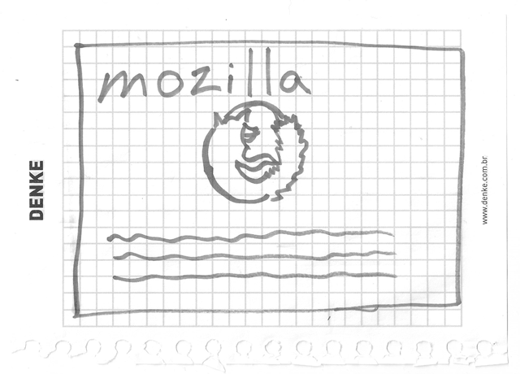
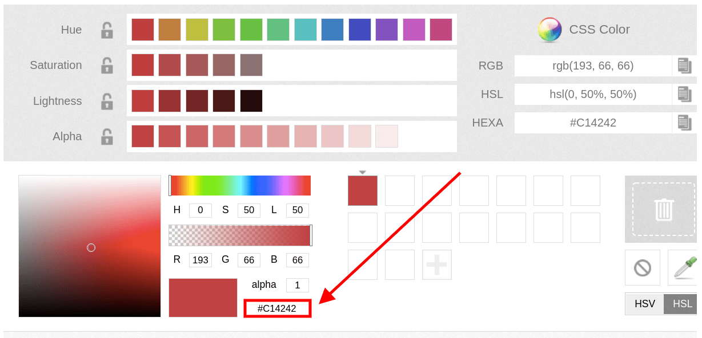
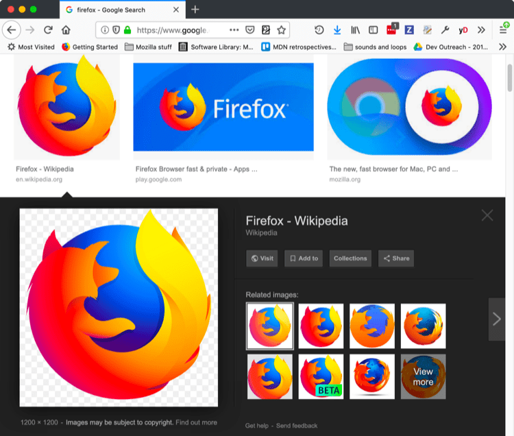
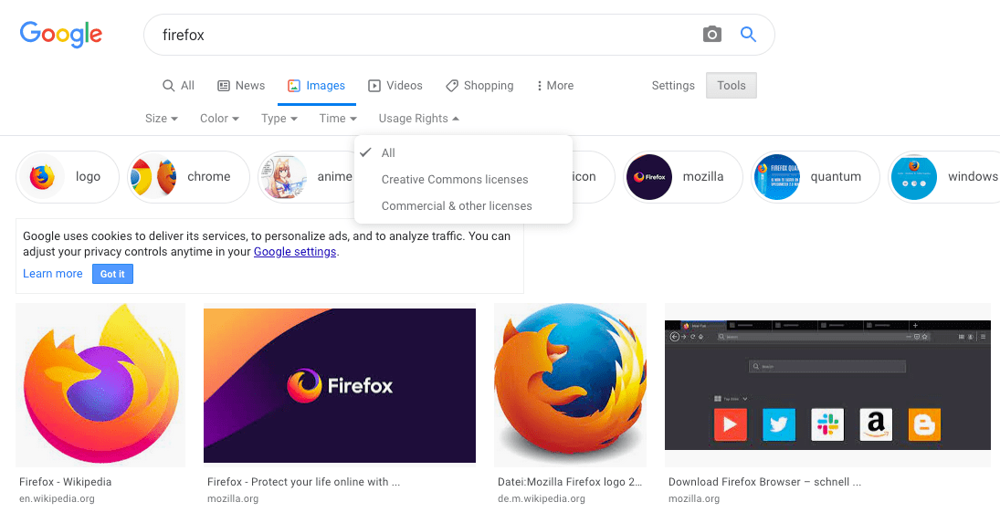

{{LearnSidebar}}{{PreviousMenuNext("Learn/Getting_started_with_the_web/Installing_basic_software", "Learn/Getting_started_with_the_web/Dealing_with_files", "Learn/Getting_started_with_the_web")}}

_What will your website look like?_ discusses the planning and design work you have to do for your website before writing code, including "What information does my website offer?", "What fonts and colors do I want?", and "What does my site do?"

## First things first: planning

Before doing anything, you need some ideas. What should your website actually do? A website can do basically anything, but, for your first try, you should keep things simple. We'll start by creating a simple webpage with a heading, an image, and a few paragraphs.

To begin, you'll need to answer these questions:

1. **What is your website about?** Do you like dogs, New York, or Pac-Man?
2. **What information are you presenting on the subject?** Write a title and a few paragraphs and think of an image you'd like to show on your page.
3. **What does your website look like,** in simple high-level terms? What's the background color? What kind of font is appropriate: formal, cartoony, bold and loud, subtle?

> **Note:** Complex projects need detailed guidelines that go into all the details of colors, fonts, spacing between items on a page, appropriate writing style, and so on. This is sometimes called a design guide, design system, or brand book, and you can see an example at the [Firefox Photon Design System](https://design.firefox.com/photon/).

## Sketching out your design

Next, grab pen and paper and sketch out roughly how you want your site to look. For your first simple webpage, there's not much to sketch out, but you should get in the habit of doing this now. It really helps — you don't have to be Van Gogh!

> **Note:** Even on real, complex websites, the design teams usually start out with rough sketches on paper and later on build digital mockups using a graphics editor or web technologies.
>
> Web teams often include both a graphic designer and a {{Glossary("UX", "user experience")}} (UX) designer. Graphic designers put together the visuals of the website. UX designers have a somewhat more abstract role in addressing how users will experience and interact with the website.

## Choosing your assets

At this point, it's good to start putting together the content that will eventually appear on your webpage.

### Text

You should still have your paragraphs and title from earlier. Keep these close by.

### Theme color

To choose a color, go to [the Color Picker](/en-US/docs/Web/CSS/CSS_colors/Color_picker_tool) and find a color you like. When you click on a color, you'll see a strange six-character code like `#660066`. That's called a _hex code_ (short for hexadecimal), and represents your color. Copy the code down somewhere safe for now.

### Images

To choose an image, go to [Google Images](https://www.google.com/imghp?gws_rd=ssl) and search for something suitable.

1. When you find the image you want, click on the image to get an enlarged view of it.
2. Right-click the image (Ctrl + click on a Mac), choose _Save Image As…_, and choose a safe place to save your image. Alternatively, copy the image's web address from your browser's address bar for later use.

Note that most images on the web, including in Google Images, are copyrighted. To reduce your likelihood of violating copyright, you can use Google's license filter. Click on the _Tools_ button, then on the resulting _Usage rights_ option that appears below. You should choose the option _Creative Commons licenses_.

### Font

As with images, many fonts are protected by licenses, meaning you cannot freely use them in your site. [Google Fonts](https://developers.google.com/fonts) is a web service owned by Google that provides access to many fonts.

Once you have found a font, there are two main ways of using it:

1. Add a reference in your code to load the font from Google's servers.
2. Download the font file to your own system, host the font yourself, and use your hosted copy in your website's code.

> **Note:** Serving fonts hosted on Google Fonts may be incompatible with the European Union's data privacy regulation [GDPR](https://gdpr.eu/what-is-gdpr/) as the font service exposes the user's IP address. If this is a potential problem for you, choose the second option.

Alternatively you can use [safe web fonts](https://web.mit.edu/jmorzins/www/fonts.html) such as Arial, Times New Roman, or Courier New.

{{PreviousMenuNext("Learn/Getting_started_with_the_web/Installing_basic_software", "Learn/Getting_started_with_the_web/Dealing_with_files", "Learn/Getting_started_with_the_web")}}
