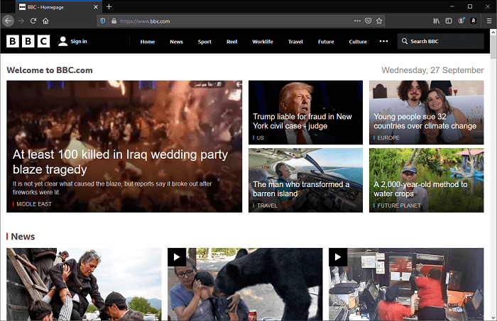
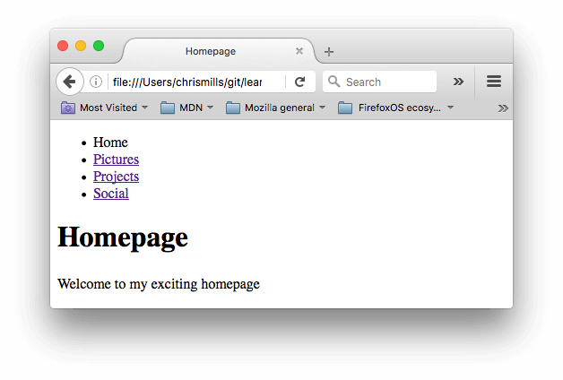

{{LearnSidebar}}{{PreviousMenuNext("Learn/HTML/Introduction_to_HTML/HTML_text_fundamentals", "Learn/HTML/Introduction_to_HTML/Advanced_text_formatting", "Learn/HTML/Introduction_to_HTML")}}

Hyperlinks are really important — they are what makes the Web _a web_.
This article shows the syntax required to make a link, and discusses link best practices.

<table>
  <tbody>
    <tr>
      <th scope="row">Prerequisites:</th>
      <td>
        Basic HTML familiarity, as covered in
        <a href="/en-US/docs/Learn/HTML/Introduction_to_HTML/Getting_started"
          >Getting started with HTML</a
        >. HTML text formatting, as covered in
        <a
          href="/en-US/docs/Learn/HTML/Introduction_to_HTML/HTML_text_fundamentals"
          >HTML text fundamentals</a
        >.
      </td>
    </tr>
    <tr>
      <th scope="row">Objective:</th>
      <td>
        To learn how to implement a hyperlink effectively, and link multiple
        files together.
      </td>
    </tr>
  </tbody>
</table>

## What is a hyperlink?

Hyperlinks are one of the most exciting innovations the Web has to offer.
They've been a feature of the Web since the beginning, and are what makes the Web _a web._
Hyperlinks allow us to link documents to other documents or resources, link to specific parts of documents, or make apps available at a web address.
Almost any web content can be converted to a link so that when clicked or otherwise activated the web browser goes to another web address ({{glossary("URL")}}).

> **Note:** A URL can point to HTML files, text files, images, text documents, video and audio files, or anything else that lives on the Web.
> If the web browser doesn't know how to display or handle the file, it will ask you if you want to open the file (in which case the duty of opening or handling the file is passed to a suitable native app on the device) or download the file (in which case you can try to deal with it later on).

For example, the BBC homepage contains many links that point not only to multiple news stories, but also different areas of the site (navigation functionality), login/registration pages (user tools), and more.



## Anatomy of a link

A basic link is created by wrapping the text or other content, see [Block level links](#block_level_links), inside an {{htmlelement("a")}} element and using the {{htmlattrxref("href", "a")}} attribute, also known as a **Hypertext Reference**, or **target**, that contains the web address.

```html
<p>I'm creating a link to
<a href="https://www.mozilla.org/en-US/">the Mozilla homepage</a>.
</p>
```

This gives us the following result:

I'm creating a link to [the Mozilla homepage](https://www.mozilla.org/en-US/).

### Adding supporting information with the title attribute

Another attribute you may want to add to your links is `title`.
The title contains additional information about the link, such as which kind of information the page contains, or things to be aware of on the website.

```html
<p>I'm creating a link to
<a href="https://www.mozilla.org/en-US/"
   title="The best place to find more information about Mozilla's
          mission and how to contribute">the Mozilla homepage</a>.
</p>
```

This gives us the following result and hovering over the link displays the title as a tooltip:

I'm creating a link to <a href="https://www.mozilla.org/en-US/" title="The best place to find more information about Mozilla's mission and how to contribute">the Mozilla homepage</a>.

> **Note:** A link title is only revealed on mouse hover, which means that people relying on keyboard controls or touchscreens to navigate web pages will have difficulty accessing title information.
> If a title's information is truly important to the usability of the page, then you should present it in a manner that will be accessible to all users, for example by putting it in the regular text.

### Active learning: creating your own example link

Create an HTML document using your local code editor and our [getting started template](https://github.com/mdn/learning-area/blob/main/html/introduction-to-html/getting-started/index.html).

- Inside the HTML body, add one or more paragraphs or other types of content you already know about.
- Change some of the content into links.
- Include title attributes.

### Block level links

As mentioned before, almost any content can be made into a link, even [block-level elements](/en-US/docs/Learn/HTML/Introduction_to_HTML/Getting_started#block_versus_inline_elements).
If you have an image you want to make into a link, use the {{htmlelement("a")}} element and reference the image file with the {{htmlelement("img")}} element.

```html
<a href="https://www.mozilla.org/en-US/">
  
</a>
```

> **Note:** You'll find out more about using images on the Web in a future article.

## A quick primer on URLs and paths

To fully understand link targets, you need to understand URLs and file paths. This section gives you the information you need to achieve this.

A URL, or Uniform Resource Locator is a string of text that defines where something is located on the Web. For example, Mozilla's English homepage is located at `https://www.mozilla.org/en-US/`.

URLs use paths to find files. Paths specify where the file you're interested in is located in the filesystem. Let's look at an example of a directory structure, see the [creating-hyperlinks](https://github.com/mdn/learning-area/tree/main/html/introduction-to-html/creating-hyperlinks) directory.


The **root** of this directory structure is called `creating-hyperlinks`. When working locally with a website, you'll have one directory that contains the entire site. Inside the **root**, we have an `index.html` file and a `contacts.html`. In a real website, `index.html` would be our home page or landing page (a web page that serves as the entry point for a website or a particular section of a website.).

There are also two directories inside our root — `pdfs` and `projects`. These each have a single file inside them — a PDF (`project-brief.pdf`) and an `index.html` file, respectively. Note that you can have two `index.html` files in one project, as long as they're in different filesystem locations. The second `index.html` would perhaps be the main landing page for project-related information.

- **Same directory**: If you wanted to include a hyperlink inside `index.html` (the top level `index.html`) pointing to `contacts.html`, you would specify the filename that you want to link to, because it's in the same directory as the current file. The URL you would use is `contacts.html`:

  ```html
  <p>Want to contact a specific staff member?
  Find details on our <a href="contacts.html">contacts page</a>.</p>
  ```

- **Moving down into subdirectories**: If you wanted to include a hyperlink inside `index.html` (the top level `index.html`) pointing to `projects/index.html`, you would need to go down into the `projects` directory before indicating the file you want to link to.
  This is done by specifying the directory's name, then a forward slash, then the name of the file. The URL you would use is `projects/index.html`:

  ```html
  <p>Visit my <a href="projects/index.html">project homepage</a>.</p>
  ```

- **Moving back up into parent directories**: If you wanted to include a hyperlink inside `projects/index.html` pointing to `pdfs/project-brief.pdf`, you'd have to go up a directory level, then back down into the `pdf` directory.
  To go up a directory, use two dots — `..` — so the URL you would use is `../pdfs/project-brief.pdf`:

  ```html
  <p>A link to my <a href="../pdfs/project-brief.pdf">project brief</a>.</p>
  ```

> **Note:** You can combine multiple instances of these features into complex URLs, if needed, for example: `../../../complex/path/to/my/file.html`.

### Document fragments

It's possible to link to a specific part of an HTML document, known as a **document fragment**, rather than just to the top of the document.
To do this you first have to assign an {{htmlattrxref("id")}} attribute to the element you want to link to.
It normally makes sense to link to a specific heading, so this would look something like the following:

```html
<h2 id="Mailing_address">Mailing address</h2>
```

Then to link to that specific `id`, you'd include it at the end of the URL, preceded by a hash/pound symbol (`#`), for example:

```html
<p>Want to write us a letter? Use our <a href="contacts.html#Mailing_address">mailing address</a>.</p>
```

You can even use the document fragment reference on its own to link to _another part of the current document_:

```html
<p>The <a href="#Mailing_address">company mailing address</a> can be found at the bottom of this page.</p>
```

### Absolute versus relative URLs

Two terms you'll come across on the Web are **absolute URL** and **relative URL:**

**absolute URL**: Points to a location defined by its absolute location on the web, including {{glossary("protocol")}} and {{glossary("domain name")}}.
For example, if an `index.html` page is uploaded to a directory called `projects` that sits inside the **root** of a web server, and the website's domain is `https://www.example.com`, the page would be available at `https://www.example.com/projects/index.html` (or even just `https://www.example.com/projects/`, as most web servers just look for a landing page such as `index.html` to load if it isn't specified in the URL.)

An absolute URL will always point to the same location, no matter where it's used.

**relative URL**: Points to a location that is _relative_ to the file you are linking from, more like what we looked at in the previous section.
For example, if we wanted to link from our example file at `https://www.example.com/projects/index.html` to a PDF file in the same directory, the URL would just be the filename — `project-brief.pdf` — no extra information needed. If the PDF was available in a subdirectory inside `projects` called `pdfs`, the relative link would be `pdfs/project-brief.pdf` (the equivalent absolute URL would be `https://www.example.com/projects/pdfs/project-brief.pdf`.)

A relative URL will point to different places depending on the actual location of the file you refer from — for example if we moved our `index.html` file out of the `projects` directory and into the **root** of the website (the top level, not in any directories), the `pdfs/project-brief.pdf` relative URL link inside it would now point to a file located at `https://www.example.com/pdfs/project-brief.pdf`, not a file located at `https://www.example.com/projects/pdfs/project-brief.pdf`.

Of course, the location of the `project-brief.pdf` file and `pdfs` folder won't suddenly change because you moved the `index.html` file — this would make your link point to the wrong place, so it wouldn't work if clicked on. You need to be careful!

## Link best practices

There are some best practices to follow when writing links. Let's look at these now.

### Use clear link wording

It's easy to throw links up on your page. That's not enough. We need to make our links _accessible_ to all readers, regardless of their current context and which tools they prefer. For example:

- Screen reader users like jumping around from link to link on the page, and reading links out of context.
- Search engines use link text to index target files, so it is a good idea to include keywords in your link text to effectively describe what is being linked to.
- Visual readers skim over the page rather than reading every word, and their eyes will be drawn to page features that stand out, like links. They will find descriptive link text useful.

Let's look at a specific example:

**Good** link text: [Download Firefox](https://www.mozilla.org/en-US/firefox/new/?redirect_source=firefox-com)

```html example-good
<p><a href="https://www.mozilla.org/firefox/">
  Download Firefox
</a></p>
```

**Bad** link text: [Click here](https://www.mozilla.org/firefox/) to download Firefox

```html example-bad
<p><a href="https://www.mozilla.org/firefox/">
  Click here
</a>
to download Firefox</p>
```

Other tips:

- Don't repeat the URL as part of the link text — URLs look ugly, and sound even uglier when a screen reader reads them out letter by letter.
- Don't say "link" or "links to" in the link text — it's just noise. Screen readers tell people there's a link.
  Visual users will also know there's a link, because links are generally styled in a different color and underlined (this convention generally shouldn't be broken, as users are used to it).
- Keep your link text as short as possible — this is helpful because screen readers need to interpret the entire link text.
- Minimize instances where multiple copies of the same text are linked to different places.
  This can cause problems for screen reader users, if there's a list of links out of context that are labeled "click here", "click here", "click here".

### Linking to non-HTML resources — leave clear signposts

When linking to a resource that will be downloaded (like a PDF or Word document), streamed (like video or audio), or has another potentially unexpected effect (opens a popup window, or loads a Flash movie), you should add clear wording to reduce any confusion.

For example:

- If you're on a low bandwidth connection, click a link, and then a multiple megabyte download starts unexpectedly.
- If you don't have the Flash player installed, click a link, and then suddenly get taken to a page that requires Flash.

Let's look at some examples, to see what kind of text can be used here:

```html
<p><a href="https://www.example.com/large-report.pdf">
  Download the sales report (PDF, 10MB)
</a></p>

<p><a href="https://www.example.com/video-stream/" target="_blank">
  Watch the video (stream opens in separate tab, HD quality)
</a></p>

<p><a href="https://www.example.com/car-game">
  Play the car game (requires Flash)
</a></p>
```

### Use the download attribute when linking to a download

When you are linking to a resource that's to be downloaded rather than opened in the browser, you can use the `download` attribute to provide a default save filename. Here's an example with a download link to the latest Windows version of Firefox:

```html
<a href="https://download.mozilla.org/?product=firefox-latest-ssl&os=win64&lang=en-US"
   download="firefox-latest-64bit-installer.exe">
  Download Latest Firefox for Windows (64-bit) (English, US)
</a>
```

## Active learning: creating a navigation menu

For this exercise, we'd like you to link some pages together with a navigation menu to create a multipage website. This is one common way in which a website is created — the same page structure is used on every page, including the same navigation menu, so when links are clicked it gives the impression that you are staying in the same place, and different content is being brought up.

You'll need to make local copies of the following four pages, all in the same directory. For a complete file list, see the [navigation-menu-start](https://github.com/mdn/learning-area/tree/main/html/introduction-to-html/navigation-menu-start) directory:

- [index.html](https://github.com/mdn/learning-area/blob/main/html/introduction-to-html/navigation-menu-start/index.html)
- [projects.html](https://github.com/mdn/learning-area/blob/main/html/introduction-to-html/navigation-menu-start/projects.html)
- [pictures.html](https://github.com/mdn/learning-area/blob/main/html/introduction-to-html/navigation-menu-start/pictures.html)
- [social.html](https://github.com/mdn/learning-area/blob/main/html/introduction-to-html/navigation-menu-start/social.html)

You should:

1. Add an unordered list in the indicated place on one page that includes the names of the pages to link to.
   A navigation menu is usually just a list of links, so this is semantically OK.
2. Change each page name into a link to that page.
3. Copy the navigation menu across to each page.
4. On each page, remove just the link to that same page — it's confusing and unnecessary for a page to include a link to itself.
   And, the lack of a link acts a good visual reminder of which page you are currently on.

The finished example should look similar to the following page:



> **Note:** If you get stuck, or aren't sure if you have got it right, you can check the [navigation-menu-marked-up](https://github.com/mdn/learning-area/tree/main/html/introduction-to-html/navigation-menu-marked-up) directory to see the correct answer.

## E-mail links

It's possible to create links or buttons that, when clicked, open a new outgoing email message rather than linking to a resource or page.
This is done using the {{HTMLElement("a")}} element and the `mailto:` URL scheme.

In its most basic and commonly used form, a `mailto:` link indicates the email address of the intended recipient. For example:

```html
<a href="mailto:nowhere@mozilla.org">Send email to nowhere</a>
```

This results in a link that looks like this: [Send email to nowhere](mailto:nowhere@mozilla.org).

In fact, the email address is optional. If you omit it and your {{htmlattrxref("href", "a")}} is "mailto:", a new outgoing email window will be opened by the user's email client with no destination address.
This is often useful as "Share" links that users can click to send an email to an address of their choosing.

### Specifying details

In addition to the email address, you can provide other information. In fact, any standard mail header fields can be added to the `mailto` URL you provide.
The most commonly used of these are "subject", "cc", and "body" (which is not a true header field, but allows you to specify a short content message for the new email).
Each field and its value is specified as a query term.

Here's an example that includes a cc, bcc, subject and body:

```html
<a href="mailto:nowhere@mozilla.org?cc=name2@rapidtables.com&bcc=name3@rapidtables.com&subject=The%20subject%20of%20the%20email&body=The%20body%20of%20the%20email">
  Send mail with cc, bcc, subject and body
</a>
```

> **Note:** The values of each field must be URL-encoded with non-printing characters (invisible characters like tabs, carriage returns, and page breaks) and spaces [percent-escaped](https://en.wikipedia.org/wiki/Percent-encoding).
> Also, note the use of the question mark (`?`) to separate the main URL from the field values, and ampersands (&) to separate each field in the `mailto:` URL.
> This is standard URL query notation.
> Read [The GET method](/en-US/docs/Learn/Forms/Sending_and_retrieving_form_data#the_get_method) to understand what URL query notation is more commonly used for.

Here are a few other sample `mailto` URLs:

- <mailto:>
- <mailto:nowhere@mozilla.org>
- <mailto:nowhere@mozilla.org,nobody@mozilla.org>
- <mailto:nowhere@mozilla.org?cc=nobody@mozilla.org>
- <mailto:nowhere@mozilla.org?cc=nobody@mozilla.org&subject=This%20is%20the%20subject>

## Test your skills!

You've reached the end of this article, but can you remember the most important information? You can find some further tests to verify that you've retained this information before you move on — see [Test your skills: Links](/en-US/docs/Learn/HTML/Introduction_to_HTML/Test_your_skills:_Links).

## Summary

That's it for links, for now anyway! You'll return to links later on in the course when you start to look at styling them. Next up for HTML, we'll return to text semantics and look at some more advanced/unusual features that you'll find useful — [Advanced text formatting](/en-US/docs/Learn/HTML/Introduction_to_HTML/Advanced_text_formatting) is your next stop.

{{PreviousMenuNext("Learn/HTML/Introduction_to_HTML/HTML_text_fundamentals", "Learn/HTML/Introduction_to_HTML/Advanced_text_formatting", "Learn/HTML/Introduction_to_HTML")}}

## In this module

- [Getting started with HTML](/en-US/docs/Learn/HTML/Introduction_to_HTML/Getting_started)
- [What's in the head? Metadata in HTML](/en-US/docs/Learn/HTML/Introduction_to_HTML/The_head_metadata_in_HTML)
- [HTML text fundamentals](/en-US/docs/Learn/HTML/Introduction_to_HTML/HTML_text_fundamentals)
- [Creating hyperlinks](/en-US/docs/Learn/HTML/Introduction_to_HTML/Creating_hyperlinks)
- [Advanced text formatting](/en-US/docs/Learn/HTML/Introduction_to_HTML/Advanced_text_formatting)
- [Document and website structure](/en-US/docs/Learn/HTML/Introduction_to_HTML/Document_and_website_structure)
- [Debugging HTML](/en-US/docs/Learn/HTML/Introduction_to_HTML/Debugging_HTML)
- [Marking up a letter](/en-US/docs/Learn/HTML/Introduction_to_HTML/Marking_up_a_letter)
- [Structuring a page of content](/en-US/docs/Learn/HTML/Introduction_to_HTML/Structuring_a_page_of_content)
