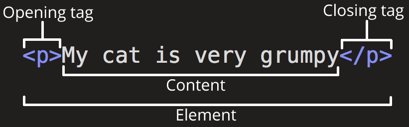
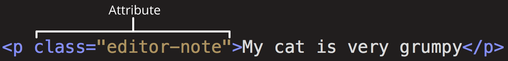

{{LearnSidebar}}{{NextMenu("Learn/HTML/Introduction_to_HTML/The_head_metadata_in_HTML", "Learn/HTML/Introduction_to_HTML")}}

In this article, we cover the absolute basics of HTML. To get you started, this article defines elements, attributes, and all the other important terms you may have heard. It also explains where these fit into HTML. You will learn how HTML elements are structured, how a typical HTML page is structured, and other important basic language features. Along the way, there will be an opportunity to play with HTML too!

<table>
  <tbody>
    <tr>
      <th scope="row">Prerequisites:</th>
      <td>
        <a href="/en-US/docs/Learn/Getting_started_with_the_web/Installing_basic_software">Basic software installed</a>, and basic knowledge of <a href="/en-US/docs/Learn/Getting_started_with_the_web/Dealing_with_files">working with files</a>.
      </td>
    </tr>
    <tr>
      <th scope="row">Objective:</th>
      <td>
        To gain basic familiarity with HTML, and practice writing a few HTML elements.
      </td>
    </tr>
  </tbody>
</table>

## What is HTML?

{{glossary("HTML")}} (HyperText Markup Language) is a _markup language_ that tells web browsers how to structure the web pages you visit. It can be as complicated or as simple as the web developer wants it to be. HTML consists of a series of {{glossary("Element", "elements")}}, which you use to enclose, wrap, or _mark up_ different parts of content to make it appear or act in a certain way. The enclosing {{glossary("Tag", "tags")}} can make content into a hyperlink to connect to another page, italicize words, and so on. For example, consider the following line of text:

```plain
My cat is very grumpy
```

If we wanted the text to stand by itself, we could specify that it is a paragraph by enclosing it in a paragraph ({{htmlelement("p")}}) element:

```html
<p>My cat is very grumpy</p>
```

> **Note:** Tags in HTML are not case-sensitive. This means they can be written in uppercase or lowercase. For example, a {{htmlelement("title")}} tag could be written as `<title>`, `<TITLE>`, `<Title>`, `<TiTlE>`, etc., and it will work. However, it is best practice to write all tags in lowercase for consistency and readability.

## Anatomy of an HTML element

Let's further explore our paragraph element from the previous section:



The anatomy of our element is:

- **The opening tag:** This consists of the name of the element (in this example, _p_ for paragraph), wrapped in opening and closing angle brackets. This opening tag marks where the element begins or starts to take effect. In this example, it precedes the start of the paragraph text.
- **The content:** This is the content of the element. In this example, it is the paragraph text.
- **The closing tag:** This is the same as the opening tag, except that it includes a forward slash before the element name. This marks where the element ends. Failing to include a closing tag is a common beginner error that can produce peculiar results.

The element is the opening tag, followed by content, followed by the closing tag.

### Active learning: creating your first HTML element

Edit the line below in the "Editable code" area by wrapping it with the tags `<em>` and `</em>.` To _open the element_, put the opening tag `<em>` at the start of the line. To _close the element_, put the closing tag `</em>` at the end of the line. Doing this should give the line italic text formatting! See your changes update live in the _Output_ area.

If you make a mistake, you can clear your work using the _Reset_ button. If you get really stuck, press the _Show solution_ button to see the answer.

```html hidden
<h2>Live output</h2>
<div class="output" style="min-height: 50px;"></div>

<h2>Editable code</h2>
<p class="a11y-label">
  Press Esc to move focus away from the code area (Tab inserts a tab character).
</p>

<textarea id="code" class="playable-code" style="min-height: 100px;width: 95%">
  This is my text.
</textarea>

<div class="controls">
  <input id="reset" type="button" value="Reset" />
  <input id="solution" type="button" value="Show solution" />
</div>
```

```css hidden
html {
  font-family: "Open Sans Light", Helvetica, Arial, sans-serif;
}

h2 {
  font-size: 16px;
}

.a11y-label {
  margin: 0;
  text-align: right;
  font-size: 0.7rem;
  width: 98%;
}

body {
  margin: 10px;
  background: #f5f9fa;
}
```

```js hidden
const textarea = document.getElementById("code");
const reset = document.getElementById("reset");
const solution = document.getElementById("solution");
const output = document.querySelector(".output");
const code = textarea.value;
let userEntry = textarea.value;

function updateCode() {
  output.innerHTML = textarea.value;
}

const htmlSolution = "<em>This is my text.</em>";
let solutionEntry = htmlSolution;

reset.addEventListener("click", () => {
  textarea.value = code;
  userEntry = textarea.value;
  solutionEntry = htmlSolution;
  solution.value = "Show solution";
  updateCode();
});

solution.addEventListener("click", () => {
  if (solution.value === "Show solution") {
    textarea.value = solutionEntry;
    solution.value = "Hide solution";
  } else {
    textarea.value = userEntry;
    solution.value = "Show solution";
  }
  updateCode();
});

textarea.addEventListener("input", updateCode);
window.addEventListener("load", updateCode);

// stop tab key tabbing out of textarea and
// make it write a tab at the caret position instead
textarea.onkeydown = (e) => {
  if (e.code === "Tab") {
    e.preventDefault();
    insertAtCaret("\t");
  }

  if (e.code === "Escape") {
    textarea.blur();
  }
};

function insertAtCaret(text) {
  const scrollPos = textarea.scrollTop;
  let caretPos = textarea.selectionStart;

  const front = textarea.value.substring(0, caretPos);
  const back = textarea.value.substring(
    textarea.selectionEnd,
    textarea.value.length,
  );
  textarea.value = front + text + back;
  caretPos += text.length;
  textarea.selectionStart = caretPos;
  textarea.selectionEnd = caretPos;
  textarea.focus();
  textarea.scrollTop = scrollPos;
}

// Update the saved userCode every time the user updates the text area code

textarea.onkeyup = () => {
  // We only want to save the state when the user code is being shown,
  // not the solution, so that solution is not saved over the user code
  if (solution.value === "Show solution") {
    userEntry = textarea.value;
  } else {
    solutionEntry = textarea.value;
  }

  updateCode();
};
```

{{ EmbedLiveSample('Active_learning_creating_your_first_HTML_element', 700, 400, "", "") }}

### Nesting elements

Elements can be placed within other elements. This is called _nesting_. If we wanted to state that our cat is **very** grumpy, we could wrap the word _very_ in a {{htmlelement("strong")}} element, which means that the word is to have strong(er) text formatting:

```html
<p>My cat is <strong>very</strong> grumpy.</p>
```

There is a right and wrong way to do nesting. In the example above, we opened the `p` element first, then opened the `strong` element. For proper nesting, we should close the `strong` element first, before closing the `p`.

The following is an example of the _wrong_ way to do nesting:

```html-nolint example-bad
<p>My cat is <strong>very grumpy.</p></strong>
```

The **tags have to open and close in a way that they are inside or outside one another**. With the kind of overlap in the example above, the browser has to guess at your intent. This kind of guessing can result in unexpected results.

### Void elements

Not all elements follow the pattern of an opening tag, content, and a closing tag. Some elements consist of a single tag, which is typically used to insert/embed something in the document. Such elements are called {{glossary("void element", "void elements")}}. For example, the {{htmlelement("img")}} element embeds an image file onto a page:

```html

```

This would output the following:

{{ EmbedLiveSample('Void_elements', 700, 300, "", "") }}

> **Note:** In HTML, there is no requirement to add a `/` at the end of a void element's tag, for example: ``. However, it is also a valid syntax, and you may do this when you want your HTML to be valid XML.

## Attributes

Elements can also have attributes. Attributes look like this:



Attributes contain extra information about the element that won't appear in the content. In this example, the **`class`** attribute is an identifying name used to target the element with style information.

An attribute should have:

- A space between it and the element name. (For an element with more than one attribute, the attributes should be separated by spaces too.)
- The attribute name, followed by an equal sign.
- An attribute value, wrapped with opening and closing quote marks.

### Active learning: Adding attributes to an element

The `` element can take a number of attributes, including:

- `src`
  - : The `src` attribute is a **required** attribute that specifies the location of the image. For example: `src="https://raw.githubusercontent.com/mdn/beginner-html-site/gh-pages/images/firefox-icon.png"`.
- `alt`
  - : The `alt` attribute specifies a text description of the image. For example: `alt="The Firefox icon"`.
- `width`
  - : The `width` attribute specifies the width of the image with the unit being pixels. For example: `width="300"`.
- `height`
  - : The `height` attribute specifies the height of the image with the unit being pixels. For example: `height="300"`.

Edit the line below in the _Input_ area to turn it into an image.

1. Find your favorite image online, right click it, and press _Copy Image Link/Address_.
2. Back in the area below, add the `src` attribute and fill it with the link from step 1.
3. Set the `alt` attribute.
4. Add the `width` and `height` attributes.

You will be able to see your changes live in the _Output_ area.

If you make a mistake, you can always reset it using the _Reset_ button. If you get really stuck, press the _Show solution_ button to see the answer.

```html hidden
<h2>Live output</h2>

<div class="output" style="min-height: 50px;"></div>

<h2>Editable code</h2>
<p class="a11y-label">
  Press Esc to move focus away from the code area (Tab inserts a tab character).
</p>

<textarea id="code" class="input" style="min-height: 100px;width: 95%">
&lt;img alt="I should be an image" &gt;
</textarea>

<div class="playable-buttons">
  <input id="reset" type="button" value="Reset" />
  <input id="solution" type="button" value="Show solution" />
</div>
```

```css hidden
html {
  font-family: sans-serif;
}

h2 {
  font-size: 16px;
}

.a11y-label {
  margin: 0;
  text-align: right;
  font-size: 0.7rem;
  width: 98%;
}

body {
  margin: 10px;
  background: #f5f9fa;
}
```

```js hidden
const textarea = document.getElementById("code");
const reset = document.getElementById("reset");
const solution = document.getElementById("solution");
const output = document.querySelector(".output");
const code = textarea.value;
let userEntry = textarea.value;

function updateCode() {
  output.innerHTML = textarea.value;
}

const htmlSolution =
  '';
let solutionEntry = htmlSolution;

reset.addEventListener("click", () => {
  textarea.value = code;
  userEntry = textarea.value;
  solutionEntry = htmlSolution;
  solution.value = "Show solution";
  updateCode();
});

solution.addEventListener("click", () => {
  if (solution.value === "Show solution") {
    textarea.value = solutionEntry;
    solution.value = "Hide solution";
  } else {
    textarea.value = userEntry;
    solution.value = "Show solution";
  }
  updateCode();
});

textarea.addEventListener("input", updateCode);
window.addEventListener("load", updateCode);

// stop tab key tabbing out of textarea and
// make it write a tab at the caret position instead

textarea.onkeydown = (e) => {
  if (e.code === "Tab") {
    e.preventDefault();
    insertAtCaret("\t");
  }

  if (e.code === "Escape") {
    textarea.blur();
  }
};

function insertAtCaret(text) {
  const scrollPos = textarea.scrollTop;
  let caretPos = textarea.selectionStart;

  const front = textarea.value.substring(0, caretPos);
  const back = textarea.value.substring(
    textarea.selectionEnd,
    textarea.value.length,
  );
  textarea.value = front + text + back;
  caretPos += text.length;
  textarea.selectionStart = caretPos;
  textarea.selectionEnd = caretPos;
  textarea.focus();
  textarea.scrollTop = scrollPos;
}

// Update the saved userCode every time the user updates the text area code

textarea.onkeyup = () => {
  // We only want to save the state when the user code is being shown,
  // not the solution, so that solution is not saved over the user code
  if (solution.value === "Show solution") {
    userEntry = textarea.value;
  } else {
    solutionEntry = textarea.value;
  }

  updateCode();
};
```

{{ EmbedLiveSample('Active_learning_Adding_attributes_to_an_element', 700, 400, "", "") }}

### Boolean attributes

Sometimes you will see attributes written without values. This is entirely acceptable. These are called Boolean attributes. Boolean attributes can only have one value, which is generally the same as the attribute name. For example, consider the [`disabled`](/en-US/docs/Web/HTML/Element/input#disabled) attribute, which you can assign to form input elements. (You use this to _disable_ the form input elements so the user can't make entries. The disabled elements typically have a grayed-out appearance.) For example:

```html
<input type="text" disabled="disabled" />
```

As shorthand, it is acceptable to write this as follows:

```html
<!-- using the disabled attribute prevents the end user from entering text into the input box -->
<input type="text" disabled />

<!-- text input is allowed, as it doesn't contain the disabled attribute -->
<input type="text" />
```

For reference, the example above also includes a non-disabled form input element. The HTML from the example above produces this result:

{{ EmbedLiveSample('Boolean_attributes', 700, 100, "", "") }}

### Omitting quotes around attribute values

If you look at code for a lot of other sites, you might come across a number of strange markup styles, including attribute values without quotes. This is permitted in certain circumstances, but it can also break your markup in other circumstances. The element in the code snippet below, `<a>`, is called an anchor. Anchors enclose text and turn them into links. The `href` attribute specifies the web address the link points to. You can write this basic version below with _only_ the `href` attribute, like this:

```html
<a href=https://www.mozilla.org/>favorite website</a>
```

Anchors can also have a `title` attribute, a description of the linked page. However, as soon as we add the `title` in the same fashion as the `href` attribute there are problems:

```html-nolint example-bad
<a href=https://www.mozilla.org/ title=The Mozilla homepage>favorite website</a>
```

As written above, the browser misinterprets the markup, mistaking the `title` attribute for three attributes: a title attribute with the value `The`, and two Boolean attributes, `Mozilla` and `homepage`. Obviously, this is not intended! It will cause errors or unexpected behavior, as you can see in the live example below. Try hovering over the link to view the title text!

{{ EmbedLiveSample('Omitting_quotes_around_attribute_values', 700, 100, "", "") }}

Always include the attribute quotes. It avoids such problems, and results in more readable code.

### Single or double quotes?

In this article, you will also notice that the attributes are wrapped in double quotes. However, you might see single quotes in some HTML code. This is a matter of style. You can feel free to choose which one you prefer. Both of these lines are equivalent:

```html-nolint
<a href='https://www.example.com'>A link to my example.</a>

<a href="https://www.example.com">A link to my example.</a>
```

Make sure you don't mix single quotes and double quotes. This example (below) shows a kind of mixing of quotes that will go wrong:

```html-nolint example-bad
<a href="https://www.example.com'>A link to my example.</a>
```

However, if you use one type of quote, you can include the other type of quote _inside_ your attribute values:

```html
<a href="https://www.example.com" title="Isn't this fun?">
  A link to my example.
</a>
```

To use quote marks inside other quote marks of the same type (single quote or double quote), use {{glossary("character reference", "character references")}}.
For example, this will break:

```html-nolint example-bad
<a href="https://www.example.com" title="An "interesting" reference">A link to my example.</a>
```

Instead, you need to do this:

```html-nolint
<a href="https://www.example.com" title="An &quot;interesting&quot; reference">A link to my example.</a>
```

## Anatomy of an HTML document

Individual HTML elements aren't very useful on their own. Next, let's examine how individual elements combine to form an entire HTML page:

```html
<!doctype html>
<html lang="en-US">
  <head>
    <meta charset="utf-8" />
    <title>My test page</title>
  </head>
  <body>
    <p>This is my page</p>
  </body>
</html>
```

Here we have:

1. `<!DOCTYPE html>`: The doctype. When HTML was young (1991-1992), doctypes were meant to act as links to a set of rules that the HTML page had to follow to be considered good HTML. Doctypes used to look something like this:

   ```html
   <!DOCTYPE html PUBLIC "-//W3C//DTD XHTML 1.0 Transitional//EN" "http://www.w3.org/TR/xhtml1/DTD/xhtml1-transitional.dtd">
   ```

   More recently, the doctype is a historical artifact that needs to be included for everything else to work right. `<!DOCTYPE html>` is the shortest string of characters that counts as a valid doctype. That is all you need to know!

2. `<html></html>`: The {{htmlelement("html")}} element. This element wraps all the content on the page. It is sometimes known as the root element.
3. `<head></head>`: The {{htmlelement("head")}} element. This element acts as a container for everything you want to include on the HTML page, **that isn't the content** the page will show to viewers. This includes keywords and a page description that would appear in search results, CSS to style content, character set declarations, and more. You will learn more about this in the next article of the series.
4. `<meta charset="utf-8">`: The {{htmlelement("meta")}} element. This element represents metadata that cannot be represented by other HTML meta-related elements, like {{htmlelement("base")}}, {{htmlelement("link")}}, {{htmlelement("script")}}, {{htmlelement("style")}} or {{htmlelement("title")}}. The [`charset`](/en-US/docs/Web/HTML/Element/meta#charset) attribute specifies the character encoding for your document as UTF-8, which includes most characters from the vast majority of human written languages. With this setting, the page can now handle any textual content it might contain. There is no reason not to set this, and it can help avoid some problems later.
5. `<title></title>`: The {{htmlelement("title")}} element. This sets the title of the page, which is the title that appears in the browser tab the page is loaded in. The page title is also used to describe the page when it is bookmarked.
6. `<body></body>`: The {{htmlelement("body")}} element. This contains _all_ the content that displays on the page, including text, images, videos, games, playable audio tracks, or whatever else.

### Active learning: Adding some features to an HTML document

If you want to experiment with writing some HTML on your local computer, you can:

1. Copy the HTML page example listed above.
2. Create a new file in your text editor.
3. Paste the code into the new text file.
4. Save the file as `index.html`.

> **Note:** You can also find this basic HTML template on the [MDN Learning Area GitHub repo](https://github.com/mdn/learning-area/blob/main/html/introduction-to-html/getting-started/index.html).

You can now open this file in a web browser to see what the rendered code looks like. Edit the code and refresh the browser to see what the result is. Initially, the page looks like this:


In this exercise, you can edit the code locally on your computer, as described previously, or you can edit it in the sample window below (the editable sample window represents just the contents of the {{htmlelement("body")}} element, in this case). Sharpen your skills by implementing the following tasks:

- Just below the opening tag of the {{htmlelement("body")}} element, add a main title for the document. This should be wrapped inside an `<h1>` opening tag and `</h1>` closing tag.
- Edit the paragraph content to include text about a topic that you find interesting.
- Make important words stand out in bold by wrapping them inside a `<strong>` opening tag and `</strong>` closing tag.
- Add a link to your paragraph, as [explained earlier in the article](#active_learning_adding_attributes_to_an_element).
- Add an image to your document. Place it below the paragraph, as [explained earlier in the article](#void_elements). Earn bonus points if you manage to link to a different image (either locally on your computer or somewhere else on the web).

If you make a mistake, you can always reset it using the _Reset_ button. If you get really stuck, press the _Show solution_ button to see the answer.

```html hidden
<h2>Live output</h2>

<div class="output" style="min-height: 50px;"></div>

<h2>Editable code</h2>
<p class="a11y-label">
  Press Esc to move focus away from the code area (Tab inserts a tab character).
</p>

<textarea id="code" class="input" style="min-height: 100px;width: 95%">
  &lt;p&gt;This is my page&lt;/p&gt;
</textarea>

<div class="playable-buttons">
  <input id="reset" type="button" value="Reset" />
  <input id="solution" type="button" value="Show solution" />
</div>
```

```css hidden
html {
  font-family: sans-serif;
}

h1 {
  color: blue;
}

h2 {
  font-size: 16px;
}

.a11y-label {
  margin: 0;
  text-align: right;
  font-size: 0.7rem;
  width: 98%;
}

img {
  max-width: 100%;
}

body {
  margin: 10px;
  background: #f5f9fa;
}
```

```js hidden
const textarea = document.getElementById("code");
const reset = document.getElementById("reset");
const solution = document.getElementById("solution");
const output = document.querySelector(".output");
const code = textarea.value;
let userEntry = textarea.value;

function updateCode() {
  output.innerHTML = textarea.value;
}

const htmlSolution =
  '<h1>Some music</h1><p>I really enjoy <strong>playing the drums</strong>. One of my favorite drummers is Neal Peart, who plays in the band <a href="https://en.wikipedia.org/wiki/Rush_%28band%29" title="Rush Wikipedia article">Rush</a>. My favorite Rush album is currently <a href="http://www.deezer.com/album/942295">Moving Pictures</a>.</p> ';
let solutionEntry = htmlSolution;

reset.addEventListener("click", () => {
  textarea.value = code;
  userEntry = textarea.value;
  solutionEntry = htmlSolution;
  solution.value = "Show solution";
  updateCode();
});

solution.addEventListener("click", () => {
  if (solution.value === "Show solution") {
    textarea.value = solutionEntry;
    solution.value = "Hide solution";
  } else {
    textarea.value = userEntry;
    solution.value = "Show solution";
  }
  updateCode();
});

textarea.addEventListener("input", updateCode);
window.addEventListener("load", updateCode);

// stop tab key tabbing out of textarea and
// make it write a tab at the caret position instead

textarea.onkeydown = (e) => {
  if (e.code === "Tab") {
    e.preventDefault();
    insertAtCaret("\t");
  }

  if (e.code === "Escape") {
    textarea.blur();
  }
};

function insertAtCaret(text) {
  const scrollPos = textarea.scrollTop;
  let caretPos = textarea.selectionStart;

  const front = textarea.value.substring(0, caretPos);
  const back = textarea.value.substring(
    textarea.selectionEnd,
    textarea.value.length,
  );
  textarea.value = front + text + back;
  caretPos += text.length;
  textarea.selectionStart = caretPos;
  textarea.selectionEnd = caretPos;
  textarea.focus();
  textarea.scrollTop = scrollPos;
}

// Update the saved userCode every time the user updates the text area code
textarea.onkeyup = () => {
  // We only want to save the state when the user code is being shown,
  // not the solution, so that solution is not saved over the user code
  if (solution.value === "Show solution") {
    userEntry = textarea.value;
  } else {
    solutionEntry = textarea.value;
  }

  updateCode();
};
```

{{ EmbedLiveSample('Active_learning_Adding_some_features_to_an_HTML_document', 700, 500) }}

### Whitespace in HTML

In the examples above, you may have noticed that a lot of whitespace is included in the code. This is optional. These two code snippets are equivalent:

```html-nolint
<p id="noWhitespace">Dogs are silly.</p>

<p id="whitespace">Dogs
    are
        silly.</p>
```

No matter how much whitespace you use inside HTML element content (which can include one or more space characters, but also line breaks), the HTML parser reduces each sequence of whitespace to a single space when rendering the code. So why use so much whitespace? The answer is readability.

It can be easier to understand what is going on in your code if you have it nicely formatted. In our HTML we've got each nested element indented by two spaces more than the one it is sitting inside. It is up to you to choose the style of formatting (how many spaces for each level of indentation, for example), but you should consider formatting it.

Let's have a look at how the browser renders the two paragraphs above with and without whitespace:

{{ EmbedLiveSample('Whitespace_in_HTML', 700, 100) }}

> **Note:** Accessing the [innerHTML](/en-US/docs/Web/API/Element/innerHTML) of elements from JavaScript will keep all the whitespace intact.
> This may return unexpected results if the whitespace is trimmed by the browser.

```js
const noWhitespace = document.getElementById("noWhitespace").innerHTML;
console.log(noWhitespace);
// "Dogs are silly."

const whitespace = document.getElementById("whitespace").innerHTML;
console.log(whitespace);
// "Dogs
//    are
//        silly."
```

## Character references: including special characters in HTML

In HTML, the characters `<`, `>`,`"`,`'`, and `&` are special characters. They are parts of the HTML syntax itself. So how do you include one of these special characters in your text? For example, if you want to use an ampersand or less-than sign, and not have it interpreted as code.

You do this with {{glossary("character reference", "character references")}}. These are special codes that represent characters, to be used in these exact circumstances. Each character reference starts with an ampersand (&), and ends with a semicolon (;).

| Literal character | Character reference equivalent |
| ----------------- | ------------------------------ |
| <                 | `&lt;`                         |
| >                 | `&gt;`                         |
| "                 | `&quot;`                       |
| '                 | `&apos;`                       |
| &                 | `&amp;`                        |

The character reference equivalent could be easily remembered because the text it uses can be seen as less than for `&lt;`, quotation for `&quot;` and similarly for others. To find more about entity references, see [List of XML and HTML character entity references](https://en.wikipedia.org/wiki/List_of_XML_and_HTML_character_entity_references) (Wikipedia).

In the example below, there are two paragraphs:

```html-nolint
<p>In HTML, you define a paragraph using the <p> element.</p>

<p>In HTML, you define a paragraph using the &lt;p&gt; element.</p>
```

In the live output below, you can see that the first paragraph has gone wrong. The browser interprets the second instance of `<p>` as starting a new paragraph. The second paragraph looks fine because it has angle brackets with character references.

{{ EmbedLiveSample('Entity_references_Including_special_characters_in_HTML', 700, 200, "", "") }}

> **Note:** You don't need to use entity references for any other symbols, as modern browsers will handle the actual symbols just fine as long as your HTML's [character encoding is set to UTF-8](/en-US/docs/Learn/HTML/Introduction_to_HTML/The_head_metadata_in_HTML#specifying_your_documents_character_encoding).

## HTML comments

HTML has a mechanism to write comments in the code. Browsers ignore comments, effectively making comments invisible to the user. The purpose of comments is to allow you to include notes in the code to explain your logic or coding. This is very useful if you return to a code base after being away for long enough that you don't completely remember it. Likewise, comments are invaluable as different people are making changes and updates.

To write an HTML comment, wrap it in the special markers `<!--` and `-->`. For example:

```html
<p>I'm not inside a comment</p>

<!-- <p>I am!</p> -->
```

As you can see below, only the first paragraph is displayed in the live output.

{{ EmbedLiveSample('HTML_comments', 700, 100, "", "") }}

## Summary

You made it to the end of the article! We hope you enjoyed your tour of the basics of HTML.

At this point, you should understand what HTML looks like, and how it works at a basic level. You should also be able to write a few elements and attributes. The subsequent articles of this module go further on some of the topics introduced here, as well as presenting other concepts of the language.

- As you start to learn more about HTML, consider learning the basics of CSS (Cascading Style Sheets). [CSS](/en-US/docs/Learn/CSS) is the language used to style web pages, such as changing fonts or colors or altering the page layout. HTML and CSS work well together, as you will soon discover.

## See also

- [Applying color to HTML elements using CSS](/en-US/docs/Web/CSS/CSS_colors/Applying_color)

{{NextMenu("Learn/HTML/Introduction_to_HTML/The_head_metadata_in_HTML", "Learn/HTML/Introduction_to_HTML")}}
