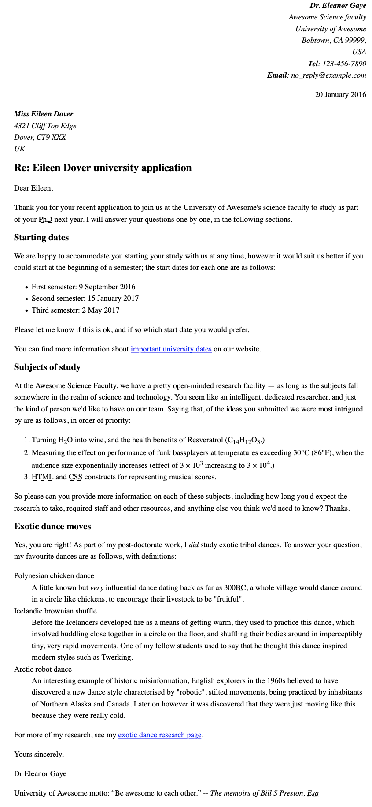

{{LearnSidebar}}{{PreviousMenuNext("Learn/HTML/Introduction_to_HTML/Debugging_HTML", "Learn/HTML/Introduction_to_HTML/Structuring_a_page_of_content", "Learn/HTML/Introduction_to_HTML")}}

We all learn to write a letter sooner or later; it is also a useful example to test our text formatting skills. In this assignment, you'll have a letter to mark up as a test for your HTML text formatting skills, as well as hyperlinks and proper use of the HTML `<head>` element.

<table>
  <tbody>
    <tr>
      <th scope="row">Prerequisites:</th>
      <td>
        Before attempting this assessment you should have already worked through
        <a href="/en-US/docs/Learn/HTML/Introduction_to_HTML/Getting_started"
          >Getting started with HTML</a
        >,
        <a
          href="/en-US/docs/Learn/HTML/Introduction_to_HTML/The_head_metadata_in_HTML"
          >What's in the head? Metadata in HTML</a
        >,
        <a
          href="/en-US/docs/Learn/HTML/Introduction_to_HTML/HTML_text_fundamentals"
          >HTML text fundamentals</a
        >,
        <a
          href="/en-US/docs/Learn/HTML/Introduction_to_HTML/Creating_hyperlinks"
          >Creating hyperlinks</a
        >, and
        <a
          href="/en-US/docs/Learn/HTML/Introduction_to_HTML/Advanced_text_formatting"
          >Advanced text formatting</a
        >.
      </td>
    </tr>
    <tr>
      <th scope="row">Objective:</th>
      <td>
        Test basic and advanced HTML text formatting, use of hyperlinks, and use
        of HTML &#x3C;head>.
      </td>
    </tr>
  </tbody>
</table>

## Starting point

To begin, get the [raw text you need to mark up](https://github.com/mdn/learning-area/blob/main/html/introduction-to-html/marking-up-a-letter-start/letter-text.txt), and the [CSS to style the HTML](https://github.com/mdn/learning-area/blob/main/html/introduction-to-html/marking-up-a-letter-start/css.txt). Create a new `.html` file using your text editor or use an online tool such as [CodePen](https://codepen.io/), [jsFiddle](https://jsfiddle.net/), or [Glitch](https://glitch.com/) to complete the tasks.

> **Note:** If you get stuck, then ask us for help — see the [Assessment or further help](#assessment_or_further_help) section at the bottom of this page.

## Project brief

For this project, your task is to mark up a letter that needs to be hosted on a university intranet. The letter is a response from a research fellow to a prospective PhD student concerning their application to the university.

### Block/structural semantics

- Use appropriate document structure including doctype, and {{htmlelement("html")}}, {{htmlelement("head")}} and {{htmlelement("body")}} elements.
- In general, the letter should be marked up as an organization of headings and paragraphs, with the following exception. There is one top level heading (the "Re:" line) and three second level headings.
- Use an appropriate list type to mark up the semester start dates, study subjects, and exotic dances.
- Put the two addresses inside {{htmlelement("address")}} elements. Each line of the address should sit on a new line, but not be in a new paragraph.

### Inline semantics

- The names of the sender and receiver (and _Tel_ and _Email_) should be marked up with strong importance.
- The four dates in the document should have appropriate elements containing machine-readable dates.
- The first address and first date in the letter should have a class attribute value of _sender-column_. The CSS you'll add later will cause these to be right aligned, as it should be in the case in a classic letter layout.
- Mark up the following five acronyms/abbreviations in the main text of the letter — "PhD," "HTML," "CSS," "BC," and "Esq." — to provide expansions of each one.
- The six sub/superscripts should be marked up appropriately — in the chemical formulae, and the numbers 103 and 104 (they should be 10 to the power of 3 and 4, respectively).
- Try to mark up at least two appropriate words in the text with strong importance/emphasis.
- There are two places where the letter should have a hyperlink. Add appropriate links with titles. For the location that the links point to, you may use `http://example.com` as the URL.
- Mark up the university motto quote and citation with appropriate elements.

### The head of the document

- The character set of the document should be set as utf-8 using the appropriate meta tag.
- The author of the letter should be specified in an appropriate meta tag.
- The provided CSS should be included inside an appropriate tag.

## Hints and tips

- Use the [W3C HTML validator](https://validator.w3.org/) to validate your HTML. Award yourself bonus points if it validates.
- You don't need to know any CSS to do this assignment. You just need to put the provided CSS inside an HTML element.

## Example

The following screenshot shows an example of what the letter might look like after being marked up.

## Assessment or further help

If you would like your work assessed or are stuck and want to ask for help:

1. Put your work into an online shareable editor such as [CodePen](https://codepen.io/), [jsFiddle](https://jsfiddle.net/), or [Glitch](https://glitch.com/).
2. Write a post asking for assessment and/or help at the [MDN Discourse forum Learning category](https://discourse.mozilla.org/c/mdn/learn/250). Your post should include:

   - A descriptive title such as "Assessment wanted for Marking up a letter".
   - Details of what you have already tried and what you would like us to do; for example, tell us if you're stuck and need help or want an assessment.
   - A link to the example you want assessed or need help with, in an online shareable editor (as mentioned in step 1 above). This is a good practice to get into — it's very hard to help someone with a coding problem if you can't see their code.
   - A link to the actual task or assessment page, so we can find the question you want help with.

{{PreviousMenuNext("Learn/HTML/Introduction_to_HTML/Debugging_HTML", "Learn/HTML/Introduction_to_HTML/Structuring_a_page_of_content", "Learn/HTML/Introduction_to_HTML")}}
