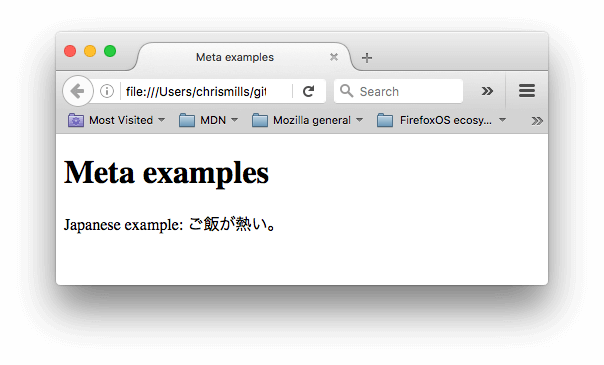
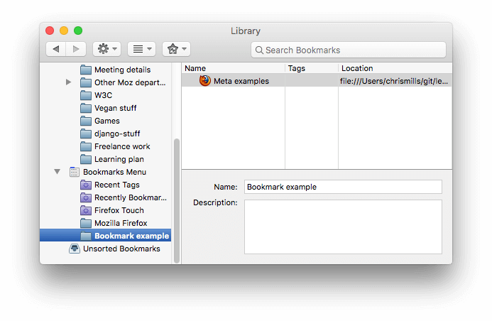
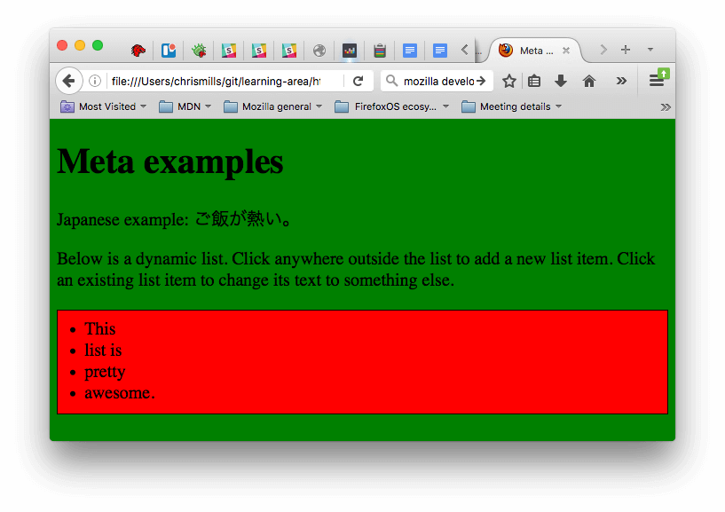

{{LearnSidebar}}{{PreviousMenuNext("Learn/HTML/Introduction_to_HTML/Getting_started", "Learn/HTML/Introduction_to_HTML/HTML_text_fundamentals", "Learn/HTML/Introduction_to_HTML")}}

The {{glossary("Head", "head")}} of an HTML document is the part that is not displayed in the web browser when the page is loaded. It contains information such as the page {{htmlelement("title")}}, links to {{glossary("CSS")}} (if you choose to style your HTML content with CSS), links to custom favicons, and other metadata (data about the HTML, such as the author, and important keywords that describe the document). Web browsers use information contained in the {{glossary("Head", "head")}} to render the HTML document correctly. In this article we'll cover all of the above and more, in order to give you a good basis for working with markup.

<table>
  <tbody>
    <tr>
      <th scope="row">Prerequisites:</th>
      <td>
        Basic HTML familiarity, as covered in
        <a href="/en-US/docs/Learn/HTML/Introduction_to_HTML/Getting_started"
          >Getting started with HTML</a
        >.
      </td>
    </tr>
    <tr>
      <th scope="row">Objective:</th>
      <td>
        To learn about the HTML head, its purpose, the most important items it
        can contain, and what effect it can have on the HTML document.
      </td>
    </tr>
  </tbody>
</table>

## What is the HTML head?

Let's revisit the simple [HTML document we covered in the previous article](/en-US/docs/Learn/HTML/Introduction_to_HTML/Getting_started#anatomy_of_an_html_document):

```html
<!doctype html>
<html lang="en-US">
  <head>
    <meta charset="utf-8" />
    <title>My test page</title>
  </head>
  <body>
    <p>This is my page</p>
  </body>
</html>
```

The HTML head is the contents of the {{htmlelement("head")}} element. Unlike the contents of the {{htmlelement("body")}} element (which are displayed on the page when loaded in a browser), the head's content is not displayed on the page. Instead, the head's job is to contain {{glossary("Metadata", "metadata")}} about the document. In the above example, the head is quite small:

```html
<head>
  <meta charset="utf-8" />
  <title>My test page</title>
</head>
```

In larger pages however, the head can get quite large. Try going to some of your favorite websites and use the [developer tools](/en-US/docs/Learn/Common_questions/Tools_and_setup/What_are_browser_developer_tools) to check out their head contents. Our aim here is not to show you how to use everything that can possibly be put in the head, but rather to teach you how to use the major elements that you'll want to include in the head, and give you some familiarity. Let's get started.

## Adding a title

We've already seen the {{htmlelement("title")}} element in action — this can be used to add a title to the document. This however can get confused with the {{htmlelement("Heading_Elements", "h1")}} element, which is used to add a top level heading to your body content — this is also sometimes referred to as the page title. But they are different things!

- The {{htmlelement("Heading_Elements", "h1")}} element appears on the page when loaded in the browser — generally this should be used once per page, to mark up the title of your page content (the story title, or news headline, or whatever is appropriate to your usage.)
- The {{htmlelement("title")}} element is metadata that represents the title of the overall HTML document (not the document's content.)

### Active learning: Inspecting a simple example

1. To start off this active learning, we'd like you to go to our GitHub repo and download a copy of our [title-example.html page](https://github.com/mdn/learning-area/blob/main/html/introduction-to-html/the-html-head/title-example.html). To do this, either

   1. Copy and paste the code out of the page and into a new text file in your code editor, then save it in a sensible place.
   2. Press the "Raw" button on the GitHub page, which causes the raw code to appear (possibly in a new browser tab). Next, choose your browser's _Save Page As…_ menu and choose a sensible place to save the file.

2. Now open the file in your browser. You should see something like this:

   

   It should now be completely obvious where the `<h1>` content appears and where the `<title>` content appears!

3. You should also try opening the code up in your code editor, editing the contents of these elements, then refreshing the page in your browser. Have some fun with it.

The `<title>` element contents are also used in other ways. For example, if you try bookmarking the page (_Bookmarks > Bookmark This Page_ or the star icon in the URL bar in Firefox), you will see the `<title>` contents filled in as the suggested bookmark name.


The `<title>` contents are also used in search results, as you'll see below.

## Metadata: the `<meta>` element

Metadata is data that describes data, and HTML has an "official" way of adding metadata to a document — the {{htmlelement("meta")}} element. Of course, the other stuff we are talking about in this article could also be thought of as metadata too. There are a lot of different types of `<meta>` elements that can be included in your page's `<head>`, but we won't try to explain them all at this stage, as it would just get too confusing. Instead, we'll explain a few things that you might commonly see, just to give you an idea.

### Specifying your document's character encoding

In the example we saw above, this line was included:

```html
<meta charset="utf-8" />
```

This element specifies the document's character encoding — the character set that the document is permitted to use. `utf-8` is a universal character set that includes pretty much any character from any human language. This means that your web page will be able to handle displaying any language; it's therefore a good idea to set this on every web page you create! For example, your page could handle English and Japanese just fine:

If you set your character encoding to `ISO-8859-1`, for example (the character set for the Latin alphabet), your page rendering may appear all messed up:


> **Note:** Some browsers (like Chrome) automatically fix incorrect encodings, so depending on what browser you use, you may not see this problem. You should still set an encoding of `utf-8` on your page anyway to avoid any potential problems in other browsers.

### Active learning: Experiment with character encoding

To try this out, revisit the simple HTML template you obtained in the previous section on `<title>` (the [title-example.html page](https://github.com/mdn/learning-area/blob/main/html/introduction-to-html/the-html-head/title-example.html)), try changing the meta charset value to `ISO-8859-1`, and add the Japanese to your page. This is the code we used:

```html
<p>Japanese example: ご飯が熱い。</p>
```

### Adding an author and description

Many `<meta>` elements include `name` and `content` attributes:

- `name` specifies the type of meta element it is; what type of information it contains.
- `content` specifies the actual meta content.

Two such meta elements that are useful to include on your page define the author of the page, and provide a concise description of the page. Let's look at an example:

```html
<meta name="author" content="Chris Mills" />
<meta
  name="description"
  content="The MDN Web Docs Learning Area aims to provide
complete beginners to the Web with all they need to know to get
started with developing websites and applications." />
```

Specifying an author is beneficial in many ways: it is useful to be able to understand who wrote the page, if you have any questions about the content and you would like to contact them. Some content management systems have facilities to automatically extract page author information and make it available for such purposes.

Specifying a description that includes keywords relating to the content of your page is useful as it has the potential to make your page appear higher in relevant searches performed in search engines (such activities are termed [Search Engine Optimization](/en-US/docs/Glossary/SEO), or {{glossary("SEO")}}.)

### Active learning: The description's use in search engines

The description is also used on search engine result pages. Let's go through an exercise to explore this

1. Go to the [front page of The Mozilla Developer Network](/en-US/).
2. View the page's source (right-click on the page, choose _View Page Source_ from the context menu.)
3. Find the description meta tag. It will look something like this (although it may change over time):

   ```html
   <meta
     name="description"
     content="The MDN Web Docs site
     provides information about Open Web technologies
     including HTML, CSS, and APIs for both websites and
     progressive web apps." />
   ```

4. Now search for "MDN Web Docs" in your favorite search engine (We used Google.) You'll notice the description `<meta>` and `<title>` element content used in the search result — definitely worth having!

   

> **Note:** In Google, you will see some relevant subpages of MDN Web Docs listed below the main homepage link — these are called sitelinks, and are configurable in [Google's webmaster tools](https://search.google.com/search-console/about?hl=en) — a way to make your site's search results better in the Google search engine.

> **Note:** Many `<meta>` features just aren't used anymore. For example, the keyword `<meta>` element (`<meta name="keywords" content="fill, in, your, keywords, here">`) — which is supposed to provide keywords for search engines to determine relevance of that page for different search terms — is ignored by search engines, because spammers were just filling the keyword list with hundreds of keywords, biasing results.

### Other types of metadata

As you travel around the web, you'll find other types of metadata, too. A lot of the features you'll see on websites are proprietary creations, designed to provide certain sites (such as social networking sites) with specific pieces of information they can use.

For example, [Open Graph Data](https://ogp.me/) is a metadata protocol that Facebook invented to provide richer metadata for websites. In the MDN Web Docs sourcecode, you'll find this:

```html
<meta
  property="og:image"
  content="https://developer.mozilla.org/mdn-social-share.png" />
<meta
  property="og:description"
  content="The Mozilla Developer Network (MDN) provides
information about Open Web technologies including HTML, CSS, and APIs for both websites
and HTML Apps." />
<meta property="og:title" content="Mozilla Developer Network" />
```

One effect of this is that when you link to MDN Web Docs on Facebook, the link appears along with an image and description: a richer experience for users.


Twitter also has its own similar proprietary metadata called [Twitter Cards](https://developer.twitter.com/en/docs/twitter-for-websites/cards/overview/abouts-cards), which has a similar effect when the site's URL is displayed on twitter.com. For example:

```html
<meta name="twitter:title" content="Mozilla Developer Network" />
```

## Adding custom icons to your site

To further enrich your site design, you can add references to custom icons in your metadata, and these will be displayed in certain contexts. The most commonly used of these is the **favicon** (short for "favorites icon", referring to its use in the "favorites" or "bookmarks" lists in browsers).

The humble favicon has been around for many years. It is the first icon of this type: a 16-pixel square icon used in multiple places. You may see (depending on the browser) favicons displayed in the browser tab containing each open page, and next to bookmarked pages in the bookmarks panel.

A favicon can be added to your page by:

1. Saving it in the same directory as the site's index page, saved in `.ico` format (most also support favicons in more common formats like `.gif` or `.png`)
2. Adding the following line into your HTML's {{HTMLElement("head")}} block to reference it:

   ```html
   <link rel="icon" href="favicon.ico" type="image/x-icon" />
   ```

Here is an example of a favicon in a bookmarks panel:



There are lots of other icon types to consider these days as well. For example, you'll find this in the source code of the MDN Web Docs homepage:

```html
<!-- third-generation iPad with high-resolution Retina display: -->
<link
  rel="apple-touch-icon-precomposed"
  sizes="144x144"
  href="https://developer.mozilla.org/static/img/favicon144.png" />
<!-- iPhone with high-resolution Retina display: -->
<link
  rel="apple-touch-icon-precomposed"
  sizes="114x114"
  href="https://developer.mozilla.org/static/img/favicon114.png" />
<!-- first- and second-generation iPad: -->
<link
  rel="apple-touch-icon-precomposed"
  sizes="72x72"
  href="https://developer.mozilla.org/static/img/favicon72.png" />
<!-- non-Retina iPhone, iPod Touch, and Android 2.1+ devices: -->
<link
  rel="apple-touch-icon-precomposed"
  href="https://developer.mozilla.org/static/img/favicon57.png" />
<!-- basic favicon -->
<link
  rel="icon"
  href="https://developer.mozilla.org/static/img/favicon32.png" />
```

The comments explain what each icon is used for — these elements cover things like providing a nice high resolution icon to use when the website is saved to an iPad's home screen.

Don't worry too much about implementing all these types of icon right now — this is a fairly advanced feature, and you won't be expected to have knowledge of this to progress through the course. The main purpose here is to let you know what such things are, in case you come across them while browsing other websites' source code.

> **Note:** If your site uses a Content Security Policy (CSP) to enhance its security, the policy applies to the favicon. If you encounter problems with the favicon not loading, verify that the {{HTTPHeader("Content-Security-Policy")}} header's [`img-src` directive](/en-US/docs/Web/HTTP/Headers/Content-Security-Policy/img-src) is not preventing access to it.

## Applying CSS and JavaScript to HTML

Just about all websites you'll use in the modern day will employ {{glossary("CSS")}} to make them look cool, and {{glossary("JavaScript")}} to power interactive functionality, such as video players, maps, games, and more. These are most commonly applied to a web page using the {{htmlelement("link")}} element and the {{htmlelement("script")}} element, respectively.

- The {{htmlelement("link")}} element should always go inside the head of your document. This takes two attributes, `rel="stylesheet"`, which indicates that it is the document's stylesheet, and `href`, which contains the path to the stylesheet file:

  ```html
  <link rel="stylesheet" href="my-css-file.css" />
  ```

- The {{htmlelement("script")}} element should also go into the head, and should include a `src` attribute containing the path to the JavaScript you want to load, and `defer`, which basically instructs the browser to load the JavaScript after the page has finished parsing the HTML. This is useful as it makes sure that the HTML is all loaded before the JavaScript runs, so that you don't get errors resulting from JavaScript trying to access an HTML element that doesn't exist on the page yet. There are actually a number of ways to handle loading JavaScript on your page, but this is the most reliable one to use for modern browsers (for others, read [Script loading strategies](/en-US/docs/Learn/JavaScript/First_steps/What_is_JavaScript#script_loading_strategies)).

  ```html
  <script src="my-js-file.js" defer></script>
  ```

  > **Note:** The `<script>` element may look like a {{glossary("void element")}}, but it's not, and so needs a closing tag. Instead of pointing to an external script file, you can also choose to put your script inside the `<script>` element.

### Active learning: applying CSS and JavaScript to a page

1. To start this active learning, grab a copy of our [meta-example.html](https://github.com/mdn/learning-area/blob/main/html/introduction-to-html/the-html-head/meta-example.html), [script.js](https://github.com/mdn/learning-area/blob/main/html/introduction-to-html/the-html-head/script.js) and [style.css](https://github.com/mdn/learning-area/blob/main/html/introduction-to-html/the-html-head/style.css) files, and save them on your local computer in the same directory. Make sure they are saved with the correct names and file extensions.
2. Open the HTML file in both your browser, and your text editor.
3. By following the information given above, add {{htmlelement("link")}} and {{htmlelement("script")}} elements to your HTML, so that your CSS and JavaScript are applied to your HTML.

If done correctly, when you save your HTML and refresh your browser you should be able to see that things have changed:



- The JavaScript has added an empty list to the page. Now when you click anywhere outside the list, a dialog box will pop up asking you to enter some text for a new list item. When you press the OK button, a new list item will be added to the list containing the text. When you click on an existing list item, a dialog box will pop up allowing you to change the item's text.
- The CSS has caused the background to go green, and the text to become bigger. It has also styled some of the content that the JavaScript has added to the page (the red bar with the black border is the styling the CSS has added to the JS-generated list.)

> **Note:** If you get stuck in this exercise and can't get the CSS/JS to apply, try checking out our [css-and-js.html](https://github.com/mdn/learning-area/blob/main/html/introduction-to-html/the-html-head/css-and-js.html) example page.

## Setting the primary language of the document

Finally, it's worth mentioning that you can (and really should) set the language of your page. This can be done by adding the [lang attribute](/en-US/docs/Web/HTML/Global_attributes/lang) to the opening HTML tag (as seen in the [meta-example.html](https://github.com/mdn/learning-area/blob/main/html/introduction-to-html/the-html-head/meta-example.html) and shown below.)

```html
<html lang="en-US">
  …
</html>
```

This is useful in many ways. Your HTML document will be indexed more effectively by search engines if its language is set (allowing it to appear correctly in language-specific results, for example), and it is useful to people with visual impairments using screen readers (for example, the word "six" exists in both French and English, but is pronounced differently.)

You can also set subsections of your document to be recognized as different languages. For example, we could set our Japanese language section to be recognized as Japanese, like so:

```html
<p>Japanese example: <span lang="ja">ご飯が熱い。</span>.</p>
```

These codes are defined by the [ISO 639-1](https://en.wikipedia.org/wiki/ISO_639-1) standard. You can find more about them in [Language tags in HTML and XML](https://www.w3.org/International/articles/language-tags/).

## Summary

That marks the end of our quickfire tour of the HTML head — there's a lot more you can do in here, but an exhaustive tour would be boring and confusing at this stage, and we just wanted to give you an idea of the most common things you'll find in there for now! In the next article, we'll be looking at [HTML text fundamentals](/en-US/docs/Learn/HTML/Introduction_to_HTML/HTML_text_fundamentals).

{{PreviousMenuNext("Learn/HTML/Introduction_to_HTML/Getting_started", "Learn/HTML/Introduction_to_HTML/HTML_text_fundamentals", "Learn/HTML/Introduction_to_HTML")}}
