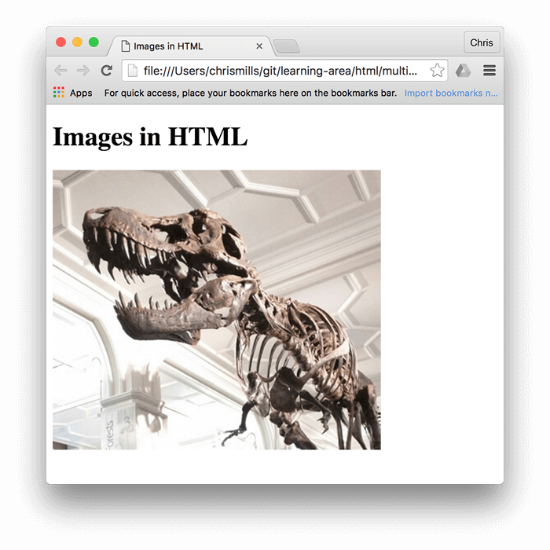
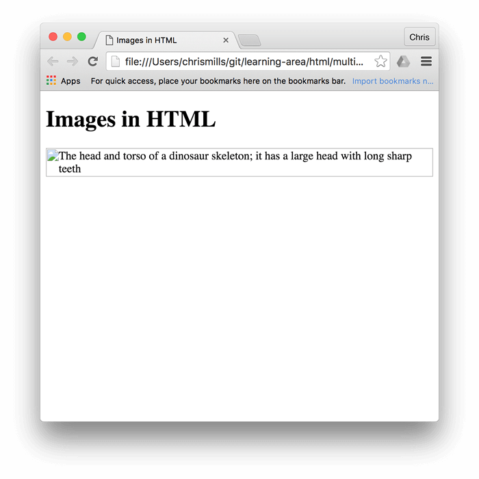
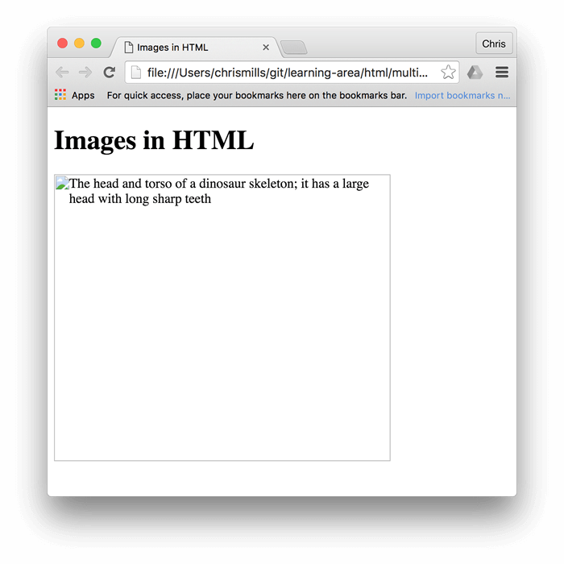

{{LearnSidebar}}{{NextMenu("Learn/HTML/Multimedia_and_embedding/Video_and_audio_content", "Learn/HTML/Multimedia_and_embedding")}}

In the beginning, the Web was just text, and it was really quite boring. Fortunately, it wasn't too long before the ability to embed images (and other more interesting types of content) inside web pages was added. There are other types of multimedia to consider, but it is logical to start with the humble {{htmlelement("img")}} element, used to embed a simple image in a webpage. In this article we'll look at how to use it in depth, including the basics, annotating it with captions using {{htmlelement("figure")}}, and detailing how it relates to {{glossary("CSS")}} background images.

<table>
<caption>Multimedia and Embedding Images</caption>
  <tbody>
    <tr>
      <th scope="row">Prerequisites:</th>
      <td>
        Basic computer literacy,
        <a
          href="/en-US/docs/Learn/Getting_started_with_the_web/Installing_basic_software"
          >basic software installed</a
        >, basic knowledge of
        <a
          href="/en-US/docs/Learn/Getting_started_with_the_web/Dealing_with_files"
          >working with files</a
        >, familiarity with HTML fundamentals (as covered in
        <a href="/en-US/docs/Learn/HTML/Introduction_to_HTML/Getting_started"
          >Getting started with HTML</a
        >.)
      </td>
    </tr>
    <tr>
      <th scope="row">Objective:</th>
      <td>
        To learn how to embed simple images in HTML, annotate them with
        captions, and how HTML images relate to CSS background images.
      </td>
    </tr>
  </tbody>
</table>

## How do we put an image on a webpage?

In order to put a simple image on a web page, we use the {{htmlelement("img")}} element. This is a {{Glossary("void element")}} (meaning, it cannot have any child content and cannot have an end tag) that requires two attributes to be useful: `src` and `alt`. The `src` attribute contains a URL pointing to the image you want to embed in the page. As with the `href` attribute for {{htmlelement("a")}} elements, the `src` attribute can be a relative URL or an absolute URL. Without a `src` attribute, an `img` element has no image to load.

The [`alt` attribute is described below](#alternative_text).

> **Note:** You should read [A quick primer on URLs and paths](/en-US/docs/Learn/HTML/Introduction_to_HTML/Creating_hyperlinks#a_quick_primer_on_urls_and_paths) to refresh your memory on relative and absolute URLs before continuing.

So for example, if your image is called `dinosaur.jpg`, and it sits in the same directory as your HTML page, you could embed the image like so:

```html

```

If the image was in an `images` subdirectory, which was inside the same directory as the HTML page, then you'd embed it like this:

```html

```

And so on.

> **Note:** Search engines also read image filenames and count them towards SEO. Therefore, you should give your image a descriptive filename; `dinosaur.jpg` is better than `img835.png`.

You could also embed the image using its absolute URL, for example:

```html

```

Linking via absolute URLs is not recommended, however. You should host the images you want to use on your site, which in simple setups means keeping the images for your website on the same server as your HTML. In addition, it is more efficient to use relative URLs than absolute URLs in terms of maintenance (when you move your site to a different domain, you won't need to update all your URLs to include the new domain). In more advanced setups, you might use a [CDN (Content Delivery Network)](/en-US/docs/Glossary/CDN) to deliver your images.

If you did not create the images, you should make sure you have the permission to use them under the conditions of the license they are published under (see [Media assets and licensing](#media_assets_and_licensing) below for more information).

> **Warning:** _Never_ point the `src` attribute at an image hosted on someone else's website _without permission_. This is called "hotlinking". It is considered unethical, since someone else would be paying the bandwidth costs for delivering the image when someone visits your page. It also leaves you with no control over the image being removed or replaced with something embarrassing.

The previous code snippet, either with the absolute or the relative URL, will give us the following result:



> **Note:** Elements like {{htmlelement("img")}} and {{htmlelement("video")}} are sometimes referred to as **replaced elements**. This is because the element's content and size are defined by an external resource (like an image or video file), not by the contents of the element itself. You can read more about them at [Replaced elements](/en-US/docs/Web/CSS/Replaced_element).

> **Note:** You can find the finished example from this section [running on GitHub](https://mdn.github.io/learning-area/html/multimedia-and-embedding/images-in-html/index.html) (see the [source code](https://github.com/mdn/learning-area/blob/main/html/multimedia-and-embedding/images-in-html/index.html) too.)

### Alternative text

The next attribute we'll look at is `alt`. Its value is supposed to be a textual description of the image, for use in situations where the image cannot be seen/displayed or takes a long time to render because of a slow internet connection. For example, our above code could be modified like so:

```html

```

The easiest way to test your `alt` text is to purposely misspell your filename. If for example our image name was spelled `dinosooooor.jpg`, the browser wouldn't display the image, and would display the alt text instead:



So, why would you ever see or need alt text? It can come in handy for a number of reasons:

- The user is visually impaired, and is using a [screen reader](https://en.wikipedia.org/wiki/Screen_reader) to read the web out to them. In fact, having alt text available to describe images is useful to most users.
- As described above, the spelling of the file or path name might be wrong.
- The browser doesn't support the image type. Some people still use text-only browsers, such as [Lynx](https://en.wikipedia.org/wiki/Lynx_%28web_browser%29), which displays the alt text of images.
- You may want to provide text for search engines to utilize; for example, search engines can match alt text with search queries.
- Users have turned off images to reduce data transfer volume and distractions. This is especially common on mobile phones, and in countries where bandwidth is limited or expensive.

What exactly should you write inside your `alt` attribute? It depends on _why_ the image is there in the first place. In other words, what you lose if your image doesn't show up:

- **Decoration.** You should use [CSS background images](#css_background_images) for decorative images, but if you must use HTML, add a blank `alt=""`. If the image isn't part of the content, a screen reader shouldn't waste time reading it.
- **Content.** If your image provides significant information, provide the same information in a _brief_ `alt` text – or even better, in the main text which everybody can see. Don't write redundant `alt` text. How annoying would it be for a sighted user if all paragraphs were written twice in the main content? If the image is described adequately by the main text body, you can just use `alt=""`.
- **Link.** If you put an image inside {{htmlelement("a")}} tags, to turn an image into a link, you still must provide [accessible link text](/en-US/docs/Learn/HTML/Introduction_to_HTML/Creating_hyperlinks#use_clear_link_wording). In such cases you may, either, write it inside the same `<a>` element, or inside the image's `alt` attribute – whichever works best in your case.
- **Text.** You should not put your text into images. If your main heading needs a drop shadow, for example, [use CSS](/en-US/docs/Web/CSS/text-shadow) for that rather than putting the text into an image. However, If you _really can't avoid doing this_, you should supply the text inside the `alt` attribute.

Essentially, the key is to deliver a usable experience, even when the images can't be seen. This ensures all users are not missing any of the content. Try turning off images in your browser and see how things look. You'll soon realize how helpful alt text is if the image cannot be seen.

> **Note:** For more information, see our guide to [Text Alternatives](/en-US/docs/Learn/Accessibility/HTML#text_alternatives).

### Width and height

You can use the `width` and `height` attributes to specify the width and height of your image. You can find your image's width and height in a number of ways. For example on the Mac you can use <kbd>Cmd</kbd> + <kbd>I</kbd> to get the info display up for the image file. Returning to our example, we could do this:

```html

```

This doesn't result in much difference to the display, under normal circumstances. But if the image isn't being displayed, for example, the user has just navigated to the page, and the image hasn't yet loaded, you'll notice the browser is leaving a space for the image to appear in:



This is a good thing to do, resulting in the page loading quicker and more smoothly.

However, you shouldn't alter the size of your images using HTML attributes. If you set the image size too big, you'll end up with images that look grainy, fuzzy, or too small, and wasting bandwidth downloading an image that is not fitting the user's needs. The image may also end up looking distorted, if you don't maintain the correct [aspect ratio](https://en.wikipedia.org/wiki/Aspect_ratio_%28image%29). You should use an image editor to put your image at the correct size before putting it on your webpage.

> **Note:** If you do need to alter an image's size, you should use [CSS](/en-US/docs/Learn/CSS) instead.

### Image titles

As [with links](/en-US/docs/Learn/HTML/Introduction_to_HTML/Creating_hyperlinks#adding_supporting_information_with_the_title_attribute), you can also add `title` attributes to images, to provide further supporting information if needed. In our example, we could do this:

```html

```

This gives us a tooltip on mouse hover, just like link titles:


However, this is not recommended — `title` has a number of accessibility problems, mainly based around the fact that screen reader support is very unpredictable and most browsers won't show it unless you are hovering with a mouse (so e.g. no access to keyboard users). If you are interested in more information about this, read [The Trials and Tribulations of the Title Attribute](https://www.24a11y.com/2017/the-trials-and-tribulations-of-the-title-attribute/) by Scott O'Hara.

It is better to include such supporting information in the main article text, rather than attached to the image.

### Active learning: embedding an image

It is now your turn to play! This active learning section will have you up and running with a simple embedding exercise. You are provided with a basic {{htmlelement("img")}} tag; we'd like you to embed the image located at the following URL:

```
https://raw.githubusercontent.com/mdn/learning-area/master/html/multimedia-and-embedding/images-in-html/dinosaur_small.jpg
```

Earlier we said to never hotlink to images on other servers, but this is just for learning purposes, so we'll let you off this one time.

We would also like you to:

- Add some alt text, and check that it works by misspelling the image URL.
- Set the image's correct `width` and `height` (hint: it is 200px wide and 171px high), then experiment with other values to see what the effect is.
- Set a `title` on the image.

If you make a mistake, you can always reset it using the _Reset_ button. If you get really stuck, press the _Show solution_ button to see an answer:

```html hidden
<h2>Live output</h2>

<div class="output" style="min-height: 50px;"></div>

<h2>Editable code</h2>
<p class="a11y-label">
  Press Esc to move focus away from the code area (Tab inserts a tab character).
</p>

<textarea id="code" class="input" style="min-height: 100px; width: 95%">

</textarea>

<div class="playable-buttons">
  <input id="reset" type="button" value="Reset" />
  <input id="solution" type="button" value="Show solution" />
</div>
```

```css hidden
html {
  font-family: sans-serif;
}

h2 {
  font-size: 16px;
}

.a11y-label {
  margin: 0;
  text-align: right;
  font-size: 0.7rem;
  width: 98%;
}

body {
  margin: 10px;
  background: #f5f9fa;
}
```

```js hidden
const textarea = document.getElementById("code");
const reset = document.getElementById("reset");
const solution = document.getElementById("solution");
const output = document.querySelector(".output");
const code = textarea.value;
let userEntry = textarea.value;

function updateCode() {
  output.innerHTML = textarea.value;
}

const htmlSolution =
  '';
let solutionEntry = htmlSolution;

reset.addEventListener("click", () => {
  textarea.value = code;
  userEntry = textarea.value;
  solutionEntry = htmlSolution;
  solution.value = "Show solution";
  updateCode();
});

solution.addEventListener("click", () => {
  if (solution.value === "Show solution") {
    textarea.value = solutionEntry;
    solution.value = "Hide solution";
  } else {
    textarea.value = userEntry;
    solution.value = "Show solution";
  }
  updateCode();
});

textarea.addEventListener("input", updateCode);
window.addEventListener("load", updateCode);

// stop tab key tabbing out of textarea and
// make it write a tab at the caret position instead

textarea.onkeydown = (e) => {
  if (e.keyCode === 9) {
    e.preventDefault();
    insertAtCaret("\t");
  }

  if (e.keyCode === 27) {
    textarea.blur();
  }
};

function insertAtCaret(text) {
  const scrollPos = textarea.scrollTop;
  let caretPos = textarea.selectionStart;

  const front = textarea.value.substring(0, caretPos);
  const back = textarea.value.substring(
    textarea.selectionEnd,
    textarea.value.length,
  );
  textarea.value = front + text + back;
  caretPos += text.length;
  textarea.selectionStart = caretPos;
  textarea.selectionEnd = caretPos;
  textarea.focus();
  textarea.scrollTop = scrollPos;
}

// Update the saved userCode every time the user updates the text area code

textarea.onkeyup = function () {
  // We only want to save the state when the user code is being shown,
  // not the solution, so that solution is not saved over the user code
  if (solution.value === "Show solution") {
    userEntry = textarea.value;
  } else {
    solutionEntry = textarea.value;
  }

  updateCode();
};
```

{{ EmbedLiveSample('Active_learning_embedding_an_image', 700, 350) }}

## Media assets and licensing

Images (and other media asset types) you find on the web are released under various license types. Before you use an image on a site you are building, ensure you own it, have permission to use it, or comply with the owner's licensing conditions.

### Understanding license types

Let's look at some common categories of licenses you are likely to find on the web.

#### All rights reserved

Creators of original work such as songs, books, or software often release their work under closed copyright protection. This means that, by default, they (or their publisher) have exclusive rights to use (for example, display or distribute) their work. If you want to use a copyrighted image with the _all rights reserved_ license, you need to:

- Obtain explicit, written permission from the copyright holder.
- Pay a license fee to use it. This can be a one-time fee for unlimited use ("royalty-free"), or it might be "rights-managed", in which case you might have to pay specific fees per use by time slot, geographic region, industry or media type, etc.
- Limit your uses to those that would be considered [fair use](https://fairuse.stanford.edu/overview/fair-use/what-is-fair-use/) or [fair dealing](https://www.bl.uk/business-and-ip-centre/articles/fair-dealing-copyright-explained) in your jurisdiction.

Authors are not required to include a copyright notice or license terms with their work. Copyright exists automatically in an original work of authorship once it is created in a tangible medium. So if you find an image online and there are no copyright notices or license terms, the safest course is to assume it is protected by copyright with all rights reserved.

#### Permissive

If the image is released under a permissive license, such as [MIT](https://mit-license.org/), [BSD](https://opensource.org/license/BSD-3-clause/), or a suitable [Creative Commons (CC) license](https://creativecommons.org/choose/), you do not need to pay a license fee or seek permission to use it. Still, there are various licensing conditions you will have to fulfill, which vary by license.

For example, you might have to:

- Provide a link to the original source of the image and credit its creator.
- Indicate whether any changes were made to it.
- Share any derivative works created using the image under the same license as the original.
- Not share any derivative works at all.
- Not use the image in any commercial work.
- Include a copy of the license along with any release that uses the image.

You should consult the applicable license for the specific terms you will need to follow.

> **Note:** You may come across the term "copyleft" in the context of permissive licenses. Copyleft licenses (such as the [GNU General Public License (GPL)](https://www.gnu.org/licenses/gpl-3.0.en.html) or "Share Alike" Creative Commons licenses) stipulate that derivative works need to be released under the same license as the original.

Copyleft licenses are prominent in the software world. The basic idea is that a new project built with the code of a copyleft-licensed project (this is known as a "fork" of the original software) will also need to be licensed under the same copyleft license. This ensures that the source code of the new project will also be made available for others to study and modify. Note that, in general, licenses that were drafted for software, such as the GPL, are not considered to be good licenses for non-software works as they were not drafted with non-software works in mind.

Explore the links provided earlier in this section to read about the different license types and the kinds of conditions they specify.

#### Public domain/CC0

Work released into the public domain is sometimes referred to as "no rights reserved" — no copyright applies to it, and it can be used without permission and without having to fulfill any licensing conditions. Work can end up in the public domain by various means such as expiration of copyright, or specific waiving of rights.

One of the most effective ways to place work in the public domain is to license it under [CC0](https://creativecommons.org/share-your-work/public-domain/cc0/), a specific creative commons license that provides a clear and unambiguous legal tool for this purpose.

When using public domain images, obtain proof that the image is in the public domain and keep the proof for your records. For example, take a screenshot of the original source with the licensing status clearly displayed, and consider adding a page to your website with a list of the images acquired along with their license requirements.

### Searching for permissively-licensed images

You can find permissive-licensed images for your projects using an image search engine or directly from image repositories.

Search for images using a description of the image you are seeking along with relevant licensing terms. For example, when searching for "yellow dinosaur" add "public domain images", "public domain image library", "open licensed images", or similar terms to the search query.

Some search engines have tools to help you find images with permissive licenses. For example, when using Google, go to the "Images" tab to search for images, then click "Tools". There is a "Usage Rights" dropdown in the resulting toolbar where you can choose to search specifically for images under creative commons licenses.

Image repository sites, such as [Flickr](https://flickr.com/), [ShutterStock](https://www.shutterstock.com), and [Pixabay](https://pixabay.com/), have search options to allow you to search just for permissively-licensed images. Some sites exclusively distribute permissively-licensed images and icons, such as [Picryl](https://picryl.com) and [The Noun Project](https://thenounproject.com/).

Complying with the license the image has been released under is a matter of finding the license details, reading the license or instruction page provided by the source, and then following those instructions. Reputable image repositories make their license conditions clear and easy to find.

## Annotating images with figures and figure captions

Speaking of captions, there are a number of ways that you could add a caption to go with your image. For example, there would be nothing to stop you from doing this:

```html
<div class="figure">
  

  <p>A T-Rex on display in the Manchester University Museum.</p>
</div>
```

This is OK. It contains the content you need, and is nicely stylable using CSS. But there is a problem here: there is nothing that semantically links the image to its caption, which can cause problems for screen readers. For example, when you have 50 images and captions, which caption goes with which image?

A better solution, is to use the HTML {{htmlelement("figure")}} and {{htmlelement("figcaption")}} elements. These are created for exactly this purpose: to provide a semantic container for figures, and to clearly link the figure to the caption. Our above example could be rewritten like this:

```html
<figure>
  

  <figcaption>
    A T-Rex on display in the Manchester University Museum.
  </figcaption>
</figure>
```

The {{htmlelement("figcaption")}} element tells browsers, and assistive technology that the caption describes the other content of the {{htmlelement("figure")}} element.

> **Note:** From an accessibility viewpoint, captions and [`alt`](/en-US/docs/Web/HTML/Element/img#alt) text have distinct roles. Captions benefit even people who can see the image, whereas [`alt`](/en-US/docs/Web/HTML/Element/img#alt) text provides the same functionality as an absent image. Therefore, captions and `alt` text shouldn't just say the same thing, because they both appear when the image is gone. Try turning images off in your browser and see how it looks.

A figure doesn't have to be an image. It is an independent unit of content that:

- Expresses your meaning in a compact, easy-to-grasp way.
- Could go in several places in the page's linear flow.
- Provides essential information supporting the main text.

A figure could be several images, a code snippet, audio, video, equations, a table, or something else.

### Active learning: creating a figure

In this active learning section, we'd like you to take the finished code from the previous active learning section, and turn it into a figure:

1. Wrap it in a {{htmlelement("figure")}} element.
2. Copy the text out of the `title` attribute, remove the `title` attribute, and put the text inside a {{htmlelement("figcaption")}} element below the image.

If you make a mistake, you can always reset it using the _Reset_ button. If you get really stuck, press the _Show solution_ button to see an answer:

```html hidden
<h2>Live output</h2>

<div class="output" style="min-height: 50px;"></div>

<h2>Editable code</h2>
<p class="a11y-label">
  Press Esc to move focus away from the code area (Tab inserts a tab character).
</p>

<textarea
  id="code"
  class="input"
  style="min-height: 100px; width: 95%"></textarea>

<div class="playable-buttons">
  <input id="reset" type="button" value="Reset" />
  <input id="solution" type="button" value="Show solution" />
</div>
```

```css hidden
html {
  font-family: sans-serif;
}

h2 {
  font-size: 16px;
}

.a11y-label {
  margin: 0;
  text-align: right;
  font-size: 0.7rem;
  width: 98%;
}

body {
  margin: 10px;
  background: #f5f9fa;
}
```

```js hidden
const textarea = document.getElementById("code");
const reset = document.getElementById("reset");
const solution = document.getElementById("solution");
const output = document.querySelector(".output");
const code = textarea.value;
let userEntry = textarea.value;

function updateCode() {
  output.innerHTML = textarea.value;
}

const htmlSolution =
  '<figure>\n \n <figcaption>A T-Rex on display in the Manchester University Museum</figcaption>\n</figure>';
let solutionEntry = htmlSolution;

reset.addEventListener("click", () => {
  textarea.value = code;
  userEntry = textarea.value;
  solutionEntry = htmlSolution;
  solution.value = "Show solution";
  updateCode();
});

solution.addEventListener("click", () => {
  if (solution.value === "Show solution") {
    textarea.value = solutionEntry;
    solution.value = "Hide solution";
  } else {
    textarea.value = userEntry;
    solution.value = "Show solution";
  }
  updateCode();
});

textarea.addEventListener("input", updateCode);
window.addEventListener("load", updateCode);

// stop tab key tabbing out of textarea and
// make it write a tab at the caret position instead

textarea.onkeydown = (e) => {
  if (e.keyCode === 9) {
    e.preventDefault();
    insertAtCaret("\t");
  }

  if (e.keyCode === 27) {
    textarea.blur();
  }
};

function insertAtCaret(text) {
  const scrollPos = textarea.scrollTop;
  let caretPos = textarea.selectionStart;

  const front = textarea.value.substring(0, caretPos);
  const back = textarea.value.substring(
    textarea.selectionEnd,
    textarea.value.length,
  );
  textarea.value = front + text + back;
  caretPos += text.length;
  textarea.selectionStart = caretPos;
  textarea.selectionEnd = caretPos;
  textarea.focus();
  textarea.scrollTop = scrollPos;
}

// Update the saved userCode every time the user updates the text area code

textarea.onkeyup = () => {
  // We only want to save the state when the user code is being shown,
  // not the solution, so that solution is not saved over the user code
  if (solution.value === "Show solution") {
    userEntry = textarea.value;
  } else {
    solutionEntry = textarea.value;
  }

  updateCode();
};
```

{{ EmbedLiveSample('Active_learning_creating_a_figure', 700, 350) }}

## CSS background images

You can also use CSS to embed images into webpages (and JavaScript, but that's another story entirely). The CSS {{cssxref("background-image")}} property, and the other `background-*` properties, are used to control background image placement. For example, to place a background image on every paragraph on a page, you could do this:

```css
p {
  background-image: url("images/dinosaur.jpg");
}
```

The resulting embedded image is arguably easier to position and control than HTML images. So why bother with HTML images? As hinted to above, CSS background images are for decoration only. If you just want to add something pretty to your page to enhance the visuals, this is fine. Though, such images have no semantic meaning at all. They can't have any text equivalents, are invisible to screen readers, and so on. This is where HTML images shine!

Summing up: if an image has meaning, in terms of your content, you should use an HTML image. If an image is purely decoration, you should use CSS background images.

> **Note:** You'll learn a lot more about [CSS background images](/en-US/docs/Learn/CSS/Building_blocks/Backgrounds_and_borders) in our [CSS](/en-US/docs/Learn/CSS) topic.

## Test your skills!

You've reached the end of this article, but can you remember the most important information? You can find some further tests to verify that you've retained this information before you move on — see [Test your skills: HTML images](/en-US/docs/Learn/HTML/Multimedia_and_embedding/Images_in_HTML/Test_your_skills:_HTML_images).

## Summary

That's all for now. We have covered images and captions in detail. In the next article, we'll move it up a gear, looking at how to use HTML to embed [video and audio content](/en-US/docs/Learn/HTML/Multimedia_and_embedding/Video_and_audio_content) in web pages.

{{NextMenu("Learn/HTML/Multimedia_and_embedding/Video_and_audio_content", "Learn/HTML/Multimedia_and_embedding")}}
