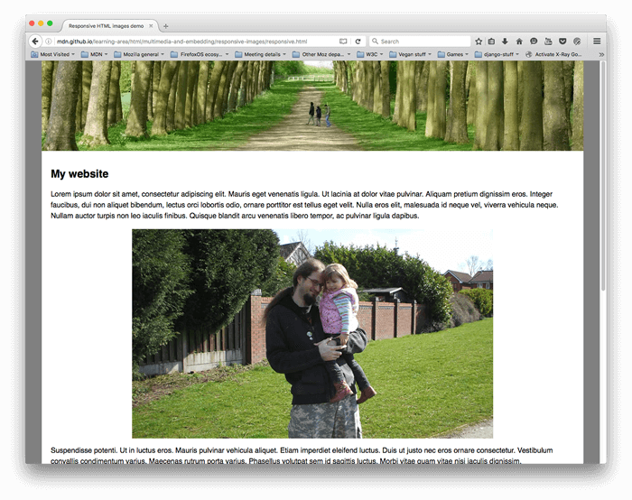
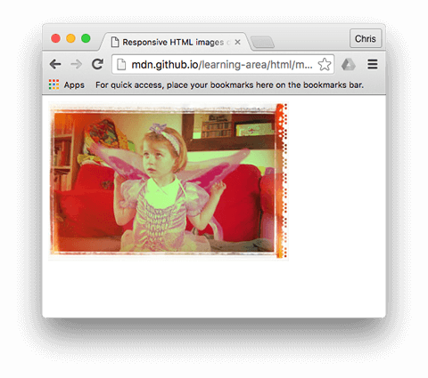
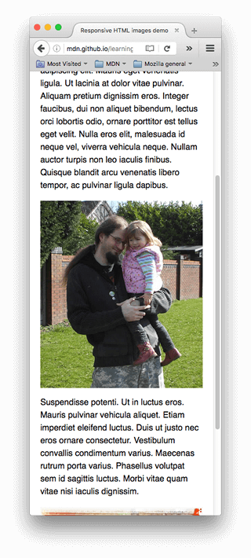

{{LearnSidebar}}{{PreviousMenuNext("Learn/HTML/Multimedia_and_embedding/Adding_vector_graphics_to_the_Web", "Learn/HTML/Multimedia_and_embedding/Mozilla_splash_page", "Learn/HTML/Multimedia_and_embedding")}}

In this article, we'll learn about the concept of responsive images — images that work well on devices with widely differing screen sizes, resolutions, and other such features — and look at what tools HTML provides to help implement them. This helps to improve performance across different devices. Responsive images are just one part of [responsive design](/en-US/docs/Learn/CSS/CSS_layout/Responsive_Design), a future CSS topic for you to learn.

<table class="standard-table">
  <tbody>
    <tr>
      <th scope="row">Prerequisites:</th>
      <td>
        You should already know the
        <a href="/en-US/docs/Learn/HTML/Introduction_to_HTML">basics of HTML</a>
        and how to
        <a href="/en-US/docs/Learn/HTML/Multimedia_and_embedding/Images_in_HTML"
          >add static images to a web page</a
        >.
      </td>
    </tr>
    <tr>
      <th scope="row">Objective:</th>
      <td>
        Learn how to use features like
        {{htmlattrxref("srcset", "img")}} and the
        {{htmlelement("picture")}} element to implement responsive
        image solutions on websites.
      </td>
    </tr>
  </tbody>
</table>

## Why responsive images?

Let's examine a typical scenario. A typical website may contain a header image and some content images below the header. The header image will likely span the whole of the width of the header, and the content image will fit somewhere inside the content column. Here's a simple example:



This works well on a wide screen device, such as a laptop or desktop (you can [see the example live](https://mdn.github.io/learning-area/html/multimedia-and-embedding/responsive-images/not-responsive.html) and find the [source code](https://github.com/mdn/learning-area/blob/main/html/multimedia-and-embedding/responsive-images/not-responsive.html) on GitHub.) We won't discuss the CSS much in this lesson, except to say that:

- The body content has been set to a maximum width of 1200 pixels — in viewports above that width, the body remains at 1200px and centers itself in the available space. In viewports below that width, the body will stay at 100% of the width of the viewport.
- The header image has been set so that its center always stays in the center of the header, no matter what width the heading is set at. If the site is being viewed on a narrower screen, the important detail in the center of the image (the people) can still be seen, and the excess is lost off either side. It is 200px high.
- The content images have been set so that if the body element becomes smaller than the image, the images start to shrink so that they always stay inside the body, rather than overflowing it.

However, issues arise when you start to view the site on a narrow screen device. The header below looks OK, but it's starting to take up a lot of the screen height for a mobile device. And at this size, it is difficult to see faces of the two people within the first content image.


An improvement would be to display a cropped version of the image which displays the important details of the image when the site is viewed on a narrow screen. A second cropped image could be displayed for a medium-width screen device, like a tablet. The general problem whereby you want to serve different cropped images in that way, for various layouts, is commonly known as the **art direction problem**.

In addition, there is no need to embed such large images on the page if it is being viewed on a mobile screen. And conversely, a small [raster image](/en-US/docs/Glossary/Raster_image) starts to look grainy when displayed larger than its original size (a raster image is a set number of pixels wide and a set number of pixels tall, as we saw when we looked at [vector graphics](/en-US/docs/Learn/HTML/Multimedia_and_embedding/Adding_vector_graphics_to_the_Web)). This is called the **resolution switching problem**.

Conversely, it is unnecessary to display a large image on a screen significantly smaller than
the size it was meant for. Doing so can waste bandwidth; in particular, mobile users don't want to
waste bandwidth by downloading a large image intended for desktop users, when a small image would
do for their device. Ideally, multiple resolutions would be made available to the user's web
browser. The browser could then determine the optimal resolution to load based on the screen size
of the user's device.

To make things more complicated, some devices have high resolution screens that need larger images than you might expect to display nicely. This is essentially the same problem, but in a slightly different context.

You might think that vector images would solve these problems, and they do to a certain degree — they are small in file size and scale well, and you should use them wherever possible. However, they aren't suitable for all image types. Vector images are great for simple graphics, patterns, interface elements, etc., but it starts to get very complex to create a vector-based image with the kind of detail that you'd find in say, a photo. Raster image formats such as JPEGs are more suited to the kind of images we see in the above example.

This kind of problem didn't exist when the web first existed, in the early to mid 90s — back then the only devices in existence to browse the Web were desktops and laptops, so browser engineers and spec writers didn't even think to implement solutions. _Responsive image technologies_ were implemented recently to solve the problems indicated above by letting you offer the browser several image files, either all showing the same thing but containing different numbers of pixels (_resolution switching_), or different images suitable for different space allocations (_art direction_).

> **Note:** The new features discussed in this article — {{htmlattrxref("srcset", "img")}}/{{htmlattrxref("sizes", "img")}}/{{htmlelement("picture")}} — are all supported in modern desktop and mobile browsers (including Microsoft's Edge browser, although not Internet Explorer.)

## How do you create responsive images?

In this section, we'll look at the two problems illustrated above and show how to solve them using HTML's responsive image features. You should note that we will be focusing on {{htmlelement("img")}} elements for this section, as seen in the content area of the example above — the image in the site header is only for decoration, and therefore implemented using CSS background images. [CSS arguably has better tools for responsive design](https://cloudfour.com/thinks/responsive-images-101-part-8-css-images/) than HTML, and we'll talk about those in a future CSS module.

### Resolution switching: Different sizes

So, what is the problem that we want to solve with resolution switching? We want to display identical image content, just larger or smaller depending on the device — this is the situation we have with the second content image in our example. The standard {{htmlelement("img")}} element traditionally only lets you point the browser to a single source file:

```html

```

We can however use two attributes — {{htmlattrxref("srcset", "img")}} and {{htmlattrxref("sizes", "img")}} — to provide several additional source images along with hints to help the browser pick the right one. You can see an example of this in our [responsive.html](https://mdn.github.io/learning-area/html/multimedia-and-embedding/responsive-images/responsive.html) example on GitHub (see also [the source code](https://github.com/mdn/learning-area/blob/main/html/multimedia-and-embedding/responsive-images/responsive.html)):

```html

```

The `srcset` and `sizes` attributes look complicated, but they're not too hard to understand if you format them as shown above, with a different part of the attribute value on each line. Each value contains a comma-separated list, and each part of those lists is made up of three sub-parts. Let's run through the contents of each now:

**`srcset`** defines the set of images we will allow the browser to choose between, and what size each image is. Each set of image information is separated from the previous one by a comma. For each one, we write:

1. An **image filename** (`elva-fairy-480w.jpg`)
2. A space
3. The image's **intrinsic width in pixels** (`480w`) — note that this uses the `w` unit, not `px` as you might expect. An image's [intrinsic size](/en-US/docs/Glossary/Intrinsic_Size) is its real size, which can be found by inspecting the image file on your computer (for example, on a Mac you can select the image in Finder and press

    <kbd>Cmd</kbd>

    \+

    <kbd>I</kbd>

    to bring up the info screen).

**`sizes`** defines a set of media conditions (e.g. screen widths) and indicates what image size would be best to choose, when certain media conditions are true — these are the hints we talked about earlier. In this case, before each comma we write:

1. A **media condition** (`(max-width:600px)`) — you'll learn more about these in the [CSS topic](/en-US/docs/Learn/CSS), but for now let's just say that a media condition describes a possible state that the screen can be in. In this case, we are saying "when the viewport width is 600 pixels or less".
2. A space
3. The **width of the slot** the image will fill when the media condition is true (`480px`)

> **Note:** For the slot width, rather than providing an absolute width (for example, `480px`), you can alternatively provide a width relative to the viewport (for example, `50vw`) — but not a percentage. You may have noticed that the last slot width has no media condition (this is the default that is chosen when none of the media conditions are true). The browser ignores everything after the first matching condition, so be careful how you order the media conditions.

So, with these attributes in place, the browser will:

1. Look at its device width.
2. Work out which media condition in the `sizes` list is the first one to be true.
3. Look at the slot size given to that media query.
4. Load the image referenced in the `srcset` list that has the same size as the slot or, if there isn't one, the first image that is bigger than the chosen slot size.

And that's it! At this point, if a supporting browser with a viewport width of 480px loads the page, the `(max-width: 600px)` media condition will be true, and so the browser chooses the `480px` slot. The `elva-fairy-480w.jpg` will be loaded, as its inherent width (`480w`) is closest to the slot size. The 800px picture is 128KB on disk, whereas the 480px version is only 63KB — a saving of 65KB. Now, imagine if this was a page that had many pictures on it. Using this technique could save mobile users a lot of bandwidth.

> **Note:** When testing this with a desktop browser, if the browser fails to load the narrower images when you've got its window set to the narrowest width, have a look at what the viewport is (you can approximate it by going into the browser's JavaScript console and typing in `document.querySelector('html').clientWidth`). Different browsers have minimum sizes that they'll let you reduce the window width to, and they might be wider than you'd think. When testing it with a mobile browser, you can use tools like Firefox's `about:debugging` page to inspect the page loaded on the mobile using the desktop developer tools.
>
> To see which images were loaded, you can use Firefox DevTools's [Network Monitor](https://firefox-source-docs.mozilla.org/devtools-user/network_monitor/index.html) tab.

Older browsers that don't support these features will just ignore them. Instead, those browsers will go ahead and load the image referenced in the {{htmlattrxref("src", "img")}} attribute as normal.

> **Note:** In the {{htmlelement("head")}} of the example linked above, you'll find the line `<meta name="viewport" content="width=device-width">`: this forces mobile browsers to adopt their real viewport width for loading web pages (some mobile browsers lie about their viewport width, and instead load pages at a larger viewport width then shrink the loaded page down, which is not very helpful for responsive images or design).

### Resolution switching: Same size, different resolutions

If you're supporting multiple display resolutions, but everyone sees your image at the same real-world size on the screen, you can allow the browser to choose an appropriate resolution image by using `srcset` with x-descriptors and without `sizes` — a somewhat easier syntax! You can find an example of what this looks like in [srcset-resolutions.html](https://mdn.github.io/learning-area/html/multimedia-and-embedding/responsive-images/srcset-resolutions.html) (see also [the source code](https://github.com/mdn/learning-area/blob/main/html/multimedia-and-embedding/responsive-images/srcset-resolutions.html)):

```html

```

In this example, the following CSS is applied to the image so that it will have a width of 320 pixels on the screen (also called CSS pixels):

```css
img {
  width: 320px;
}
```

In this case, `sizes` is not needed — the browser works out what resolution the display is that it is being shown on, and serves the most appropriate image referenced in the `srcset`. So if the device accessing the page has a standard/low resolution display, with one device pixel representing each CSS pixel, the `elva-fairy-320w.jpg` image will be loaded (the 1x is implied, so you don't need to include it.) If the device has a high resolution of two device pixels per CSS pixel or more, the `elva-fairy-640w.jpg` image will be loaded. The 640px image is 93KB, whereas the 320px image is only 39KB.

### Art direction

To recap, the **art direction problem** involves wanting to change the image displayed to suit different image display sizes. For example, a web page includes a large landscape shot with a person in the middle when viewed on a desktop browser. When viewed on a mobile browser, that same image is shrunk down, making the person in the image very small and hard to see. It would probably be better to show a smaller, portrait image on mobile, which zooms in on the person. The {{htmlelement("picture")}} element allows us to implement just this kind of solution.

Returning to our original [not-responsive.html](https://mdn.github.io/learning-area/html/multimedia-and-embedding/responsive-images/not-responsive.html) example, we have an image that badly needs art direction:

```html

```

Let's fix this, with {{htmlelement("picture")}}! Like [`<video>` and `<audio>`](/en-US/docs/Learn/HTML/Multimedia_and_embedding/Video_and_audio_content), the `<picture>` element is a wrapper containing several {{htmlelement("source")}} elements that provide different sources for the browser to choose from, followed by the all-important {{htmlelement("img")}} element. The code in [responsive.html](https://mdn.github.io/learning-area/html/multimedia-and-embedding/responsive-images/responsive.html) looks like so:

```html
<picture>
  <source media="(max-width: 799px)" srcset="elva-480w-close-portrait.jpg">
  <source media="(min-width: 800px)" srcset="elva-800w.jpg">
  
</picture>
```

- The `<source>` elements include a `media` attribute that contains a media condition — as with the first `srcset` example, these conditions are tests that decide which image is shown — the first one that returns true will be displayed. In this case, if the viewport width is 799px wide or less, the first `<source>` element's image will be displayed. If the viewport width is 800px or more, it'll be the second one.
- The `srcset` attributes contain the path to the image to display. Just as we saw with `` above, `<source>` can take a `srcset` attribute with multiple images referenced, as well as a `sizes` attribute. So, you could offer multiple images via a `<picture>` element, but then also offer multiple resolutions of each one. Realistically, you probably won't want to do this kind of thing very often.
- In all cases, you must provide an `` element, with `src` and `alt`, right before `</picture>`, otherwise no images will appear. This provides a default case that will apply when none of the media conditions return true (you could actually remove the second `<source>` element in this example), and a fallback for browsers that don't support the `<picture>` element.

This code allows us to display a suitable image on both wide screen and narrow screen displays, as shown below:



> **Note:** You should use the `media` attribute only in art direction scenarios; when you do use `media`, don't also offer media conditions within the `sizes` attribute.

### Why can't we just do this using CSS or JavaScript?

When the browser starts to load a page, it starts to download (preload) any images before the main parser has started to load and interpret the page's CSS and JavaScript. That mechanism is useful in general for reducing page load times, but it is not helpful for responsive images — hence the need to implement solutions like `srcset`. For example, you couldn't load the {{htmlelement("img")}} element, then detect the viewport width with JavaScript, and then dynamically change the source image to a smaller one if desired. By then, the original image would already have been loaded, and you would load the small image as well, which is even worse in responsive image terms.

### Use modern image formats boldly

New image formats like [WebP](/en-US/docs/Web/Media/Formats/Image_types#webp_image) and [AVIF](/en-US/docs/Web/Media/Formats/Image_types#avif_image) can maintain a low file size and high quality at the same time. These formats now have relatively broad browser support but little "historical depth".

`<picture>` lets us continue catering to older browsers. You can supply MIME types inside `type` attributes so the browser can immediately reject unsupported file types:

```html
<picture>
  <source type="image/svg+xml" srcset="pyramid.svg">
  <source type="image/webp" srcset="pyramid.webp">
  
</picture>
```

- Do _not_ use the `media` attribute, unless you also need art direction.
- In a `<source>` element, you can only refer to images of the type declared in `type`.
- Use comma-separated lists with `srcset` and `sizes`, as needed.

## Active learning: Implementing your own responsive images

For this active learning, we're expecting you to be brave and do it alone, mostly. We want you to implement your own suitable art-directed narrow screen/wide screenshot using `<picture>`, and a resolution switching example that uses `srcset`.

1. Write some simple HTML to contain your code (use `not-responsive.html` as a starting point, if you like).
2. Find a nice wide screen landscape image with some kind of detail contained in it somewhere. Create a web-sized version of it using a graphics editor, then crop it to show a smaller part that zooms in on the detail, and create a second image (about 480px wide is good for this).
3. Use the `<picture>` element to implement an art direction picture switcher!
4. Create multiple image files of different sizes, each showing the same picture.
5. Use `srcset`/`size` to create a resolution switcher example, either to serve the same size image at different resolutions, or different image sizes at different viewport widths.

## Summary

That's a wrap for responsive images — we hope you enjoyed playing with these new techniques. As a recap, there are two distinct problems we've been discussing here:

- **Art direction**: The problem whereby you want to serve cropped images for different layouts — for example a landscape image showing a full scene for a desktop layout, and a portrait image showing the main subject zoomed in for a mobile layout. You can solve this problem using the {{htmlelement("picture")}} element.
- **Resolution switching**: The problem whereby you want to serve smaller image files to narrow-screen devices, as they don't need huge images like desktop displays do — and to serve different resolution images to high density/low density screens. You can solve this problem using [vector graphics](/en-US/docs/Learn/HTML/Multimedia_and_embedding/Adding_vector_graphics_to_the_Web) (SVG images) and the {{htmlattrxref("srcset", "img")}} with {{htmlattrxref("sizes", "img")}} attributes.

This also draws to a close the entire [Multimedia and embedding](/en-US/docs/Learn/HTML/Multimedia_and_embedding) module! The only thing to do now before moving on is to try our [Multimedia and embedding assessment](/en-US/docs/Learn/HTML/Multimedia_and_embedding/Mozilla_splash_page), and see how you get on. Have fun!

## See also

- [Jason Grigsby's excellent introduction to responsive images](https://cloudfour.com/thinks/responsive-images-101-definitions/)
- [Responsive Images: If you're just changing resolutions, use srcset](https://css-tricks.com/responsive-images-youre-just-changing-resolutions-use-srcset/) — includes more explanation of how the browser works out which image to use
- {{htmlelement("img")}}
- {{htmlelement("picture")}}
- {{htmlelement("source")}}

{{PreviousMenuNext("Learn/HTML/Multimedia_and_embedding/Adding_vector_graphics_to_the_Web", "Learn/HTML/Multimedia_and_embedding/Mozilla_splash_page", "Learn/HTML/Multimedia_and_embedding")}}

## In this module

- [Images in HTML](/en-US/docs/Learn/HTML/Multimedia_and_embedding/Images_in_HTML)
- [Video and audio content](/en-US/docs/Learn/HTML/Multimedia_and_embedding/Video_and_audio_content)
- [From \<object> to \<iframe> — other embedding technologies](/en-US/docs/Learn/HTML/Multimedia_and_embedding/Other_embedding_technologies)
- [Adding vector graphics to the Web](/en-US/docs/Learn/HTML/Multimedia_and_embedding/Adding_vector_graphics_to_the_Web)
- [Responsive images](/en-US/docs/Learn/HTML/Multimedia_and_embedding/Responsive_images)
- [Mozilla splash page](/en-US/docs/Learn/HTML/Multimedia_and_embedding/Mozilla_splash_page)
