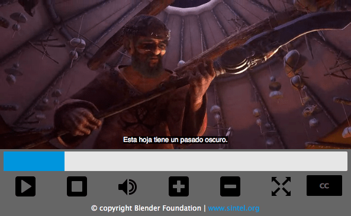

{{LearnSidebar}}{{PreviousMenuNext("Learn/HTML/Multimedia_and_embedding/Images_in_HTML", "Learn/HTML/Multimedia_and_embedding/Other_embedding_technologies", "Learn/HTML/Multimedia_and_embedding")}}

Now that we are comfortable with adding simple images to a webpage, the next step is to start adding video and audio players to your HTML documents! In this article we'll look at doing just that with the {{htmlelement("video")}} and {{htmlelement("audio")}} elements; we'll then finish off by looking at how to add captions/subtitles to your videos.

<table>
  <tbody>
    <tr>
      <th scope="row">Prerequisites:</th>
      <td>
        Basic computer literacy,
        <a
          href="/en-US/docs/Learn/Getting_started_with_the_web/Installing_basic_software"
          >basic software installed</a
        >, basic knowledge of
        <a
          href="/en-US/docs/Learn/Getting_started_with_the_web/Dealing_with_files"
          >working with files</a
        >, familiarity with HTML fundamentals (as covered in
        <a href="/en-US/docs/Learn/HTML/Introduction_to_HTML/Getting_started"
          >Getting started with HTML</a
        >) and
        <a href="/en-US/docs/Learn/HTML/Multimedia_and_embedding/Images_in_HTML"
          >Images in HTML</a
        >.
      </td>
    </tr>
    <tr>
      <th scope="row">Objective:</th>
      <td>
        To learn how to embed video and audio content into a webpage, and add
        captions/subtitles to video.
      </td>
    </tr>
  </tbody>
</table>

## Video and audio on the web

The first influx of online videos and audio were made possible by proprietary plugin-based technologies like [Flash](https://en.wikipedia.org/wiki/Adobe_Flash) and [Silverlight](https://en.wikipedia.org/wiki/Microsoft_Silverlight). Both of these had security and accessibility issues, and are now obsolete, in favor of native HTML solutions {{htmlelement("video")}} and {{htmlelement("audio")}} elements and the availability of {{Glossary("JavaScript")}} {{Glossary("API","APIs")}} for controlling them. We'll not be looking at JavaScript here — just the basic foundations that can be achieved with HTML.

We won't be teaching you how to produce audio and video files — that requires a completely different skillset. We have provided you with [sample audio and video files and example code](https://github.com/mdn/learning-area/tree/main/html/multimedia-and-embedding/video-and-audio-content) for your own experimentation, in case you are unable to get hold of your own.

> **Note:** Before you begin here, you should also know that there are quite a few OVPs (online video providers) like [YouTube](https://www.youtube.com/), [Dailymotion](https://www.dailymotion.com), and [Vimeo](https://vimeo.com/), and online audio providers like [Soundcloud](https://soundcloud.com/). Such companies offer a convenient, easy way to host and consume videos, so you don't have to worry about the enormous bandwidth consumption. OVPs even usually offer ready-made code for embedding video/audio in your webpages; if you use that route, you can avoid some of the difficulties we discuss in this article. We'll be discussing this kind of service a bit more in the next article.

### The \<video> element

The {{htmlelement("video")}} element allows you to embed a video very easily. A really simple example looks like this:

```html
<video src="rabbit320.webm" controls>
  <p>Your browser doesn't support HTML video. Here is a <a href="rabbit320.webm">link to the video</a> instead.</p>
</video>
```

The features of note are:

- {{htmlattrxref("src","video")}}
  - : In the same way as for the {{htmlelement("img")}} element, the `src` (source) attribute contains a path to the video you want to embed. It works in exactly the same way.
- {{htmlattrxref("controls","video")}}
  - : Users must be able to control video and audio playback (it's especially critical for people who have [epilepsy](https://en.wikipedia.org/wiki/Epilepsy#Epidemiology).) You must either use the `controls` attribute to include the browser's own control interface, or build your interface using the appropriate [JavaScript API](/en-US/docs/Web/API/HTMLMediaElement). At a minimum, the interface must include a way to start and stop the media, and to adjust the volume.
- The paragraph inside the `<video>` tags
  - : This is called **fallback content** — this will be displayed if the browser accessing the page doesn't support the `<video>` element, allowing us to provide a fallback for older browsers. This can be anything you like; in this case, we've provided a direct link to the video file, so the user can at least access it some way regardless of what browser they are using.

The embedded video will look something like this:


You can [try the example live](https://mdn.github.io/learning-area/html/multimedia-and-embedding/video-and-audio-content/simple-video.html) here (see also the [source code](https://github.com/mdn/learning-area/blob/main/html/multimedia-and-embedding/video-and-audio-content/simple-video.html).)

### Using multiple source formats to improve compatibility

There's a problem with the above example. It is possible that the video might not play for you, because different browsers support different video (and audio) formats. Fortunately, there are things you can do to help prevent this from being an issue.

#### Contents of a media file

First, let's go through the terminology quickly. Formats like MP3, MP4 and WebM are called **[container formats](/en-US/docs/Web/Media/Formats/Containers)**. They define a structure in which the audio and/or video tracks that make up the media are stored, along with metadata describing the media, what codecs are used to encode its channels, and so forth.

A WebM file containing a movie which has a main video track and one alternate angle track, plus audio for both English and Spanish, in addition to audio for an English commentary track can be conceptualized as shown in the diagram below. Also included are text tracks containing closed captions for the feature film, Spanish subtitles for the film, and English captions for the commentary.

[](containersandtracks.png)

The audio and video tracks within the container hold data in the appropriate format for the codec used to encode that media. Different formats are used for audio tracks versus video tracks. Each audio track is encoded using an [audio codec](/en-US/docs/Web/Media/Formats/Audio_codecs), while video tracks are encoded using (as you probably have guessed) [a video codec](/en-US/docs/Web/Media/Formats/Video_codecs). As we talked about before, different browsers support different video and audio formats, and different container formats (like MP3, MP4, and WebM, which in turn can contain different types of video and audio).

For example:

- A WebM container typically packages Vorbis or Opus audio with VP8/VP9 video. This is supported in all modern browsers, though older versions may not work.
- An MP4 container often packages AAC or MP3 audio with H.264 video. This is also supported in all modern browsers, as well as Internet Explorer.
- The Ogg container tends to use Vorbis audio and Theora video. This is best supported in Firefox and Chrome, but has basically been superseded by the better quality WebM format.

There are some special cases. For example, for some types of audio, a codec's data is often stored without a container, or with a simplified container. One such instance is the FLAC codec, which is stored most commonly in FLAC files, which are just raw FLAC tracks.

Another such situation is the always-popular MP3 file. An "MP3 file" is actually an MPEG-1 Audio Layer III (MP3) audio track stored within an MPEG or MPEG-2 container. This is especially interesting since while most browsers don't support using MPEG media in the {{HTMLElement("video")}} and {{HTMLElement("audio")}} elements, they may still support MP3 due to its popularity.

An audio player will tend to play an audio track directly, e.g. an MP3 or Ogg file. These don't need containers.

#### Media file support in browsers

> **Note:** Several popular formats, such as MP3 and MP4/H.264, are excellent but are encumbered by patents; that is, there are patents covering some or all of the technology that they're based upon. In the United States, patents covered MP3 until 2017, and H.264 is encumbered by patents through at least 2027.
>
> Because of those patents, browsers that wish to implement support for those codecs must pay typically enormous license fees. In addition, some people prefer to avoid restricted software and prefer to use only open formats. Due to these legal and preferential reasons, web developers find themselves having to support multiple formats to capture their entire audience.

The codecs described in the previous section exist to compress video and audio into manageable files, since raw audio and video are both exceedingly large. Each web browser supports an assortment of **{{Glossary("Codec","codecs")}}**, like Vorbis or H.264, which are used to convert the compressed audio and video into binary data and back. Each codec offers its own advantages and drawbacks, and each container may also offer its own positive and negative features affecting your decisions about which to use.

Things become slightly more complicated because not only does each browser support a different set of container file formats, they also each support a different selection of codecs. In order to maximize the likelihood that your web site or app will work on a user's browser, you may need to provide each media file you use in multiple formats. If your site and the user's browser don't share a media format in common, your media won't play.

Due to the intricacies of ensuring your app's media is viewable across every combination of browsers, platforms, and devices you wish to reach, choosing the best combination of codecs and container can be a complicated task. See {{SectionOnPage("/en-US/docs/Web/Media/Formats/Containers", "Choosing the right container")}} for help selecting the container file format best suited for your needs; similarly, see {{SectionOnPage("/en-US/docs/Web/Media/Formats/Video_codecs", "Choosing a video codec")}} and {{SectionOnPage("/en-US/docs/Web/Media/Formats/Audio_codecs", "Choosing an audio codec")}} for help selecting the first media codecs to use for your content and your target audience.

One additional thing to keep in mind: mobile browsers may support additional formats not supported by their desktop equivalents, just like they may not support all the same formats the desktop version does. On top of that, both desktop and mobile browsers _may_ be designed to offload handling of media playback (either for all media or only for specific types it can't handle internally). This means media support is partly dependent on what software the user has installed.

So how do we do this? Take a look at the following [updated example](https://github.com/mdn/learning-area/blob/gh-pages/html/multimedia-and-embedding/video-and-audio-content/multiple-video-formats.html) ([try it live here](https://mdn.github.io/learning-area/html/multimedia-and-embedding/video-and-audio-content/multiple-video-formats.html), also):

```html
<video controls>
  <source src="rabbit320.mp4" type="video/mp4">
  <source src="rabbit320.webm" type="video/webm">
  <p>Your browser doesn't support this video. Here is a <a href="rabbit320.mp4">link to the video</a> instead.</p>
</video>
```

Here we've taken the `src` attribute out of the actual {{HTMLElement("video")}} tag, and instead included separate {{htmlelement("source")}} elements that point to their own sources. In this case the browser will go through the {{HTMLElement("source")}} elements and play the first one that it has the codec to support. Including WebM and MP4 sources should be enough to play your video on most platforms and browsers these days.

Each `<source>` element also has a {{htmlattrxref("type", "source")}} attribute. This is optional, but it is advised that you include it. The `type` attribute contains the {{glossary("MIME type")}} of the file specified by the `<source>`, and browsers can use the `type` to immediately skip videos they don't understand. If `type` isn't included, browsers will load and try to play each file until they find one that works, which obviously takes time and is an unnecessary use of resources.

Refer to our [guide to media types and formats](/en-US/docs/Web/Media/Formats) for help selecting the best containers and codecs for your needs, as well as to look up the right MIME types to specify for each.

### Other \<video> features

There are a number of other features you can include when displaying an HTML video. Take a look at our next example:

```html
<video controls width="400" height="400"
       autoplay loop muted preload="auto"
       poster="poster.png">
  <source src="rabbit320.mp4" type="video/mp4">
  <source src="rabbit320.webm" type="video/webm">
  <p>Your browser doesn't support this video. Here is a <a href="rabbit320.mp4">link to the video</a> instead.</p>
</video>
```

The resulting UI looks something like this:


Features include:

- {{htmlattrxref("width","video")}} and {{htmlattrxref("height","video")}}
  - : You can control the video size either with these attributes or with {{Glossary("CSS")}}. In both cases, videos maintain their native width-height ratio — known as the **aspect ratio**. If the aspect ratio is not maintained by the sizes you set, the video will grow to fill the space horizontally, and the unfilled space will just be given a solid background color by default.
- {{htmlattrxref("autoplay","video")}}
  - : Makes the audio or video start playing right away, while the rest of the page is loading. You are advised not to use autoplaying video (or audio) on your sites, because users can find it really annoying.
- {{htmlattrxref("loop","video")}}
  - : Makes the video (or audio) start playing again whenever it finishes. This can also be annoying, so only use if really necessary.
- {{htmlattrxref("muted","video")}}
  - : Causes the media to play with the sound turned off by default.
- {{htmlattrxref("poster","video")}}
  - : The URL of an image which will be displayed before the video is played. It is intended to be used for a splash screen or advertising screen.
- {{htmlattrxref("preload","video")}}

  - : Used for buffering large files; it can take one of three values:

    - `"none"` does not buffer the file
    - `"auto"` buffers the media file
    - `"metadata"` buffers only the metadata for the file

You can find the above example available to [play live on GitHub](https://mdn.github.io/learning-area/html/multimedia-and-embedding/video-and-audio-content/extra-video-features.html) (also [see the source code](https://github.com/mdn/learning-area/blob/gh-pages/html/multimedia-and-embedding/video-and-audio-content/extra-video-features.html).) Note that we haven't included the `autoplay` attribute in the live version — if the video starts to play as soon as the page loads, you don't get to see the poster!

### The \<audio> element

The {{htmlelement("audio")}} element works just like the {{htmlelement("video")}} element, with a few small differences as outlined below. A typical example might look like so:

```html
<audio controls>
  <source src="viper.mp3" type="audio/mp3">
  <source src="viper.ogg" type="audio/ogg">
  <p>Your browser doesn't support this audio file. Here is a <a href="viper.mp3">link to the audio</a> instead.</p>
</audio>
```

This produces something like the following in a browser:


> **Note:** You can [run the audio demo live](https://mdn.github.io/learning-area/html/multimedia-and-embedding/video-and-audio-content/multiple-audio-formats.html) on GitHub (also see the [audio player source code](https://github.com/mdn/learning-area/blob/gh-pages/html/multimedia-and-embedding/video-and-audio-content/multiple-audio-formats.html).)

This takes up less space than a video player, as there is no visual component — you just need to display controls to play the audio. Other differences from HTML video are as follows:

- The {{htmlelement("audio")}} element doesn't support the `width`/`height` attributes — again, there is no visual component, so there is nothing to assign a width or height to.
- It also doesn't support the `poster` attribute — again, no visual component.

Other than this, `<audio>` supports all the same features as `<video>` — review the above sections for more information about them.

## Displaying video text tracks

Now we'll discuss a slightly more advanced concept that is really useful to know about. Many people can't or don't want to hear the audio/video content they find on the Web, at least at certain times. For example:

- Many people have auditory impairments (such as being hard of hearing or deaf) so can't hear the audio clearly if at all.
- Others may not be able to hear the audio because they are in noisy environments (like a crowded bar when a sports game is being shown).
- Similarly, in environments where having the audio playing would be a distraction or disruption (such as in a library or when a partner is trying to sleep), having captions can be very useful.
- People who don't speak the language of the video might want a text transcript or even translation to help them understand the media content.

Wouldn't it be nice to be able to provide these people with a transcript of the words being spoken in the audio/video? Well, thanks to HTML video, you can. To do so we use the [WebVTT](/en-US/docs/Web/API/WebVTT_API) file format and the {{htmlelement("track")}} element.

> **Note:** "Transcribe" means "to write down spoken words as text." The resulting text is a "transcript."

WebVTT is a format for writing text files containing multiple strings of text along with metadata such as the time in the video at which each text string should be displayed, and even limited styling/positioning information. These text strings are called **cues**, and there are several kinds of cues which are used for different purposes. The most common cues are:

- subtitles
  - : Translations of foreign material, for people who don't understand the words spoken in the audio.
- captions
  - : Synchronized transcriptions of dialog or descriptions of significant sounds, to let people who can't hear the audio understand what is going on.
- timed descriptions
  - : Text which should be spoken by the media player in order to describe important visuals to blind or otherwise visually impaired users.

A typical WebVTT file will look something like this:

```plain
WEBVTT

1
00:00:22.230 --> 00:00:24.606
This is the first subtitle.

2
00:00:30.739 --> 00:00:34.074
This is the second.

…
```

To get this displayed along with the HTML media playback, you need to:

1. Save it as a `.vtt` file in a sensible place.
2. Link to the `.vtt` file with the {{htmlelement("track")}} element. `<track>` should be placed within `<audio>` or `<video>`, but after all `<source>` elements. Use the {{htmlattrxref("kind","track")}} attribute to specify whether the cues are `subtitles`, `captions`, or `descriptions`. Further, use {{htmlattrxref("srclang","track")}} to tell the browser what language you have written the subtitles in. Finally, add {{htmlattrxref("label","track")}} to help readers identify the language they are searching for.

Here's an example:

```html
<video controls>
    <source src="example.mp4" type="video/mp4">
    <source src="example.webm" type="video/webm">
    <track kind="subtitles" src="subtitles_es.vtt" srclang="es" label="Spanish">
</video>
```

This will result in a video that has subtitles displayed, kind of like this:



For more details, including on how to add labels please read [Adding captions and subtitles to HTML video](/en-US/docs/Web/Guide/Audio_and_video_delivery/Adding_captions_and_subtitles_to_HTML5_video). You can [find the example](https://iandevlin.github.io/mdn/video-player-with-captions/) that goes along with this article on GitHub, written by Ian Devlin (see the [source code](https://github.com/iandevlin/iandevlin.github.io/tree/master/mdn/video-player-with-captions) too.) This example uses some JavaScript to allow users to choose between different subtitles. Note that to turn the subtitles on, you need to press the "CC" button and select an option — English, Deutsch, or Español.

> **Note:** Text tracks also help you with {{glossary("SEO")}}, since search engines especially thrive on text. Text tracks even allow search engines to link directly to a spot partway through the video.

### Active learning: Embedding your own audio and video

For this active learning, we'd (ideally) like you to go out into the world and record some of your own video and audio — most phones these days allow you to record audio and video very easily and, provided you can transfer it on to your computer, you can use it. You may have to do some conversion to end up with a WebM and MP4 in the case of video, and an MP3 and Ogg in the case of audio, but there are enough programs out there to allow you to do this without too much trouble, such as [Miro Video Converter](http://www.mirovideoconverter.com/) and [Audacity](https://sourceforge.net/projects/audacity/). We'd like you to have a go!

If you are unable to source any video or audio, then you can feel free to use our [sample audio and video files](https://github.com/mdn/learning-area/tree/main/html/multimedia-and-embedding/video-and-audio-content) to carry out this exercise. You can also use our sample code for reference.

We would like you to:

1. Save your audio and video files in a new directory on your computer.
2. Create a new HTML file in the same directory, called `index.html`.
3. Add {{HTMLElement("audio")}} and {{HTMLElement("video")}} elements to the page; make them display the default browser controls.
4. Give both of them {{HTMLElement("source")}} elements so that browsers will find the audio format they support best and load it. These should include {{htmlattrxref("type", "source")}} attributes.
5. Give the `<video>` element a poster that will be displayed before the video starts to be played. Have fun creating your own poster graphic.

For an added bonus, you could try researching text tracks, and work out how to add some captions to your video.

## Test your skills!

You've reached the end of this article, but can you remember the most important information? You can find some further tests to verify that you've retained this information before you move on — see [Test your skills: Multimedia and embedding](/en-US/docs/Learn/HTML/Multimedia_and_embedding/Video_and_audio_content/Test_your_skills:_Multimedia_and_embedding). Note that the third assessment question in this test assumes knowledge of some of the techniques covered in the [next article](/en-US/docs/Learn/HTML/Multimedia_and_embedding/Other_embedding_technologies), so you may want to read that before attempting it.

## Summary

And that's a wrap — we hope you had fun playing with video and audio in web pages! In the next article, we'll look at [other ways of embedding content](/en-US/docs/Learn/HTML/Multimedia_and_embedding/Other_embedding_technologies) on the Web, using technologies like {{htmlelement("iframe")}} and {{htmlelement("object")}}.

## See also

- The HTML media elements: {{htmlelement("audio")}}, {{htmlelement("video")}}, {{htmlelement("source")}}, and {{htmlelement("track")}}
- [Adding captions and subtitles to video](/en-US/docs/Web/Guide/Audio_and_video_delivery/Adding_captions_and_subtitles_to_HTML5_video)
- [Audio and Video delivery](/en-US/docs/Web/Guide/Audio_and_video_delivery): A LOT of detail about putting audio and video onto web pages using HTML and JavaScript.
- [Audio and Video manipulation](/en-US/docs/Web/Guide/Audio_and_video_manipulation): A LOT of detail about manipulating audio and video using JavaScript (for example adding filters.)
- [Web media technologies](/en-US/docs/Web/Media)
- [Guide to media types and formats on the web](/en-US/docs/Web/Media/Formats)
- [Event reference > Media](/en-US/docs/Web/Events#media)

{{PreviousMenuNext("Learn/HTML/Multimedia_and_embedding/Images_in_HTML", "Learn/HTML/Multimedia_and_embedding/Other_embedding_technologies", "Learn/HTML/Multimedia_and_embedding")}}

## In this module

- [Images in HTML](/en-US/docs/Learn/HTML/Multimedia_and_embedding/Images_in_HTML)
- [Video and audio content](/en-US/docs/Learn/HTML/Multimedia_and_embedding/Video_and_audio_content)
- [From `<object>` to `<iframe>` — other embedding technologies](/en-US/docs/Learn/HTML/Multimedia_and_embedding/Other_embedding_technologies)
- [Adding vector graphics to the Web](/en-US/docs/Learn/HTML/Multimedia_and_embedding/Adding_vector_graphics_to_the_Web)
- [Responsive images](/en-US/docs/Learn/HTML/Multimedia_and_embedding/Responsive_images)
- [Mozilla splash page](/en-US/docs/Learn/HTML/Multimedia_and_embedding/Mozilla_splash_page)
