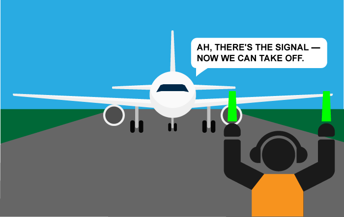

{{LearnSidebar}}{{PreviousMenuNext("Learn/JavaScript/Building_blocks/Return_values","Learn/JavaScript/Building_blocks/Image_gallery", "Learn/JavaScript/Building_blocks")}}

Events are actions or occurrences that happen in the system you are programming, which the system tells you about so your code can react to them.

For example, if the user clicks a button on a webpage, you might want to react to that action by displaying an information box.
In this article, we discuss some important concepts surrounding events, and look at how they work in browsers.
This won't be an exhaustive study; just what you need to know at this stage.

<table>
  <tbody>
    <tr>
      <th scope="row">Prerequisites:</th>
      <td>
        Basic computer literacy, a basic understanding of HTML and CSS,
        <a href="/en-US/docs/Learn/JavaScript/First_steps"
          >JavaScript first steps</a
        >.
      </td>
    </tr>
    <tr>
      <th scope="row">Objective:</th>
      <td>
        To understand the fundamental theory of events, how they work in
        browsers, and how events may differ in different programming
        environments.
      </td>
    </tr>
  </tbody>
</table>

## A series of fortunate events

As mentioned above, **events** are actions or occurrences that happen in the system you are programming — the system produces (or "fires") a signal of some kind when an event occurs, and provides a mechanism by which an action can be automatically taken (that is, some code running) when the event occurs.
For example, in an airport, when the runway is clear for take off, a signal is communicated to the pilot.
As a result, the plane can safely take off.



In the case of the Web, events are fired inside the browser window, and tend to be attached to a specific item that resides in it. This might be a single element, a set of elements, the HTML document loaded in the current tab, or the entire browser window.
There are many different types of events that can occur.

For example:

- The user selects, clicks, or hovers the cursor over a certain element.
- The user chooses a key on the keyboard.
- The user resizes or closes the browser window.
- A web page finishes loading.
- A form is submitted.
- A video is played, paused, or finishes.
- An error occurs.

You can gather from this (and from glancing at the MDN [event reference](/en-US/docs/Web/Events)) that there are **a lot** of events that can be fired.

To react to an event, you attach an **event handler** to it. This is a block of code (usually a JavaScript function that you as a programmer create) that runs when the event fires.
When such a block of code is defined to run in response to an event, we say we are **registering an event handler**.
Note: Event handlers are sometimes called **event listeners** — they are pretty much interchangeable for our purposes, although strictly speaking, they work together.
The listener listens out for the event happening, and the handler is the code that is run in response to it happening.

> **Note:** Web events are not part of the core JavaScript language — they are defined as part of the APIs built into the browser.

### A simple example

Let's look at a simple example of what we mean here.
In the following example, we have a single {{htmlelement("button")}}, which when pressed, makes the background change to a random color:

```html
<button>Change color</button>
```

```css hidden
button { margin: 10px };
```

The JavaScript looks like so:

```js
const btn = document.querySelector('button');

function random(number) {
  return Math.floor(Math.random() * (number+1));
}

btn.addEventListener('click', () => {
  const rndCol = `rgb(${random(255)}, ${random(255)}, ${random(255)})`;
  document.body.style.backgroundColor = rndCol;
});
```

In this code, we store a reference to the [`<button>`](/en-US/docs/Web/HTML/Element/button) element inside a constant called `btn`, using the {{domxref("Document.querySelector()")}} function.

We also define a function that returns a random number.

The third part of the code is where we define and register the event handler. The `<button>` element has an event called `'click'` that fires when the user clicks the button. Objects that can fire events have an {{domxref("EventTarget/addEventListener", "addEventListener()")}} method, that takes at least two arguments: the name of the event and a function to handle the event. So we call the button's `addEventListener()` method, passing in:

- the string `'click'`, to indicate that we want to listen to the click event
- a function to call when the event happens. In our case the function generates a random RGB color and sets the page [`<body>`](/en-US/docs/Web/HTML/Element/body) [`background-color`](/en-US/docs/Web/CSS/background-color) equal to that color.

The example output is as follows. Try clicking the button:

{{ EmbedLiveSample('A_simple_example', '100%', 200, "", "") }}

### It's not just web pages

Events are not unique to JavaScript — most programming languages have some kind of event model, and the way the model works often differs from JavaScript's way.
In fact, the event model in JavaScript for web pages differs from the event model for JavaScript as it is used in other environments.

For example, [Node.js](/en-US/docs/Learn/Server-side/Express_Nodejs) is a very popular JavaScript runtime that enables developers to use JavaScript to build network and server-side applications.
The [Node.js event model](https://nodejs.org/docs/latest-v12.x/api/events.html) relies on listeners to listen for events and emitters to emit events periodically — it doesn't sound that different, but the code is quite different, making use of functions like `on()` to register an event listener, and `once()` to register an event listener that unregisters after it has run once.
The [HTTP connect event docs](https://nodejs.org/docs/latest-v12.x/api/http.html#http_event_connect) provide a good example.

You can also use JavaScript to build cross-browser add-ons — browser functionality enhancements — using a technology called [WebExtensions](/en-US/docs/Mozilla/Add-ons/WebExtensions).
The event model is similar to the web events model, but a bit different — event listeners' properties are camel-cased (such as `onMessage` rather than `onmessage`), and need to be combined with the `addListener` function.
See the [`runtime.onMessage`](/en-US/docs/Mozilla/Add-ons/WebExtensions/API/runtime/onMessage#examples) page for an example.

You don't need to understand anything about other such environments at this stage in your learning; we just wanted to make it clear that events can differ in different programming environments.

## Using addEventListener()

The recommended mechanism for adding event handlers in web pages is the [`addEventListener()`](/en-US/docs/Web/API/EventTarget/addEventListener) method:

```js
const btn = document.querySelector('button');

function random(number) {
  return Math.floor(Math.random() * (number+1));
}

btn.addEventListener('click', () => {
  const rndCol = `rgb(${random(255)}, ${random(255)}, ${random(255)})`;
  document.body.style.backgroundColor = rndCol;
});
```

> **Note:** You can find the [full source code](https://github.com/mdn/learning-area/blob/main/javascript/building-blocks/events/random-color-addeventlistener.html) for this example on GitHub (also [see it running live](https://mdn.github.io/learning-area/javascript/building-blocks/events/random-color-addeventlistener.html)).

Inside the `addEventListener()` function, we specify two parameters: the name of the event we want to register this handler for, and the code that comprises the handler function we want to run in response to it.

It is fine to make the handler function a separate named function, like this:

```js
const btn = document.querySelector('button');

function random(number) {
  return Math.floor(Math.random() * (number+1));
}

function changeBackground() {
  const rndCol = `rgb(${random(255)}, ${random(255)}, ${random(255)})`;
  document.body.style.backgroundColor = rndCol;
}

btn.addEventListener('click', changeBackground);
```

### Listening for other events

There are many different events that can be fired by a button element. Let's experiment.

First, make a local copy of [random-color-addeventlistener.html](https://github.com/mdn/learning-area/blob/main/javascript/building-blocks/events/random-color-addeventlistener.html), and open it in your browser.
It's just a copy of the simple random color example we've played with already. Now try changing `click` to the following different values in turn, and observing the results in the example:

- [`focus`](/en-US/docs/Web/API/Element/focus_event) and [`blur`](/en-US/docs/Web/API/Element/blur_event) — The color changes when the button is focused and unfocused; try pressing the tab to focus on the button and press the tab again to focus away from the button.
  These are often used to display information about filling in form fields when they are focused, or displaying an error message if a form field is filled with an incorrect value.
- [`dblclick`](/en-US/docs/Web/API/Element/dblclick_event) — The color changes only when the button is double-clicked.
- [`mouseover`](/en-US/docs/Web/API/Element/mouseover_event) and [`mouseout`](/en-US/docs/Web/API/Element/mouseout_event) — The color changes when the mouse pointer hovers over the button, or when the pointer moves off the button, respectively.

Some events, such as `click`, are available on nearly any element. Others are more specific and only useful in certain situations: for example, the [`play`](/en-US/docs/Web/API/HTMLMediaElement/play_event) event is only available on some elements, such as {{htmlelement("video")}}.

### Removing listeners

If you've added an event handler using `addEventListener()`, you can remove it again using the [`removeEventListener()`](/en-US/docs/Web/API/EventTarget/removeEventListener) method. For example, this would remove the `changeBackground()` event handler:

```js
btn.removeEventListener('click', changeBackground);
```

Event handlers can also be removed by passing an {{domxref("AbortSignal")}} to {{domxref("EventTarget/addEventListener()", "addEventListener()")}} and then later calling {{domxref("AbortController/abort()", "abort()")}} on the controller owning the `AbortSignal`.
For example, to add an event handler that we can remove with an `AbortSignal`:

```js
const controller = new AbortController();

btn.addEventListener('click', () => {
  const rndCol = `rgb(${random(255)}, ${random(255)}, ${random(255)})`;
  document.body.style.backgroundColor = rndCol;
}, { signal: controller.signal }); // pass an AbortSignal to this handler
```

Then the event handler created by the code above can be removed like this:

```js
controller.abort(); // removes any/all event handlers associated with this controller
```

For simple, small programs, cleaning up old, unused event handlers isn't necessary, but for larger, more complex programs, it can improve efficiency.
Also, the ability to remove event handlers allows you to have the same button performing different actions in different circumstances: all you have to do is add or remove handlers.

### Adding multiple listeners for a single event

By making more than one call to {{domxref("EventTarget/addEventListener()", "addEventListener()")}}, providing different handlers, you can have multiple handlers for a single event:

```js
myElement.addEventListener('click', functionA);
myElement.addEventListener('click', functionB);
```

Both functions would now run when the element is clicked.

### Learn more

There are other powerful features and options available with `addEventListener()`.

These are a little out of scope for this article, but if you want to read them, visit the [`addEventListener()`](/en-US/docs/Web/API/EventTarget/addEventListener) and [`removeEventListener()`](/en-US/docs/Web/API/EventTarget/removeEventListener) reference pages.

## Other event listener mechanisms

We recommend that you use `addEventListener()` to register event handlers. It's the most powerful method and scales best with more complex programs. However, there are two other ways of registering event handlers that you might see: _event handler properties_ and _inline event handlers_.

### Event handler properties

Objects (such as buttons) that can fire events also usually have properties whose name is `on` followed by the name of the event. For example, elements have a property `onclick`.
This is called an _event handler property_. To listen for the event, you can assign the handler function to the property.

For example, we could rewrite the random-color example like this:

```js
const btn = document.querySelector('button');

function random(number) {
  return Math.floor(Math.random() * (number+1));
}

btn.onclick = () => {
  const rndCol = `rgb(${random(255)}, ${random(255)}, ${random(255)})`;
  document.body.style.backgroundColor = rndCol;
}
```

You can also set the handler property to a named function:

```js
const btn = document.querySelector('button');

function random(number) {
  return Math.floor(Math.random() * (number+1));
}

function bgChange() {
  const rndCol = `rgb(${random(255)}, ${random(255)}, ${random(255)})`;
  document.body.style.backgroundColor = rndCol;
}

btn.onclick = bgChange;
```

With event handler properties, you can't add more than one handler for a single event. For example, you can call `addEventListener('click', handler)` on an element multiple times, with different functions specified in the second argument:

```js
element.addEventListener('click', function1);
element.addEventListener('click', function2);
```

This is impossible with event handler properties because any subsequent attempts to set the property will overwrite earlier ones:

```js
element.onclick = function1;
element.onclick = function2;
```

### Inline event handlers — don't use these

You might also see a pattern like this in your code:

```html
<button onclick="bgChange()">Press me</button>
```

```js
function bgChange() {
  const rndCol = `rgb(${random(255)}, ${random(255)}, ${random(255)})`;
  document.body.style.backgroundColor = rndCol;
}
```

The earliest method of registering event handlers found on the Web involved [_event handler HTML attributes_](/en-US/docs/Web/HTML/Attributes#event_handler_attributes) (or _inline event handlers_) like the one shown above — the attribute value is literally the JavaScript code you want to run when the event occurs.
The above example invokes a function defined inside a {{htmlelement("script")}} element on the same page, but you could also insert JavaScript directly inside the attribute, for example:

```html
<button onclick="alert('Hello, this is my old-fashioned event handler!');">Press me</button>
```

You can find HTML attribute equivalents for many of the event handler properties; however, you shouldn't use these — they are considered bad practice.
It might seem easy to use an event handler attribute if you are doing something really quick, but they quickly become unmanageable and inefficient.

For a start, it is not a good idea to mix up your HTML and your JavaScript, as it becomes hard to read. Keeping your JavaScript separate is a good practice, and if it is in a separate file you can apply it to multiple HTML documents.

Even in a single file, inline event handlers are not a good idea.
One button is OK, but what if you had 100 buttons? You'd have to add 100 attributes to the file; it would quickly turn into a maintenance nightmare.
With JavaScript, you could easily add an event handler function to all the buttons on the page no matter how many there were, using something like this:

```js
const buttons = document.querySelectorAll('button');

for (const button of buttons) {
  button.addEventListener('click', bgChange);
}
```

Finally, many common server configurations will disallow inline JavaScript, as a security measure.

**You should never use the HTML event handler attributes** — those are outdated, and using them is bad practice.

## Event objects

Sometimes, inside an event handler function, you'll see a parameter specified with a name such as `event`, `evt`, or `e`.
This is called the **event object**, and it is automatically passed to event handlers to provide extra features and information.
For example, let's rewrite our random color example again slightly:

```js
const btn = document.querySelector('button');

function random(number) {
  return Math.floor(Math.random() * (number+1));
}

function bgChange(e) {
  const rndCol = `rgb(${random(255)}, ${random(255)}, ${random(255)})`;
  e.target.style.backgroundColor = rndCol;
  console.log(e);
}

btn.addEventListener('click', bgChange);
```

> **Note:** You can find the [full source code](https://github.com/mdn/learning-area/blob/main/javascript/building-blocks/events/random-color-eventobject.html) for this example on GitHub (also [see it running live](https://mdn.github.io/learning-area/javascript/building-blocks/events/random-color-eventobject.html)).

Here you can see we are including an event object, **e**, in the function, and in the function setting a background color style on `e.target` — which is the button itself.
The `target` property of the event object is always a reference to the element the event occurred upon.
So, in this example, we are setting a random background color on the button, not the page.

> **Note:** See the [Event delegation](#event_delegation) section below for an example where we use `event.target`.

> **Note:** You can use any name you like for the event object — you just need to choose a name that you can then use to reference it inside the event handler function.
`e`/`evt`/`event` are most commonly used by developers because they are short and easy to remember.
It's always good to be consistent — with yourself, and with others if possible.

### Extra properties of event objects

Most event objects have a standard set of properties and methods available on the event object; see the {{domxref("Event")}} object reference for a full list.

Some event objects add extra properties that are relevant to that particular type of event. For example, the {{domxref("Element/keydown_event", "keydown")}} event fires when the user presses a key. Its event object is a {{domxref("KeyboardEvent")}}, which is a specialized `Event` object with a `key` property that tells you which key was pressed:

```html
<input id="textBox" type="text">
<div id="output"></div>
```

```js
const textBox = document.querySelector("#textBox");
const output = document.querySelector("#output");
textBox.addEventListener('keydown', (event) => output.textContent = `You pressed "${event.key}".`);
```

```css hidden
div {
  margin: .5rem 0;
}
```

Try typing into the text box and see the output:

{{EmbedLiveSample("Extra_properties_of_event_objects", 100, 100)}}

## Preventing default behavior

Sometimes, you'll come across a situation where you want to prevent an event from doing what it does by default.
The most common example is that of a web form, for example, a custom registration form.
When you fill in the details and click the submit button, the natural behavior is for the data to be submitted to a specified page on the server for processing, and the browser to be redirected to a "success message" page of some kind (or the same page, if another is not specified.)

The trouble comes when the user has not submitted the data correctly — as a developer, you want to prevent the submission to the server and give an error message saying what's wrong and what needs to be done to put things right.
Some browsers support automatic form data validation features, but since many don't, you are advised to not rely on those and implement your own validation checks.
Let's look at a simple example.

First, a simple HTML form that requires you to enter your first and last name:

```html
<form>
  <div>
    <label for="fname">First name: </label>
    <input id="fname" type="text">
  </div>
  <div>
    <label for="lname">Last name: </label>
    <input id="lname" type="text">
  </div>
  <div>
     <input id="submit" type="submit">
  </div>
</form>
<p></p>
```

```css hidden
div {
  margin-bottom: 10px;
}
```

Now some JavaScript — here we implement a very simple check inside a handler for the [`submit`](/en-US/docs/Web/API/HTMLFormElement/submit_event) event (the submit event is fired on a form when it is submitted) that tests whether the text fields are empty.
If they are, we call the [`preventDefault()`](/en-US/docs/Web/API/Event/preventDefault) function on the event object — which stops the form submission — and then display an error message in the paragraph below our form to tell the user what's wrong:

```js
const form = document.querySelector('form');
const fname = document.getElementById('fname');
const lname = document.getElementById('lname');
const para = document.querySelector('p');

form.addEventListener('submit', (e) => {
  if (fname.value === '' || lname.value === '') {
    e.preventDefault();
    para.textContent = 'You need to fill in both names!';
  }
});
```

Obviously, this is pretty weak form validation — it wouldn't stop the user validating the form with spaces or numbers entered into the fields, for example — but it is OK for example purposes.
The output is as follows:

{{ EmbedLiveSample('Preventing_default_behavior', '100%', 180, "", "") }}

> **Note:** for the full source code, see [preventdefault-validation.html](https://github.com/mdn/learning-area/blob/main/javascript/building-blocks/events/preventdefault-validation.html) (also see it [running live](https://mdn.github.io/learning-area/javascript/building-blocks/events/preventdefault-validation.html) here.)

## Event bubbling and capture

Event bubbling and capture are terms that describe phases in how the browser handles events targeted at nested elements.

### Setting a listener on a parent element

Consider a web page like this:

```html
<div id="container">
  <button>Click me!</button>
</div>
<pre id="output"></pre>
```

Here the button is inside another element, a {{HTMLElement("div")}} element. We say that the `<div>` element here is the **parent** of the element it contains. What happens if we add a click event handler to the parent, then click the button?

```js
const output = document.querySelector('#output');
function handleClick(e) {
  output.textContent += `You clicked on a ${e.currentTarget.tagName} element\n`;
}

const container = document.querySelector('#container');
container.addEventListener('click', handleClick);
```

{{ EmbedLiveSample('Setting a listener on a parent element', '100%', 200, "", "") }}

You'll see that the parent fires a click event when the user clicks the button:

```
You clicked on a DIV element
```

This makes sense: the button is inside the `<div>`, so when you click the button you're also implicitly clicking the element it is inside.

### Bubbling example

What happens if we add event listeners to the button _and_ the parent?

```html
<body>
  <div id="container">
    <button>Click me!</button>
  </div>
  <pre id="output"></pre>
</body>
```

Let's try adding click event handlers to the button, its parent (the `<div>`), and the {{HTMLElement("body")}} element that contains both of them:

```js
const output = document.querySelector('#output');
function handleClick(e) {
  output.textContent += `You clicked on a ${e.currentTarget.tagName} element\n`;
}

const container = document.querySelector('#container');
const button = document.querySelector('button');

document.body.addEventListener('click', handleClick);
container.addEventListener('click', handleClick);
button.addEventListener('click', handleClick);
```

{{ EmbedLiveSample('Bubbling example', '100%', 200, "", "") }}

You'll see that all three elements fire a click event when the user clicks the button:

```
You clicked on a BUTTON element
You clicked on a DIV element
You clicked on a BODY element
```

In this case:

- the click on the button fires first
- followed by the click on its parent (the `<div>` element)
- followed by the `<div>` element's parent (the `<body>` element).

We describe this by saying that the event **bubbles up** from the innermost element that was clicked.

This behavior can be useful and can also cause unexpected problems. In the next section we'll see a problem that it causes, and find the solution.

### Video player example

Open up the [show-video-box.html](https://mdn.github.io/learning-area/javascript/building-blocks/events/show-video-box.html) example in a new tab (and the [source code](https://github.com/mdn/learning-area/blob/main/javascript/building-blocks/events/show-video-box.html) in another tab.) It is also available live below:

{{ EmbedLiveSample('Video_player_example', '100%', 500, "", "") }}

This example shows and hides a {{htmlelement("div")}} with a {{htmlelement("video")}} element inside it:

```html
<button>Display video</button>

<div class="hidden">
  <video>
    <source src="https://raw.githubusercontent.com/mdn/learning-area/master/javascript/building-blocks/events/rabbit320.mp4" type="video/mp4">
    <source src="https://raw.githubusercontent.com/mdn/learning-area/master/javascript/building-blocks/events/rabbit320.webm" type="video/webm">
    <p>Your browser doesn't support HTML video. Here is a <a href="rabbit320.mp4">link to the video</a> instead.</p>
  </video>
</div>
```

When the {{htmlelement("button")}} is clicked, the video is displayed, by changing the class attribute on the `<div>` from `hidden` to `showing` (the example's CSS contains these two classes, which position the box off the screen and on the screen, respectively):

```js
const btn = document.querySelector('button');
const videoBox = document.querySelector('div');

function displayVideo() {
  if (videoBox.getAttribute('class') === 'hidden') {
    videoBox.setAttribute('class','showing');
  }
}

btn.addEventListener('click', displayVideo);
```

```css hidden
div {
  position: absolute;
  top: 50%;
  transform: translate(-50%,-50%);
  width: 480px;
  height: 380px;
  border-radius: 10px;
  background-color: #eee;
  background-image: linear-gradient(to bottom, rgba(0,0,0,0), rgba(0,0,0,0.1));
}

.hidden {
  left: -50%;
}

.showing {
  left: 50%;
}

div video {
  display: block;
  width: 400px;
  margin: 40px auto;
}
```

We then add a couple more `click` event handlers — the first one to the `<div>` and the second one to the `<video>`:

```js
videoBox.addEventListener('click', () => videoBox.setAttribute('class', 'hidden'));

const video = document.querySelector('video');

video.addEventListener('click', () => video.play());
```

Now, when the area of the `<div>` outside the video is clicked, the box should be hidden again and when the video itself is clicked, the video should start to play.

But there's a problem — currently, when you click the video it starts to play, but it causes the `<div>` to be hidden at the same time.
This is because the video is inside the `<div>` — it is part of it — so clicking the video actually runs _both_ the above event handlers.

### Bubbling and capturing explained

When an event is fired on an element that has parent elements (in this case, the {{htmlelement("video")}} has the {{htmlelement("div")}} as a parent), modern browsers run three different phases — the **capturing** phase, the **target** phase, and the **bubbling** phase.

In the **capturing** phase:

- The browser checks to see if the element's outer-most ancestor ({{htmlelement("html")}}) has a `click` event handler registered on it for the capturing phase, and runs it if so.
- Then it moves on to the next element inside `<html>` and does the same thing, then the next one, and so on until it reaches the direct parent of the element that was actually clicked.

In the **target** phase:

- The browser checks to see if the {{domxref("Event.target", "target")}} property has an event handler for the `click` event registered on it, and runs it if so.
- Then, if {{domxref("Event.bubbles", "bubbles")}} is `true`, it propagates the event to the direct parent of the clicked element, then the next one, and so on until it reaches the `<html>` element.
  Otherwise, if {{domxref("Event.bubbles", "bubbles")}} is `false`, it doesn't propagate the event to any ancestors of the target.

In the **bubbling** phase, the exact opposite of the **capturing** phase occurs:

- The browser checks to see if the direct parent of the clicked element has a `click` event handler registered on it for the bubbling phase, and runs it if so.
- Then it moves on to the next immediate ancestor element and does the same thing, then the next one, and so on until it reaches the `<html>` element.

In modern browsers, by default, all event handlers are registered for the bubbling phase.
So in our current example, when you click the video, the event bubbles from the `<video>` element outwards to the `<html>` element.
Along the way:

- It finds the `click` handler on the `video` element and runs it, so the video first starts playing.
- It then finds the `click` handler on the `videoBox` element and runs that, so the video is hidden as well.

> **Note:** All JavaScript events go through the capturing and target phases.
> Whether an event enters the bubbling phase can be checked by the read-only {{domxref("Event.bubbles", "bubbles")}} property.

> **Note:** Event listeners registered for the `<html>` element aren't at the top of hierarchy.
> For example, event listeners registered for the {{domxref("Window", "window")}} and {{domxref("Document", "document")}} objects are higher in the hierarchy.

The following example demonstrates the behavior described above.
Hover over the numbers and click on them to trigger events, and then observe the output that gets logged.

{{EmbedLiveSample("Example_code_event_phases", "85ch", "400")}}

#### Example code: event phases

```html
<div>1
    <div>2
        <div>3
            <div>4
                <div>5</div>
            </div>
        </div>
    </div>
</div>
<button id="clear">clear output</button>
<section id="log"></section>
```

```css
p {
    line-height: 0;
}

div {
    display: inline-block;
    padding: 5px;

    background: #fff;
    border: 1px solid #aaa;
    cursor: pointer;
}

div:hover {
    border: 1px solid #faa;
    background: #fdd;
}
```

```js
/*
 * source 1: https://dom.spec.whatwg.org/#dom-event-eventphase
 * source 2: https://stackoverflow.com/a/4616720/15266715
*/
const evtPhasestr = ["NONE: ", "CAPTURING_PHASE: ", "AT_TARGET: ", "BUBBLING_PHASE: "];
const logElement = document.getElementById('log');

function log(msg) {
    logElement.innerHTML += (`<p>${msg}</p>`);
}

function phase(evt) {
    log(evtPhasestr[evt.eventPhase] + this.firstChild.nodeValue.trim());
}
function gphase(evt) {
    log(evtPhasestr[evt.eventPhase] + evt.currentTarget.toString().slice(8,-1));
}

function clearOutput(evt) {
    evt.stopPropagation();
    logElement.innerHTML = '';
}

const divs = document.getElementsByTagName('div');
for (const div of divs) {
  div.addEventListener('click', phase, true);
  div.addEventListener('click', phase, false);
}

document.addEventListener('click', gphase, true);
document.addEventListener('click', gphase, false);
window.addEventListener('click', gphase, true);
window.addEventListener('click', gphase, false);

const clearButton = document.getElementById('clear');
clearButton.addEventListener('click', clearOutput);
```

### Fixing the problem with stopPropagation()

As we saw in the video example, this can be a very annoying behavior, but there is a way to prevent it!
The standard [`Event`](/en-US/docs/Web/API/Event) object has a function available on it called [`stopPropagation()`](/en-US/docs/Web/API/Event/stopPropagation) which, when invoked on a handler's event object, makes it so that the first handler is run but the event doesn't bubble any further up the chain, so no more handlers will be run.

So we can fix our current problem by changing the second handler function in the previous code block to this:

```js
video.addEventListener('click', (e) => {
  e.stopPropagation();
  video.play();
});
```

You can try making a local copy of the [show-video-box.html source code](https://github.com/mdn/learning-area/blob/main/javascript/building-blocks/events/show-video-box.html) and fixing it yourself, or looking at the fixed result in [show-video-box-fixed.html](https://mdn.github.io/learning-area/javascript/building-blocks/events/show-video-box-fixed.html) (also see the [source code](https://github.com/mdn/learning-area/blob/main/javascript/building-blocks/events/show-video-box-fixed.html) here).

> **Note:** Why bother with both capturing and bubbling? Well, in the bad old days when browsers were much less cross-compatible than they are now, Netscape only used event capturing, and Internet Explorer used only event bubbling.
> When the W3C decided to try to standardize the behavior and reach a consensus, they ended up with this system that included both, which is the one modern browsers implemented.

> **Note:** As mentioned above, by default almost all event handlers are registered in the bubbling phase, and this makes more sense most of the time.
> If you really want to register an event in the capturing phase instead, you can do so by registering your handler using [`addEventListener()`](/en-US/docs/Web/API/EventTarget/addEventListener), and setting the optional third property to `true`.

### Event delegation

Event bubbling isn't just annoying though: it can be very useful. In particular it enables a practice called **event delegation**. In this practice, when we want some code to run when the user interacts with any one of a large number of child elements, we set the event listener on their parent and have events that happen on them bubble up to their parent rather than having to set the event listener on every child individually.

Let's go back to our first example, where we set the background color of the whole page when the user clicked a button. Suppose that instead, the page is divided into 16 tiles, and we want to set each tile to a random color when the user clicks that tile.

Here's the HTML:

```html
<div id="container">
  <div class="tile"></div>
  <div class="tile"></div>
  <div class="tile"></div>
  <div class="tile"></div>
  <div class="tile"></div>
  <div class="tile"></div>
  <div class="tile"></div>
  <div class="tile"></div>
  <div class="tile"></div>
  <div class="tile"></div>
  <div class="tile"></div>
  <div class="tile"></div>
  <div class="tile"></div>
  <div class="tile"></div>
  <div class="tile"></div>
  <div class="tile"></div>
</div>
```

We have a little CSS, to set the size and position of the tiles:

```css
.tile {
  height: 100px;
  width: 25%;
  float: left;
}
```

Now in the JavaScript, we could add a click event handler for every tile. But a much simpler and more efficient option is to set the click event handler on the parent, and rely on event bubbling to ensure that the handler is executed when the user clicks on a tile:

```js
function random(number) {
  return Math.floor(Math.random()*number);
}

function bgChange() {
  const rndCol = `rgb(${random(255)}, ${random(255)}, ${random(255)})`;
  return rndCol;
}

const container = document.querySelector('#container');

container.addEventListener('click', (event) => event.target.style.backgroundColor = bgChange());
```

The output is as follows (try clicking around on it):

{{ EmbedLiveSample('Event delegation', '100%', 430, "", "") }}

> **Note:** In this example we're using `event.target` to get the element that was the target of the event (that is, the innermost element). If we wanted to access the element that handled this event (in this case the container) we could use `event.currentTarget`.

> **Note:** See [useful-eventtarget.html](https://github.com/mdn/learning-area/blob/main/javascript/building-blocks/events/useful-eventtarget.html) for the full source code; also see it [running live](https://mdn.github.io/learning-area/javascript/building-blocks/events/useful-eventtarget.html) here.

## Test your skills!

You've reached the end of this article, but can you remember the most important information? To verify you've retained this information before you move on — see [Test your skills: Events](/en-US/docs/Learn/JavaScript/Building_blocks/Test_your_skills:_Events).

## Conclusion

You should now know all you need to know about web events at this early stage.
As mentioned, events are not really part of the core JavaScript — they are defined in browser Web APIs.

Also, it is important to understand that the different contexts in which JavaScript is used have different event models — from Web APIs to other areas such as browser WebExtensions and Node.js (server-side JavaScript).
We are not expecting you to understand all of these areas now, but it certainly helps to understand the basics of events as you forge ahead with learning web development.

If there is anything you didn't understand, feel free to read through the article again, or [contact us](https://discourse.mozilla.org/c/mdn/learn/250) to ask for help.

## See also

- [domevents.dev](https://domevents.dev/) — a very useful interactive playground app that enables learning about the behavior of the DOM Event system through exploration.
- [Event reference](/en-US/docs/Web/Events)
- [Event order](https://www.quirksmode.org/js/events_order.html) (discussion of capturing and bubbling) — an excellently detailed piece by Peter-Paul Koch.
- [Event accessing](https://www.quirksmode.org/js/events_access.html) (discussion of the event object) — another excellently detailed piece by Peter-Paul Koch.

{{PreviousMenuNext("Learn/JavaScript/Building_blocks/Return_values","Learn/JavaScript/Building_blocks/Image_gallery", "Learn/JavaScript/Building_blocks")}}

## In this module

- [Making decisions in your code — conditionals](/en-US/docs/Learn/JavaScript/Building_blocks/conditionals)
- [Looping code](/en-US/docs/Learn/JavaScript/Building_blocks/Looping_code)
- [Functions — reusable blocks of code](/en-US/docs/Learn/JavaScript/Building_blocks/Functions)
- [Build your own function](/en-US/docs/Learn/JavaScript/Building_blocks/Build_your_own_function)
- [Function return values](/en-US/docs/Learn/JavaScript/Building_blocks/Return_values)
- **Introduction to events**
- [Image gallery](/en-US/docs/Learn/JavaScript/Building_blocks/Image_gallery)
