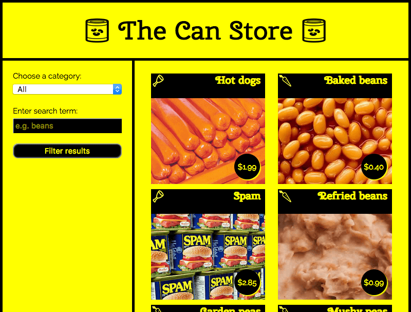

{{LearnSidebar}}{{PreviousMenuNext("Learn/JavaScript/Client-side_web_APIs/Manipulating_documents", "Learn/JavaScript/Client-side_web_APIs/Third_party_APIs", "Learn/JavaScript/Client-side_web_APIs")}}

Another very common task in modern websites and applications is retrieving individual data items from the server to update sections of a webpage without having to load an entire new page. This seemingly small detail has had a huge impact on the performance and behavior of sites, so in this article, we'll explain the concept and look at technologies that make it possible, such as XMLHttpRequest and the Fetch API.

<table>
  <tbody>
    <tr>
      <th scope="row">Prerequisites:</th>
      <td>
        JavaScript basics (see
        <a href="/en-US/docs/Learn/JavaScript/First_steps">first steps</a>,
        <a href="/en-US/docs/Learn/JavaScript/Building_blocks"
          >building blocks</a
        >,
        <a href="/en-US/docs/Learn/JavaScript/Objects">JavaScript objects</a>),
        the
        <a href="/en-US/docs/Learn/JavaScript/Client-side_web_APIs/Introduction"
          >basics of Client-side APIs</a
        >
      </td>
    </tr>
    <tr>
      <th scope="row">Objective:</th>
      <td>
        To learn how to fetch data from the server and use it to update the
        contents of a web page.
      </td>
    </tr>
  </tbody>
</table>

## What is the problem here?

Originally page loading on the web was simple — you'd send a request for a website to a server, and as long as nothing went wrong, the assets that made the web page would be downloaded and displayed on your computer.


The trouble with this model is that whenever you want to update any part of the page, for example, to display a new set of products or load a new page, you've got to load the entire page again. This is extremely wasteful and results in a poor user experience, especially as pages get larger and more complex.

### Enter Ajax

This led to the creation of technologies that allow web pages to request small chunks of data (such as [HTML](/en-US/docs/Web/HTML), {{glossary("XML")}}, [JSON](/en-US/docs/Learn/JavaScript/Objects/JSON), or plain text) and display them only when needed, helping to solve the problem described above.

This is achieved by using APIs like {{domxref("XMLHttpRequest")}} or — more recently — the [Fetch API](/en-US/docs/Web/API/Fetch_API). These technologies allow web pages to directly handle making [HTTP](/en-US/docs/Web/HTTP) requests for specific resources available on a server and formatting the resulting data as needed before it is displayed.

> **Note:** In the early days, this general technique was known as [Asynchronous](/en-US/docs/Glossary/Asynchronous) JavaScript and XML ([Ajax](/en-US/docs/Glossary/AJAX)), because it tended to use {{domxref("XMLHttpRequest")}} to request XML data. This is normally not the case these days (you'd be more likely to use `XMLHttpRequest` or Fetch to request JSON), but the result is still the same, and the term "Ajax" is still often used to describe the technique.


The Ajax model involves using a web API as a proxy to more intelligently request data rather than just having the browser reload the entire page. Let's think about the significance of this:

1.  Go to one of your favorite information-rich sites, like Amazon, YouTube, CNN, etc., and load it.
2.  Now search for something, like a new product. The main content will change, but most of the surrounding information, like the header, footer, navigation menu, etc., will stay the same.

This is a really good thing because:

- Page updates are a lot quicker and you don't have to wait for the page to refresh, meaning that the site feels faster and more responsive.
- Less data is downloaded on each update, meaning less wasted bandwidth. This may not be such a big issue on a desktop on a broadband connection, but it's a major issue on mobile devices and in developing countries that don't have ubiquitous fast Internet service.

To speed things up even further, some sites also store assets and data on the user's computer when they are first requested, meaning that on subsequent visits they use the local versions instead of downloading fresh copies everytime the page is first loaded. The content is only reloaded from the server when it has been updated.


## A basic Ajax request

Let's look at how such a request is handled, using both {{domxref("XMLHttpRequest")}} and [Fetch](/en-US/docs/Web/API/Fetch_API). For these examples, we'll request data out of a few different text files and use them to populate a content area.

This series of files will act as our fake database; in a real application, we'd be more likely to use a server-side language like PHP, Python, or Node to request our data from a database. Here, however, we want to keep it simple and concentrate on the client-side part of this.

### XMLHttpRequest

`XMLHttpRequest` (which is frequently abbreviated to XHR) is a fairly old technology now — it was invented by Microsoft in the late '90s, and has been standardized across browsers for quite a long time.

1.  To begin this example, make a local copy of [ajax-start.html](https://github.com/mdn/learning-area/blob/master/javascript/apis/fetching-data/ajax-start.html) and the four text files — [verse1.txt](https://github.com/mdn/learning-area/blob/master/javascript/apis/fetching-data/verse1.txt), [verse2.txt](https://github.com/mdn/learning-area/blob/master/javascript/apis/fetching-data/verse2.txt), [verse3.txt](https://github.com/mdn/learning-area/blob/master/javascript/apis/fetching-data/verse3.txt), and [verse4.txt](https://github.com/mdn/learning-area/blob/master/javascript/apis/fetching-data/verse4.txt) — in a new directory on your computer. In this example, we will load a different verse of the poem (which you may well recognize) via XHR when it's selected in the drop-down menu.
2.  Just inside the {{htmlelement("script")}} element, add the following code. This stores a reference to the {{htmlelement("select")}} and {{htmlelement("pre")}} elements in constants and defines an {{domxref("GlobalEventHandlers.onchange","onchange")}} event handler function so that when the select's value is changed, its value is passed to an invoked function `updateDisplay()` as a parameter.

    ```js
    const verseChoose = document.querySelector('select');
    const poemDisplay = document.querySelector('pre');

    verseChoose.onchange = function() {
      const verse = verseChoose.value;
      updateDisplay(verse);
    };
    ```

3.  Let's define our `updateDisplay()` function. First of all, put the following beneath your previous code block — this is the empty shell of the function. Note: Steps 4 - 9 will all be performed _within_ this function.

    ```js
    function updateDisplay(verse) {

    }
    ```

4.  We'll start our function by constructing a relative URL pointing to the text file we want to load, as we'll need it later. The value of the {{htmlelement("select")}} element at any time is the same as the text inside the selected {{htmlelement("option")}} (unless you specify a different value in a value attribute) — so for example "Verse 1". The corresponding verse text file is "verse1.txt", and is in the same directory as the HTML file, therefore just the file name will do.

    However, web servers tend to be case sensitive, and the file name doesn't have a space in it. To convert "Verse 1" to "verse1.txt" we need to convert the V to lower case, remove the space, and add .txt on the end. This can be done with {{jsxref("String.replace", "replace()")}}, {{jsxref("String.toLowerCase", "toLowerCase()")}}, and simple [string concatenation](/en-US/docs/Learn/JavaScript/First_steps/Strings#concatenating_strings). Add the following lines inside your `updateDisplay()` function:

    ```js
    verse = verse.replace(" ", "");
    verse = verse.toLowerCase();
    let url = verse + '.txt';
    ```

5.  To begin creating an XHR request, you need to create a new request object using the {{domxref("XMLHttpRequest.XMLHttpRequest", "XMLHttpRequest()")}} constructor. You can call this object anything you like, but we'll call it `request` to keep things simple. Add the following below your previous lines inside your `updateDisplay()` function:

    ```js
    let request = new XMLHttpRequest();
    ```

6.  Next, you need to use the {{domxref("XMLHttpRequest.open","open()")}} method to specify what [HTTP request method](/en-US/docs/Web/HTTP/Methods) to use to request the resource from the network, and what its URL is. We'll just use the [`GET`](/en-US/docs/Web/HTTP/Methods/GET) method here and set the URL as our `url` variable. Add this below your previous line:

    ```js
    request.open('GET', url);
    ```

7.  Next, we'll set the type of response we are expecting — which is defined by the request's {{domxref("XMLHttpRequest.responseType", "responseType")}} property — as `text`. This isn't strictly necessary here — XHR returns text by default — but it is a good idea to get into the habit of setting this in case you want to fetch other types of data in the future. Add this next:

    ```js
    request.responseType = 'text';
    ```

8.  Fetching a resource from the network is an {{glossary("asynchronous")}} operation, meaning that you have to wait for that operation to complete (e.g., the resource is returned from the network) before you can do anything with that response, otherwise, an error will be thrown. XHR allows you to handle this using its {{domxref("XMLHttpRequest.onload", "onload")}} event handler — this is run when the {{event("load")}} event fires (when the response has returned). When this has occurred, the response data will be available in the `response` property of the XHR request object.

    Add the following below your last addition. You'll see that inside the `onload` event handler we are setting the [`textContent`](/en-US/docs/Web/API/Node/textContent) of the `poemDisplay` (the {{htmlelement("pre")}} element) to the value of the {{domxref("XMLHttpRequest.response", "request.response")}} property.

    ```js
    request.onload = function() {
      poemDisplay.textContent = request.response;
    };
    ```

9.  The above is all set up for the XHR request — it won't actually run until we tell it to, which is done using the {{domxref("XMLHttpRequest.send","send()")}} method. Add the following below your previous addition to complete the function. This line should rest just above the closing curly brace of your `updateDisplay()` function.

    ```js
    request.send();
    ```

10. One problem with the example as it stands is that it won't show any of the poem when it first loads. To fix this, add the following two lines at the bottom of your code (just above the closing `</script>` tag) to load verse 1 by default, and make sure the {{htmlelement("select")}} element always shows the correct value:

    ```js
    updateDisplay('Verse 1');
    verseChoose.value = 'Verse 1';
    ```

### Serving your example from a server

Modern browsers will not run XHR requests if you just run the example from a local file. This is because of security restrictions (for more on web security, read [Website security](/en-US/docs/Learn/Server-side/First_steps/Website_security)).

To get around this, we need to test the example by running it through a local web server. To find out how to do this, read [How do you set up a local testing server?](/en-US/docs/Learn/Common_questions/set_up_a_local_testing_server)

### Fetch

The Fetch API is basically a modern replacement for XHR; it was introduced in browsers recently to make asynchronous HTTP requests easier to do in JavaScript, both for developers and other APIs that build on top of Fetch.

Let's convert the last example to use Fetch instead.

1.  Make a copy of your previous finished example directory. (If you didn't work through the previous exercise, create a new directory and inside it make copies of [xhr-basic.html](https://github.com/mdn/learning-area/blob/master/javascript/apis/fetching-data/xhr-basic.html) and the four text files — [verse1.txt](https://github.com/mdn/learning-area/blob/master/javascript/apis/fetching-data/verse1.txt), [verse2.txt](https://github.com/mdn/learning-area/blob/master/javascript/apis/fetching-data/verse2.txt), [verse3.txt](https://github.com/mdn/learning-area/blob/master/javascript/apis/fetching-data/verse3.txt), and [verse4.txt](https://github.com/mdn/learning-area/blob/master/javascript/apis/fetching-data/verse4.txt).)
2.  Inside the `updateDisplay()` function, find the XHR code:

    ```js
    let request = new XMLHttpRequest();
    request.open('GET', url);
    request.responseType = 'text';

    request.onload = function() {
      poemDisplay.textContent = request.response;
    };

    request.send();
    ```

3.  Replace all the XHR code with this:

    ```js
    fetch(url).then(function(response) {
      response.text().then(function(text) {
        poemDisplay.textContent = text;
      });
    });
    ```

4.  Load the example in your browser (running it through a web server) and it should work just the same as the XHR version, provided you are running a modern browser.

#### So what is going on in the Fetch code?

First of all, we invoke the {{domxref("fetch()")}} method, passing it the URL of the resource we want to fetch. This is the modern equivalent of {{domxref("XMLHttpRequest.open","request.open()")}} in XHR, plus you don't need any equivalent to `.send()`.

After that, you can see the {{jsxref("Promise.then",".then()")}} method chained onto the end of `fetch()` — this method is a part of {{jsxref("Promise","Promises")}}, a modern JavaScript feature for performing asynchronous operations. `fetch()` returns a [promise](/en-US/docs/Web/JavaScript/Reference/Global_Objects/Promise), which resolves to the response sent back from the server — we use `.then()` to run some follow-up code after the promise resolves, which is the function we've defined inside it. This is the equivalent of the `onload` event handler in the XHR version.

This function is automatically given the response from the server as a parameter when the `fetch()` promise resolves. Inside the function we grab the response and run its {{domxref("Response.text","text()")}} method, which basically returns the response as raw text. This is the equivalent of `request.responseType = 'text'` in the XHR version.

You'll see that `text()` also returns a promise, so we chain another `.then()` onto it, inside of which we define a function to receive the raw text that the `text()` promise resolves to.

Inside the inner promise's function, we do much the same as we did in the XHR version — set the {{htmlelement("pre")}} element's text content to the text value.

### Aside on promises

Promises are a bit confusing the first time you meet them, but don't worry too much about this for now. You'll get used to them after a while, especially as you learn more about modern JavaScript APIs — most of the newer ones are heavily based on promises.

Let's look at the promise structure from above again to see if we can make some more sense of it:

```js
fetch(url).then(function(response) {
  response.text().then(function(text) {
    poemDisplay.textContent = text;
  });
});
```

The first line is saying "fetch the resource located at URL" (`fetch(url)`) and "then run the specified function when the promise resolves" (`.then(function() { ... })`). "Resolve" means "finish performing the specified operation at some point in the future". The specified operation, in this case, is to fetch a resource from a specified URL (using an HTTP request), and return the response for us to do something with.

Effectively, the function passed into `then()` is a chunk of code that won't run immediately. Instead, it will run at some point in the future when the response has been returned. Note that you could also choose to store your promise in a variable and chain {{jsxref("Promise.then",".then()")}} onto that instead. The code below would do the same thing:

```js
let myFetch = fetch(url);

myFetch.then(function(response) {
  response.text().then(function(text) {
    poemDisplay.textContent = text;
  });
});
```

Because the `fetch()` method returns a promise that resolves to the HTTP response, any function you define inside a `.then()` chained onto the end of it will automatically be given the response as a parameter. You can call the parameter anything you like — the below example would still work:

```js
fetch(url).then(function(dogBiscuits) {
  dogBiscuits.text().then(function(text) {
    poemDisplay.textContent = text;
  });
});
```

But it makes more sense to call the parameter something that describes its contents.

Now let's focus just on the function:

```js
function(response) {
  response.text().then(function(text) {
    poemDisplay.textContent = text;
  });
}
```

The response object has a method {{domxref("Response.text","text()")}} that takes the raw data contained in the response body and turns it into plain text — the format we want it in. It also returns a promise (which resolves to the resulting text string), so here we use another {{jsxref("Promise.then",".then()")}}, inside of which we define another function that dictates what we want to do with that text string. We are just setting the [`textContent`](/en-US/docs/Web/API/Node/textContent) property of our poem's {{htmlelement("pre")}} element to equal the text string, so this works out pretty simple.

It is also worth noting that you can directly chain multiple promise blocks (`.then()` blocks, but there are other types too) onto the end of one another, passing the result of each block to the next block as you travel down the chain. This makes promises very powerful.

The following block does the same thing as our original example, but is written in a different style:

```js
fetch(url).then(function(response) {
  return response.text()
}).then(function(text) {
  poemDisplay.textContent = text;
});
```

Many developers like this style better, as it is flatter and arguably easier to read for longer promise chains — each subsequent promise comes after the previous one, rather than being inside the previous one (which can get unwieldy). The only other difference is that we've had to include a [`return`](/en-US/docs/Learn/JavaScript/Building_blocks/Return_values) statement in front of `response.text()`, to get it to pass its result on to the next link in the chain.

### Which mechanism should you use?

This really depends on what project you are working on. XHR has been around for a long time now and has very good cross-browser support. Fetch and Promises, on the other hand, are a more recent addition to the web platform, although they're supported well across the browser landscape, with the exception of Internet Explorer.

If you need to support older browsers, then an XHR solution might be preferable. If however you are working on a more progressive project and aren't as worried about older browsers, then Fetch could be a good choice.

You should really learn both — Fetch will become more popular as Internet Explorer declines in usage (IE is no longer being developed, in favor of Microsoft's new Edge browser), but you might need XHR for a while yet.

## A more complex example

To round off the article, we'll look at a slightly more complex example that shows some more interesting uses of Fetch. We have created a sample site called The Can Store — it's a fictional supermarket that only sells canned goods. You can find this [example live on GitHub](https://mdn.github.io/learning-area/javascript/apis/fetching-data/can-store/), and [see the source code](https://github.com/mdn/learning-area/tree/master/javascript/apis/fetching-data/can-store).



By default, the site displays all the products, but you can use the form controls in the left hand column to filter them by category, or search term, or both.

There is quite a lot of complex code that deals with filtering the products by category and search terms, manipulating strings so the data displays correctly in the UI, etc. We won't discuss all of it in the article, but you can find extensive comments in the code (see [can-script.js](https://github.com/mdn/learning-area/blob/master/javascript/apis/fetching-data/can-store/can-script.js)).

We will however explain the Fetch code.

The first block that uses Fetch can be found at the start of the JavaScript:

```js
fetch('products.json').then(function(response) {
  return response.json();
}).then(function(json) {
  let products = json;
  initialize(products);
}).catch(function(err) {
  console.log('Fetch problem: ' + err.message);
});
```

The `fetch()` function returns a promise. If this completes successfully, the function inside the first `.then()` block contains the `response` returned from the network.

Inside this function we run {{domxref("Response.json","json()")}} on the response, not {{domxref("Response.text","text()")}}, as we want to return our response as structured JSON data, not plain text.

Next, we chain another `.then()` onto the end of our first one, the success function that contains the `json` returned from the `response.json()` promise. We set this to be the value of the `products` variable, then run `initialize(products)`, which starts the process of displaying all the products in the user interface.

To handle errors, we chain a `.catch()` block onto the end of the chain. This runs if the promise fails for some reason. Inside it, we include a function that is passed as a parameter, an `error` object. This `error` object can be used to report the nature of the error that has occurred, in this case we do it with a simple `console.log()`.

However, a complete website would handle this error more gracefully by displaying a message on the user's screen and perhaps offering options to remedy the situation, but we don't need anything more than a simple `console.log()`.

You can test the fail case yourself:

1.  Make a local copy of the example files (download and unpack [the can-store ZIP file](https://github.com/mdn/learning-area/blob/master/javascript/apis/fetching-data/can-store/can-store.zip?raw=true)).
2.  Run the code through a web server (as described above, in {{anch("Serving your example from a server")}}).
3.  Modify the path to the file being fetched, to something like 'produc.json' (make sure it is misspelled).
4.  Now load the index file in your browser (via `localhost:8000`) and look in your browser developer console. You'll see a message similar to "Network request for produc.json failed with response 404: File not found".

The second Fetch block can be found inside the `fetchBlob()` function:

```js
fetch(url).then(function(response) {
    return response.blob();
}).then(function(blob) {
  // Convert the blob to an object URL — this is basically a temporary internal URL
  // that points to an object stored inside the browser
  let objectURL = URL.createObjectURL(blob);
  // invoke showProduct
  showProduct(objectURL, product);
});
```

This works in much the same way as the previous one, except that instead of using {{domxref("Response.json","json()")}}, we use {{domxref("Response.blob","blob()")}}. In this case we want to return our response as an image file, and the data format we use for that is [Blob](/en-US/docs/Web/API/Blob) (the term is an abbreviation of "Binary Large Object" and can basically be used to represent large file-like objects, such as images or video files).

Once we've successfully received our blob, we create an object URL out of it using {{domxref("URL.createObjectURL()", "createObjectURL()")}}. This returns a temporary internal URL that points to an object referenced inside the browser. These are not very readable, but you can see what one looks like by opening up the Can Store app, Ctrl-/Right-clicking on an image, and selecting the "View image" option (which might vary slightly depending on what browser you are using). The object URL will be visible inside the address bar, and should be something like this:

    blob:http://localhost:7800/9b75250e-5279-e249-884f-d03eb1fd84f4

### Challenge: An XHR version of the Can Store

We'd like you to try converting the Fetch version of the app to use XHR as a useful bit of practice. Take a [copy of the ZIP file](https://github.com/mdn/learning-area/blob/master/javascript/apis/fetching-data/can-store/can-store.zip?raw=true), and try modifying the JavaScript as appropriate.

Some helpful hints:

- You might find the {{domxref("XMLHttpRequest")}} reference material useful.
- You will basically need to use the same pattern as you saw earlier in the [XHR-basic.html](https://github.com/mdn/learning-area/blob/master/javascript/apis/fetching-data/xhr-basic.html) example.
- You will, however, need to add the error handling we showed you in the Fetch version of the Can Store:

  - The response is found in `request.response` after the `load` event has fired, not in a promise `then()`.
  - About the best equivalent to Fetch's `response.ok` in XHR is to check whether {{domxref("XMLHttpRequest.status","request.status")}} is equal to 200, or if {{domxref("XMLHttpRequest.readyState","request.readyState")}} is equal to 4.
  - The properties for getting the status and status message are the same, but they are found on the `request` (XHR) object, not the `response` object.

> **Note:** If you have trouble with this, feel free to check your code against the finished version on GitHub ([see the source here](https://github.com/mdn/learning-area/blob/master/javascript/apis/fetching-data/can-store-xhr/can-script.js), and also [see it running live](https://mdn.github.io/learning-area/javascript/apis/fetching-data/can-store-xhr/)).

## Summary

This article shows how to start working with both XHR and Fetch to fetch data from the server.

## See also

There are however a lot of different subjects discussed in this article, which has only really scratched the surface. For a lot more detail on these subjects, try the following articles:

- [Ajax — Getting started](/en-US/docs/Web/Guide/AJAX/Getting_Started)
- [Using Fetch](/en-US/docs/Web/API/Fetch_API/Using_Fetch)
- [Promises](/en-US/docs/Web/JavaScript/Reference/Global_Objects/Promise)
- [Working with JSON data](/en-US/docs/Learn/JavaScript/Objects/JSON)
- [An overview of HTTP](/en-US/docs/Web/HTTP/Overview)
- [Server-side website programming](/en-US/docs/Learn/Server-side)

{{PreviousMenuNext("Learn/JavaScript/Client-side_web_APIs/Manipulating_documents", "Learn/JavaScript/Client-side_web_APIs/Third_party_APIs", "Learn/JavaScript/Client-side_web_APIs")}}

## In this module

- [Introduction to web APIs](/en-US/docs/Learn/JavaScript/Client-side_web_APIs/Introduction)
- [Manipulating documents](/en-US/docs/Learn/JavaScript/Client-side_web_APIs/Manipulating_documents)
- [Fetching data from the server](/en-US/docs/Learn/JavaScript/Client-side_web_APIs/Fetching_data)
- [Third party APIs](/en-US/docs/Learn/JavaScript/Client-side_web_APIs/Third_party_APIs)
- [Drawing graphics](/en-US/docs/Learn/JavaScript/Client-side_web_APIs/Drawing_graphics)
- [Video and audio APIs](/en-US/docs/Learn/JavaScript/Client-side_web_APIs/Video_and_audio_APIs)
- [Client-side storage](/en-US/docs/Learn/JavaScript/Client-side_web_APIs/Client-side_storage)
