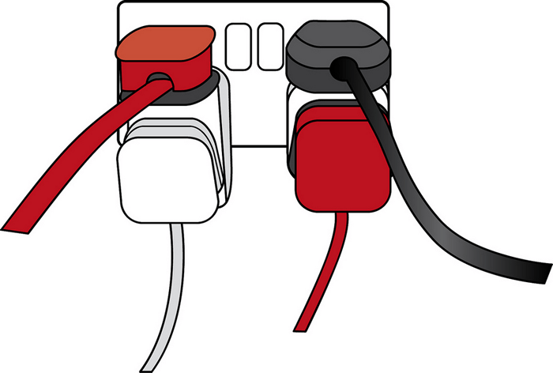

{{LearnSidebar}}{{NextMenu("Learn/JavaScript/Client-side_web_APIs/Manipulating_documents", "Learn/JavaScript/Client-side_web_APIs")}}

First up, we'll start by looking at APIs from a high level — what are they, how do they work, how to use them in your code, and how are they structured? We'll also take a look at what the different main classes of APIs are, and what kind of uses they have.

<table>
  <tbody>
    <tr>
      <th scope="row">Prerequisites:</th>
      <td>
        Basic computer literacy, a basic understanding of
        <a href="/en-US/docs/Learn/HTML">HTML</a> and
        <a href="/en-US/docs/Learn/CSS">CSS</a>, JavaScript basics (see
        <a href="/en-US/docs/Learn/JavaScript/First_steps">first steps</a>,
        <a href="/en-US/docs/Learn/JavaScript/Building_blocks"
          >building blocks</a
        >,
        <a href="/en-US/docs/Learn/JavaScript/Objects">JavaScript objects</a>).
      </td>
    </tr>
    <tr>
      <th scope="row">Objective:</th>
      <td>
        To gain familiarity with APIs, what they can do, and how you can use
        them in your code.
      </td>
    </tr>
  </tbody>
</table>

## What are APIs?

Application Programming Interfaces (APIs) are constructs made available in programming languages to allow developers to create complex functionality more easily. They abstract more complex code away from you, providing some easier syntax to use in its place.

As a real-world example, think about the electricity supply in your house, apartment, or other dwellings. If you want to use an appliance in your house, you plug it into a plug socket and it works. You don't try to wire it directly into the power supply — to do so would be really inefficient and, if you are not an electrician, difficult and dangerous to attempt.



_Image source: [Overloaded plug socket](https://www.flickr.com/photos/easy-pics/9518184890/in/photostream/lightbox/) by [The Clear Communication People](https://www.flickr.com/photos/easy-pics/), on Flickr._

In the same way, if you want to say, program some 3D graphics, it is a lot easier to do it using an API written in a higher-level language such as JavaScript or Python, rather than try to directly write low-level code (say C or C++) that directly controls the computer's GPU or other graphics functions.

> **Note:** See also the [API glossary entry](/en-US/docs/Glossary/API) for further description.

### APIs in client-side JavaScript

Client-side JavaScript, in particular, has many APIs available to it — these are not part of the JavaScript language itself, rather they are built on top of the core JavaScript language, providing you with extra superpowers to use in your JavaScript code. They generally fall into two categories:

- **Browser APIs** are built into your web browser and are able to expose data from the browser and surrounding computer environment and do useful complex things with it. For example, the [Web Audio API](/en-US/docs/Web/API/Web_Audio_API) provides JavaScript constructs for manipulating audio in the browser — taking an audio track, altering its volume, applying effects to it, etc. In the background, the browser is actually using some complex lower-level code (e.g. C++ or Rust) to do the actual audio processing. But again, this complexity is abstracted away from you by the API.
- **Third-party APIs** are not built into the browser by default, and you generally have to retrieve their code and information from somewhere on the Web. For example, the [Twitter API](https://developer.twitter.com/en/docs) allows you to do things like displaying your latest tweets on your website. It provides a special set of constructs you can use to query the Twitter service and return specific information.


### Relationship between JavaScript, APIs, and other JavaScript tools

So above, we talked about what client-side JavaScript APIs are, and how they relate to the JavaScript language. Let's recap this to make it clearer, and also mention where other JavaScript tools fit in:

- JavaScript — A high-level scripting language built into browsers that allows you to implement functionality on web pages/apps. Note that JavaScript is also available in other programming environments, such as [Node](/en-US/docs/Learn/Server-side/Express_Nodejs/Introduction).
- Browser APIs — constructs built into the browser that sits on top of the JavaScript language and allows you to implement functionality more easily.
- Third-party APIs — constructs built into third-party platforms (e.g. Twitter, Facebook) that allow you to use some of those platform's functionality in your own web pages (for example, display your latest Tweets on your web page).
- JavaScript libraries — Usually one or more JavaScript files containing [custom functions](/en-US/docs/Learn/JavaScript/Building_blocks/Functions#custom_functions) that you can attach to your web page to speed up or enable writing common functionality. Examples include jQuery, Mootools and React.
- JavaScript frameworks — The next step up from libraries, JavaScript frameworks (e.g. Angular and Ember) tend to be packages of HTML, CSS, JavaScript, and other technologies that you install and then use to write an entire web application from scratch. The key difference between a library and a framework is "Inversion of Control". When calling a method from a library, the developer is in control. With a framework, the control is inverted: the framework calls the developer's code.

## What can APIs do?

There are a huge number of APIs available in modern browsers that allow you to do a wide variety of things in your code. You can see this by taking a look at the [MDN APIs index page](/en-US/docs/Web/API).

### Common browser APIs

In particular, the most common categories of browser APIs you'll use (and which we'll cover in this module in greater detail) are:

- **APIs for manipulating documents** loaded into the browser. The most obvious example is the [DOM (Document Object Model) API](/en-US/docs/Web/API/Document_Object_Model), which allows you to manipulate HTML and CSS — creating, removing and changing HTML, dynamically applying new styles to your page, etc. Every time you see a popup window appear on a page or some new content displayed, for example, that's the DOM in action. Find out more about these types of API in [Manipulating documents](/en-US/docs/Learn/JavaScript/Client-side_web_APIs/Manipulating_documents).
- **APIs that fetch data from the server** to update small sections of a webpage on their own are very commonly used. This seemingly small detail has had a huge impact on the performance and behavior of sites — if you just need to update a stock listing or list of available new stories, doing it instantly without having to reload the whole entire page from the server can make the site or app feel much more responsive and "snappy". The main API used for this is the [Fetch API](/en-US/docs/Web/API/Fetch_API), although older code might still use the [`XMLHttpRequest`](/en-US/docs/Web/API/XMLHttpRequest) API. You may also come across the term **Ajax**, which describes this technique. Find out more about such APIs in [Fetching data from the server](/en-US/docs/Learn/JavaScript/Client-side_web_APIs/Fetching_data).
- **APIs for drawing and manipulating graphics** are widely supported in browsers — the most popular ones are [Canvas](/en-US/docs/Web/API/Canvas_API) and [WebGL](/en-US/docs/Web/API/WebGL_API), which allow you to programmatically update the pixel data contained in an HTML {{htmlelement("canvas")}} element to create 2D and 3D scenes. For example, you might draw shapes such as rectangles or circles, import an image onto the canvas, and apply a filter to it such as sepia or grayscale using the Canvas API, or create a complex 3D scene with lighting and textures using WebGL. Such APIs are often combined with APIs for creating animation loops (such as {{domxref("window.requestAnimationFrame()")}}) and others to make constantly updating scenes like cartoons and games.
- **[Audio and Video APIs](/en-US/docs/Web/Guide/Audio_and_video_delivery)** like {{domxref("HTMLMediaElement")}}, the [Web Audio API](/en-US/docs/Web/API/Web_Audio_API), and [WebRTC](/en-US/docs/Web/API/WebRTC_API) allow you to do really interesting things with multimedia such as creating custom UI controls for playing audio and video, displaying text tracks like captions and subtitles along with your videos, grabbing video from your web camera to be manipulated via a canvas (see above) or displayed on someone else's computer in a web conference, or adding effects to audio tracks (such as gain, distortion, panning, etc.).
- **Device APIs** enable you to interact with device hardware: for example, accessing the device GPS to find the user's position using the [Geolocation API](/en-US/docs/Web/API/Geolocation_API).
- **Client-side storage APIs** enable you to store data on the client-side, so you can create an app that will save its state between page loads, and perhaps even work when the device is offline. There are several options available, e.g. simple name/value storage with the [Web Storage API](/en-US/docs/Web/API/Web_Storage_API), and more complex database storage with the [IndexedDB API](/en-US/docs/Web/API/IndexedDB_API).

### Common third-party APIs

Third-party APIs come in a large variety; some of the more popular ones that you are likely to make use of sooner or later are:

- The [Twitter API](https://developer.twitter.com/en/docs), which allows you to do things like displaying your latest tweets on your website.
- Map APIs, like [Mapquest](https://developer.mapquest.com/) and the [Google Maps API](https://developers.google.com/maps/), which allow you to do all sorts of things with maps on your web pages.
- The [Facebook suite of APIs](https://developers.facebook.com/docs/), which enables you to use various parts of the Facebook ecosystem to benefit your app, such as by providing app login using Facebook login, accepting in-app payments, rolling out targeted ad campaigns, etc.
- The [Telegram APIs](https://core.telegram.org/api), which allows you to embed content from Telegram channels on your website, in addition to providing support for bots.
- The [YouTube API](https://developers.google.com/youtube/), which allows you to embed YouTube videos on your site, search YouTube, build playlists, and more.
- The [Pinterest API](https://developers.pinterest.com/), which provides tools to manage Pinterest boards and pins to include them in your website.
- The [Twilio API](https://www.twilio.com/), which provides a framework for building voice and video call functionality into your app, sending SMS/MMS from your apps, and more.
- The [Mastodon API](https://docs.joinmastodon.org/api/), which enables you to manipulate features of the Mastodon social network programmatically.

> **Note:** You can find information on a lot more 3rd party APIs in the [Programmable Web API directory](https://www.programmableweb.com/category/all/apis).

## How do APIs work?

Different JavaScript APIs work in slightly different ways, but generally, they have common features and similar themes to how they work.

### They are based on objects

Your code interacts with APIs using one or more [JavaScript objects](/en-US/docs/Learn/JavaScript/Objects), which serve as containers for the data the API uses (contained in object properties), and the functionality the API makes available (contained in object methods).

> **Note:** If you are not already familiar with how objects work, you should go back and work through our [JavaScript objects](/en-US/docs/Learn/JavaScript/Objects) module before continuing.

Let's return to the example of the Web Audio API — this is a fairly complex API, which consists of a number of objects. The most obvious ones are:

- {{domxref("AudioContext")}}, which represents an [audio graph](/en-US/docs/Web/API/Web_Audio_API/Basic_concepts_behind_Web_Audio_API#audio_graphs) that can be used to manipulate audio playing inside the browser, and has a number of methods and properties available to manipulate that audio.
- {{domxref("MediaElementAudioSourceNode")}}, which represents an {{htmlelement("audio")}} element containing sound you want to play and manipulate inside the audio context.
- {{domxref("AudioDestinationNode")}}, which represents the destination of the audio, i.e. the device on your computer that will actually output it — usually your speakers or headphones.

So how do these objects interact? If you look at our [simple web audio example](https://github.com/mdn/learning-area/blob/main/javascript/apis/introduction/web-audio/index.html) ([see it live also](https://mdn.github.io/learning-area/javascript/apis/introduction/web-audio/)), you'll first see the following HTML:

```html
<audio src="outfoxing.mp3"></audio>

<button class="paused">Play</button>
<br />
<input type="range" min="0" max="1" step="0.01" value="1" class="volume" />
```

We, first of all, include an `<audio>` element with which we embed an MP3 into the page. We don't include any default browser controls. Next, we include a {{htmlelement("button")}} that we'll use to play and stop the music, and an {{htmlelement("input")}} element of type range, which we'll use to adjust the volume of the track while it's playing.

Next, let's look at the JavaScript for this example.

We start by creating an `AudioContext` instance inside which to manipulate our track:

```js
const AudioContext = window.AudioContext || window.webkitAudioContext;
const audioCtx = new AudioContext();
```

Next, we create constants that store references to our `<audio>`, `<button>`, and `<input>` elements, and use the {{domxref("AudioContext.createMediaElementSource()")}} method to create a `MediaElementAudioSourceNode` representing the source of our audio — the `<audio>` element will be played from:

```js
const audioElement = document.querySelector("audio");
const playBtn = document.querySelector("button");
const volumeSlider = document.querySelector(".volume");

const audioSource = audioCtx.createMediaElementSource(audioElement);
```

Next up we include a couple of event handlers that serve to toggle between play and pause when the button is pressed and reset the display back to the beginning when the song has finished playing:

```js
// play/pause audio
playBtn.addEventListener("click", () => {
  // check if context is in suspended state (autoplay policy)
  if (audioCtx.state === "suspended") {
    audioCtx.resume();
  }

  // if track is stopped, play it
  if (playBtn.getAttribute("class") === "paused") {
    audioElement.play();
    playBtn.setAttribute("class", "playing");
    playBtn.textContent = "Pause";
    // if track is playing, stop it
  } else if (playBtn.getAttribute("class") === "playing") {
    audioElement.pause();
    playBtn.setAttribute("class", "paused");
    playBtn.textContent = "Play";
  }
});

// if track ends
audioElement.addEventListener("ended", () => {
  playBtn.setAttribute("class", "paused");
  playBtn.textContent = "Play";
});
```

> **Note:** Some of you may notice that the `play()` and `pause()` methods being used to play and pause the track are not part of the Web Audio API; they are part of the {{domxref("HTMLMediaElement")}} API, which is different but closely-related.

Next, we create a {{domxref("GainNode")}} object using the {{domxref("BaseAudioContext/createGain", "AudioContext.createGain()")}} method, which can be used to adjust the volume of audio fed through it, and create another event handler that changes the value of the audio graph's gain (volume) whenever the slider value is changed:

```js
// volume
const gainNode = audioCtx.createGain();

volumeSlider.addEventListener("input", () => {
  gainNode.gain.value = volumeSlider.value;
});
```

The final thing to do to get this to work is to connect the different nodes in the audio graph up, which is done using the {{domxref("AudioNode.connect()")}} method available on every node type:

```js
audioSource.connect(gainNode).connect(audioCtx.destination);
```

The audio starts in the source, which is then connected to the gain node so the audio's volume can be adjusted. The gain node is then connected to the destination node so the sound can be played on your computer (the {{domxref("BaseAudioContext/destination", "AudioContext.destination")}} property represents whatever is the default {{domxref("AudioDestinationNode")}} available on your computer's hardware, e.g. your speakers).

### They have recognizable entry points

When using an API, you should make sure you know where the entry point is for the API. In The Web Audio API, this is pretty simple — it is the {{domxref("AudioContext")}} object, which needs to be used to do any audio manipulation whatsoever.

The Document Object Model (DOM) API also has a simple entry point — its features tend to be found hanging off the {{domxref("Document")}} object, or an instance of an HTML element that you want to affect in some way, for example:

```js
const em = document.createElement("em"); // create a new em element
const para = document.querySelector("p"); // reference an existing p element
em.textContent = "Hello there!"; // give em some text content
para.appendChild(em); // embed em inside para
```

The [Canvas API](/en-US/docs/Web/API/Canvas_API) also relies on getting a context object to use to manipulate things, although in this case, it's a graphical context rather than an audio context. Its context object is created by getting a reference to the {{htmlelement("canvas")}} element you want to draw on, and then calling its {{domxref("HTMLCanvasElement.getContext()")}} method:

```js
const canvas = document.querySelector("canvas");
const ctx = canvas.getContext("2d");
```

Anything that we want to do to the canvas is then achieved by calling properties and methods of the context object (which is an instance of {{domxref("CanvasRenderingContext2D")}}), for example:

```js
Ball.prototype.draw = function () {
  ctx.beginPath();
  ctx.fillStyle = this.color;
  ctx.arc(this.x, this.y, this.size, 0, 2 * Math.PI);
  ctx.fill();
};
```

> **Note:** You can see this code in action in our [bouncing balls demo](https://github.com/mdn/learning-area/blob/main/javascript/apis/introduction/bouncing-balls.html) (see it [running live](https://mdn.github.io/learning-area/javascript/apis/introduction/bouncing-balls.html) also).

### They often use events to handle changes in state

We already discussed events earlier on in the course in our [Introduction to events](/en-US/docs/Learn/JavaScript/Building_blocks/Events) article, which looks in detail at what client-side web events are and how they are used in your code. If you are not already familiar with how client-side web API events work, you should go and read this article first before continuing.

Some web APIs contain no events, but most contain at least a few. The handler properties that allow us to run functions when events fire are generally listed in our reference material in separate "Event handlers" sections.

We already saw a number of event handlers in use in our Web Audio API example above:

```js
// play/pause audio
playBtn.addEventListener("click", () => {
  // check if context is in suspended state (autoplay policy)
  if (audioCtx.state === "suspended") {
    audioCtx.resume();
  }

  // if track is stopped, play it
  if (playBtn.getAttribute("class") === "paused") {
    audioElement.play();
    playBtn.setAttribute("class", "playing");
    playBtn.textContent = "Pause";
    // if track is playing, stop it
  } else if (playBtn.getAttribute("class") === "playing") {
    audioElement.pause();
    playBtn.setAttribute("class", "paused");
    playBtn.textContent = "Play";
  }
});

// if track ends
audioElement.addEventListener("ended", () => {
  playBtn.setAttribute("class", "paused");
  playBtn.textContent = "Play";
});
```

### They have additional security mechanisms where appropriate

WebAPI features are subject to the same security considerations as JavaScript and other web technologies (for example [same-origin policy](/en-US/docs/Web/Security/Same-origin_policy)), but they sometimes have additional security mechanisms in place. For example, some of the more modern WebAPIs will only work on pages served over HTTPS due to them transmitting potentially sensitive data (examples include [Service Workers](/en-US/docs/Web/API/Service_Worker_API) and [Push](/en-US/docs/Web/API/Push_API)).

In addition, some WebAPIs request permission to be enabled from the user once calls to them are made in your code. As an example, the [Notifications API](/en-US/docs/Web/API/Notifications_API) asks for permission using a pop-up dialog box:


The Web Audio and {{domxref("HTMLMediaElement")}} APIs are subject to a security mechanism called [autoplay policy](/en-US/docs/Web/API/Web_Audio_API/Best_practices#autoplay_policy) — this basically means that you can't automatically play audio when a page loads — you've got to allow your users to initiate audio play through a control like a button. This is done because autoplaying audio is usually really annoying and we really shouldn't be subjecting our users to it.

> **Note:** Depending on how strict the browser is, such security mechanisms might even stop the example from working locally, i.e. if you load the local example file in your browser instead of running it from a web server. At the time of writing, our Web Audio API example wouldn't work locally on Google Chrome — we had to upload it to GitHub before it would work.

## Summary

At this point, you should have a good idea of what APIs are, how they work, and what you can do with them in your JavaScript code. You are probably excited to start actually doing some fun things with specific APIs, so let's go! Next up, we'll look at manipulating documents with the Document Object Model (DOM).

{{NextMenu("Learn/JavaScript/Client-side_web_APIs/Manipulating_documents", "Learn/JavaScript/Client-side_web_APIs")}}
