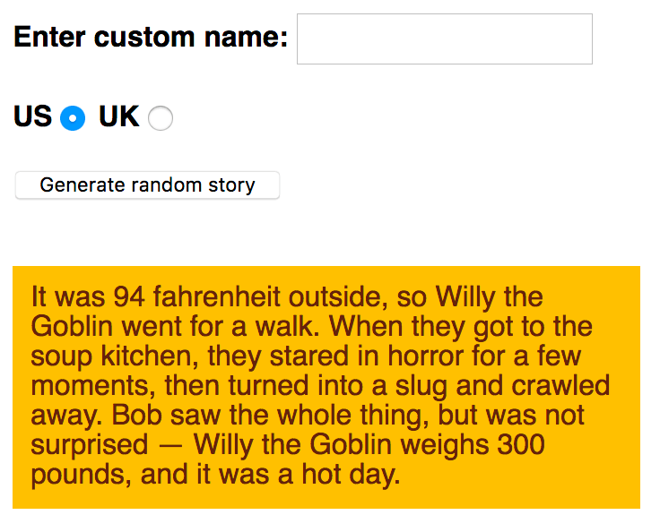

{{LearnSidebar}}{{PreviousMenu("Learn/JavaScript/First_steps/Arrays", "Learn/JavaScript/First_steps")}}

In this assessment you'll be tasked with taking some of the knowledge you've picked up in this module's articles and applying it to creating a fun app that generates random silly stories. Have fun!

<table>
  <tbody>
    <tr>
      <th scope="row">Prerequisites:</th>
      <td>
        Before attempting this assessment you should have already worked through
        all the articles in this module.
      </td>
    </tr>
    <tr>
      <th scope="row">Objective:</th>
      <td>
        To test comprehension of JavaScript fundamentals, such as variables,
        numbers, operators, strings, and arrays.
      </td>
    </tr>
  </tbody>
</table>

## Starting point

To get this assessment started, you should:

- Go and [grab the HTML file](https://github.com/mdn/learning-area/blob/main/javascript/introduction-to-js-1/assessment-start/index.html) for the example, save a local copy of it as `index.html` in a new directory somewhere on your computer, and do the assessment locally to begin with. This also has the CSS to style the example contained within it.
- Go to the [page containing the raw text](https://github.com/mdn/learning-area/blob/main/javascript/introduction-to-js-1/assessment-start/raw-text.txt) and keep this open in a separate browser tab somewhere. You'll need it later.

Alternatively, you could use a site like [JSBin](https://jsbin.com/) or [Glitch](https://glitch.com/) to do your assessment. You could paste the HTML, CSS and JavaScript into one of these online editors. If the online editor you are using doesn't have a separate JavaScript panel, feel free to put it inline in a `<script>` element inside the HTML page.

> **Note:** If you get stuck, then ask us for help — see the [Assessment or further help](#assessment_or_further_help) section at the bottom of this page.

## Project brief

You have been provided with some raw HTML/CSS and a few text strings and JavaScript functions; you need to write the necessary JavaScript to turn this into a working program, which does the following:

- Generates a silly story when the "Generate random story" button is pressed.
- Replaces the default name "Bob" in the story with a custom name, only if a custom name is entered into the "Enter custom name" text field before the generate button is pressed.
- Converts the default US weight and temperature quantities and units in the story into UK equivalents if the UK radio button is checked before the generate button is pressed.
- Generates a new random silly story every time the button is pressed.

The following screenshot shows an example of what the finished program should output:



To give you more of an idea, [have a look at the finished example](https://mdn.github.io/learning-area/javascript/introduction-to-js-1/assessment-finished/) (no peeking at the source code!)

## Steps to complete

The following sections describe what you need to do.

Basic setup:

1. Create a new file called `main.js`, in the same directory as your `index.html` file.
2. Apply the external JavaScript file to your HTML by inserting a {{htmlelement("script")}} element into your HTML referencing `main.js`. Put it just before the closing `</body>` tag.

Initial variables and functions:

1. In the raw text file, copy all of the code underneath the heading "1. COMPLETE VARIABLE AND FUNCTION DEFINITIONS" and paste it into the top of the `main.js` file. This gives you three variables that store references to the "Enter custom name" text field (`customName`), the "Generate random story" button (`randomize`), and the {{htmlelement("p")}} element at the bottom of the HTML body that the story will be copied into (`story`), respectively. In addition you've got a function called `randomValueFromArray()` that takes an array, and returns one of the items stored inside the array at random.
2. Now look at the second section of the raw text file — "2. RAW TEXT STRINGS". This contains text strings that will act as input into our program. We'd like you to contain these inside variables inside `main.js`:

   1. Store the first, big long, string of text inside a variable called `storyText`.
   2. Store the first set of three strings inside an array called `insertX`.
   3. Store the second set of three strings inside an array called `insertY`.
   4. Store the third set of three strings inside an array called `insertZ`.

Placing the event handler and incomplete function:

1. Now return to the raw text file.
2. Copy the code found underneath the heading "3. EVENT LISTENER AND PARTIAL FUNCTION DEFINITION" and paste it into the bottom of your `main.js` file. This:

   - Adds a click event listener to the `randomize` variable so that when the button it represents is clicked, the `result()` function is run.
   - Adds a partially-completed `result()` function definition to your code. For the remainder of the assessment, you'll be filling in lines inside this function to complete it and make it work properly.

Completing the `result()` function:

1. Create a new variable called `newStory`, and set its value to equal `storyText`. This is needed so we can create a new random story each time the button is pressed and the function is run. If we made changes directly to `storyText`, we'd only be able to generate a new story once.
2. Create three new variables called `xItem`, `yItem`, and `zItem`, and make them equal to the result of calling `randomValueFromArray()` on your three arrays (the result in each case will be a random item out of each array it is called on). For example you can call the function and get it to return one random string out of `insertX` by writing `randomValueFromArray(insertX)`.
3. Next we want to replace the three placeholders in the `newStory` string — `:insertx:`, `:inserty:`, and `:insertz:` — with the strings stored in `xItem`, `yItem`, and `zItem`. There are two possible string methods that will help you here — in each case, make the call to the method equal to `newStory`, so each time it is called, `newStory` is made equal to itself, but with substitutions made. So each time the button is pressed, these placeholders are each replaced with a random silly string. As a further hint, depending on the method you choose, you might need to make one of the calls twice.
4. Inside the first `if` block, add another string replacement method call to replace the name 'Bob' found in the `newStory` string with the `name` variable. In this block we are saying "If a value has been entered into the `customName` text input, replace Bob in the story with that custom name."
5. Inside the second `if` block, we are checking to see if the `uk` radio button has been selected. If so, we want to convert the weight and temperature values in the story from pounds and Fahrenheit into stones and centigrade. What you need to do is as follows:

   1. Look up the formulas for converting pounds to stone, and Fahrenheit to centigrade.
   2. Inside the line that defines the `weight` variable, replace 300 with a calculation that converts 300 pounds into stones. Concatenate `' stone'` onto the end of the result of the overall `Math.round()` call.
   3. Inside the line that defines the `temperature` variable, replace 94 with a calculation that converts 94 Fahrenheit into centigrade. Concatenate `' centigrade'` onto the end of the result of the overall `Math.round()` call.
   4. Just under the two variable definitions, add two more string replacement lines that replace '94 fahrenheit' with the contents of the `temperature` variable, and '300 pounds' with the contents of the `weight` variable.

6. Finally, in the second-to-last line of the function, make the `textContent` property of the `story` variable (which references the paragraph) equal to `newStory`.

## Hints and tips

- You don't need to edit the HTML in any way, except to apply the JavaScript to your HTML.
- If you are unsure whether the JavaScript is applied to your HTML properly, try removing everything else from the JavaScript file temporarily, adding in a simple bit of JavaScript that you know will create an obvious effect, then saving and refreshing. The following for example turns the background of the {{htmlelement("html")}} element red — so the entire browser window should go red if the JavaScript is applied properly:

  ```js
  document.querySelector("html").style.backgroundColor = "red";
  ```

- [`Math.round()`](/en-US/docs/Web/JavaScript/Reference/Global_Objects/Math/round) is a built-in JavaScript method that rounds the result of a calculation to the nearest whole number.
- There are three instances of strings that need to be replaced. You may repeat the `replace()` method multiple times, or you can use `replaceAll()`. Remember, Strings are immutable!

## Assessment or further help

If you would like your work assessed, or are stuck and want to ask for help:

1. Put your work into an online shareable editor such as [CodePen](https://codepen.io/), [jsFiddle](https://jsfiddle.net/), or [Glitch](https://glitch.com/).
2. Write a post asking for assessment and/or help at the [MDN Discourse forum Learning category](https://discourse.mozilla.org/c/mdn/learn/250). Your post should include:

   - A descriptive title such as "Assessment wanted for Silly story generator".
   - Details of what you have already tried, and what you would like us to do, e.g. if you are stuck and need help, or want an assessment.
   - A link to the example you want assessed or need help with, in an online shareable editor (as mentioned in step 1 above). This is a good practice to get into — it's very hard to help someone with a coding problem if you can't see their code.
   - A link to the actual task or assessment page, so we can find the question you want help with.

{{PreviousMenu("Learn/JavaScript/First_steps/Arrays", "Learn/JavaScript/First_steps")}}
