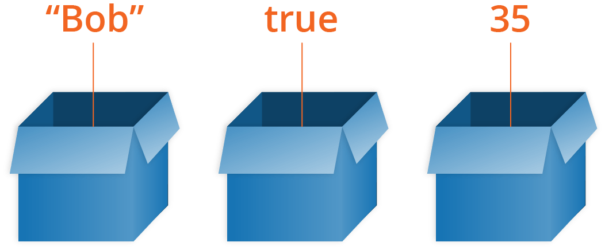

{{LearnSidebar}}{{PreviousMenuNext("Learn/JavaScript/First_steps/What_went_wrong", "Learn/JavaScript/First_steps/Math", "Learn/JavaScript/First_steps")}}

After reading the last couple of articles you should now know what JavaScript is, what it can do for you, how you use it alongside other web technologies, and what its main features look like from a high level. In this article, we will get down to the real basics, looking at how to work with the most basic building blocks of JavaScript — Variables.

<table>
  <tbody>
    <tr>
      <th scope="row">Prerequisites:</th>
      <td>
        Basic computer literacy, a basic understanding of HTML and CSS, an
        understanding of what JavaScript is.
      </td>
    </tr>
    <tr>
      <th scope="row">Objective:</th>
      <td>To gain familiarity with the basics of JavaScript variables.</td>
    </tr>
  </tbody>
</table>

## Tools you need

Throughout this article, you'll be asked to type in lines of code to test your understanding of the content. If you are using a desktop browser, the best place to type your sample code is your browser's JavaScript console (see [What are browser developer tools](/en-US/docs/Learn/Common_questions/Tools_and_setup/What_are_browser_developer_tools) for more information on how to access this tool).

## What is a variable?

A variable is a container for a value, like a number we might use in a sum, or a string that we might use as part of a sentence.

### Variable example

Let's look at a simple example:

```html
<button id="button_A">Press me</button>
<h3 id="heading_A"></h3>
```

```js
const buttonA = document.querySelector("#button_A");
const headingA = document.querySelector("#heading_A");

buttonA.onclick = () => {
  const name = prompt("What is your name?");
  alert(`Hello ${name}, nice to see you!`);
  headingA.textContent = `Welcome ${name}`;
};
```

{{ EmbedLiveSample('Variable_example', '100%', 120) }}

In this example pressing the button runs some code. The first line pops a box up on the screen that asks the reader to enter their name, and then stores the value in a variable. The second line displays a welcome message that includes their name, taken from the variable value and the third line displays that name on the page.

### Without a variable

To understand why this is so useful, let's think about how we'd write this example without using a variable. It would end up looking something like this:

```html example-bad
<button id="button_B">Press me</button>
<h3 id="heading_B"></h3>
```

```js example-bad
const buttonB = document.querySelector("#button_B");
const headingB = document.querySelector("#heading_B");

buttonB.onclick = () => {
  alert(`Hello ${prompt("What is your name?")}, nice to see you!`);
  headingB.textContent = `Welcome ${prompt("What is your name?")}`;
};
```

{{ EmbedLiveSample('Without_a_variable', '100%', 120) }}

You may not fully understand the syntax we are using (yet!), but you should be able to get the idea. If we didn't have variables available, we'd have to ask the reader for their name every time we needed to use it!

Variables just make sense, and as you learn more about JavaScript they will start to become second nature.

One special thing about variables is that they can contain just about anything — not just strings and numbers. Variables can also contain complex data and even entire functions to do amazing things. You'll learn more about this as you go along.

> **Note:** We say variables contain values. This is an important distinction to make. Variables aren't the values themselves; they are containers for values. You can think of them being like little cardboard boxes that you can store things in.



## Declaring a variable

To use a variable, you've first got to create it — more accurately, we call this declaring the variable. To do this, we type the keyword `let` followed by the name you want to call your variable:

```js
let myName;
let myAge;
```

Here we're creating two variables called `myName` and `myAge`. Try typing these lines into your web browser's console. After that, try creating a variable (or two) with your own name choices.

> **Note:** In JavaScript, all code instructions should end with a semicolon (`;`) — your code may work correctly for single lines, but probably won't when you are writing multiple lines of code together. Try to get into the habit of including it.

You can test whether these values now exist in the execution environment by typing just the variable's name, e.g.

```js
myName;
myAge;
```

They currently have no value; they are empty containers. When you enter the variable names, you should get a value of `undefined` returned. If they don't exist, you'll get an error message — try typing in

```js
scoobyDoo;
```

> **Note:** Don't confuse a variable that exists but has no defined value with a variable that doesn't exist at all — they are very different things. In the box analogy you saw above, not existing would mean there's no box (variable) for a value to go in. No value defined would mean that there is a box, but it has no value inside it.

## Initializing a variable

Once you've declared a variable, you can initialize it with a value. You do this by typing the variable name, followed by an equals sign (`=`), followed by the value you want to give it. For example:

```js
myName = "Chris";
myAge = 37;
```

Try going back to the console now and typing in these lines. You should see the value you've assigned to the variable returned in the console to confirm it, in each case. Again, you can return your variable values by typing their name into the console — try these again:

```js
myName;
myAge;
```

You can declare and initialize a variable at the same time, like this:

```js
let myDog = "Rover";
```

This is probably what you'll do most of the time, as it is quicker than doing the two actions on two separate lines.

## A note about var

You'll probably also see a different way to declare variables, using the `var` keyword:

```js
var myName;
var myAge;
```

Back when JavaScript was first created, this was the only way to declare variables. The design of `var` is confusing and error-prone. So `let` was created in modern versions of JavaScript, a new keyword for creating variables that works somewhat differently to `var`, fixing its issues in the process.

A couple of simple differences are explained below. We won't go into all the differences now, but you'll start to discover them as you learn more about JavaScript (if you really want to read about them now, feel free to check out our [let reference page](/en-US/docs/Web/JavaScript/Reference/Statements/let)).

For a start, if you write a multiline JavaScript program that declares and initializes a variable, you can actually declare a variable with `var` after you initialize it and it will still work. For example:

```js
myName = "Chris";

function logName() {
  console.log(myName);
}

logName();

var myName;
```

> **Note:** This won't work when typing individual lines into a JavaScript console, just when running multiple lines of JavaScript in a web document.

This works because of **hoisting** — read [var hoisting](/en-US/docs/Web/JavaScript/Reference/Statements/var#var_hoisting) for more detail on the subject.

Hoisting no longer works with `let`. If we changed `var` to `let` in the above example, it would fail with an error. This is a good thing — declaring a variable after you initialize it results in confusing, harder to understand code.

Secondly, when you use `var`, you can declare the same variable as many times as you like, but with `let` you can't. The following would work:

```js
var myName = "Chris";
var myName = "Bob";
```

But the following would throw an error on the second line:

```js example-bad
let myName = "Chris";
let myName = "Bob";
```

You'd have to do this instead:

```js
let myName = "Chris";
myName = "Bob";
```

Again, this is a sensible language decision. There is no reason to redeclare variables — it just makes things more confusing.

For these reasons and more, we recommend that you use `let` in your code, rather than `var`. Unless you are explicitly writing support for ancient browsers, there is no longer any reason to use `var` as all modern browsers have supported `let` since 2015.

> **Note:** If you are trying this code in your browser's console, prefer to copy & paste each of the code blocks here as a whole. There's a [feature in Chrome's console](https://goo.gle/devtools-const-repl) where variable re-declarations with `let` and `const` are allowed:
>
> ```
> > let myName = 'Chris';
>   let myName = 'Bob';
> // As one input: SyntaxError: Identifier 'myName' has already been declared
>
> > let myName = 'Chris';
> > let myName = 'Bob';
> // As two inputs: both succeed
> ```

## Updating a variable

Once a variable has been initialized with a value, you can change (or update) that value by giving it a different value. Try entering the following lines into your console:

```js
myName = "Bob";
myAge = 40;
```

### An aside on variable naming rules

You can call a variable pretty much anything you like, but there are limitations. Generally, you should stick to just using Latin characters (0-9, a-z, A-Z) and the underscore character.

- You shouldn't use other characters because they may cause errors or be hard to understand for an international audience.
- Don't use underscores at the start of variable names — this is used in certain JavaScript constructs to mean specific things, so may get confusing.
- Don't use numbers at the start of variables. This isn't allowed and causes an error.
- A safe convention to stick to is so-called ["lower camel case"](https://en.wikipedia.org/wiki/CamelCase#Variations_and_synonyms), where you stick together multiple words, using lower case for the whole first word and then capitalize subsequent words. We've been using this for our variable names in the article so far.
- Make variable names intuitive, so they describe the data they contain. Don't just use single letters/numbers, or big long phrases.
- Variables are case sensitive — so `myage` is a different variable from `myAge`.
- One last point: you also need to avoid using JavaScript reserved words as your variable names — by this, we mean the words that make up the actual syntax of JavaScript! So, you can't use words like `var`, `function`, `let`, and `for` as variable names. Browsers recognize them as different code items, and so you'll get errors.

> **Note:** You can find a fairly complete list of reserved keywords to avoid at [Lexical grammar — keywords](/en-US/docs/Web/JavaScript/Reference/Lexical_grammar#keywords).

Good name examples:

```plain example-good
age
myAge
init
initialColor
finalOutputValue
audio1
audio2
```

Bad name examples:

```plain example-bad
1
a
_12
myage
MYAGE
var
Document
skjfndskjfnbdskjfb
thisisareallylongvariablenameman
```

Try creating a few more variables now, with the above guidance in mind.

## Variable types

There are a few different types of data we can store in variables. In this section we'll describe these in brief, then in future articles, you'll learn about them in more detail.

So far we've looked at the first two, but there are others.

### Numbers

You can store numbers in variables, either whole numbers like 30 (also called integers) or decimal numbers like 2.456 (also called floats or floating point numbers). You don't need to declare variable types in JavaScript, unlike some other programming languages. When you give a variable a number value, you don't include quotes:

```js
let myAge = 17;
```

### Strings

Strings are pieces of text. When you give a variable a string value, you need to wrap it in single or double quote marks; otherwise, JavaScript tries to interpret it as another variable name.

```js
let dolphinGoodbye = "So long and thanks for all the fish";
```

### Booleans

Booleans are true/false values — they can have two values, `true` or `false`. These are generally used to test a condition, after which code is run as appropriate. So for example, a simple case would be:

```js
let iAmAlive = true;
```

Whereas in reality it would be used more like this:

```js
let test = 6 < 3;
```

This is using the "less than" operator (`<`) to test whether 6 is less than 3. As you might expect, it returns `false`, because 6 is not less than 3! You will learn a lot more about such operators later on in the course.

### Arrays

An array is a single object that contains multiple values enclosed in square brackets and separated by commas. Try entering the following lines into your console:

```js
let myNameArray = ["Chris", "Bob", "Jim"];
let myNumberArray = [10, 15, 40];
```

Once these arrays are defined, you can access each value by their location within the array. Try these lines:

```js
myNameArray[0]; // should return 'Chris'
myNumberArray[2]; // should return 40
```

The square brackets specify an index value corresponding to the position of the value you want returned. You might have noticed that arrays in JavaScript are zero-indexed: the first element is at index 0.

You'll learn a lot more about arrays in [a future article](/en-US/docs/Learn/JavaScript/First_steps/Arrays).

### Objects

In programming, an object is a structure of code that models a real-life object. You can have a simple object that represents a box and contains information about its width, length, and height, or you could have an object that represents a person, and contains data about their name, height, weight, what language they speak, how to say hello to them, and more.

Try entering the following line into your console:

```js
let dog = { name: "Spot", breed: "Dalmatian" };
```

To retrieve the information stored in the object, you can use the following syntax:

```js
dog.name;
```

We won't be looking at objects any more for now — you can learn more about those in [a future module](/en-US/docs/Learn/JavaScript/Objects).

## Dynamic typing

JavaScript is a "dynamically typed language", which means that, unlike some other languages, you don't need to specify what data type a variable will contain (numbers, strings, arrays, etc.).

For example, if you declare a variable and give it a value enclosed in quotes, the browser treats the variable as a string:

```js
let myString = "Hello";
```

Even if the value enclosed in quotes is just digits, it is still a string — not a number — so be careful:

```js
let myNumber = "500"; // oops, this is still a string
typeof myNumber;
myNumber = 500; // much better — now this is a number
typeof myNumber;
```

Try entering the four lines above into your console one by one, and see what the results are. You'll notice that we are using a special operator called [`typeof`](/en-US/docs/Web/JavaScript/Reference/Operators/typeof) — this returns the data type of the variable you type after it. The first time it is called, it should return `string`, as at that point the `myNumber` variable contains a string, `'500'`. Have a look and see what it returns the second time you call it.

## Constants in JavaScript

As well as variables, you can declare constants. These are like variables, except that:

- you must initialize them when you declare them
- you can't assign them a new value after you've initialized them.

For example, using `let` you can declare a variable without initializing it:

```js
let count;
```

If you try to do this using `const` you will see an error:

```js example-bad
const count;
```

Similarly, with `let` you can initialize a variable, and then assign it a new value (this is also called _reassigning_ the variable):

```js
let count = 1;
count = 2;
```

If you try to do this using `const` you will see an error:

```js example-bad
const count = 1;
count = 2;
```

Note that although a constant in JavaScript must always name the same value, you can change the content of the value that it names. This isn't a useful distinction for simple types like numbers or booleans, but consider an object:

```js
const bird = { species: "Kestrel" };
console.log(bird.species); // "Kestrel"
```

You can update, add, or remove properties of an object declared using `const`, because even though the content of the object has changed, the constant is still pointing to the same object:

```js
bird.species = "Striated Caracara";
console.log(bird.species); // "Striated Caracara"
```

## When to use const and when to use let

If you can't do as much with `const` as you can with `let`, why would you prefer to use it rather than `let`? In fact `const` is very useful. If you use `const` to name a value, it tells anyone looking at your code that this name will never be assigned to a different value. Any time they see this name, they will know what it refers to.

In this course, we adopt the following principle about when to use `let` and when to use `const`:

_Use `const` when you can, and use `let` when you have to._

This means that if you can initialize a variable when you declare it, and don't need to reassign it later, make it a constant.

## Test your skills!

You've reached the end of this article, but can you remember the most important information? You can find some further tests to verify that you've retained this information before you move on — see [Test your skills: variables](/en-US/docs/Learn/JavaScript/First_steps/Test_your_skills:_variables).

## Summary

By now you should know a reasonable amount about JavaScript variables and how to create them. In the next article, we'll focus on numbers in more detail, looking at how to do basic math in JavaScript.

{{PreviousMenuNext("Learn/JavaScript/First_steps/What_went_wrong", "Learn/JavaScript/First_steps/Maths", "Learn/JavaScript/First_steps")}}
