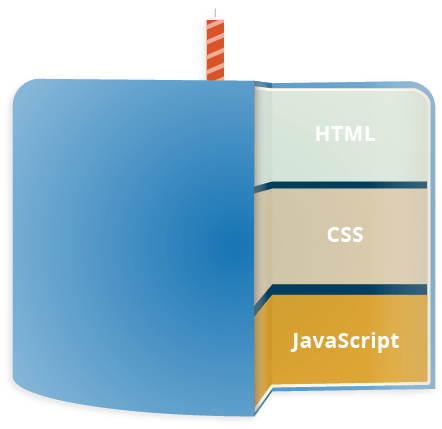
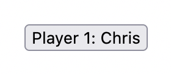
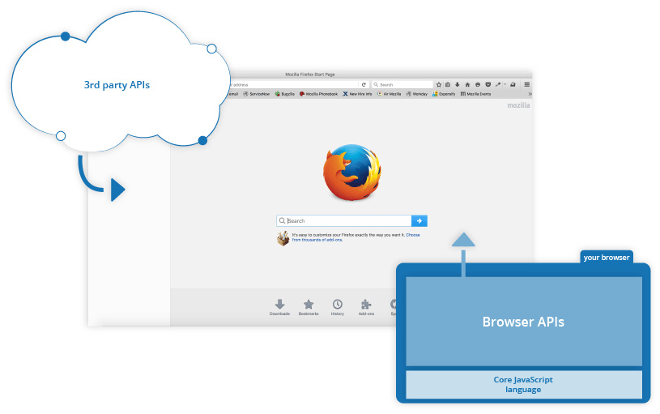

{{LearnSidebar}}{{NextMenu("Learn/JavaScript/First_steps/A_first_splash", "Learn/JavaScript/First_steps")}}

Welcome to the MDN beginner's JavaScript course!
In this article we will look at JavaScript from a high level, answering questions such as "What is it?" and "What can you do with it?", and making sure you are comfortable with JavaScript's purpose.

<table>
  <tbody>
    <tr>
      <th scope="row">Prerequisites:</th>
      <td>Basic computer literacy, a basic understanding of HTML and CSS.</td>
    </tr>
    <tr>
      <th scope="row">Objective:</th>
      <td>
        To gain familiarity with what JavaScript is, what it can do, and how it
        fits into a website.
      </td>
    </tr>
  </tbody>
</table>

## A high-level definition

JavaScript is a scripting or programming language that allows you to implement complex features on web pages — every time a web page does more than just sit there and display static information for you to look at — displaying timely content updates, interactive maps, animated 2D/3D graphics, scrolling video jukeboxes, etc. — you can bet that JavaScript is probably involved.
It is the third layer of the layer cake of standard web technologies, two of which ([HTML](/en-US/docs/Learn/HTML) and [CSS](/en-US/docs/Learn/CSS)) we have covered in much more detail in other parts of the Learning Area.



- {{glossary("HTML")}} is the markup language that we use to structure and give meaning to our web content, for example defining paragraphs, headings, and data tables, or embedding images and videos in the page.
- {{glossary("CSS")}} is a language of style rules that we use to apply styling to our HTML content, for example setting background colors and fonts, and laying out our content in multiple columns.
- {{glossary("JavaScript")}} is a scripting language that enables you to create dynamically updating content, control multimedia, animate images, and pretty much everything else. (Okay, not everything, but it is amazing what you can achieve with a few lines of JavaScript code.)

The three layers build on top of one another nicely. Let's take a simple text label as an example. We can mark it up using HTML to give it structure and purpose:

```html
<p>Player 1: Chris</p>
```



Then we can add some CSS into the mix to get it looking nice:

```css
p {
  font-family: "helvetica neue", helvetica, sans-serif;
  letter-spacing: 1px;
  text-transform: uppercase;
  text-align: center;
  border: 2px solid rgb(0 0 200 / 0.6);
  background: rgb(0 0 200 / 0.6);
  color: rgb(255 255 255 / 1);
  box-shadow: 1px 1px 2px rgb(0 0 200 / 0.4);
  border-radius: 10px;
  padding: 3px 10px;
  display: inline-block;
  cursor: pointer;
}
```


And finally, we can add some JavaScript to implement dynamic behavior:

```js
const para = document.querySelector("p");

para.addEventListener("click", updateName);

function updateName() {
  const name = prompt("Enter a new name");
  para.textContent = `Player 1: ${name}`;
}
```

{{ EmbedLiveSample('A_high-level_definition', '100%', 80) }}

Try clicking on this last version of the text label to see what happens (note also that you can find this demo on GitHub — see the [source code](https://github.com/mdn/learning-area/blob/main/javascript/introduction-to-js-1/what-is-js/javascript-label.html), or [run it live](https://mdn.github.io/learning-area/javascript/introduction-to-js-1/what-is-js/javascript-label.html))!

JavaScript can do a lot more than that — let's explore what in more detail.

## So what can it really do?

The core client-side JavaScript language consists of some common programming features that allow you to do things like:

- Store useful values inside variables. In the above example for instance, we ask for a new name to be entered then store that name in a variable called `name`.
- Operations on pieces of text (known as "strings" in programming). In the above example we take the string "Player 1: " and join it to the `name` variable to create the complete text label, e.g. "Player 1: Chris".
- Running code in response to certain events occurring on a web page. We used a {{domxref("Element/click_event", "click")}} event in our example above to detect when the label is clicked and then run the code that updates the text label.
- And much more!

What is even more exciting however is the functionality built on top of the client-side JavaScript language. So-called **Application Programming Interfaces** (**APIs**) provide you with extra superpowers to use in your JavaScript code.

APIs are ready-made sets of code building blocks that allow a developer to implement programs that would otherwise be hard or impossible to implement.
They do the same thing for programming that ready-made furniture kits do for home building — it is much easier to take ready-cut panels and screw them together to make a bookshelf than it is to work out the design yourself, go and find the correct wood, cut all the panels to the right size and shape, find the correct-sized screws, and _then_ put them together to make a bookshelf.

They generally fall into two categories.



**Browser APIs** are built into your web browser, and are able to expose data from the surrounding computer environment, or do useful complex things. For example:

- The {{domxref("Document_Object_Model","DOM (Document Object Model) API")}} allows you to manipulate HTML and CSS, creating, removing and changing HTML, dynamically applying new styles to your page, etc.
  Every time you see a popup window appear on a page, or some new content displayed (as we saw above in our simple demo) for example, that's the DOM in action.
- The {{domxref("Geolocation","Geolocation API")}} retrieves geographical information.
  This is how [Google Maps](https://www.google.com/maps) is able to find your location and plot it on a map.
- The {{domxref("Canvas_API","Canvas")}} and {{domxref("WebGL_API","WebGL")}} APIs allow you to create animated 2D and 3D graphics.
  People are doing some amazing things using these web technologies — see [Chrome Experiments](https://experiments.withgoogle.com/collection/chrome) and [webglsamples](https://webglsamples.org/).
- [Audio and Video APIs](/en-US/docs/Web/Guide/Audio_and_video_delivery) like {{domxref("HTMLMediaElement")}} and {{domxref("WebRTC API", "WebRTC")}} allow you to do really interesting things with multimedia, such as play audio and video right in a web page, or grab video from your web camera and display it on someone else's computer (try our simple [Snapshot demo](https://chrisdavidmills.github.io/snapshot/) to get the idea).

> **Note:** Many of the above demos won't work in an older browser — when experimenting, it's a good idea to use a modern browser like Firefox, Chrome, Edge or Opera to run your code in.
> You will need to consider [cross browser testing](/en-US/docs/Learn/Tools_and_testing/Cross_browser_testing) in more detail when you get closer to delivering production code (i.e. real code that real customers will use).

**Third party APIs** are not built into the browser by default, and you generally have to grab their code and information from somewhere on the Web. For example:

- The [Twitter API](https://developer.twitter.com/en/docs) allows you to do things like displaying your latest tweets on your website.
- The [Google Maps API](https://developers.google.com/maps/) and [OpenStreetMap API](https://wiki.openstreetmap.org/wiki/API) allows you to embed custom maps into your website, and other such functionality.

> **Note:** These APIs are advanced, and we'll not be covering any of these in this module. You can find out much more about these in our [Client-side web APIs module](/en-US/docs/Learn/JavaScript/Client-side_web_APIs).

There's a lot more available, too! However, don't get over excited just yet. You won't be able to build the next Facebook, Google Maps, or Instagram after studying JavaScript for 24 hours — there are a lot of basics to cover first. And that's why you're here — let's move on!

## What is JavaScript doing on your page?

Here we'll actually start looking at some code, and while doing so, explore what actually happens when you run some JavaScript in your page.

Let's briefly recap the story of what happens when you load a web page in a browser (first talked about in our [How CSS works](/en-US/docs/Learn/CSS/First_steps/How_CSS_works#how_does_css_actually_work) article). When you load a web page in your browser, you are running your code (the HTML, CSS, and JavaScript) inside an execution environment (the browser tab). This is like a factory that takes in raw materials (the code) and outputs a product (the web page).


A very common use of JavaScript is to dynamically modify HTML and CSS to update a user interface, via the Document Object Model API (as mentioned above).
Note that the code in your web documents is generally loaded and executed in the order it appears on the page.
Errors may occur if JavaScript is loaded and run before the HTML and CSS that it is intended to modify.
You will learn ways around this later in the article, in the [Script loading strategies](#script_loading_strategies) section.

### Browser security

Each browser tab has its own separate bucket for running code in (these buckets are called "execution environments" in technical terms) — this means that in most cases the code in each tab is run completely separately, and the code in one tab cannot directly affect the code in another tab — or on another website.
This is a good security measure — if this were not the case, then pirates could start writing code to steal information from other websites, and other such bad things.

> **Note:** There are ways to send code and data between different websites/tabs in a safe manner, but these are advanced techniques that we won't cover in this course.

### JavaScript running order

When the browser encounters a block of JavaScript, it generally runs it in order, from top to bottom.
This means that you need to be careful what order you put things in.
For example, let's return to the block of JavaScript we saw in our first example:

```js
const para = document.querySelector("p");

para.addEventListener("click", updateName);

function updateName() {
  const name = prompt("Enter a new name");
  para.textContent = `Player 1: ${name}`;
}
```

Here we are selecting a text paragraph (line 1), then attaching an event listener to it (line 3) so that when the paragraph is clicked, the `updateName()` code block (lines 5–8) is run. The `updateName()` code block (these types of reusable code blocks are called "functions") asks the user for a new name, and then inserts that name into the paragraph to update the display.

If you swapped the order of the first two lines of code, it would no longer work — instead, you'd get an error returned in the [browser developer console](/en-US/docs/Learn/Common_questions/Tools_and_setup/What_are_browser_developer_tools) — `TypeError: para is undefined`.
This means that the `para` object does not exist yet, so we can't add an event listener to it.

> **Note:** This is a very common error — you need to be careful that the objects referenced in your code exist before you try to do stuff to them.

### Interpreted versus compiled code

You might hear the terms **interpreted** and **compiled** in the context of programming.
In interpreted languages, the code is run from top to bottom and the result of running the code is immediately returned.
You don't have to transform the code into a different form before the browser runs it.
The code is received in its programmer-friendly text form and processed directly from that.

Compiled languages on the other hand are transformed (compiled) into another form before they are run by the computer.
For example, C/C++ are compiled into machine code that is then run by the computer.
The program is executed from a binary format, which was generated from the original program source code.

JavaScript is a lightweight interpreted programming language.
The web browser receives the JavaScript code in its original text form and runs the script from that.
From a technical standpoint, most modern JavaScript interpreters actually use a technique called **just-in-time compiling** to improve performance; the JavaScript source code gets compiled into a faster, binary format while the script is being used, so that it can be run as quickly as possible.
However, JavaScript is still considered an interpreted language, since the compilation is handled at run time, rather than ahead of time.

There are advantages to both types of language, but we won't discuss them right now.

### Server-side versus client-side code

You might also hear the terms **server-side** and **client-side** code, especially in the context of web development.
Client-side code is code that is run on the user's computer — when a web page is viewed, the page's client-side code is downloaded, then run and displayed by the browser.
In this module we are explicitly talking about **client-side JavaScript**.

Server-side code on the other hand is run on the server, then its results are downloaded and displayed in the browser.
Examples of popular server-side web languages include PHP, Python, Ruby, ASP.NET, and even JavaScript!
JavaScript can also be used as a server-side language, for example in the popular Node.js environment — you can find out more about server-side JavaScript in our [Dynamic Websites – Server-side programming](/en-US/docs/Learn/Server-side) topic.

### Dynamic versus static code

The word **dynamic** is used to describe both client-side JavaScript, and server-side languages — it refers to the ability to update the display of a web page/app to show different things in different circumstances, generating new content as required.
Server-side code dynamically generates new content on the server, e.g. pulling data from a database, whereas client-side JavaScript dynamically generates new content inside the browser on the client, e.g. creating a new HTML table, filling it with data requested from the server, then displaying the table in a web page shown to the user.
The meaning is slightly different in the two contexts, but related, and both approaches (server-side and client-side) usually work together.

A web page with no dynamically updating content is referred to as **static** — it just shows the same content all the time.

## How do you add JavaScript to your page?

JavaScript is applied to your HTML page in a similar manner to CSS.
Whereas CSS uses {{htmlelement("link")}} elements to apply external stylesheets and {{htmlelement("style")}} elements to apply internal stylesheets to HTML, JavaScript only needs one friend in the world of HTML — the {{htmlelement("script")}} element. Let's learn how this works.

### Internal JavaScript

1. First of all, make a local copy of our example file [apply-javascript.html](https://github.com/mdn/learning-area/blob/main/javascript/introduction-to-js-1/what-is-js/apply-javascript.html). Save it in a directory somewhere sensible.
2. Open the file in your web browser and in your text editor. You'll see that the HTML creates a simple web page containing a clickable button.
3. Next, go to your text editor and add the following in your head — just before your closing `</head>` tag:

   ```html
   <script>
     // JavaScript goes here
   </script>
   ```

4. Now we'll add some JavaScript inside our {{htmlelement("script")}} element to make the page do something more interesting — add the following code just below the "// JavaScript goes here" line:

   ```js
   document.addEventListener("DOMContentLoaded", () => {
     function createParagraph() {
       const para = document.createElement("p");
       para.textContent = "You clicked the button!";
       document.body.appendChild(para);
     }

     const buttons = document.querySelectorAll("button");

     for (const button of buttons) {
       button.addEventListener("click", createParagraph);
     }
   });
   ```

5. Save your file and refresh the browser — now you should see that when you click the button, a new paragraph is generated and placed below.

> **Note:** If your example doesn't seem to work, go through the steps again and check that you did everything right.
> Did you save your local copy of the starting code as a `.html` file?
> Did you add your {{htmlelement("script")}} element just before the `</head>` tag?
> Did you enter the JavaScript exactly as shown? **JavaScript is case sensitive, and very fussy, so you need to enter the syntax exactly as shown, otherwise it may not work.**

> **Note:** You can see this version on GitHub as [apply-javascript-internal.html](https://github.com/mdn/learning-area/blob/main/javascript/introduction-to-js-1/what-is-js/apply-javascript-internal.html) ([see it live too](https://mdn.github.io/learning-area/javascript/introduction-to-js-1/what-is-js/apply-javascript-internal.html)).

### External JavaScript

This works great, but what if we wanted to put our JavaScript in an external file? Let's explore this now.

1. First, create a new file in the same directory as your sample HTML file. Call it `script.js` — make sure it has that .js filename extension, as that's how it is recognized as JavaScript.
2. Replace your current {{htmlelement("script")}} element with the following:

   ```html
   <script src="script.js" defer></script>
   ```

3. Inside `script.js`, add the following script:

   ```js
   function createParagraph() {
     const para = document.createElement("p");
     para.textContent = "You clicked the button!";
     document.body.appendChild(para);
   }

   const buttons = document.querySelectorAll("button");

   for (const button of buttons) {
     button.addEventListener("click", createParagraph);
   }
   ```

4. Save and refresh your browser, and you should see the same thing!
   It works just the same, but now we've got our JavaScript in an external file.
   This is generally a good thing in terms of organizing your code and making it reusable across multiple HTML files.
   Plus, the HTML is easier to read without huge chunks of script dumped in it.

> **Note:** You can see this version on GitHub as [apply-javascript-external.html](https://github.com/mdn/learning-area/blob/main/javascript/introduction-to-js-1/what-is-js/apply-javascript-external.html) and [script.js](https://github.com/mdn/learning-area/blob/main/javascript/introduction-to-js-1/what-is-js/script.js) ([see it live too](https://mdn.github.io/learning-area/javascript/introduction-to-js-1/what-is-js/apply-javascript-external.html)).

### Inline JavaScript handlers

Note that sometimes you'll come across bits of actual JavaScript code living inside HTML.
It might look something like this:

```js example-bad
function createParagraph() {
  const para = document.createElement("p");
  para.textContent = "You clicked the button!";
  document.body.appendChild(para);
}
```

```html example-bad
<button onclick="createParagraph()">Click me!</button>
```

You can try this version of our demo below.

{{ EmbedLiveSample('Inline_JavaScript_handlers', '100%', 150) }}

This demo has exactly the same functionality as in the previous two sections, except that the {{htmlelement("button")}} element includes an inline `onclick` handler to make the function run when the button is pressed.

**Please don't do this, however.** It is bad practice to pollute your HTML with JavaScript, and it is inefficient — you'd have to include the `onclick="createParagraph()"` attribute on every button you want the JavaScript to apply to.

### Using addEventListener instead

Instead of including JavaScript in your HTML, use a pure JavaScript construct.
The `querySelectorAll()` function allows you to select all the buttons on a page.
You can then loop through the buttons, assigning a handler for each using `addEventListener()`.
The code for this is shown below:

```js
const buttons = document.querySelectorAll("button");

for (const button of buttons) {
  button.addEventListener("click", createParagraph);
}
```

This might be a bit longer than the `onclick` attribute, but it will work for all buttons — no matter how many are on the page, nor how many are added or removed.
The JavaScript does not need to be changed.

> **Note:** Try editing your version of `apply-javascript.html` and add a few more buttons into the file.
> When you reload, you should find that all of the buttons when clicked will create a paragraph.
> Neat, huh?

### Script loading strategies

There are a number of issues involved with getting scripts to load at the right time. Nothing is as simple as it seems!
A common problem is that all the HTML on a page is loaded in the order in which it appears.
If you are using JavaScript to manipulate elements on the page (or more accurately, the [Document Object Model](/en-US/docs/Learn/JavaScript/Client-side_web_APIs/Manipulating_documents#the_document_object_model)), your code won't work if the JavaScript is loaded and parsed before the HTML you are trying to do something to.

In the above code examples, in the internal and external examples the JavaScript is loaded and run in the head of the document, before the HTML body is parsed.
This could cause an error, so we've used some constructs to get around it.

In the internal example, you can see this structure around the code:

```js
document.addEventListener("DOMContentLoaded", () => {
  // …
});
```

This is an event listener, which listens for the browser's `DOMContentLoaded` event, which signifies that the HTML body is completely loaded and parsed.
The JavaScript inside this block will not run until after that event is fired, therefore the error is avoided (you'll [learn about events](/en-US/docs/Learn/JavaScript/Building_blocks/Events) later in the course).

In the external example, we use a more modern JavaScript feature to solve the problem, the `defer` attribute, which tells the browser to continue downloading the HTML content once the `<script>` tag element has been reached.

```html
<script src="script.js" defer></script>
```

In this case both the script and the HTML will load simultaneously and the code will work.

> **Note:** In the external case, we did not need to use the `DOMContentLoaded` event because the `defer` attribute solved the problem for us.
> We didn't use the `defer` solution for the internal JavaScript example because `defer` only works for external scripts.

An old-fashioned solution to this problem used to be to put your script element right at the bottom of the body (e.g. just before the `</body>` tag), so that it would load after all the HTML has been parsed.
The problem with this solution is that loading/parsing of the script is completely blocked until the HTML DOM has been loaded.
On larger sites with lots of JavaScript, this can cause a major performance issue, slowing down your site.

#### async and defer

There are actually two modern features we can use to bypass the problem of the blocking script — `async` and `defer` (which we saw above).
Let's look at the difference between these two.

Scripts loaded using the `async` attribute will download the script without blocking the page while the script is being fetched.
However, once the download is complete, the script will execute, which blocks the page from rendering.
You get no guarantee that scripts will run in any specific order.
It is best to use `async` when the scripts in the page run independently from each other and depend on no other script on the page.

Scripts loaded with the `defer` attribute will load in the order they appear on the page.
They won't run until the page content has all loaded, which is useful if your scripts depend on the DOM being in place (e.g. they modify one or more elements on the page).

Here is a visual representation of the different script loading methods and what that means for your page:


_This image is from the [HTML spec](https://html.spec.whatwg.org/images/asyncdefer.svg), copied and cropped to a reduced version, under [CC BY 4.0](https://creativecommons.org/licenses/by/4.0/) license terms._

For example, if you have the following script elements:

```html
<script async src="js/vendor/jquery.js"></script>

<script async src="js/script2.js"></script>

<script async src="js/script3.js"></script>
```

You can't rely on the order the scripts will load in.
`jquery.js` may load before or after `script2.js` and `script3.js` and if this is the case, any functions in those scripts depending on `jquery` will produce an error because `jquery` will not be defined at the time the script runs.

`async` should be used when you have a bunch of background scripts to load in, and you just want to get them in place as soon as possible.
For example, maybe you have some game data files to load, which will be needed when the game actually begins, but for now you just want to get on with showing the game intro, titles, and lobby, without them being blocked by script loading.

Scripts loaded using the `defer` attribute (see below) will run in the order they appear in the page and execute them as soon as the script and content are downloaded:

```html
<script defer src="js/vendor/jquery.js"></script>

<script defer src="js/script2.js"></script>

<script defer src="js/script3.js"></script>
```

In the second example, we can be sure that `jquery.js` will load before `script2.js` and `script3.js` and that `script2.js` will load before `script3.js`.
They won't run until the page content has all loaded, which is useful if your scripts depend on the DOM being in place (e.g. they modify one of more elements on the page).

To summarize:

- `async` and `defer` both instruct the browser to download the script(s) in a separate thread, while the rest of the page (the DOM, etc.) is downloading, so the page loading is not blocked during the fetch process.
- scripts with an `async` attribute will execute as soon as the download is complete.
  This blocks the page and does not guarantee any specific execution order.
- scripts with a `defer` attribute will load in the order they are in and will only execute once everything has finished loading.
- If your scripts should be run immediately and they don't have any dependencies, then use `async`.
- If your scripts need to wait for parsing and depend on other scripts and/or the DOM being in place, load them using `defer` and put their corresponding `<script>` elements in the order you want the browser to execute them.

## Comments

As with HTML and CSS, it is possible to write comments into your JavaScript code that will be ignored by the browser, and exist to provide instructions to your fellow developers on how the code works (and you, if you come back to your code after six months and can't remember what you did).
Comments are very useful, and you should use them often, particularly for larger applications.
There are two types:

- A single line comment is written after a double forward slash (//), e.g.

  ```js
  // I am a comment
  ```

- A multi-line comment is written between the strings /\* and \*/, e.g.

  ```js
  /*
    I am also
    a comment
  */
  ```

So for example, we could annotate our last demo's JavaScript with comments like so:

```js
// Function: creates a new paragraph and appends it to the bottom of the HTML body.

function createParagraph() {
  const para = document.createElement("p");
  para.textContent = "You clicked the button!";
  document.body.appendChild(para);
}

/*
  1. Get references to all the buttons on the page in an array format.
  2. Loop through all the buttons and add a click event listener to each one.

  When any button is pressed, the createParagraph() function will be run.
*/

const buttons = document.querySelectorAll("button");

for (const button of buttons) {
  button.addEventListener("click", createParagraph);
}
```

> **Note:** In general more comments are usually better than less, but you should be careful if you find yourself adding lots of comments to explain what variables are (your variable names perhaps should be more intuitive), or to explain very simple operations (maybe your code is overcomplicated).

## Summary

So there you go, your first step into the world of JavaScript.
We've begun with just theory, to start getting you used to why you'd use JavaScript and what kind of things you can do with it.
Along the way, you saw a few code examples and learned how JavaScript fits in with the rest of the code on your website, amongst other things.

JavaScript may seem a bit daunting right now, but don't worry — in this course, we will take you through it in simple steps that will make sense going forward.
In the next article, we will [plunge straight into the practical](/en-US/docs/Learn/JavaScript/First_steps/A_first_splash), getting you to jump straight in and build your own JavaScript examples.

{{NextMenu("Learn/JavaScript/First_steps/A_first_splash", "Learn/JavaScript/First_steps")}}
