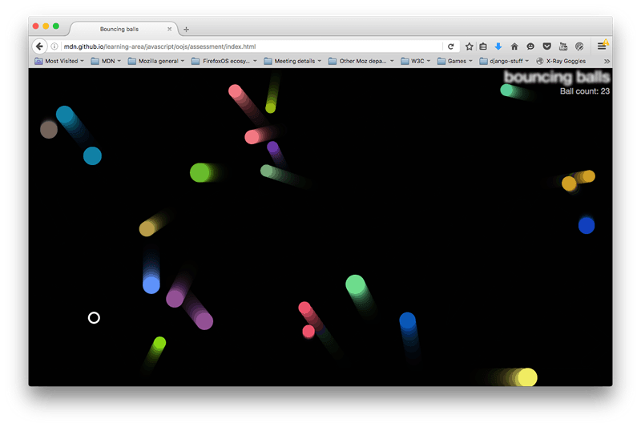

{{LearnSidebar}}{{PreviousMenuNext("Learn/JavaScript/Objects/Object_building_practice", "", "Learn/JavaScript/Objects")}}

In this assessment, you are expected to use the bouncing balls demo from the previous article as a starting point, and add some new and interesting features to it.

<table>
  <tbody>
    <tr>
      <th scope="row">Prerequisites:</th>
      <td>
        Before attempting this assessment you should have already worked through
        all the articles in this module.
      </td>
    </tr>
    <tr>
      <th scope="row">Objective:</th>
      <td>
        To test comprehension of JavaScript objects and object-oriented
        constructs
      </td>
    </tr>
  </tbody>
</table>

## Starting point

To get this assessment started, make a local copy of [index-finished.html](https://github.com/mdn/learning-area/blob/master/javascript/oojs/bouncing-balls/index-finished.html), [style.css](https://github.com/mdn/learning-area/blob/master/javascript/oojs/bouncing-balls/style.css), and [main-finished.js](https://github.com/mdn/learning-area/blob/master/javascript/oojs/bouncing-balls/main-finished.js) from our last article in a new directory in your local computer.

Alternatively, you could use a site like [JSBin](https://jsbin.com/) or [Glitch](https://glitch.com/) to do your assessment. You could paste the HTML, CSS and JavaScript into one of these online editors. If the online editor you are using doesn't have separate JavaScript/CSS panels, feel free to put them inline `<script>`/`<style>` elements inside the HTML page.

> **Note:** If you get stuck, then ask us for help — see the {{anch("Assessment or further help")}} section at the bottom of this page.

## Hints and tips

A couple of pointers before you get started.

- This assessment is quite challenging. Read the whole assessment before you start coding, and take each step slowly and carefully.
- It might be a good idea to save a separate copy of the demo after you get each stage working, so you can refer back to it if you find yourself in trouble later on.

## Project brief

Our bouncy ball demo is fun, but now we want to make it a little bit more interactive by adding a user-controlled evil circle, which will eat the balls if it catches them. We also want to test your object-building skills by creating a generic `Shape()` object that our balls and evil circle can inherit from. Finally, we want to add a score counter to track the number of balls left to capture.

The following screenshot gives you an idea of what the finished program should look like:



To give you more of an idea, have a look at the [finished example](https://mdn.github.io/learning-area/javascript/oojs/assessment/) (no peeking at the source code!)

## Steps to complete

The following sections describe what you need to do.

### Creating our new objects

First of all, change your existing `Ball()` constructor so that it becomes a `Shape()` constructor and add a new `Ball()` constructor:

1.  The `Shape()` constructor should define the `x`, `y`, `velX`, and `velY` properties in the same way as the `Ball()` constructor did originally, but not the `color` and `size` properties.
2.  It should also define a new property called `exists`, which is used to track whether the balls exist in the program (have not been eaten by the evil circle). This should be a boolean (`true`/`false`).
3.  The `Ball()` constructor should inherit the `x`, `y`, `velX`, `velY`, and `exists` properties from the `Shape()` constructor.
4.  It should also define a `color` and a `size` property, like the original `Ball()` constructor did.
5.  Remember to set the `Ball()` constructor's `prototype` and `constructor` appropriately.
6.  The `Ball` prototype's `collisionDetect()` method needs a small update. If the code were kept as-is, the `EvilCircle` would start eating the bouncing balls by setting the `exists` property to `false`. And that would reduce the number of balls involved in collision detection. A ball needs to be considered for collision detection only if the `exists` property is `true`. So, replace the existing `collisionDetect()` code with the following code:

    ```js
    Ball.prototype.collisionDetect = function() {
      for (let j = 0; j < balls.length; j++) {
        if (!(this === balls[j]) && balls[j].exists) {
          const dx = this.x - balls[j].x;
          const dy = this.y - balls[j].y;
          const distance = Math.sqrt(dx * dx + dy * dy);

          if (distance < this.size + balls[j].size) {
            balls[j].color = this.color = 'rgb(' + random(0, 255) + ',' + random(0, 255) + ',' + random(0, 255) +')';
          }
        }
      }
    }
    ```

    As discussed above, the only addition is to check if the ball exists — by using `balls[j].exists` in the `if` conditional.

The ball `draw()` and `update()` method definitions should be able to stay exactly the same as they were before.

You also need to add a new parameter to the `new Ball() ( ... )` constructor call — the `exists` parameter should be the 5th parameter, and should be given a value of `true`.

At this point, try reloading the code — it should work just the same as it did before, with our redesigned objects.

### Defining EvilCircle()

Now it's time to meet the bad guy — the `EvilCircle()`! Our game is only going to involve one evil circle, but we are still going to define it using a constructor that inherits from `Shape()` to give you some practice. You might want to add another circle to the app later on that can be controlled by another player, or have several computer-controlled evil circles. You're probably not going to take over the world with a single evil circle, but it will do for this assessment.

The `EvilCircle()` constructor should inherit `x`, `y`, `velX`, `velY`, and `exists` from `Shape()`, but `velX` and `velY` should always equal 20.

You should do this something like `Shape.call(this, x, y, 20, 20, exists);`

It should also define its own properties, as follows:

- `color` — `'white'`
- `size` — `10`

Again, remember to define your inherited properties as parameters in the constructor, and set the `prototype` and `constructor` properties correctly.

### Defining EvilCircle()'s methods

`EvilCircle()` should have four methods, as described below.

#### `draw()`

This method has the same purpose as `Ball()`'s `draw()` method: It draws the object instance on the canvas. It will work in a very similar way, so you can start by copying the `Ball.prototype.draw` definition. You should then make the following changes:

- We want the evil circle to not be filled in, but rather just have an outer line (stroke). You can achieve this by updating [`fillStyle`](/en-US/docs/Web/API/CanvasRenderingContext2D/fillStyle) and [`fill()`](/en-US/docs/Web/API/CanvasRenderingContext2D/fill) to [`strokeStyle`](/en-US/docs/Web/API/CanvasRenderingContext2D/strokeStyle) and [`stroke()`](/en-US/docs/Web/API/CanvasRenderingContext2D/stroke).
- We also want to make the stroke a bit thicker, so you can see the evil circle a bit more easily. This can be achieved by setting a value for [`lineWidth`](/en-US/docs/Web/API/CanvasRenderingContext2D/lineWidth) somewhere after the [`beginPath()`](/en-US/docs/Web/API/CanvasRenderingContext2D/beginPath) call (3 will do).

#### `checkBounds()`

This method will do the same thing as the first part of `Ball()`'s `update()` function — look to see whether the evil circle is going to go off the edge of the screen, and stop it from doing so. Again, you can mostly just copy the `Ball.prototype.update` definition, but there are a few changes you should make:

- Get rid of the last two lines — we don't want to automatically update the evil circle's position on every frame, because we will be moving it in some other way, as you'll see below.
- Inside the `if()` statements, if the tests return true we don't want to update `velX`/`velY`; we want to instead change the value of `x`/`y` so the evil circle is bounced back onto the screen slightly. Adding or subtracting (as appropriate) the evil circle's `size` property would make sense.

#### `setControls()`

This method will add an `onkeydown` event listener to the `window` object so that when certain keyboard keys are pressed, we can move the evil circle around. The following code block should be put inside the method definition:

```js
let _this = this;
window.onkeydown = function(e) {
    if (e.key === 'a') {
      _this.x -= _this.velX;
    } else if (e.key === 'd') {
      _this.x += _this.velX;
    } else if (e.key === 'w') {
      _this.y -= _this.velY;
    } else if (e.key === 's') {
      _this.y += _this.velY;
    }
  }
```

So when a key is pressed, the event object's [`key`](/en-US/docs/Web/API/KeyboardEvent/key) property is consulted to see which key is pressed. If it is one of the four specified keys, then the evil circle will move left/right/up/down.

For a bonus point, can you tell us why we've had to set `let _this = this;` in the position it is in? It is something to do with function scope.

#### `collisionDetect()`

This method will act in a very similar way to `Ball()`'s `collisionDetect()` method, so you can use a copy of that as the basis of this new method. But there are a couple of differences:

- In the outer `if` statement, you no longer need to check whether the current ball in the iteration is the same as the ball that is doing the checking — because it is no longer a ball, it is the evil circle! Instead, you need to do a test to see if the ball being checked exists (with which property could you do this with?). If it doesn't exist, it has already been eaten by the evil circle, so there is no need to check it again.
- In the inner `if` statement, you no longer want to make the objects change color when a collision is detected — instead, you want to set any balls that collide with the evil circle to not exist any more (again, how do you think you'd do that?).

### Bringing the evil circle into the program

Now we've defined the evil circle, we need to actually make it appear in our scene. To do this, you need to make some changes to the `loop()` function.

- First of all, create a new evil circle object instance (specifying the necessary parameters), then call its `setControls()` method. You only need to do these two things once, not on every iteration of the loop.
- At the point where you loop through every ball and call the `draw()`, `update()`, and `collisionDetect()` functions for each one, make it so that these functions are only called if the current ball exists.
- Call the evil ball instance's `draw()`, `checkBounds()`, and `collisionDetect()` methods on every iteration of the loop.

### Implementing the score counter

To implement the score counter, follow the following steps:

1.  In your HTML file, add a {{HTMLElement("p")}} element just below the {{HTMLElement("h1")}} element containing the text "Ball count: ".
2.  In your CSS file, add the following rule at the bottom:

    ```css
    p {
      position: absolute;
      margin: 0;
      top: 35px;
      right: 5px;
      color: #aaa;
    }
    ```

3.  In your JavaScript, make the following updates:

    - Create a variable that stores a reference to the paragraph.
    - Keep a count of the number of balls on screen in some way.
    - Increment the count and display the updated number of balls each time a ball is added to the scene.
    - Decrement the count and display the updated number of balls each time the evil circle eats a ball (causes it not to exist).

## Assessment or further help

If you would like your work assessed, or are stuck and want to ask for help:

1.  Put your work into an online shareable editor such as [CodePen](https://codepen.io/), [jsFiddle](https://jsfiddle.net/), or [Glitch](https://glitch.com/).
2.  Write a post asking for assessment and/or help at the [MDN Discourse forum Learning category](https://discourse.mozilla.org/c/mdn/learn). Your post should include:

    - A descriptive title such as "Assessment wanted for Adding bouncing balls features".
    - Details of what you have already tried, and what you would like us to do, e.g. if you are stuck and need help, or want an assessment.
    - A link to the example you want assessed or need help with, in an online shareable editor (as mentioned in step 1 above). This is a good practice to get into — it's very hard to help someone with a coding problem if you can't see their code.
    - A link to the actual task or assessment page, so we can find the question you want help with.

{{PreviousMenuNext("Learn/JavaScript/Objects/Object_building_practice", "", "Learn/JavaScript/Objects")}}

## In this module

- [Object basics](/en-US/docs/Learn/JavaScript/Objects/Basics)
- [Object-oriented JavaScript for beginners](/en-US/docs/Learn/JavaScript/Objects/Object-oriented_JS)
- [Object prototypes](/en-US/docs/Learn/JavaScript/Objects/Object_prototypes)
- [Inheritance in JavaScript](/en-US/docs/Learn/JavaScript/Objects/Inheritance)
- [Working with JSON data](/en-US/docs/Learn/JavaScript/Objects/JSON)
- [Object building practice](/en-US/docs/Learn/JavaScript/Objects/Object_building_practice)
- [Adding features to our bouncing balls demo](/en-US/docs/Learn/JavaScript/Objects/Adding_bouncing_balls_features)
