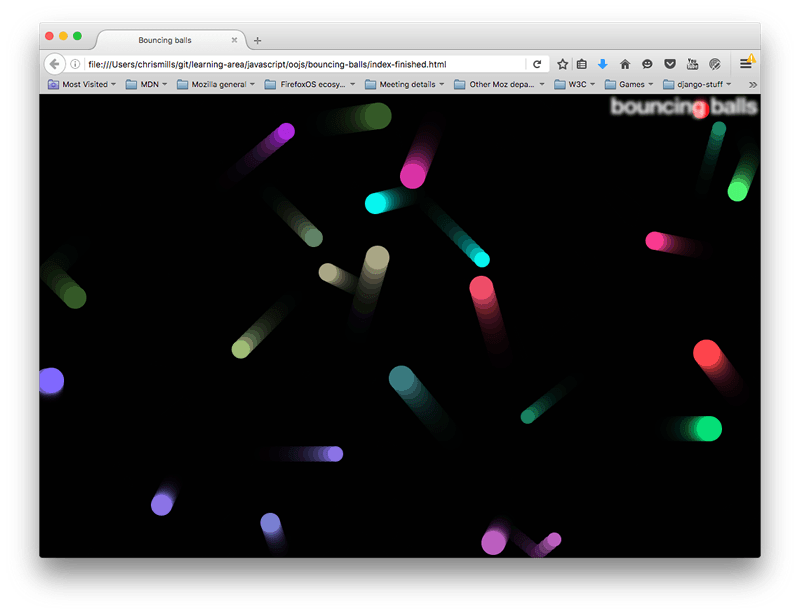

{{LearnSidebar}}{{PreviousMenuNext("Learn/JavaScript/Objects/JSON", "Learn/JavaScript/Objects/Adding_bouncing_balls_features", "Learn/JavaScript/Objects")}}

In previous articles we looked at all the essential JavaScript object theory and syntax details, giving you a solid base to start from. In this article we dive into a practical exercise, giving you some more practice in building custom JavaScript objects, with a fun and colorful result.

<table>
  <tbody>
    <tr>
      <th scope="row">Prerequisites:</th>
      <td>
        Basic computer literacy, a basic understanding of HTML and CSS,
        familiarity with JavaScript basics (see
        <a href="/en-US/docs/Learn/JavaScript/First_steps">First steps</a> and
        <a href="/en-US/docs/Learn/JavaScript/Building_blocks"
          >Building blocks</a
        >) and OOJS basics (see
        <a href="/en-US/docs/Learn/JavaScript/Objects/Basics"
          >Introduction to objects</a
        >).
      </td>
    </tr>
    <tr>
      <th scope="row">Objective:</th>
      <td>
        To get some practice with using objects and object-oriented techniques
        in a real-world context.
      </td>
    </tr>
  </tbody>
</table>

## Let's bounce some balls

In this article we will write a classic "bouncing balls" demo, to show you how useful objects can be in JavaScript. Our little balls will bounce around on the screen, and change color when they touch each other. The finished example will look a little something like this:



This example will make use of the [Canvas API](/en-US/docs/Learn/JavaScript/Client-side_web_APIs/Drawing_graphics) for drawing the balls to the screen, and the [`requestAnimationFrame`](/en-US/docs/Web/API/window/requestAnimationFrame) API for animating the whole display — you don't need to have any previous knowledge of these APIs, and we hope that by the time you've finished this article you'll be interested in exploring them more. Along the way, we'll make use of some nifty objects, and show you a couple of nice techniques like bouncing balls off walls, and checking whether they have hit each other (otherwise known as _collision detection_).

## Getting started

To begin with, make local copies of our [`index.html`](https://github.com/mdn/learning-area/blob/main/javascript/oojs/bouncing-balls/index.html), [`style.css`](https://github.com/mdn/learning-area/blob/main/javascript/oojs/bouncing-balls/style.css), and [`main.js`](https://github.com/mdn/learning-area/blob/main/javascript/oojs/bouncing-balls/main.js) files. These contain the following, respectively:

1. A very simple HTML document featuring an {{HTMLElement("Heading_Elements", "h1")}} element, a {{HTMLElement("canvas")}} element to draw our balls on, and elements to apply our CSS and JavaScript to our HTML.
2. Some very simple styles, which mainly serve to style and position the `<h1>`, and get rid of any scrollbars or margin around the edge of the page (so that it looks nice and neat).
3. Some JavaScript that serves to set up the `<canvas>` element and provide a general function that we're going to use.

The first part of the script looks like so:

```js
const canvas = document.querySelector("canvas");
const ctx = canvas.getContext("2d");

const width = (canvas.width = window.innerWidth);
const height = (canvas.height = window.innerHeight);
```

This script gets a reference to the `<canvas>` element, then calls the [`getContext()`](/en-US/docs/Web/API/HTMLCanvasElement/getContext) method on it to give us a context on which we can start to draw. The resulting constant (`ctx`) is the object that directly represents the drawing area of the canvas and allows us to draw 2D shapes on it.

Next, we set constants called `width` and `height`, and the width and height of the canvas element (represented by the `canvas.width` and `canvas.height` properties) to equal the width and height of the browser viewport (the area which the webpage appears on — this can be gotten from the {{domxref("Window.innerWidth")}} and {{domxref("Window.innerHeight")}} properties).

Note that we are chaining multiple assignments together, to get the variables all set quicker — this is perfectly OK.

Then we have two helper functions:

```js
function random(min, max) {
  return Math.floor(Math.random() * (max - min + 1)) + min;
}

function randomRGB() {
  return `rgb(${random(0, 255)},${random(0, 255)},${random(0, 255)})`;
}
```

The `random()` function takes two numbers as arguments, and returns a random number in the range between the two. The `randomRGB()` function generates a random color represented as an [`rgb()`](/en-US/docs/Web/CSS/color_value/rgb) string.

## Modeling a ball in our program

Our program will feature lots of balls bouncing around the screen. Since these balls will all behave in the same way, it makes sense to represent them with an object. Let's start by adding the following class definition to the bottom of our code.

```js
class Ball {
  constructor(x, y, velX, velY, color, size) {
    this.x = x;
    this.y = y;
    this.velX = velX;
    this.velY = velY;
    this.color = color;
    this.size = size;
  }
}
```

So far this class only contains a constructor, in which we can initialize the properties each ball needs in order to function in our program:

- `x` and `y` coordinates — the horizontal and vertical coordinates where the ball starts on the screen. This can range between 0 (top left hand corner) to the width and height of the browser viewport (bottom right-hand corner).
- horizontal and vertical velocity (`velX` and `velY`) — each ball is given a horizontal and vertical velocity; in real terms these values are regularly added to the `x`/`y` coordinate values when we animate the balls, to move them by this much on each frame.
- `color` — each ball gets a color.
- `size` — each ball gets a size — this is its radius, in pixels.

This handles the properties, but what about the methods? We want to get our balls to actually do something in our program.

### Drawing the ball

First add the following `draw()` method to the `Ball` class:

```js
draw() {
  ctx.beginPath();
  ctx.fillStyle = this.color;
  ctx.arc(this.x, this.y, this.size, 0, 2 * Math.PI);
  ctx.fill();
}
```

Using this function, we can tell the ball to draw itself onto the screen, by calling a series of members of the 2D canvas context we defined earlier (`ctx`). The context is like the paper, and now we want to command our pen to draw something on it:

- First, we use [`beginPath()`](/en-US/docs/Web/API/CanvasRenderingContext2D/beginPath) to state that we want to draw a shape on the paper.
- Next, we use [`fillStyle`](/en-US/docs/Web/API/CanvasRenderingContext2D/fillStyle) to define what color we want the shape to be — we set it to our ball's `color` property.
- Next, we use the [`arc()`](/en-US/docs/Web/API/CanvasRenderingContext2D/arc) method to trace an arc shape on the paper. Its parameters are:

  - The `x` and `y` position of the arc's center — we are specifying the ball's `x` and `y` properties.
  - The radius of the arc — in this case, the ball's `size` property.
  - The last two parameters specify the start and end number of degrees around the circle that the arc is drawn between. Here we specify 0 degrees, and `2 * PI`, which is the equivalent of 360 degrees in radians (annoyingly, you have to specify this in radians). That gives us a complete circle. If you had specified only `1 * PI`, you'd get a semi-circle (180 degrees).

- Last of all, we use the [`fill()`](/en-US/docs/Web/API/CanvasRenderingContext2D/fill) method, which basically states "finish drawing the path we started with `beginPath()`, and fill the area it takes up with the color we specified earlier in `fillStyle`."

You can start testing your object out already.

1. Save the code so far, and load the HTML file in a browser.
2. Open the browser's JavaScript console, and then refresh the page so that the canvas size changes to the smaller visible viewport that remains when the console opens.
3. Type in the following to create a new ball instance:

   ```js
   const testBall = new Ball(50, 100, 4, 4, "blue", 10);
   ```

4. Try calling its members:

   ```js
   testBall.x;
   testBall.size;
   testBall.color;
   testBall.draw();
   ```

5. When you enter the last line, you should see the ball draw itself somewhere on the canvas.

### Updating the ball's data

We can draw the ball in position, but to actually move the ball, we need an update function of some kind. Add the following code inside the class definition for `Ball`:

```js
update() {
  if ((this.x + this.size) >= width) {
    this.velX = -(this.velX);
  }

  if ((this.x - this.size) <= 0) {
    this.velX = -(this.velX);
  }

  if ((this.y + this.size) >= height) {
    this.velY = -(this.velY);
  }

  if ((this.y - this.size) <= 0) {
    this.velY = -(this.velY);
  }

  this.x += this.velX;
  this.y += this.velY;
}
```

The first four parts of the function check whether the ball has reached the edge of the canvas. If it has, we reverse the polarity of the relevant velocity to make the ball travel in the opposite direction. So for example, if the ball was traveling upwards (negative `velY`), then the vertical velocity is changed so that it starts to travel downwards instead (positive `velY`).

In the four cases, we are checking to see:

- if the `x` coordinate is greater than the width of the canvas (the ball is going off the right edge).
- if the `x` coordinate is smaller than 0 (the ball is going off the left edge).
- if the `y` coordinate is greater than the height of the canvas (the ball is going off the bottom edge).
- if the `y` coordinate is smaller than 0 (the ball is going off the top edge).

In each case, we include the `size` of the ball in the calculation because the `x`/`y` coordinates are in the center of the ball, but we want the edge of the ball to bounce off the perimeter — we don't want the ball to go halfway off the screen before it starts to bounce back.

The last two lines add the `velX` value to the `x` coordinate, and the `velY` value to the `y` coordinate — the ball is in effect moved each time this method is called.

This will do for now; let's get on with some animation!

## Animating the ball

Now let's make this fun. We are now going to start adding balls to the canvas, and animating them.

First, we need to create somewhere to store all our balls and then populate it. The following will do this job — add it to the bottom of your code now:

```js
const balls = [];

while (balls.length < 25) {
  const size = random(10, 20);
  const ball = new Ball(
    // ball position always drawn at least one ball width
    // away from the edge of the canvas, to avoid drawing errors
    random(0 + size, width - size),
    random(0 + size, height - size),
    random(-7, 7),
    random(-7, 7),
    randomRGB(),
    size,
  );

  balls.push(ball);
}
```

The `while` loop creates a new instance of our `Ball()` using random values generated with our `random()` and `randomRGB()` functions, then `push()`es it onto the end of our balls array, but only while the number of balls in the array is less than 25. So when we have 25 balls in the array, no more balls will be pushed. You can try varying the number in `balls.length < 25` to get more or fewer balls in the array. Depending on how much processing power your computer/browser has, specifying several thousand balls might slow down the animation rather a lot!

Next, add the following to the bottom of your code:

```js
function loop() {
  ctx.fillStyle = "rgba(0, 0, 0, 0.25)";
  ctx.fillRect(0, 0, width, height);

  for (const ball of balls) {
    ball.draw();
    ball.update();
  }

  requestAnimationFrame(loop);
}
```

All programs that animate things generally involve an animation loop, which serves to update the information in the program and then render the resulting view on each frame of the animation; this is the basis for most games and other such programs. Our `loop()` function does the following:

- Sets the canvas fill color to semi-transparent black, then draws a rectangle of the color across the whole width and height of the canvas, using `fillRect()` (the four parameters provide a start coordinate, and a width and height for the rectangle drawn). This serves to cover up the previous frame's drawing before the next one is drawn. If you don't do this, you'll just see long snakes worming their way around the canvas instead of balls moving! The color of the fill is set to semi-transparent, `rgba(0,0,0,0.25)`, to allow the previous few frames to shine through slightly, producing the little trails behind the balls as they move. If you changed 0.25 to 1, you won't see them at all any more. Try varying this number to see the effect it has.
- Loops through all the balls in the `balls` array, and runs each ball's `draw()` and `update()` function to draw each one on the screen, then do the necessary updates to position and velocity in time for the next frame.
- Runs the function again using the `requestAnimationFrame()` method — when this method is repeatedly run and passed the same function name, it runs that function a set number of times per second to create a smooth animation. This is generally done recursively — which means that the function is calling itself every time it runs, so it runs over and over again.

Finally, add the following line to the bottom of your code — we need to call the function once to get the animation started.

```js
loop();
```

That's it for the basics — try saving and refreshing to test your bouncing balls out!

## Adding collision detection

Now for a bit of fun, let's add some collision detection to our program, so our balls know when they have hit another ball.

First, add the following method definition to your `Ball` class.

```js
collisionDetect() {
  for (const ball of balls) {
    if (this !== ball) {
      const dx = this.x - ball.x;
      const dy = this.y - ball.y;
      const distance = Math.sqrt(dx * dx + dy * dy);

      if (distance < this.size + ball.size) {
        ball.color = this.color = randomRGB();
      }
    }
  }
}
```

This method is a little complex, so don't worry if you don't understand exactly how it works for now. An explanation follows:

- For each ball, we need to check every other ball to see if it has collided with the current ball. To do this, we start another `for...of` loop to loop through all the balls in the `balls[]` array.
- Immediately inside the for loop, we use an `if` statement to check whether the current ball being looped through is the same ball as the one we are currently checking. We don't want to check whether a ball has collided with itself! To do this, we check whether the current ball (i.e., the ball whose collisionDetect method is being invoked) is the same as the loop ball (i.e., the ball that is being referred to by the current iteration of the for loop in the collisionDetect method). We then use `!` to negate the check, so that the code inside the `if` statement only runs if they are **not** the same.
- We then use a common algorithm to check the collision of two circles. We are basically checking whether any of the two circle's areas overlap. This is explained further in [2D collision detection](/en-US/docs/Games/Techniques/2D_collision_detection).
- If a collision is detected, the code inside the inner `if` statement is run. In this case, we only set the `color` property of both the circles to a new random color. We could have done something far more complex, like get the balls to bounce off each other realistically, but that would have been far more complex to implement. For such physics simulations, developers tend to use a games or physics libraries such as [PhysicsJS](https://wellcaffeinated.net/PhysicsJS/), [matter.js](https://brm.io/matter-js/), [Phaser](https://phaser.io/), etc.

You also need to call this method in each frame of the animation. Update your `loop()` function to call `ball.collisionDetect()` after `ball.update()`:

```js
function loop() {
  ctx.fillStyle = "rgba(0, 0, 0, 0.25)";
  ctx.fillRect(0, 0, width, height);

  for (const ball of balls) {
    ball.draw();
    ball.update();
    ball.collisionDetect();
  }

  requestAnimationFrame(loop);
}
```

Save and refresh the demo again, and you'll see your balls change color when they collide!

> **Note:** If you have trouble getting this example to work, try comparing your JavaScript code against our [finished version](https://github.com/mdn/learning-area/blob/main/javascript/oojs/bouncing-balls/main-finished.js) (also see it [running live](https://mdn.github.io/learning-area/javascript/oojs/bouncing-balls/index-finished.html)).

## Summary

We hope you had fun writing your own real-world random bouncing balls example, using various object and object-oriented techniques from throughout the module! This should have given you some useful practice in using objects, and good real-world context.

That's it for object articles — all that remains now is for you to test your skills in the object assessment.

## See also

- [Canvas tutorial](/en-US/docs/Web/API/Canvas_API/Tutorial) — a beginner's guide to using 2D canvas.
- [requestAnimationFrame()](/en-US/docs/Web/API/window/requestAnimationFrame)
- [2D collision detection](/en-US/docs/Games/Techniques/2D_collision_detection)
- [3D collision detection](/en-US/docs/Games/Techniques/3D_collision_detection)
- [2D breakout game using pure JavaScript](/en-US/docs/Games/Tutorials/2D_Breakout_game_pure_JavaScript) — a great beginner's tutorial showing how to build a 2D game.
- [2D breakout game using Phaser](/en-US/docs/Games/Tutorials/2D_breakout_game_Phaser) — explains the basics of building a 2D game using a JavaScript game library.

{{PreviousMenuNext("Learn/JavaScript/Objects/JSON", "Learn/JavaScript/Objects/Adding_bouncing_balls_features", "Learn/JavaScript/Objects")}}
