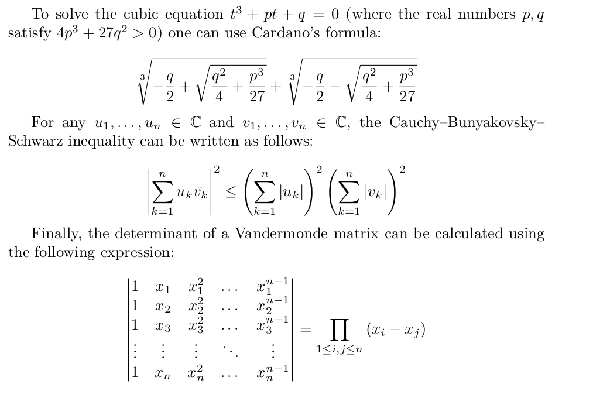

{{LearnSidebar}}{{PreviousMenu("Learn/MathML/First_steps/Tables", "Learn/MathML/First_steps")}}

<table>
  <tbody>
    <tr>
      <th scope="row">Prerequisites:</th>
      <td>
        Before attempting this assessment you should have already worked through
        all the articles in this module, and also have an understanding of HTML
        basics (study
        <a href="/en-US/docs/Learn/HTML/Introduction_to_HTML"
          >Introduction to HTML</a
        >).
      </td>
    </tr>
    <tr>
      <th scope="row">Objective:</th>
      <td>To have a play with some MathML and test your new-found
      knowledge.</td>
    </tr>
  </tbody>
</table>

## A small math article

The goal is to rewrite the following math article using HTML and MathML:



Although you don't need to be familiar with [LaTeX](https://en.wikipedia.org/wiki/LaTeX), it might be useful to know the LaTeX source from which it was generated:

```latex
\documentclass{article}

\usepackage{amsmath}
\usepackage{amssymb}

\begin{document}

To solve the cubic equation $t^3 + pt + q = 0$ (where the real numbers
$p, q$ satisfy ${4p^3 + 27q^2} > 0$) one can use Cardano's formula:

\[
  \sqrt[{3}]{
    -\frac{q}{2}
    +\sqrt{\frac{q^2}{4} + {\frac{p^{3}}{27}}}
  }+
  \sqrt[{3}]{
    -\frac{q}{2}
    -\sqrt{\frac{q^2}{4} + {\frac{p^{3}}{27}}}
  }
\]

For any $u_1, \dots, u_n \in \mathbb{C}$ and
$v_1, \dots, v_n \in \mathbb{C}$, the Cauchy–Bunyakovsky–Schwarz
inequality can be written as follows:

\[
  \left| \sum_{k=1}^n {u_k \bar{v_k}} \right|^2
  \leq
  {
    \left( \sum_{k=1}^n {|u_k|} \right)^2
    \left( \sum_{k=1}^n {|v_k|} \right)^2
  }
\]

Finally, the determinant of a Vandermonde matrix can be calculated
using the following expression:

\[
  \begin{vmatrix}
  1 & x_1 & x_1^2 & \dots & x_1^{n-1} \\
  1 & x_2 & x_2^2 & \dots & x_2^{n-1} \\
  1 & x_3 & x_3^2 & \dots & x_3^{n-1} \\
  \vdots & \vdots & \vdots & \ddots & \vdots \\
  1 & x_n & x_n^2 & \dots & x_n^{n-1} \\
  \end{vmatrix}
  = {\prod_{1 \leq {i,j} \leq n} {(x_i - x_j)}}
\]

\end{document}
```

## Starting point

To get this assessment started, you can rely on our usual HTML template. By default it uses UTF-8 encoding, special Web fonts for the `<body>` and `<math>` tags (with similar look & feel as the LaTeX output). The goal is to replace the question marks `???` with actual MathML content.

```html
<!doctype html>
<html lang="en-US">
  <head>
    <meta charset="utf-8" />
    <title>Three famous mathematical formulas</title>
    <link
      rel="stylesheet"
      href="https://fred-wang.github.io/MathFonts/LatinModern/mathfonts.css" />
  </head>
  <body class="htmlmathparagraph">
    <p>
      To solve the cubic equation ??? (where the real numbers ??? satisfy ???)
      one can use Cardano's formula: ???
    </p>

    <p>
      For any ??? and ???, the Cauchy–Bunyakovsky–Schwarz inequality can be
      written as follows: ???
    </p>

    <p>
      Finally, the determinant of a Vandermonde matrix can be calculated using
      the following expression: ???
    </p>
  </body>
</html>
```

## Hints and tips

- Start by inserting empty `<math>` tags, deciding whether they should have a `display="block"` attribute or not.
- Check the text used and find their [Unicode characters](https://en.wikipedia.org/wiki/Mathematical_operators_and_symbols_in_Unicode) ("−", "ℂ", "∑", ...).
- Analyze the semantics of each portion of text (variable? operator? number?) and determine the proper token element to use for each of them.
- Look for advanced constructions (fractions? roots? scripts? matrices?) and determine the proper MathML element to use for each of them.
- Don't forget to rely on `<mrow>` for grouping subexpressions.
- Pay attention to stretchy and large operators!
- Use the [W3C validator](https://validator.w3.org/nu/) to catch unintended mistakes in your HTML/MathML markup.
- If you are stuck, or realize how painful it is to write MathML by hand, feel free to use tools to help [write MathML](/en-US/docs/Web/MathML/Authoring) such as [TeXZilla](https://fred-wang.github.io/TeXZilla/).

{{LearnSidebar}}{{PreviousMenu("Learn/MathML/First_steps/Tables", "Learn/MathML/First_steps")}}
