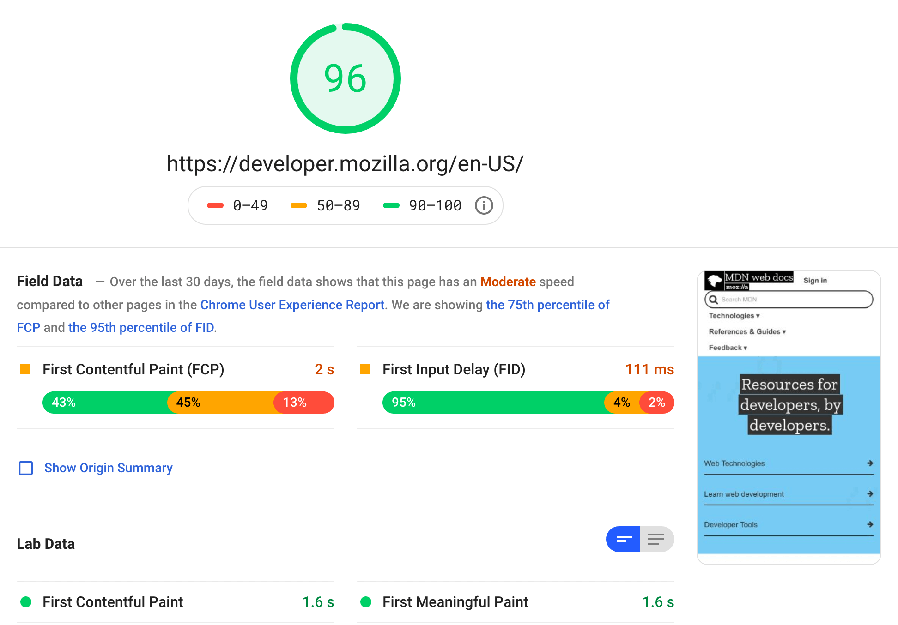
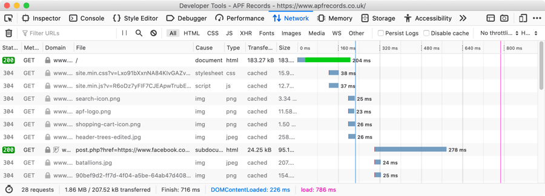
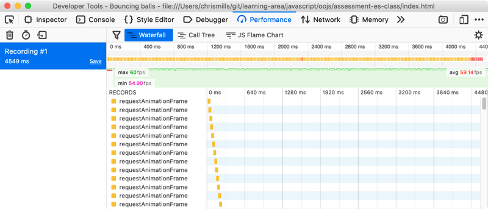

{{LearnSidebar}} {{PreviousMenuNext("Learn/Performance/Perceived_performance", "Learn/Performance/Multimedia", "Learn/Performance")}}

Measuring performance provides an important metric to help you assess the success of your app, site, or web service.

For example, you can use performance metrics to determine how your app performs in comparison to a competitor, or you can compare your app's performance across releases. The metrics you choose to measure should be relevant to your users, site, and business goals. They should be collected and measured in a consistent manner and analyzed in a format that can be consumed and understood by non-technical stakeholders.

This article introduces web performance metrics that you can use to measure and optimize your site's performance.

<table>
  <tbody>
    <tr>
      <th scope="row">Prerequisites:</th>
      <td>
        Basic computer literacy,
        <a
          href="/en-US/docs/Learn/Getting_started_with_the_web/Installing_basic_software"
          >basic software installed</a
        >, and basic knowledge of
        <a href="/en-US/docs/Learn/Getting_started_with_the_web"
          >client-side web technologies</a
        >.
      </td>
    </tr>
    <tr>
      <th scope="row">Objective:</th>
      <td>
        

          To provide information about web performance metrics that you can
          collect through various web performance APIs and tools that you can
          use to visualize that data.
        

      </td>
    </tr>
  </tbody>
</table>

## Performance APIs

When writing code for the Web, there are a large number of [Web APIs](/en-US/docs/Web/API) available that allow you to create your own performance measuring tools.

You can use the [Navigation Timing API](/en-US/docs/Web/API/Navigation_timing_API) to measure client-side web performance; including the amount of time needed to unload the previous page, how long domain lookups take, the total time spent executing the window's load handler, and more. You can use the API for metrics related to all the navigation events displayed in the diagram below.

The [Performance API](/en-US/docs/Web/API/Performance_API/Using_the_Performance_API), which provides access to performance-related information for the current page, includes the [Performance Timeline API](/en-US/docs/Web/API/Performance_Timeline), the [Navigation Timing API](/en-US/docs/Web/API/Navigation_timing_API), the [User Timing API](/en-US/docs/Web/API/User_Timing_API), and the [Resource Timing API](/en-US/docs/Web/API/Resource_Timing_API). These interfaces allow the accurate measurement of the time it takes for JavaScript tasks to complete.

The [PerformanceEntry](/en-US/docs/Web/API/PerformanceEntry) object is part of the _performance timeline_. A _performance entry_ can be directly created by making a performance _{{domxref("PerformanceMark","mark")}}_ or _{{domxref("PerformanceMeasure","measure")}}_ (for example by calling the {{domxref("Performance.mark","mark()")}} method) at an explicit point in an application. Performance entries are also created in indirect ways; such as loading a resource, like an image.

The [PerformanceObserver API](/en-US/docs/Web/API/PerformanceObserver) can be used to observe performance measurement events and to notify you of new [performance entries](/en-US/docs/Web/API/PerformanceEntry) as they are recorded in the browser's performance timeline.

While this article does not dive into using these APIs, it is useful to know they exist. You can also refer to the [Navigation and timings](/en-US/docs/Web/Performance/Navigation_and_resource_timings) article for further examples on using performance Web APIs.

## Tools and metrics

There are a number of different tools available to help you improve performance. These can generally be classified into two categories:

- Tools that indicate or measure performance, such as [PageSpeed Insights](https://pagespeed.web.dev/) or the Firefox [Network Monitor](https://firefox-source-docs.mozilla.org/devtools-user/network_monitor/index.html) and [Performance Monitor](https://firefox-source-docs.mozilla.org/devtools-user/performance/index.html). These tools show you how fast or slow your web app or site load. They also indicate areas that can be improved to optimize your web app.
- Tools that update code so that your web app or site will perform better. For example, bundling tools pack your code into single files to reduce the number of HTTP requests or minifiers that remove all whitespace from your code to make the files smaller.

We'll talk about both categories in this course. And as well as talking about performance metrics we will of course talk about the metrics that you'll use to measure whether your site's performance is improving.

### General performance reporting tools

Tools like [PageSpeed Insights](https://pagespeed.web.dev/) can measure a website's performance. You can enter a URL and get a performance report in seconds. The report contains scores about how your website is performing, both for mobile and desktop. This is a good start for getting an idea about what you are already doing well and what could be improved.

At the time of writing, MDN's performance report summary looks similar to the following:

A performance report contains information about things like how long a user has to wait before _anything_ is displayed on the page, how many bytes need to be downloaded to display a page, and much more. It also lets you know if the measured values are considered good or bad.

[webpagetest.org](https://webpagetest.org) is another example of a tool that automatically tests your site and returns useful metrics.

Try running your favorite website now, on both webpagetest.org and PageSpeed Insights, and see what the scores are.

### Network tools

Most browsers have tools available that you can use to run against loaded pages and determine how they are performing. For example, the Firefox [Network Monitor](https://firefox-source-docs.mozilla.org/devtools-user/network_monitor/index.html) returns detailed information on all the assets downloaded from the network, along with a time graph that shows how long each one took to download.

You can also use the [Performance Monitor](https://firefox-source-docs.mozilla.org/devtools-user/performance/index.html) to measure the performance of a web app or site's user interface as you perform different actions. This indicates the features that might be slowing down your web app or site.

## Conclusion

This article provided a brief overview of the web performance metrics to help introduce you to what you can measure on a web app or site. Next up, you'll look at perceived performance and some techniques to make unavoidable performance hits appear less severe to the user, or disguise them completely.

{{PreviousMenuNext("Learn/Performance/Perceived_performance", "Learn/Performance/Multimedia", "Learn/Performance")}}
