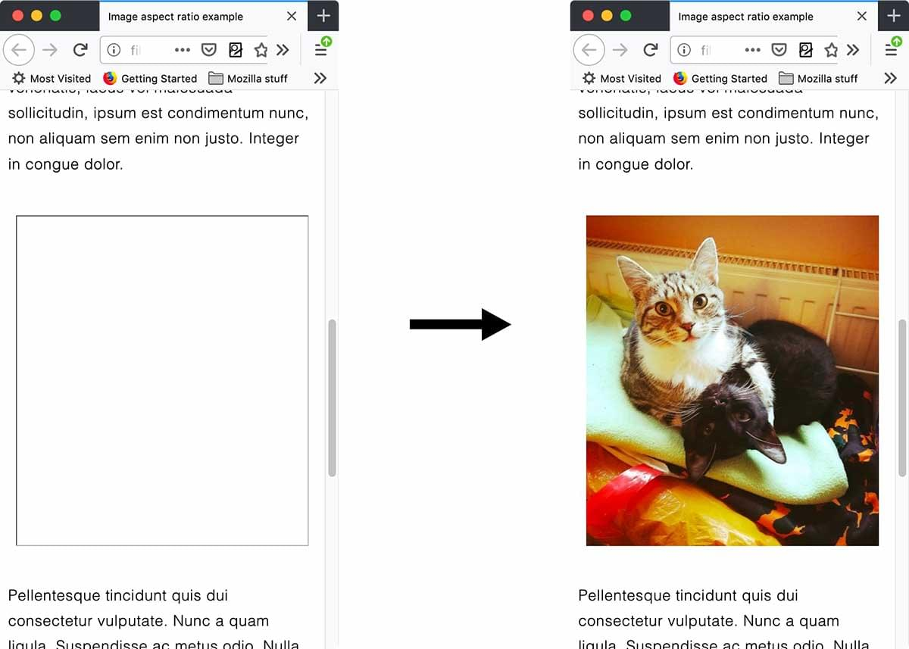

{{LearnSidebar}}{{PreviousMenuNext("Learn/Performance/measuring_performance", "Learn/Performance/video", "Learn/Performance")}}

Media, namely images and video, account for over 70% of the bytes downloaded for the average website. In terms of download performance, eliminating media, and reducing file size is the low-hanging fruit. This article looks at optimizing image and video to improve web performance.

<table>
  <tbody>
    <tr>
      <th scope="row">Prerequisites:</th>
      <td>
        Basic computer literacy,
        <a
          href="/en-US/docs/Learn/Getting_started_with_the_web/Installing_basic_software"
          >basic software installed</a
        >, and basic knowledge of
        <a href="/en-US/docs/Learn/Getting_started_with_the_web"
          >client-side web technologies</a
        >.
      </td>
    </tr>
    <tr>
      <th scope="row">Objective:</th>
      <td>
        To learn about the various image formats, their impact on performance,
        and how to reduce the impact of images on overall page load time.
      </td>
    </tr>
  </tbody>
</table>

> **Note:** This is a high-level introduction to optimizing multimedia delivery on the web, covering general principles and techniques. For a more in-depth guide, see <https://images.guide>.

## Why optimize your multimedia?

For the average website, [51% of its bandwidth comes from imagery, followed by video at 25%](https://discuss.httparchive.org/t/state-of-the-web-top-image-optimization-strategies/1367), so it's safe to say it's important to address and optimize your multimedia content.

You need to be considerate of data usage. Many people are on capped data plans or even pay-as-you-go where they are literally paying by the megabyte. This isn't an emerging market problem either. As of 2018, [24% of the United Kingdom still use pay-as-you-go](https://www.ofcom.org.uk/__data/assets/pdf_file/0021/113169/Technology-Tracker-H1-2018-data-tables.pdf).

You also need to be considerate of memory as many mobile devices have limited RAM. It's important to remember that when images are downloaded, they need to be stored in memory.

## Optimizing image delivery

Despite being the largest consumer of bandwidth, the impact of image downloading on [perceived performance](/en-US/docs/Learn/Performance/Perceived_performance) is far lower than many expect (primarily because the page text content is downloaded immediately and users can see the images being rendered as they arrive). However, for a good user experience it's still important that a visitor can see them as soon as possible.

### Loading strategy

One of the biggest improvements to most websites is [lazy-loading](/en-US/docs/Web/Performance/Lazy_loading) images beneath-the-fold, rather than downloading them all on initial page load regardless of whether a visitor scrolls to see them or not. Many JavaScript libraries can implement this for you, such as [lazysizes](https://github.com/aFarkas/lazysizes), and browser vendors are working on a native `lazyload` attribute that is currently in the experimental phase.

Beyond loading a subset of images, next you should look into the format of the images themselves:

- Are you loading the most optimal file formats?
- Have you compressed the images well?
- Are you loading the correct sizes?

#### The most optimal format

The optimal file format typically depends on the character of the image.

> **Note:** For general information on image types see the [Image file type and format guide](/en-US/docs/Web/Media/Formats/Image_types)

The [SVG](/en-US/docs/Web/Media/Formats/Image_types#svg_scalable_vector_graphics) format is more appropriate for images that have few colors and that are not photo-realistic. This requires the source to be available as in a vector graphic format. Should such an image only exist as a bitmap, then [PNG](/en-US/docs/Web/Media/Formats/Image_types#png_portable_network_graphics) would be the fallback format to choose. Examples for these types of motifs are logos, illustrations, charts or icons (note: SVGs are far better than icon fonts!). Both formats support transparency.

PNGs can be saved with three different output combinations:

- 24-bit color + 8-bit transparency — offer full color accuracy and smooth transparencies at the expense of size. You probably want to avoid this combination in favor for WebP (see below).
- 8-bit color + 8-bit transparency — offer no more than 255 colors but maintain smooth transparencies. The size is not too big. Those are the PNGs you would probably want.
- 8-bit color + 1-bit transparency — offer no more than 255 colors and just offer no or full transparency per pixel which makes the transparency borders appear hard and jagged. The size is small but the price is visual fidelity.

A good online tool for optimizing SVGs is [SVGOMG](https://jakearchibald.github.io/svgomg/). For PNGs there is [ImageOptim online](https://imageoptim.com/online) or [Squoosh](https://squoosh.app/).

With photographic motifs that do not feature transparency there is a lot wider range of formats to chose from. If you want to play it safe, then you would go for well compressed **Progressive JPEGs**. Progressive JPEGs, in contrast to normal JPEGs, render progressively (hence the name), meaning the user sees a low-resolution version that gains clarity as the image downloads, rather than the image loading at full resolution top-to-bottom or even only rendering once completely downloaded. A good compressor for these would be MozJPEG, e.g. available to use in the online image optimization tool [Squoosh](https://squoosh.app/). A quality setting of 75% should yield decent results.

Other formats improve on JPEG's capabilities regarding compression, but are not available on every browser:

- [WebP](/en-US/docs/Web/Media/Formats/Image_types#webp_image) — Excellent choice for both images and animated images. WebP offers much better compression than PNG or JPEG with support for higher color depths, animated frames, transparency etc. (but not progressive display.). Supported by all major browsers except Safari 14 on macOS desktop.

  > **Note:** Despite having [announced support](https://developer.apple.com/videos/play/wwdc2020/10663/?time=1174) for WebP in Safari 14, as of version 14.0 .webp images do not display natively on a macOS desktop, whereas Safari on iOS 14 does display .webp images properly.

- [AVIF](/en-US/docs/Web/Media/Formats/Image_types#avif_image) — Good choice for both images and animated images due to high performance and royalty free image format (even more efficient that WebP, but not as widely supported). It is now supported on Chrome, Opera and Firefox. See also [an online tool to convert previous image formats to AVIF](https://avif.io/).
- **JPEG2000** — once to be successor to JPEG but only supported in Safari. Doesn't support progressive display either.

Given the narrow support for JPEG-XR and JPEG2000, and also taking decode costs into the equation, the only serious contender for JPEG is WebP. Which is why you could offer your images in that flavor too. This can be done via the `<picture>` element with the help of a `<source>` element equipped with a [type attribute](/en-US/docs/Web/HTML/Element/picture#the_type_attribute).

If all of this sounds a bit complicated or feels like too much work for your team then there is also online services that you can use as image CDNs that will automate the serving of the correct image format on-the-fly, according to the type of device or browser requesting the image. The biggest ones are [Cloudinary](https://cloudinary.com/blog/make_all_images_on_your_website_responsive_in_3_easy_steps) and [Image Engine](https://imageengine.io/).

And finally, should you want to include animated images into your page, then know that Safari allows using video files within `` and `<picture>` elements. These also allow you to add in an **Animated WebP** for all other modern browsers.

```html
<picture>
  <source type="video/mp4" src="giphy.mp4" />
  <source type="image/webp" src="giphy.webp" />
  
</picture>
```

#### Serving the optimal size

In image delivery the "one size fits all" approach will not yield the best results, meaning that for smaller screens you would want to serve images with smaller resolution and vice versa for larger screens. On top of that, you'd also want to serve higher resolution images to those devices that boast a high DPI screen (e.g. "Retina"). So apart from creating plenty of intermediate image variants you also need a way to serve the right file to the right browser. That's where you would need to upgrade your `<picture>` and `<source>` elements with [media](/en-US/docs/Web/HTML/Element/source#media) and/or [sizes](/en-US/docs/Web/HTML/Element/source#sizes) attributes. A detailed article on how to combine all of these attributes can be found [here](https://www.smashingmagazine.com/2014/05/responsive-images-done-right-guide-picture-srcset/).

Two interesting effects to keep in mind regarding high dpi screens is that:

- with a high DPI screen, humans will spot compression artifacts a lot later, meaning that for images meant for these screens you can crank up compression beyond usual.
- [Only a very few people can spot an increase in resolution beyond 2× DPI](https://observablehq.com/@eeeps/visual-acuity-and-device-pixel-ratio), which means you don't need to serve images resolving higher than 2×.

#### Controlling the priority (and ordering) of downloading images

Getting the most important images in front of visitors sooner than the less important can deliver improved perceived performance.

The first thing to check is that your content images use `` or `<picture>` elements and your background images are defined in CSS with `background-image` — images referenced in `` elements are assigned a higher loading priority than background images.

Secondly, with the adoption of Priority Hints, you can control the priority further by adding a `fetchPriority` attribute to your image tags. An example use case for priority hints on images are carousels where the first image is a higher priority than the subsequent images.

### Rendering strategy: preventing jank when loading images

As images are loaded asynchronously and continue to load after the first paint, if their dimensions aren't defined before load, they can cause reflows to the page content. For example, when text gets pushed down the page by images loading. For this reason, it's critical that you set `width` and `height` attributes so that the browser can reserve space for them in the layout.

When the `width` and `height` attributes of an image are included on an HTML {{htmlelement("img")}} element, the aspect ratio of the image can be calculated by the browser prior to the image being loaded. This aspect ratio is used to reserve the space needed to display the image, reducing or even preventing a layout shift when the image is downloaded and painted to the screen. Reducing layout shift is a major component of good user experience and web performance.

Browsers begin rendering content as HTML is parsed, often before all assets, including images, are downloaded. Including dimensions enable browsers to reserve a correctly-sized placeholder box for each image to appear in when the images are loaded when first rendering the page.



Without the `width` and `height` attributes, no placeholder space is created, creating a noticeable {{glossary('jank')}}, or layout shift, in the page when the image loads after the page is rendered. Page reflow and repaints are performance and usability issues.

In responsive designs, when a container is narrower than an image, the following CSS is generally used to keep images from breaking out of their containers:

```css
img {
  max-width: 100%;
  height: auto;
}
```

While useful for responsive layouts, this causes jank when width and height information are not included, as if no height information is present when the `` element is parsed but before the image has loaded, this CSS effectively has set the height to 0. When the image loads after the page has been initially rendered to the screen, the page reflows and repaints creating a layout shift as it creates space for the newly determined height.

Browsers have a mechanism for sizing images before the actual image is loaded. When an ``, `<video>`, or `<input type="button">` element has `width` and `height` attributes set on it, its aspect ratio is calculated before load time, and is available to the browser, using the dimensions provided.

The aspect ratio is then used to calculate the height and therefore the correct size is applied to the `` element, meaning that the aforementioned jank will not occur, or be minimal if the listed dimensions are not fully accurate, when the image loads.

The aspect ratio is used to reserve space only on the image load. Once the image has loaded, the intrinsic aspect ratio of the loaded image, rather than the aspect ratio from the attributes, is used. This ensures that it displays at the correct aspect ratio even if the attribute dimensions are not accurate.

While developer best practices from the last decade may have recommended omitting the `width` and `height` attributes of an image on an HTML {{htmlelement("img")}}, due to aspect ratio mapping, including these two attributes is considered a developer best practice.

For any background images, it's important you set a `background-color` value so any content overlaid is still readable before the image has downloaded.

## Conclusion

In this section we took a look at image optimization. You now have a general understanding of how to optimize half of the average websites average bandwidth total. This is just one of the types of media consuming users bandwidth and slowing down page load. Let's take a look at video optimization, tackling the next 20% of bandwidth consumption.

{{PreviousMenuNext("Learn/Performance/measuring_performance", "Learn/Performance/video", "Learn/Performance")}}
